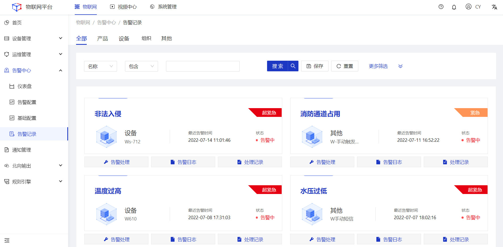
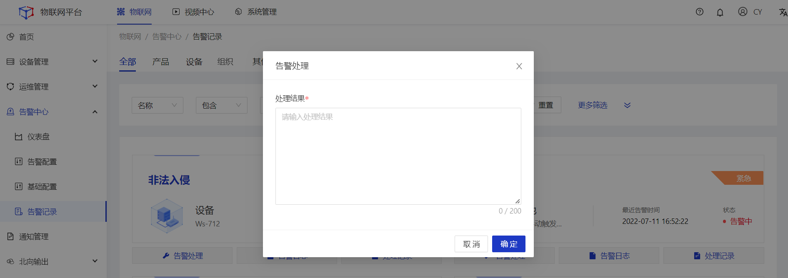
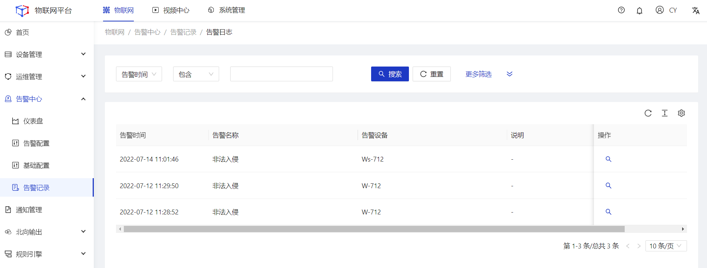
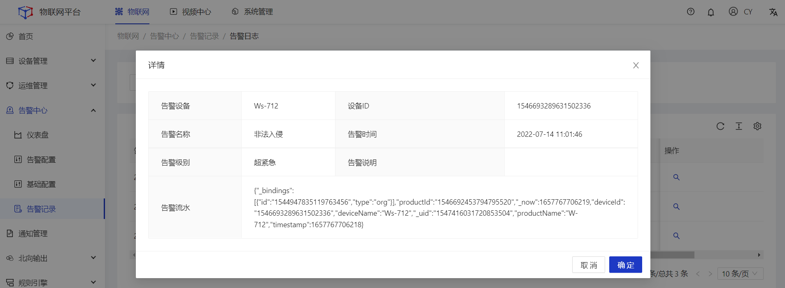

## 告警记录

### 告警处理
##### 操作步骤
1.**登录**Jetlinks物联网平台。
2.在左侧导航栏，选择**告警中心>告警记录**，进入列表页。

3.点击具体告警数据的**告警处理**按钮，在弹框页中填写处理结果，然后点击**确定**。

### 告警日志
##### 操作步骤
1.**登录**Jetlinks物联网平台。
2.在左侧导航栏，选择**告警中心>告警记录**，进入列表页。
3.点击具体告警数据的**告警日志**按钮，进入详情页。

4.点击具体日志数据的**查看**按钮，查看详情。

### 处理记录
##### 操作步骤
1.**登录**Jetlinks物联网平台。
2.在左侧导航栏，选择**告警中心>告警记录**，进入列表页。
3.点击具体告警数据的**处理记录**按钮，在弹框页中查看处理记录明细数据。

