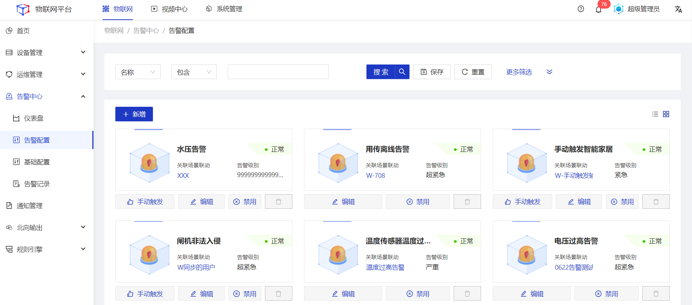
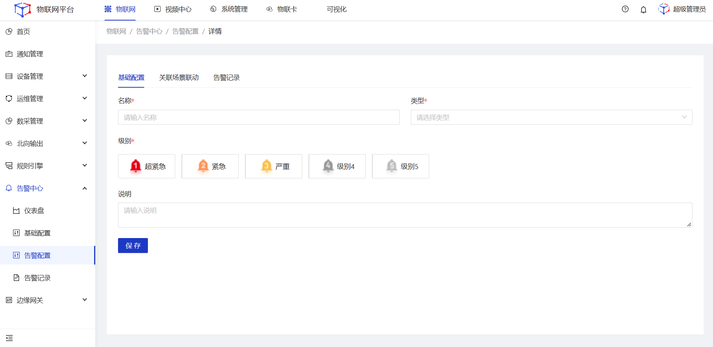
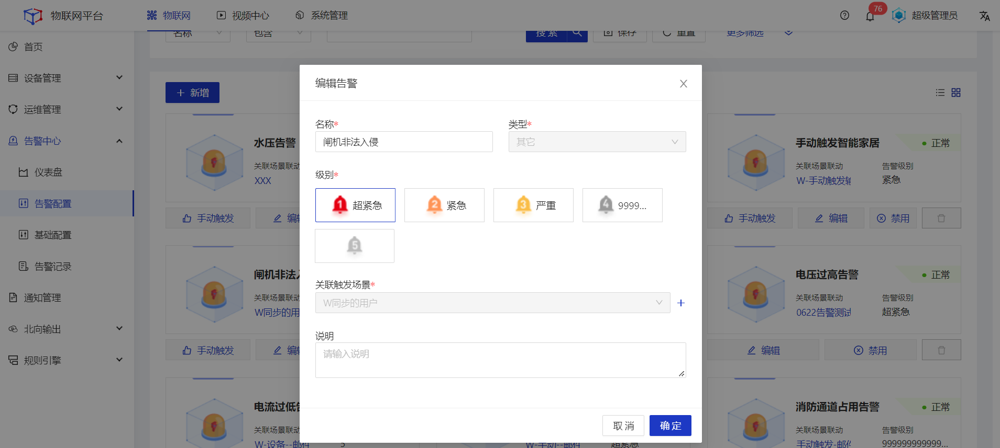
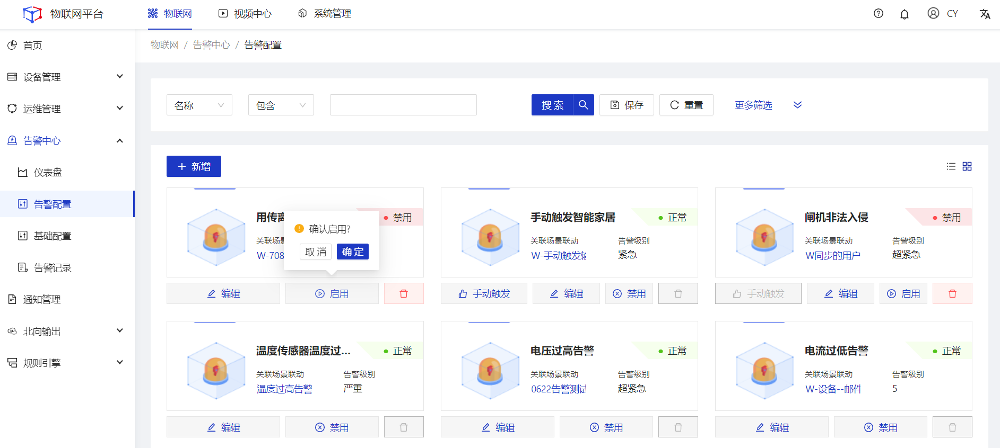
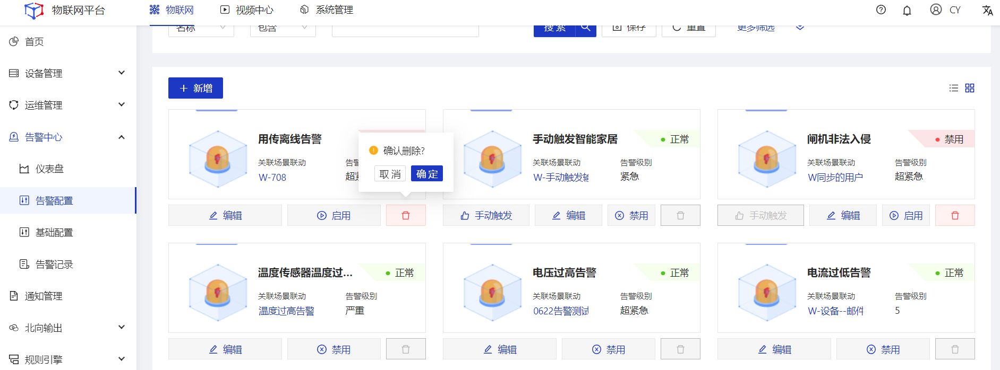
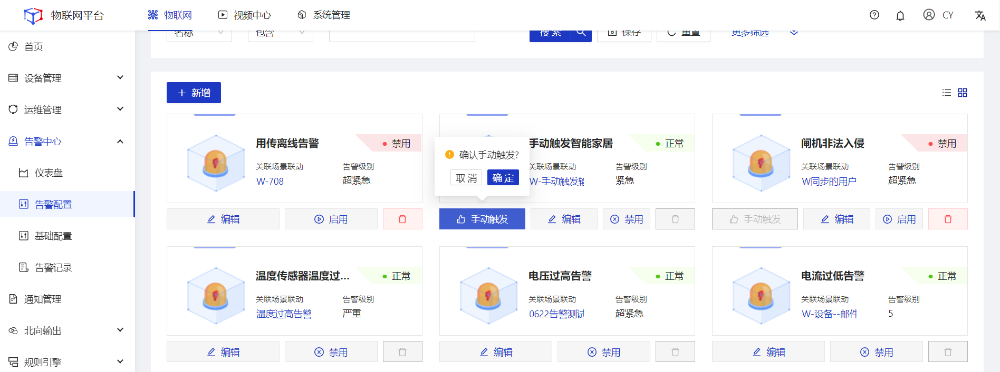
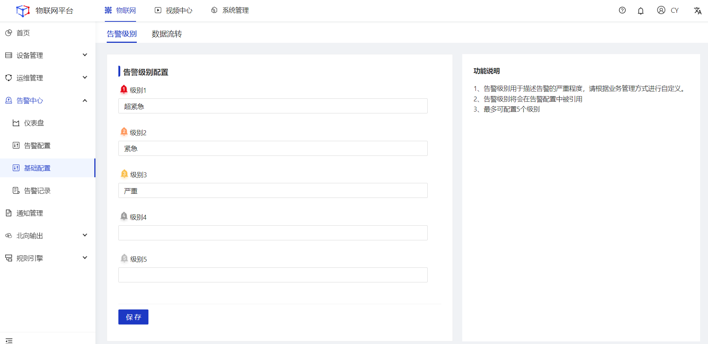
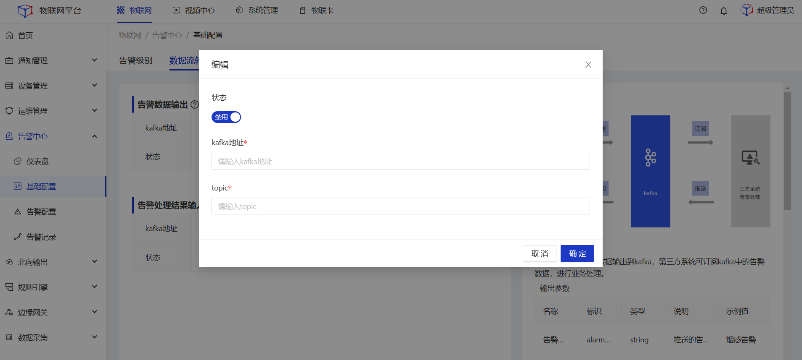

## 告警配置
统一管理系统内的告警规则配置，触发告警规则时可产生对应的告警记录数据。
#### 新增
##### 操作步骤
1.**登录**Jetlinks物联网平台。 
2.在左侧导航栏，选择**告警中心>告警配置**，进入列表页。 

3.点击新增按钮，在弹框页中填写配置信息，然后点击**确定**。 

#### 编辑
##### 操作步骤
1.**登录**Jetlinks物联网平台。 
2.在左侧导航栏，选择**告警中心>告警配置**，进入列表页。 
3.点击具体告警配置的**编辑**按钮，在弹框页面中修改配置信息，然后点击**确定**。 

  

    
    说明
  

  告警配置已产生告警数据时，类型、关联触发场景不支持编辑。

#### 启用/禁用
##### 操作步骤
1.**登录**Jetlinks物联网平台。 
2.在左侧导航栏，选择**告警中心>告警配置**，进入列表页。 
3.点击具体告警配置的**启用/禁用**按钮，然后点击**确定**。 

#### 删除
##### 操作步骤
1.**登录**Jetlinks物联网平台。 
2.在左侧导航栏，选择**告警中心>告警配置**，进入列表页。 
3.点击具体告警配置的**删除**按钮，然后点击**确定**。 

  

    
    说明
  

告警配置已产生告警数据时，不支持删除。

#### 手动触发
##### 操作步骤
1.**登录**Jetlinks物联网平台。 
2.在左侧导航栏，选择**告警中心>告警配置**，进入列表页。 
3.点击具体告警配置的**手动触发**按钮，然后点击**确定**。 

  

    
    说明
  

告警配置所关联的场景联动为手动触发类型时，将出现此按钮，点击后将生成一条对应的告警记录数据。

## 基础配置
告警基础配置，包括告警级别、告警数据流转的统一配置管理。
### 告警级别配置
##### 操作步骤
1.**登录**Jetlinks物联网平台。 
2.在左侧导航栏，选择**告警中心>基础配置**，进入详情页。 
3.填写告警级别配置信息，然后点击**保存**。 

### 数据流转配置
##### 操作步骤
1.**登录**Jetlinks物联网平台。 
2.在左侧导航栏，选择**告警中心>基础配置**，进入详情页。 
3.点击页面顶部tab切换至**数据流转**tab页。 
4.填写配置信息，然后点击**保存**。 

## 告警记录
统一维护根据告警规则产生的告警数据，可对告警记录进行详情查看与告警处理。
### 告警处理
##### 操作步骤
1.**登录**Jetlinks物联网平台。 
2.在左侧导航栏，选择**告警中心>告警记录**，进入列表页。 

3.点击具体告警数据的**告警处理**按钮，在弹框页中填写处理结果，然后点击**确定**。 

### 告警日志
##### 操作步骤
1.**登录**Jetlinks物联网平台。 
2.在左侧导航栏，选择**告警中心>告警记录**，进入列表页。 
3.点击具体告警数据的**告警日志**按钮，进入详情页。 

4.点击具体日志数据的**查看**按钮，查看详情。 

### 处理记录
##### 操作步骤
1.**登录**Jetlinks物联网平台。 
2.在左侧导航栏，选择**告警中心>告警记录**，进入列表页。 
3.点击具体告警数据的**处理记录**按钮，在弹框页中查看处理记录明细数据。 

