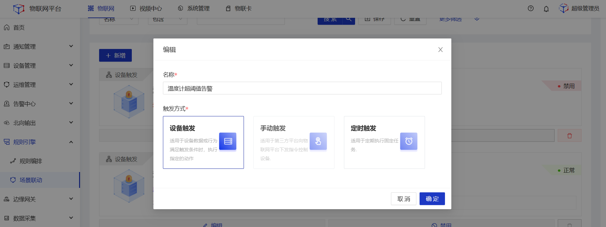
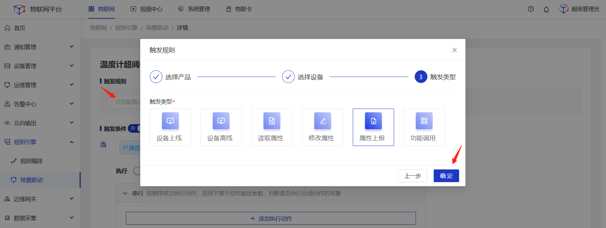
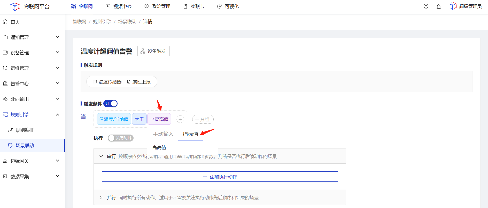
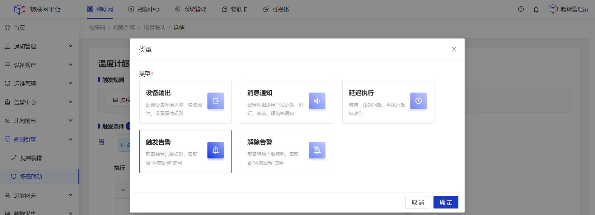
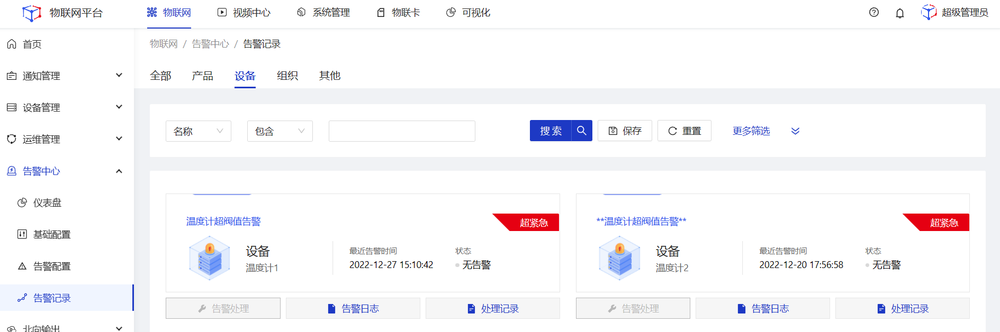

# 告警中心
设备告警是平台的核心功能之一，该功能需关联场景联动进行配置。本文以温度计温度超过指标值进行告警作为示例。

### 前置条件
1.平台内已创建好温度计产品。 
2.平台内已创建好温度计设备以及对应的物模型。 

### 操作步骤
#### 一、配置一个场景联动
1.**登录**Jetlinks物联网平台，进入**规则引擎>场景联动**菜单，点击**新增**，弹出弹框，填写名称为**温度计超阀值告警**，选择触发方式为**设备触发**，点击**确定**跳转至详情页。 

2.点击**触发规则**，在弹框页选择温度计产品，选择具体设备，触发类型选择**属性上报**，然后点击**确定**。

3.配置触发条件当温度大于指标值

4.点击**添加执行动作**，选择**触发告警**，然后点击**确定**。

5.点击底部**保存**按钮。

#### 二、配置一个告警规则
1.**登录**Jetlinks物联网平台，点击**告警中心>告警配置**菜单，进入列表页。 

2.点击**新增**，进入详情页，填写基础配置信息。类型选择为**设备**，然后点击保存 

3.点击**关联场景联动**tab，点击**新增**，在弹框页面选择名称为**温度计超阀值告警**的场景联动规则。

4.当**温度计超阀值告警**被触发时，即可在**告警记录**中查看对应的告警数据。
