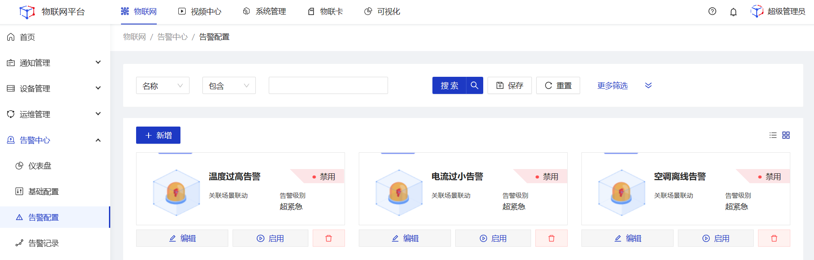
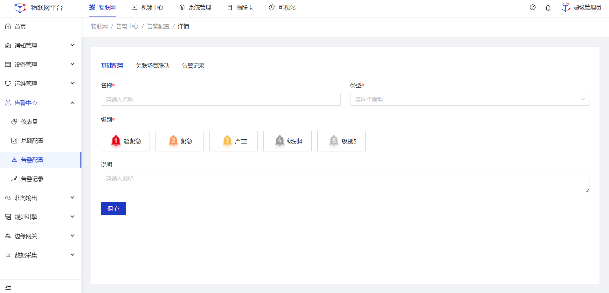
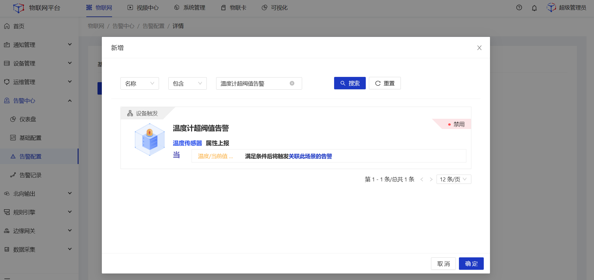
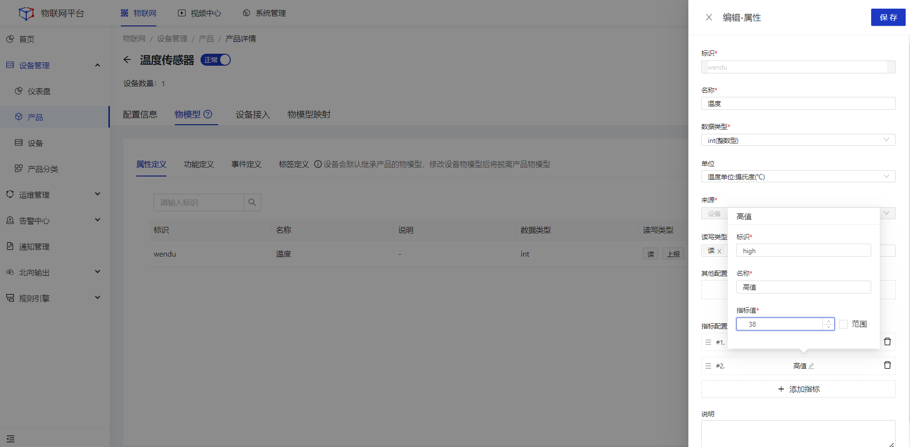
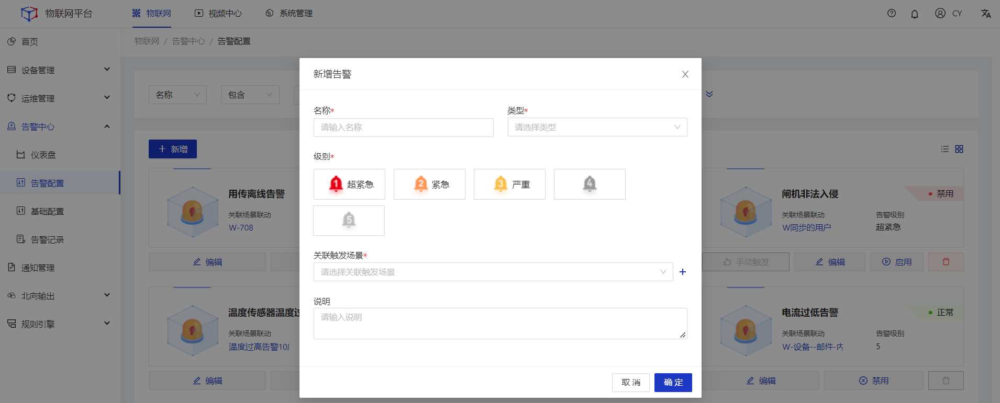

# 告警中心
设备告警是平台的核心功能之一，该功能需关联场景联动进行配置。本文以温度计温度超过阀值进行告警作为示例。

### 前置条件
1.平台内已创建好温度计产品。 
2.平台内已创建好温度计设备以及对应的物模型。 

### 操作步骤
1.**登录**Jetlinks物联网平台，进入**告警中心>基础配置**菜单，填写告警级别信息。 

2.选择**规则引擎>场景联动**菜单，点击**新增**按钮，进入详情页配置触发告警的规则。规则配置支持2种方式 
<li>手动输入具体触发值。</li>
<li>根据设备指标进行配置，指标需在产品物模型-属性页面进行单独配置。</li>

#### 手动输入具体触发值。

#### 根据设备指标进行配置

##### 属性配置指标示例

3.选择**告警中心>告警配置**菜单，点击**新增**按钮，在弹框页面中填写相关信息，然后点击**确定**。 

