## MQTT直连接入
本文档以MQTTX为例，介绍使用第三方软件以MQTT协议接入物联网平台。

### 下载并安装MQTTX
前往[官网下载](https://mqttx.app/)安装

### 系统配置
#### 操作步骤
1.**登录**Jetlinks物联网平台，进入**协议管理**菜单，上传协议包。</br>

<a target='_blank' href='https://github.com/jetlinks/jetlinks-official-protocol'>获取协议包源码</a>


2.进入**网络组件**菜单，配置**MQTT服务**类型的网络组件。</br>


3.进入**设备接入网关**菜单，配置接入方式为**MQTT直连**的网关。</br>
&emsp;（1）选择第2步创建的MQTT服务网络组件</br>

&emsp;（2）选择第1步创建的协议包</br>

&emsp;（3）填写设备接入网关名称</br>


4.创建产品，并进入**设备接入**tab，选择所需的设备接入网关。
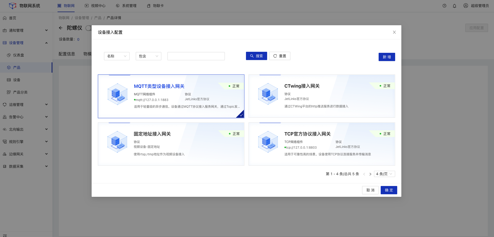

5.在**设备接入**tab页面中填写官方协议包认证信息；然后**启用**产品。

<div class='explanation primary'>
  <p class='explanation-title-warp'>
    <span class='iconfont icon-bangzhu explanation-icon'></span>
    <span class='explanation-title font-weight'>说明</span>
  </p>

不同协议包在设备接入界面所需要填写的方式不同。官方协议包，需要填写设备认证所需要的的账号密码

</div>

`在设备接入tab页的MQTT认证配置项中填写  secureId为：admin    secureKey为：admin。`


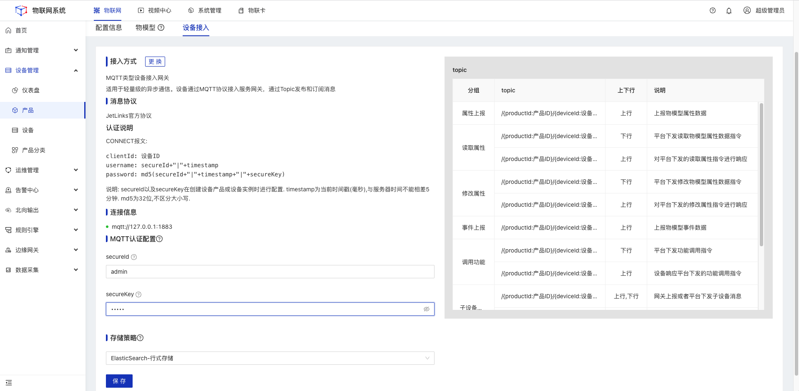


6.创建设备，选择对应的所属产品，然后**启用**设备。

<div class='explanation warning'>
  <p class='explanation-title-warp'>
    <span class='iconfont icon-jinggao explanation-icon'></span>
    <span class='explanation-title font-weight'>注意</span>
  </p>

需要先启用产品，才能基于产品创建设备

</div>


### 使用MQTTX模拟设备连接到平台
1.打开MQTTX软件，点击新建连接创建一个连接，设置**连接参数**。

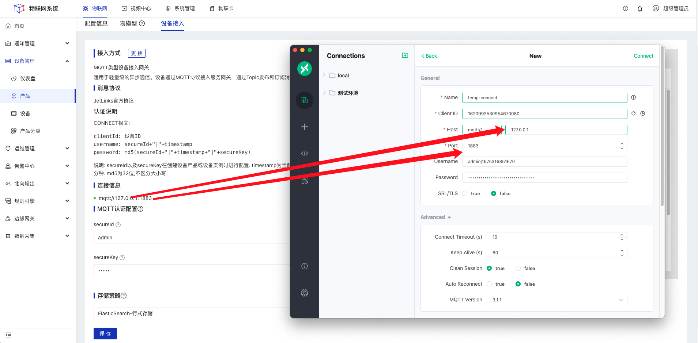

### 连接参数说明

<table class='table'>
        <thead>
            <tr>
              <td>参数</td>
              <td>说明</td>
            </tr>
        </thead>
        <tbody>
          <tr>
            <td>Name</td>
            <td>输入您的自定义名称。</td>
          </tr>
          <tr>
            <td>Client ID</td>
            <td> 设备Id。必须与系统中设备的ID填写一致。</td>
          </tr>
          <tr>
            <td>Host</td>
            <td>连接域名。本地连接可直接填写 `127.0.0.1`,如为远程连接，请填写产品-设备接入页-连接信息显示的连接地址。</td>
          </tr>
         <tr>
            <td>Port</td>
            <td>请填写产品-设备接入页-连接信息显示的端口。</td>
          </tr>
          <tr>
            <td>Username</td>
            <td>填写接入账号</td>
          </tr>
         <tr>
            <td>Password</td>
            <td>填写接入密码</td>
          </tr>
        </tbody>
      </table>
</div>


<div class='explanation primary'>
  <p class='explanation-title-warp'>
    <span class='iconfont icon-bangzhu explanation-icon'></span>
    <span class='explanation-title font-weight'>说明</span>
  </p>

使用JetLinks官方协议包接入设备，用户名和密码需要经过加密规则处理。<br />
可使用账号密码<a href="http://doc.jetlinks.cn/basics-guide/mqtt-auth-generator.html">自动生成器</a>获取

</div>


<div class='explanation warning'>
  <p class='explanation-title-warp'>
    <span class='iconfont icon-jinggao explanation-icon'></span>
    <span class='explanation-title font-weight'>注意</span>
  </p>

经过加密规则处理的账号密码超过5分钟后将不在可用，需重新生成

</div>


2.点击**连接**按钮，平台中设备状态变为**在线**。


<div class='explanation primary'>
  <p class='explanation-title-warp'>
    <span class='iconfont icon-bangzhu explanation-icon'></span>
    <span class='explanation-title font-weight'>说明</span>
  </p>

如您在点击连接后遇到MQTTX提示异常信息或设备未上线等问题。可在设备详情-设备诊断页中，诊断设备未上线原因

</div>


### 设备数据上下行
设备连接上平台后，可进行一些基本的事件上报、属性读取等操作。


### 物模型创建

在产品详情-物模型tab页中分别创建属性、事件、功能三种物模型

**创建属性** 属性ID: `temperature`


**创建功能**  功能ID: `playVoice`


**创建事件** 事件ID: `alarm_fire`


#### 读取设备属性
1.**登录**Jetlinks物联网平台，点击设备**查看**按钮，进入**运行状态**tab页。</br>
2.点击设备运行状态中某个属性的**获取属性值**按钮。

MQTTX会收到平台下发指令消息


<div class='explanation primary'>
  <p class='explanation-title-warp'>
    <span class='iconfont icon-bangzhu explanation-icon'></span>
    <span class='explanation-title font-weight'>说明</span>
  </p>
复制好订阅该topic收到的消息中的messageId。此messageId将作为回复与平台设备属性的凭据之一。
</div>

3.回复平台设备读取消息
<br />
topic格式参考：[JetLinks官方协议-读取设备属性](/dev-guide/jetlinks-protocol-support.html#读取设备属性)
<br />
消息内容格式如下

```json

{
  "deviceId": "设备Id",
  "messageId": "平台下发报文中的messageId",
  "properties":{
    "temperature": 35.6
  },
  "success": true
}

```


**回复参数说明**

<table class='table'>
        <thead>
            <tr>
              <td>参数</td>
              <td>说明</td>
            </tr>
        </thead>
        <tbody>
          <tr>
            <td>messageId</td>
            <td>平台下发报文中的messageId</td>
          </tr>
          <tr>
            <td>deviceId </td>
            <td>设备ID</td>
          </tr>
          <tr>
            <td>success</td>
            <td>成功标识</td>
          </tr>
           <tr>
            <td>properties</td>
            <td>设备属性值对象。例如： { "temperature":"50"} </td>
          </tr>
        </tbody>
      </table>


点击**消息发送按钮图标**，向平台推送该消息。


4.平台收到MqttX推送的属性值后，将会实时展示到运行状态中。</br>


<div class='explanation warning'>
  <p class='explanation-title-warp'>
    <span class='iconfont icon-jinggao explanation-icon'></span>
    <span class='explanation-title font-weight'>注意</span>
  </p>
从在系统界面中点击刷新到MQTTX端回复消息，需在10秒内完成。否则平台会视为该次操作超时，导致读取属性值失败。
</div>

#### 设备事件上报
MQTTX 推送设备事件消息到平台。<br />

1.在MQTTX上，填写事件上报topic。topic格式参考[JetLinks官方协议-设备事件上报](/dev-guide/jetlinks-protocol-support.html#设备事件上报) 。</br>
2.输入事件上报Topic和要发送的事件内容，点击"发送"按钮图标，向平台推送该事件消息。


**设备事件上报数据**

```json
{
 "data":{
   "addr":"未来科技城 C2 栋",
  "time":"12-05-2012"
 }
}
```

<table class='table'>
        <thead>
            <tr>
              <td>参数</td>
              <td>说明</td>
            </tr>
        </thead>
        <tbody>
          <tr>
            <td>data</td>
            <td>对象类型的报文数据</td>
          </tr>
        </tbody>
      </table>

上报成功后，在**设备-运行状态**tab页，可查看事件具体信息。


#### 调用设备功能
1.在**设备-设备功能**tab页，选择设备功能模块,点击执行,向设备发送功能调用指令。

3.填写设备功能回复topic和报文。格式参考[JetLinks官方协议-调用设备功能](/dev-guide/jetlinks-protocol-support.html#调用设备功能)


**设备功能回复报文**

```json
{
 "messageId":"平台下发报文中的messageId", 
 "output":true,
 "success":true
}
```
<table class='table'>
        <thead>
            <tr>
              <td>参数</td>
              <td>说明</td>
            </tr>
        </thead>
        <tbody>
          <tr>
            <td>messageId </td>
            <td>平台下发报文中的messageId</td>
          </tr>
          <tr>
            <td>output</td>
            <td>返回的对象类型执行结果</td>
          </tr>
           <tr>
            <td>success</td>
            <td>成功状态</td>
          </tr>
        </tbody>
      </table>

设备功能调用成功后在**设备-设备功能**tab页显示调用回复结果。

## MQTT Broker接入
在某些场景,设备不是直接接入平台,而是通过第三方MQTT服务,如:`emqx`接入。
本文使用`mqttx`模拟设备端，通过`emqx`接入平台。

### 安装并启动EMQ

前往[官网下载](https://docs.emqx.cn/broker/v4.3/getting-started/install.html)安装

本文使用docker搭建

```shell script
docker run -d --name emqx -p 18083:18083 -p 1883:1883 emqx/emqx:latest
```
### 访问EMQX Dashboard

在浏览器中输入 http://127.0.0.1:18083 ,默认账号密码为用户名：admin 密码：public。


### 系统配置
#### 操作步骤
1.**登录**Jetlinks物联网平台，进入**网络组件**菜单，创建MQTT客户端网络组件。</br>

`如EMQX服务在本机电脑启用，MQTT客户端网络组件填写参数参考下图填写即可`


**网络组件填写参数说明**

| 参数        | 说明   |  
| --------   | -----:  | 
| 远程地址      | emqx启动所在服务的IP地址，emq本机启动的可填写127.0.0.1   |   
| 远程端口        |   emqx启动的服务端口   |  
| clientId        |    连接到emqx的客户端Id    | 
| 用户名        |    连接到emqx时需要的用户名    | 
| 密码        |    连接到emqx时需要的密码    | 
| 最大消息长度        |    单次收发消息的最大长度,单位:字节;    | 

2.进入**协议管理**菜单，上传协议包。</br>

<a target='_blank' href='https://github.com/jetlinks/jetlinks-official-protocol'>获取协议包源码</a>


3.进入**设备接入网关**，创建MQTT Broker类型的接入网关。</br>


网关创建完成后，可在emqx客户端中的“Subscriptions”菜单中看到订阅列表


4.[创建产品](../Device_access/Create_product3.1.md)，并选中接入方式为MQTT Broker类型的设备接入网关。</br>


5 创建物模型

在产品详情-物模型tab页中创建温度属性物模型，属性ID:`temperature`


5.[创建设备](../Device_access/Create_Device3.2.md)，选择第4步中创建的产品。</br>


<div class='explanation warning'>
  <p class='explanation-title-warp'>
    <span class='iconfont icon-jinggao explanation-icon'></span>
    <span class='explanation-title font-weight'>注意</span>
  </p>

需要先启用产品，才能基于产品创建设备

</div>

### 使用MQTTX模拟设备与平台进行交互

**下载并安装MQTTX**。  可前往[官网下载](https://mqttx.app/)安装

1.打开MQTTX软件，点击新建连接创建一个连接


2.设置**连接参数**。连接到EMQX

`如EMQX服务在本机电脑启用，连接参数参数参考下图填写即可`


**连接参数说明**

| 参数        | 说明   |  
| --------   | -----:  | 
| Name      | 自定义名称   |   
| Client ID        |  注册到EMQX的客户端Id。可自定义填写任意字符串   |  
| Host        |    填写启动EMQX服务的IP地址    | 
| Port        |    EMQX启动的服务端口    | 


### 物模型属性上报

推送物模型属性消息到EMQX。实现平台设备上线与消息接收


推送设备上报属性topic格式和报文参考：[JetLinks官方协议-读取设备属性](/dev-guide/jetlinks-protocol-support.html#读取设备属性)

`topic:/产品Id/设备Id/properties/report`

```json
{
    "properties":{"temperature":36.8}
}
```

进入平台设备详情界面，此时设备以变成在线状态，且收到了刚刚的温度属性消息


### 物模型属性读取回复

1.在MQTTX中点击订阅添加按钮


2.添加订阅设备读取属性topic：`/+/+/properties/read`。格式参考：[JetLinks官方协议-读取设备属性](/dev-guide/jetlinks-protocol-support.html#读取设备属性)


后续操作参考[读取设备属性](/Best_practices/Device_access.html#读取设备属性)


## TCP 透传接入

通过官方设备模拟器模拟TCP设备接入平台

### 系统配置

1.**登录**Jetlinks物联网平台，进入**网络组件**菜单，创建TCP服务网络组件。</br>

`如服务在本机电脑启用，TCP服务网络组件填写参数参考下图填写即可`


**网络组件填写参数说明**

| 参数        | 说明   |  
| --------   | :-----  | 
| 本地地址      | TCP绑定到服务器上的网卡地址,绑定到所有网卡:0.0.0.0   |   
| 本地端口        |   监听指定端口的请求   |  
| 远程地址        |   对外提供访问的地址,内网环境时填写服务器的内网IP地址   |  
| 公网端口        |   对外提供访问端口   |  
| 粘拆包规则        |    处理TCP粘拆包的方式    | 
| 长度        |    从0开始，读取N个字节的数据值来标识TCP消息内容长度    | 
| 偏移量        |    使用"长度"字段解析TCP消息内容长度时的偏移量    | 
| 大小端        |  使用大端或小端来解析TCP消息内容长度   | 

2.进入**协议管理**菜单，上传协议包。</br>

<a target='_blank' href='https://github.com/jetlinks/jetlinks-official-protocol'>获取协议包源码</a>


3.进入**设备接入网关**，创建TCP透传类型的接入网关。</br>


4.[创建产品](../Device_access/Create_product3.1.md)，并选中接入方式为TCP透传类型的设备接入网关。</br>


5.设置TCP认证配置的secureKey值为`admin`


6.创建物模型

在产品详情-物模型tab页中创建温度属性物模型，属性ID:`temperature`


7.[创建设备](../Device_access/Create_Device3.2.md)，选择第4步中创建的产品。</br>


<div class='explanation warning'>
  <p class='explanation-title-warp'>
    <span class='iconfont icon-jinggao explanation-icon'></span>
    <span class='explanation-title font-weight'>注意</span>
  </p>

需要先启用产品，才能基于产品创建设备

</div>


### 获取模拟器

前往获取[JetLinks官方设备模拟器](https://github.com/jetlinks/device-simulator)。


### 编写tcp设备模拟脚本


将如下脚本内容复制到模拟器项目的benchmark/tcp/benchmark.js中。覆盖原有脚本内容

<div class='explanation warning'>
  <p class='explanation-title-warp'>
    <span class='iconfont icon-jinggao explanation-icon'></span>
    <span class='explanation-title font-weight'>注意</span>
  </p>

请修改下面脚本代码中deviceId为自己系统中刚刚创建的TCP设备ID

</div>


```javascript

var protocol = require("benchmark/jetlinks-binary-protocol.js");


var $enableReport = "true" === args.getOrDefault("report", "true");
var $reportLimit = parseInt(args.getOrDefault("reportLimit", "1"));
var $reportInterval = parseInt(args.getOrDefault("interval", "1000"));

//绑定内置参数,否则匿名函数无法使用。
var $benchmark = benchmark;
//平台配置的密钥
var secureKey = args.getOrDefault("secureKey", "admin");

var deviceId = "1602199560887795712";


function beforeConnect(index, options) {
    options.setId(deviceId);
}


//平台下发读取属性指令时
protocol.doOnReadProperty(function (properties) {

    $benchmark.print("读取属性:" + properties);

    let data = newHashMap();

    properties.forEach(function (property) {
        data.put(property, randomFloat(20, 30))
    });

    return data;
});

//全部连接完成后执行
function onComplete() {
    if (!$enableReport) {
        return;
    }
    // 心跳
    $benchmark
        .interval(function () {
            return $benchmark.randomConnectionAsync(99999999, function (client) {
                return sendTo(client, protocol.createPing(client));
            });
        }, 1000)

    // 定时执行
    $benchmark
        .interval(function () {
            $benchmark.print("上报属性....");
            //随机获取100个连接然后上报属性数据
            return $benchmark.randomConnectionAsync($reportLimit, reportTcpProperty);
        }, $reportInterval)

}


function sendTo(client, buffer) {
    var len = buffer.writerIndex();
    // $benchmark.print(client.getId() + " 发送数据 0x" + client.toHex(buffer))
    client.send(
        newBuffer().writeInt(len).writeBytes(buffer)
    )

}

//协议发往设备
protocol.doOnSend(sendTo);


//单个连接创建成功时执行
function onConnected(client) {

    //上线
    sendTo(client, protocol.createOnline(client, secureKey));

    //订阅读取属性
    client
        .handlePayload(function (buf) {

            let buffer = buf.getByteBuf();

            //忽略长度字段
            buffer.readInt();

            protocol.handleFromServer(client, buffer);
        });

}

//随机上报数据
function reportTcpProperty(client) {
    var data = new java.util.HashMap();
    for (let i = 0; i < 1; i++) {
        data['temperature'] = randomFloat(10, 30);
    }
    sendTo(client, protocol.createReportProperty(client, data));
}


//重点! 绑定函数到benchmark
benchmark
    .beforeConnect(beforeConnect)
    .onConnected(onConnected)
    .onComplete(onComplete);
```

### 运行模拟器

1.在模拟器项目根目录执行如下命令

```shell
$ ./run-cli.sh
```


2.在运行成功的界面中执行如下命令。

```shell
 $ benchmark tcp --size=1 --name=tcp --host=127.0.0.1 --port=8803 --script=benchmark/tcp/benchmark.js
```

3. 出现如下界面表示TCP设备连接成功，并正在上报数据


<div class='explanation primary'>
  <p class='explanation-title-warp'>
    <span class='iconfont icon-bangzhu explanation-icon'></span>
    <span class='explanation-title font-weight'>说明</span>
  </p>
如设备连接未成功，可以尝试更新最新版本的官方协议包后。重新连接
</div>


## HTTP接入

#### 应用场景

<div class='explanation primary'>
  <p class='explanation-title-warp'>
    <span class='iconfont icon-bangzhu explanation-icon'></span>
    <span class='explanation-title font-weight'>说明</span>
  </p>
    <p>
        适用于HTTP设备接入平台。
    </p>
</div>


#### 指导介绍

<p>
1. <a href='/Best_practices/Device_access.html#新增接入协议'>新增接入协议</a><br>
2. <a href='/Best_practices/Device_access.html#新增网络组件'>新增网络组件</a><br>
3. <a href='/Best_practices/Device_access.html#新增设备接入网关'>新增设备接入网关</a><br>
4. <a href='/Best_practices/Device_access.html#新增产品'>新增产品</a><br>
5. <a href='/Best_practices/Device_access.html#新增设备'>新增设备</a><br>
6. <a href='/Best_practices/Device_access.html#配置产品物模型'>配置产品物模型</a><br>
7. <a href='/Best_practices/Device_access.html#设备接入'>设备接入</a><br>
</p>


### 平台相关配置

#### 新增接入协议

<div class='explanation primary'>
  <p class='explanation-title-warp'>
    <span class='iconfont icon-bangzhu explanation-icon'></span>
    <span class='explanation-title font-weight'>说明</span>
  </p>
    <p>
        设备与平台进行通信需要有协议包的支持，平台支持基于HTTP协议通过自定义协议包的方式，以解析不同厂家、不同设备上报的数据。
    </p>
</div>

<p>
 1、 <code>登录</code>JetLinks平台，选择顶部导航栏<code>物联网</code>>>>左侧菜单栏<code>运维管理</code>>>><code>协议管理</code>。
</p>


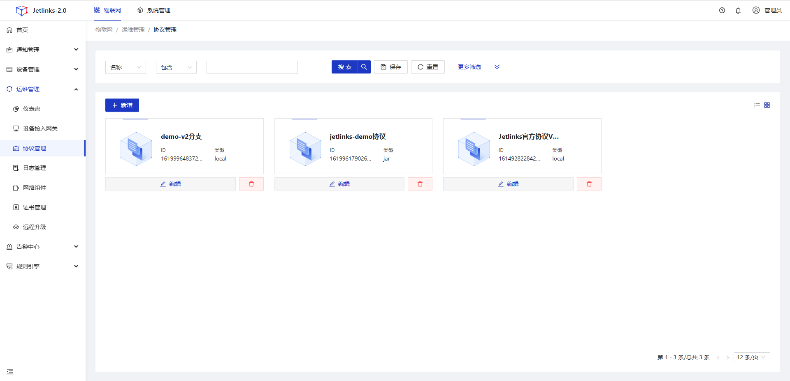

<p>2、<code>clone</code>或者<code>下载</code>协议包，此示例使用的为<a href='https://github.com/jetlinks/jetlinks-official-protocol' target='_blank'>JetLinks官方设备接入协议</a>V3分支。将协议包下载或者<code>clone</code>到本地磁盘，如果<code>clone</code>过程中出现错误可以参考<a href='../dev-guide/pull-code.html#配置ssh-key' target='_blank'>如何配置ssh-key</a>。</p>


下载完成后的协议包目录如下。

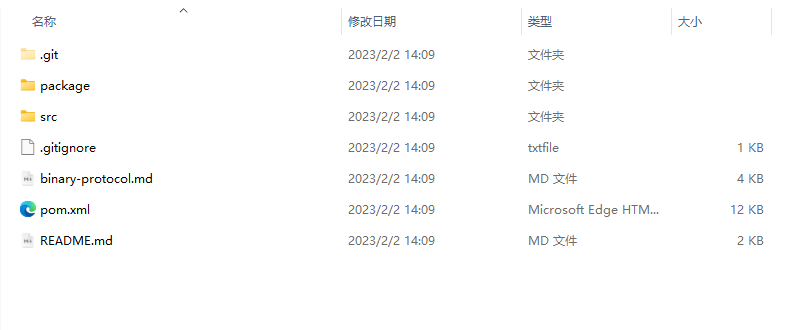

<p>3、在JetLinks平台<code>协议管理</code>内选择<code>新增</code></p>


通过<code>Jar包</code>的方式新增。

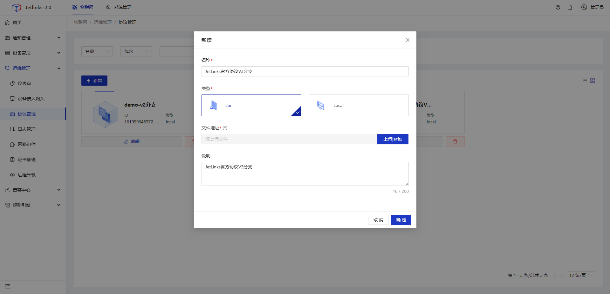

上传Jar包(需通过maven命令打包)。

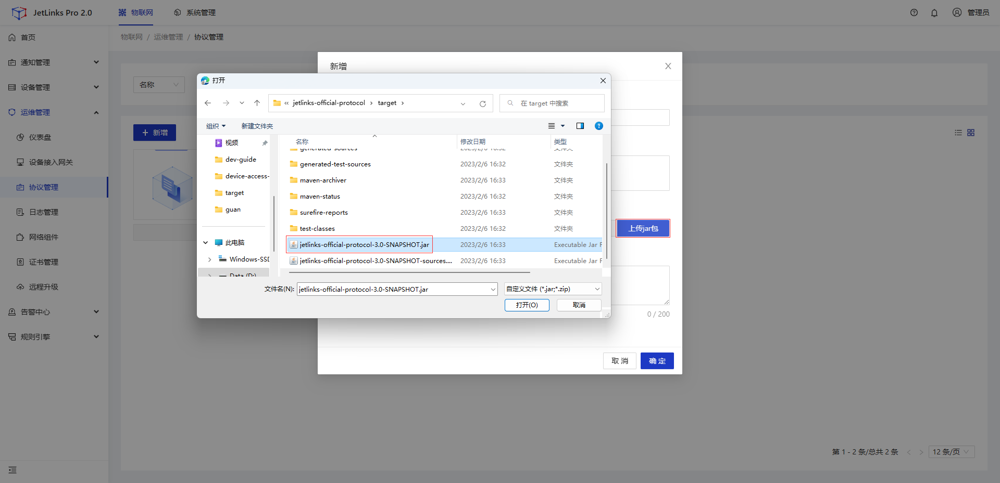

新增完成后平台显示新增的协议如下。

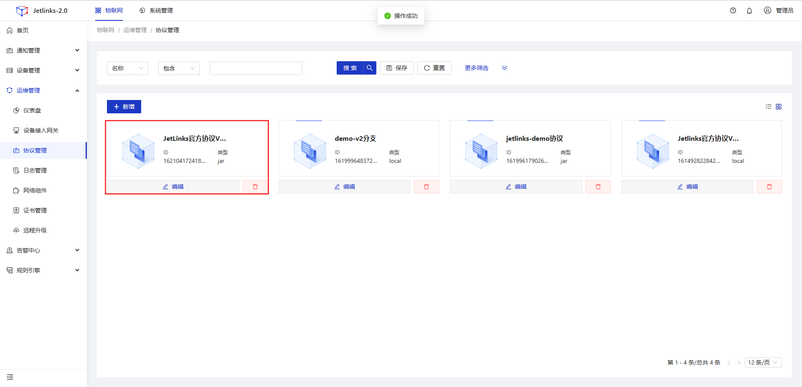

<br>

通过`Local`方式新增协议。

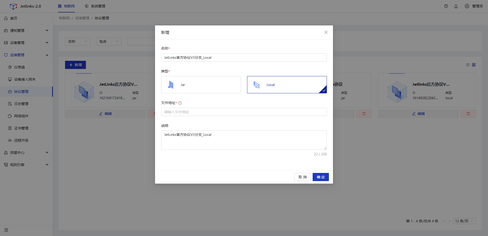

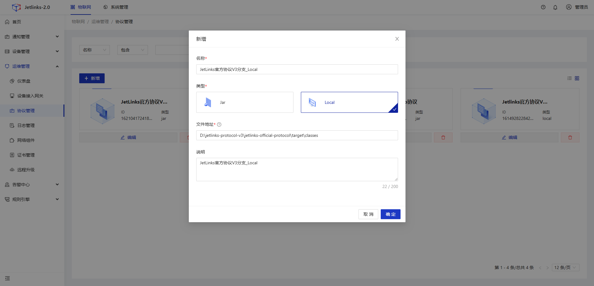


#### 新增网络组件

<div class='explanation primary'>
  <p class='explanation-title-warp'>
    <span class='iconfont icon-bangzhu explanation-icon'></span>
    <span class='explanation-title font-weight'>说明</span>
  </p>
    <p>
        网络组件是用于管理网络服务动态配置、启停，只负责接收、发送报文，不负责任何处理逻辑。
    </p>
</div>


<p>
    1、 <code>登录</code>JetLinks平台，选择顶部导航栏<code>物联网</code>>>>左侧菜单栏<code>运维管理</code>>>><code>网络组件</code>。
</p>


<p>2、填入配置参数，点击<code>保存</code>按钮</p>

| 填写参数 | 说明                                                         |
| -------- | ------------------------------------------------------------ |
| 名称     | 必填项，该网络组件的名称。                                   |
| 类型     | 必选项，此处选择HTTP服务。                                   |
| 集群     | 必选项，共享配置：集群下所有节点共用同一配置。<br>独立配置：集群下不同节点使用不同配置。 |
| 本地地址 | 绑定到服务器上的网卡地址，此处固定为0.0.0.0，表示接收所有请求。 |
| 本地端口 | 必填项，监听指定端口的请求。                                 |
| 公网地址 | 必填项，对外提供访问的地址，内网环境时填写服务器的内网IPv4地址。仅用于展示，给运维人员做公网端口和本地地址绑定关系展示使用。 |
| 公网端口 | 必填项，对外提供访问的端口。                                 |
| 开启TLS  | 必选项，是否开启tls加密，如果选择开启则需要配置证书，配置详情可以参考<a href='/Mocha_ITOM/certificate_management.html#使用平台脚本生成证书' target='_blank'>证书配置</a>。 |
| 说明     | 选填项，该网络组件的备注说明。                               |

<div class='explanation primary'>
  <p class='explanation-title-warp'>
    <span class='iconfont icon-bangzhu explanation-icon'></span>
    <span class='explanation-title font-weight'>说明</span>
  </p>
    <p>
        <code>本地端口</code>内可选择的端口号范围可在<code>jetlinks-standalone</code>模块内的<code>application.yml</code>配置文件中通过修改<code>network.resources</code>的值进行指定，完整路径为<code>jetlinks-standalone/resources/application.yml</code>
    </p>
</div>


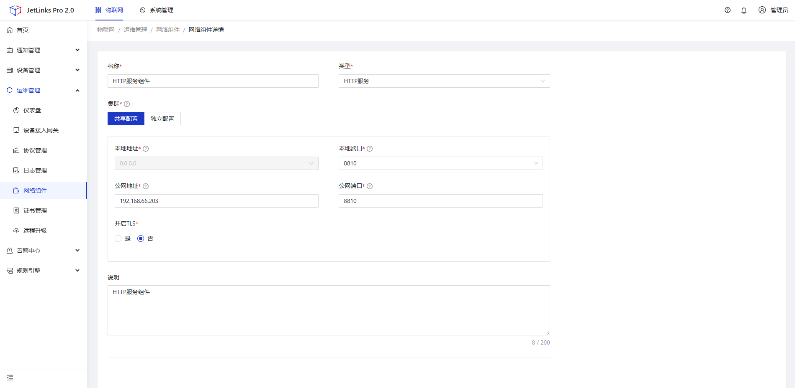


#### 新增设备接入网关

<div class='explanation primary'>
  <p class='explanation-title-warp'>
    <span class='iconfont icon-bangzhu explanation-icon'></span>
    <span class='explanation-title font-weight'>说明</span>
  </p>
    <p>
        负责平台侧统一的设备接入，使用网络组件处理对应的请求以及报文，使用配置的协议解析为平台统一的设备消息(DeviceMessage)，然后推送到事件总线。
    </p>
</div>
<p>
    1、 <code>登录</code>JetLinks平台，选择顶部导航栏<code>物联网</code>>>>左侧菜单栏<code>运维管理</code>>>><code>设备接入网关</code>。
</p>


<p>2、点击<code>新增</code>>>><code>HTTP推送接入</code>，选择配置的<code>HTTP网络组件</code>，<code>JetLinks官方协议</code>，命名后点击<code>保存</code></p>。

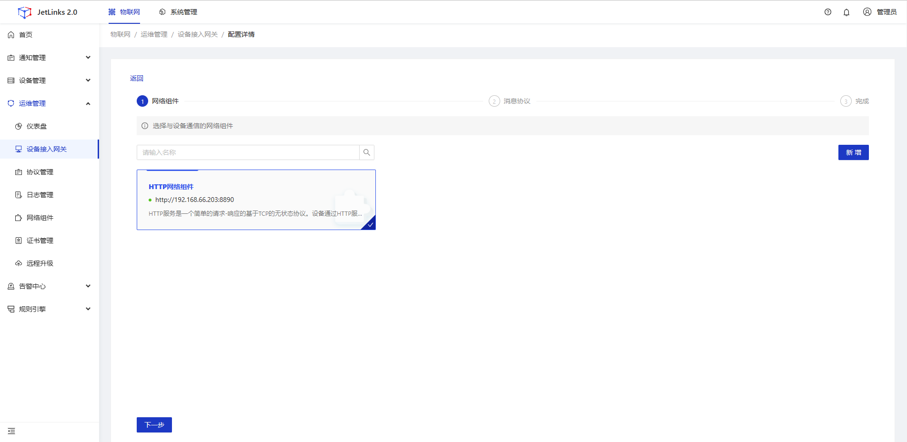

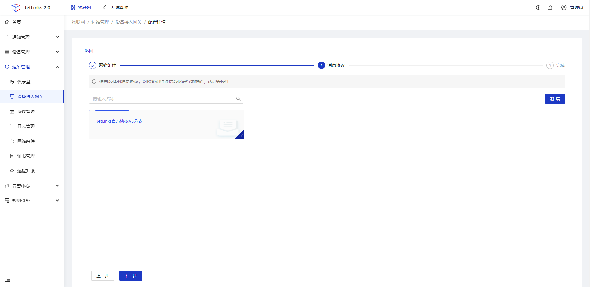

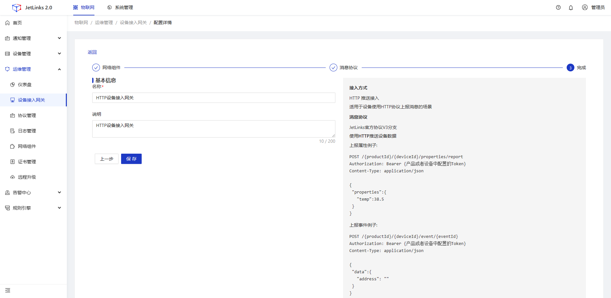


#### 新增产品

<p>
    1、 <code>登录</code>JetLinks平台，选择顶部导航栏<code>物联网</code>>>>左侧菜单栏<code>设备管理</code>>>><code>产品</code>。
</p>
<p>2、点击<code>新增</code>，填写产品<code>名称</code>，选择<code>设备类型</code>，之后点击<code>确定</code>。</p>

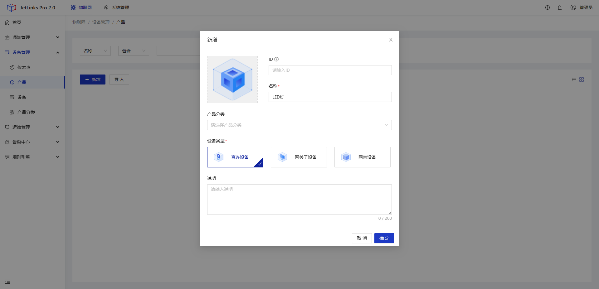

<p>3、点击创建好的产品进入产品详情页，选择<code>设备接入</code>，点击<code>选择</code>并在弹出的设备接入配置中选择上一步配置的<code>HTTP接入网关</code>，点击确定。</p>

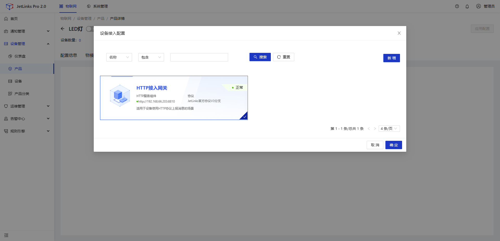

<p>4、填写<code>HTTP认证配置</code>，填入<code>Token</code>值，然后<code>启用</code>产品。</p>

<div class='explanation primary'>
  <p class='explanation-title-warp'>
    <span class='iconfont icon-bangzhu explanation-icon'></span>
    <span class='explanation-title font-weight'>说明</span>
  </p>
    <p>
        <code>Token</code>是设备连接到平台时的身份验证，每次发送数据包都会在<code>Header</code>中携带，可以在协议包中进行配置一型一密或者一机一密。
    </p>
</div>


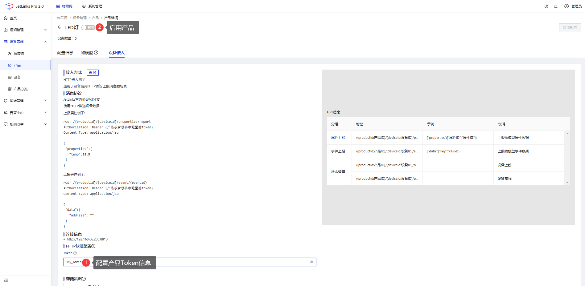


#### 新增设备

<p>
    1、 <code>登录</code>JetLinks平台，选择顶部导航栏<code>物联网</code>>>>左侧菜单栏<code>设备管理</code>>>><code>设备</code>。
</p>


<p>2、点击<code>新增</code>，填写设备<code>名称</code>，选择上一步配置的<code>产品</code>，此处选择之后点击<code>确定</code>，并在此页面<code>启用</code>设备。</p>

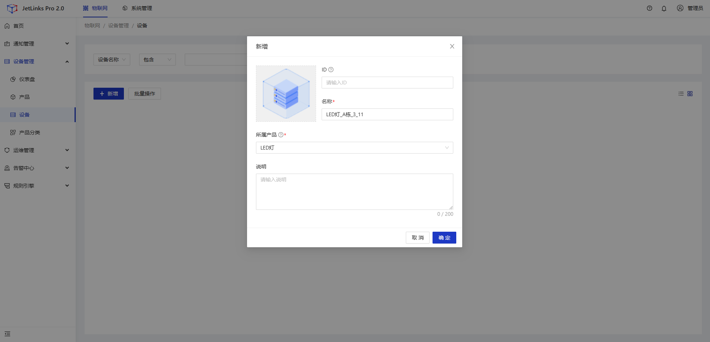

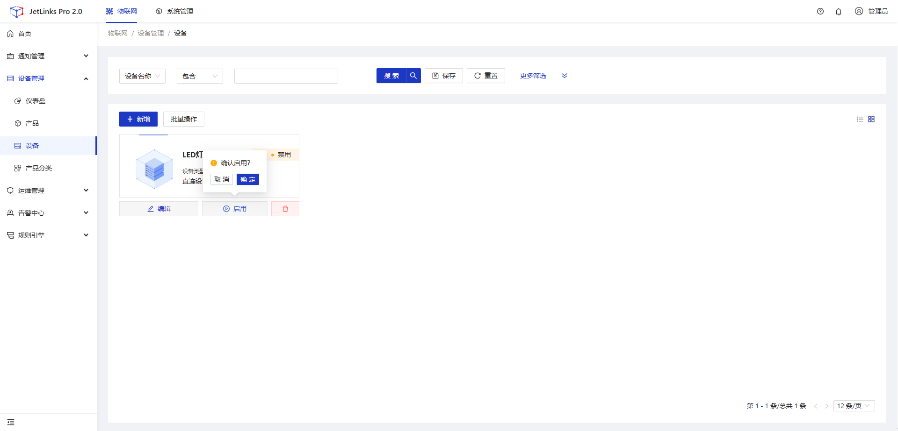


#### 配置产品物模型

<div class='explanation primary'>
  <p class='explanation-title-warp'>
    <span class='iconfont icon-bangzhu explanation-icon'></span>
    <span class='explanation-title font-weight'>说明</span>
  </p>
    <p>
        <a href='/Device_access/Configuration_model3.4.html' target='_blank'>物模型</a>是对某一类产品自身功能的一种抽象，在平台可表述为属性、功能、事件和标签。当在产品中配置物模型后，该类型下的设备都会继承该产品的物模型。但如果在设备中单独进行配置，即使未对继承的物模型进行更改，该设备的物模型也会脱离产品，需要独自进行维护。
    </p>
</div>
<p>
    1、 进入<code>物联网</code>>>><code>设备管理</code>>>><code>产品</code>页面，点击上文创建的产品，进入该产品的产品详情页，选择<code>物模型</code>。
</p>


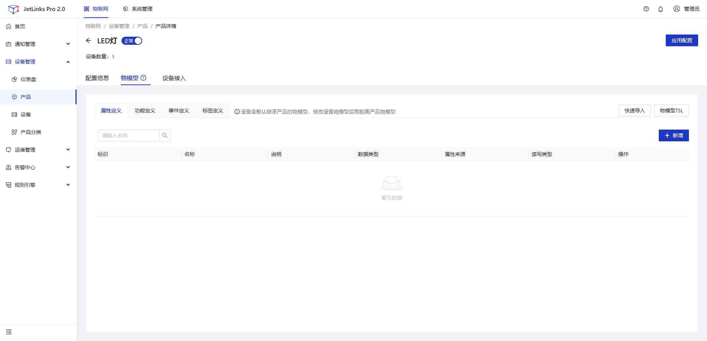

<p>2、在<code>物模型</code>>>><code>属性定义</code>内点击右侧<code>新增</code>来新增<code>属性定义</code>。</p>

填写`标识`为`actual_voltage`，名称`实际电压`，数据类型`float`，来源选择`设备`，读写类型选择`读 写 上报`。

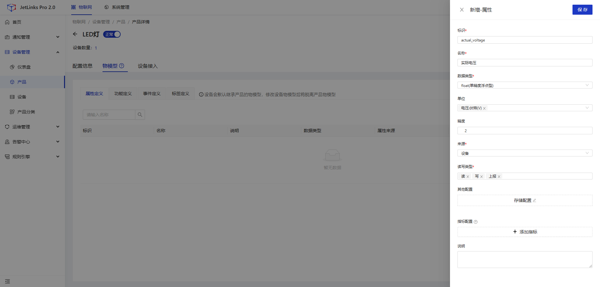


<p>3、选择<code>事件定义</code>>>>右侧<code>新增</code>，填入参数后右上角选择<code>保存</code>。</p>

填写`标识`为`abnormal_current`，名称`电流异常`，级别`警告`，输出参数选择`object(结构体)`。

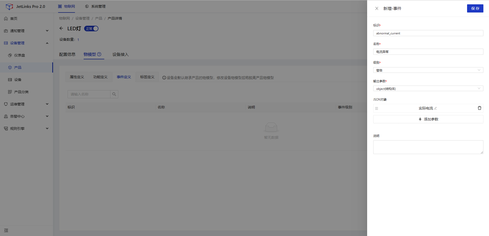

填写`标识`为`actual_current`，名称`实际电流`，数据类型`long`。

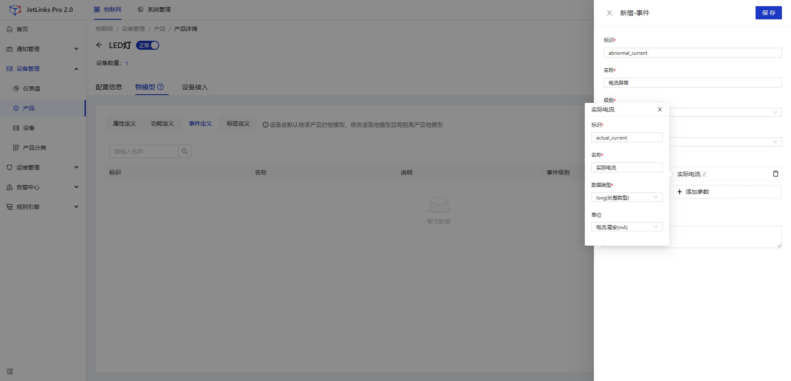

<p>4、配置完成后可以选择<code>设备</code>并找到对应产品下的设备，点击查看设备详情，选择<code>运行状态</code>，可以直观的看到配置完成的属性和事件。</p>

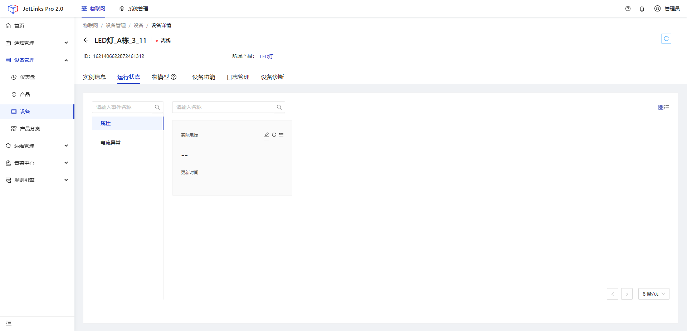

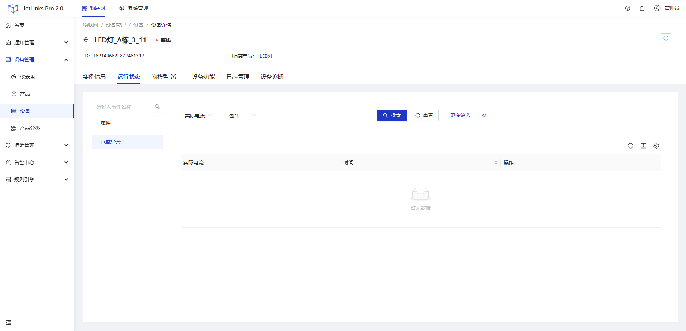


### Postman模拟设备接入

#### 设备接入

<div class='explanation primary'>
  <p class='explanation-title-warp'>
    <span class='iconfont icon-bangzhu explanation-icon'></span>
    <span class='explanation-title font-weight'>说明</span>
  </p>
    <p>
        本示例将使用<code>Postman</code>模拟设备进行连接平台以及属性和事件上报。
    </p>
</div>


### 设备上线

<p>
    1、 下载<a href='https://www.postman.com/downloads/' target='_blank'>Postman</a>，安装完成后打开。</b>
</p>


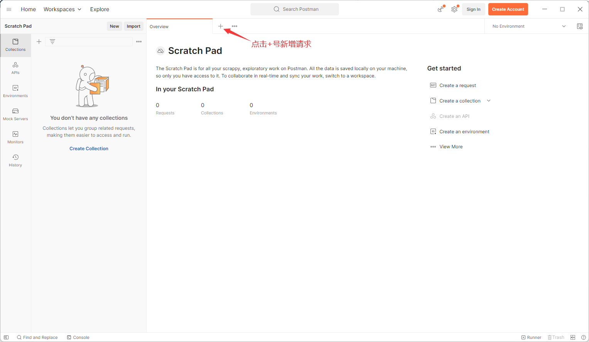

<p>2、填写连接参数</p>

配置`url`。

| 参数     | 说明                                                         |
| -------- | ------------------------------------------------------------ |
| POST     | 本次请求为POST                                               |
| 连接地址 | `http://{产品详情页里设备接入页面中的连接信息ip:端口号}/{指定的topic}`，具体的`Topic`信息，可以查看<a href="../dev-guide/jetlinks-protocol-support.html#topic列表" target='_blank'>官方协议Topic列表</a>。此处为设备上线消息`/{产品id}/{设备id}/online` |

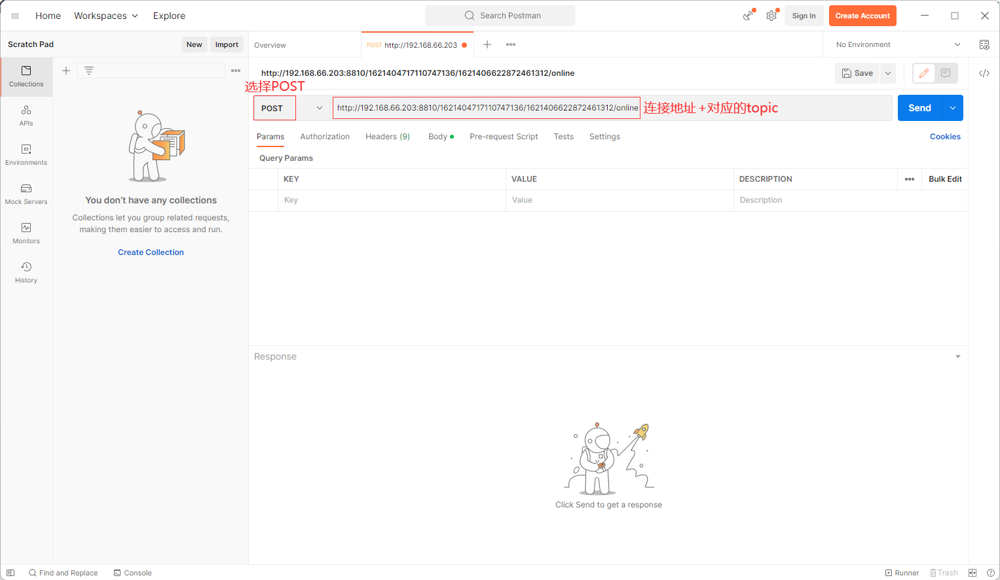配置`Headers`参数。

| 参数Key         | 参数Value         | 说明                                                         |
| --------------- | ----------------- | ------------------------------------------------------------ |
| `Authorization` | `Bearer My_Token` | Key固定填写Authorization，`Bearer`为固定值，`注意中间有一个空格`，`My_Token`为在产品的设备接入页面配置的`Token`值 |

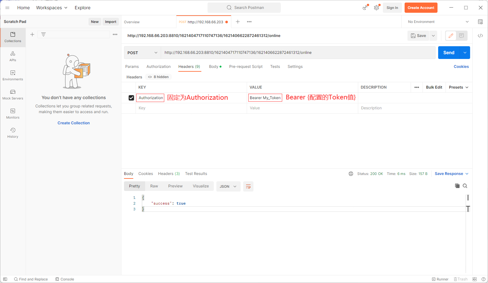

配置`Body`参数。

| 参数   | 说明                                                         |
| ------ | ------------------------------------------------------------ |
| `raw`  | 可以上传任意格式的文本，可以上传text、json、xml、html等，此处选择JSON |
| `JSON` | 选择上传JSON格式的文本                                       |
| 消息体 | 想要上传的文本内容，此处由于为设备上线，所以消息体可以不写，但必须填写`{}` |

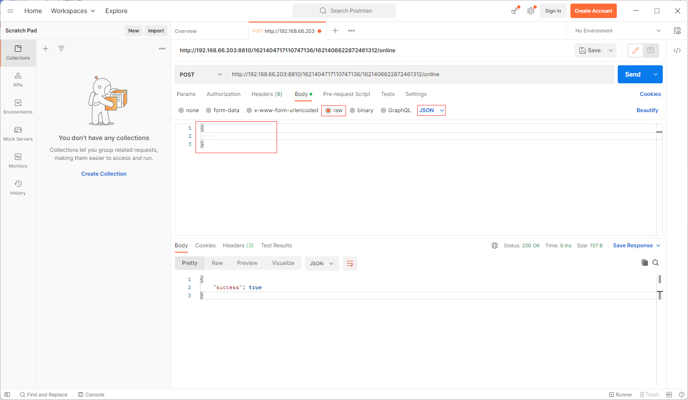

配置完成后点击`Send`按钮，发送本次请求，可以看到下方收到的消息`"success": true`，表示设备上线成功，可以在平台看到`设备`为在线状态。

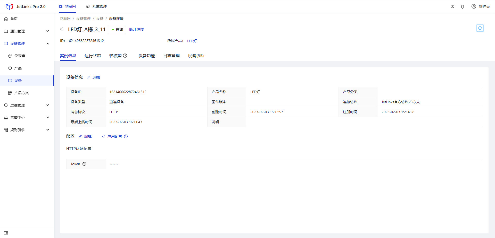


### 设备上报属性

`上报属性`只需要修改`url`以及对应的消息体就可以了，注意消息体内的注释应该删除。

| 参数   | 说明                                                         |
| ------ | ------------------------------------------------------------ |
| topic  | 具体的`Topic`信息，可以查看<a href="../dev-guide/jetlinks-protocol-support.html#topic列表" target='_blank'>官方协议Topic列表</a>。此处为设备属性上报消息`/{产品id}/{设备id}/properties/report` |
| 消息体 | `actual_voltage`为产品物模型中配置的属性，如果配置有多个属性，则按照此规则键对应值写入`properties`内即可。此处的消息体为`{"deviceId":"1621406622872461312"//应修改为对应的设备id,"properties":{"actual_voltage":12.4}}` |

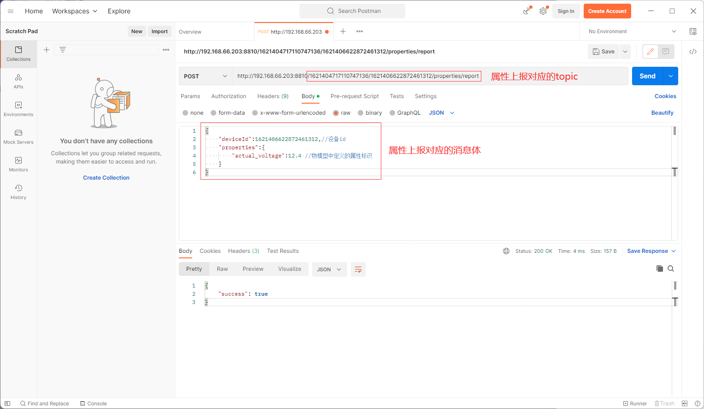

配置完成后点击`Send`按钮，发送本次请求，收到的消息`"success": true`，表示此次属性上报成功，可以在平台看到`设备`的`运行状态`内有上报的属性值。

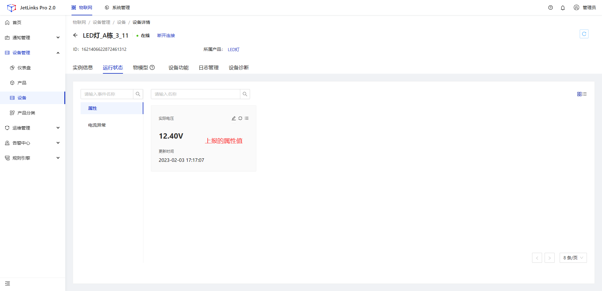


### 设备事件上报

`事件上报`只需要修改`url`以及对应的消息体就可以了，注意消息体内的注释应该删除。

| 参数   | 说明                                                         |
| ------ | ------------------------------------------------------------ |
| topic  | 具体的`Topic`信息，可以查看<a href="../dev-guide/jetlinks-protocol-support.html#topic列表" target='_blank'>官方协议Topic列表</a>。此处为设备事件上报消息`/{产品id}/{设备id}/event/{事件id}`，`事件id`为物模型的事件定义中的事件标识 |
| 消息体 | `actual_current`为产品物模型中事件定义内配置的输出参数，配置的结构体中如果有多个JSON对象，则按照此规则键对应值写入`data`内即可，此处的消息体为`{"timestamp":1675417805717,"messageId":"1621330658213723941","data":{"actual_current":23}}` |

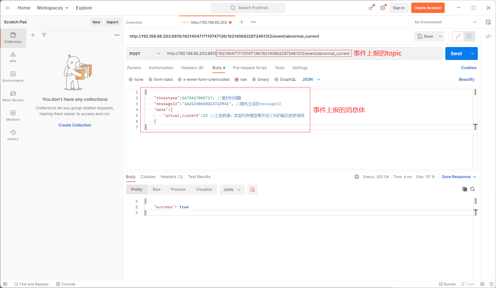

配置完成后点击`Send`按钮，发送本次请求，收到的消息`"success": true`，表示此次事件上报成功，可以在平台看到`设备`的`运行状态`内有事件上报的值。

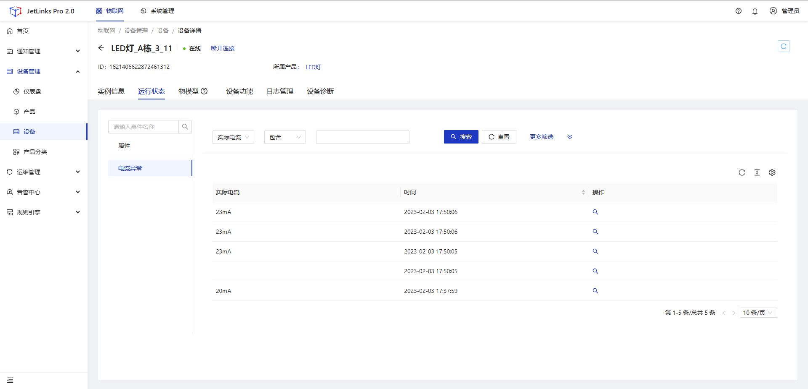


## UDP接入

#### 应用场景

<div class='explanation primary'>
  <p class='explanation-title-warp'>
    <span class='iconfont icon-bangzhu explanation-icon'></span>
    <span class='explanation-title font-weight'>说明</span>
  </p>
    <p>
        适用于UDP设备接入平台。
    </p>
</div>


#### 指导介绍

<p>
1. <a href='/Best_practices/Device_access.html#新增协议'>新增协议</a><br>
2. <a href='/Best_practices/Device_access.html#新增udp网络组件'>新增网络组件</a><br>
3. <a href='/Best_practices/Device_access.html#新增udp设备接入网关'>新增设备接入网关</a><br>
4. <a href='/Best_practices/Device_access.html#新增udp产品'>新增产品</a><br>
5. <a href='/Best_practices/Device_access.html#新增udp设备'>新增设备</a><br>
6. <a href='/Best_practices/Device_access.html#配置udp产品物模型'>配置产品物模型</a><br>
7. <a href='/Best_practices/Device_access.html#udp设备接入'>设备接入</a><br>
</p>


### 平台配置相关

#### 新增协议

<div class='explanation primary'>
  <p class='explanation-title-warp'>
    <span class='iconfont icon-bangzhu explanation-icon'></span>
    <span class='explanation-title font-weight'>说明</span>
  </p>
    <p>
        设备与平台进行通信需要有协议包的支持，平台支持基于UDP协议通过自定义协议包的方式，以解析不同厂家、不同设备上报的数据。
    </p>
</div>
<p>
 1、 <code>登录JetLinks平台</code>，选择顶部导航栏<code>物联网</code>>>>左侧菜单栏<code>运维管理</code>>>><code>协议管理</code>。
</p>


<p>2、<code>clone</code>或者<code>下载</code>协议包，此示例使用的为<a href='https://github.com/jetlinks/jetlinks-official-protocol' target='_blank'>JetLinks官方设备接入协议</a>V3分支。将协议包下载或者<code>clone</code>到本地磁盘，如果<code>clone</code>过程中出现错误可以参考<a href='./pull-code.html#配置ssh-key' target='_blank'>如何配置ssh-key</a>。</p>


下载完成后的协议包目录如下。


<p>3、在JetLinks平台<code>协议管理</code>内选择<code>新增</code>。</p>


通过<code>Jar包</code>的方式新增。


上传Jar包(需通过maven命令打包)。


新增完成后平台显示新增的协议如下。


<br>

通过`Local`方式新增协议。


复制生成的`target`文件夹下的`classes`文件夹路径填入平台新增协议的`文件地址`内，点击确认。

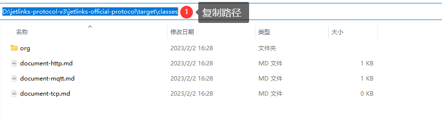


#### 新增udp网络组件

<div class='explanation primary'>
  <p class='explanation-title-warp'>
    <span class='iconfont icon-bangzhu explanation-icon'></span>
    <span class='explanation-title font-weight'>说明</span>
  </p>
    <p>
        网络组件是用于管理网络服务动态配置、启停，只负责接收、发送报文，不负责任何处理逻辑。
    </p>
</div>


<p>
    1、 <code>登录</code>JetLinks平台，选择顶部导航栏<code>物联网</code>>>>左侧菜单栏<code>运维管理</code>>>><code>网络组件</code>。
</p>
<p>2、填入配置参数，点击<code>保存</code>按钮</p>

| 填写参数 | 说明                                                         |
| -------- | ------------------------------------------------------------ |
| 名称     | 必填项，该网络组件的名称。                                   |
| 类型     | 必选项，此处选择UDP。                                        |
| 集群     | 必选项，共享配置：集群下所有节点共用同一配置。<br>独立配置：集群下不同节点使用不同配置。 |
| 本地地址 | 绑定到服务器上的网卡地址，此处固定为0.0.0.0，表示接收所有请求。 |
| 本地端口 | 必填项，监听指定端口的请求。                                 |
| 公网地址 | 必填项，对外提供访问的地址，内网环境时填写服务器的内网IPv4地址。仅用于展示，给运维人员做公网端口和本地地址绑定关系展示使用。 |
| 公网端口 | 必填项，对外提供访问的端口。                                 |
| 开启DTLS | 必选项，是否开启DTLS加密，如果选择开启则需要配置证书，配置详情可以参考<a href='/Mocha_ITOM/certificate_management.html#使用平台脚本生成证书' target='_blank'>证书配置</a>。 |
| 说明     | 选填项，该网络组件的备注说明。                               |

<div class='explanation primary'>
  <p class='explanation-title-warp'>
    <span class='iconfont icon-bangzhu explanation-icon'></span>
    <span class='explanation-title font-weight'>说明</span>
  </p>
    <p>
        本地端口内可选择的端口号范围可以在代码<code>jetlinks-standalone</code>模块内的<code>application.yml</code>配置文件中通过修改<code>network.resources</code>的值进行指定，完整路径为<code>jetlinks-standalone/resources/application.yml</code>
    </p>
</div>


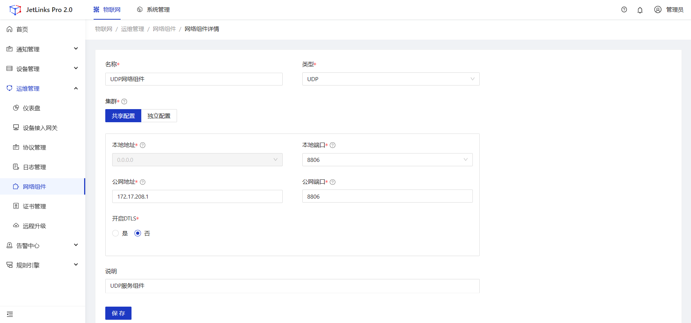


#### 新增udp设备接入网关

<div class='explanation primary'>
  <p class='explanation-title-warp'>
    <span class='iconfont icon-bangzhu explanation-icon'></span>
    <span class='explanation-title font-weight'>说明</span>
  </p>
    <p>
        负责平台侧统一的设备接入，使用网络组件处理对应的请求以及报文，使用配置的协议解析为平台统一的设备消息(DeviceMessage)，然后推送到事件总线。
    </p>
</div>


<p>
    1、 <code>登录</code>JetLinks平台，选择顶部导航栏<code>物联网</code>>>>左侧菜单栏<code>运维管理</code>>>><code>设备接入网关</code>。
</p>
<p>2、点击<code>新增</code>>>><code>UDP接入</code>，选择配置好的<code>UDP网络组件</code>，<code>JetLinks官方协议</code>，命名后点击<code>保存</code>。</p>

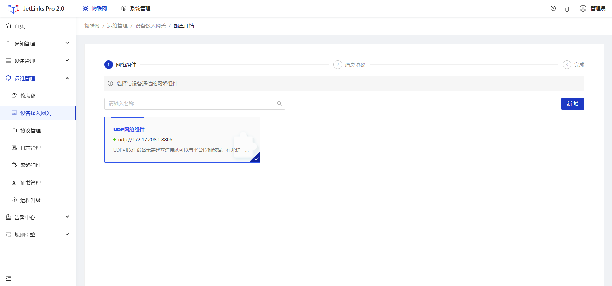


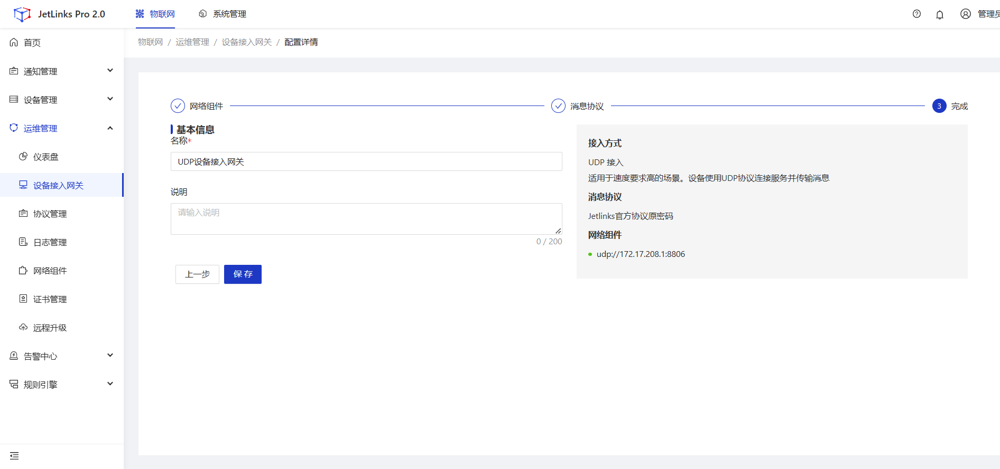


#### 新增udp产品

<div class='explanation primary'>
  <p class='explanation-title-warp'>
    <span class='iconfont icon-bangzhu explanation-icon'></span>
    <span class='explanation-title font-weight'>说明</span>
  </p>
    <p>
        对某一型设备的分类，通常是已经存在的某一个设备型号。
    </p>
</div>


<p>
    1、 <code>登录</code>JetLinks平台，选择顶部导航栏<code>物联网</code>>>>左侧菜单栏<code>设备管理</code>>>><code>产品</code>。
</p>
<p>2、点击<code>新增</code>，填写产品<code>名称</code>，选择<code>设备类型</code>，点击<code>确定</code>。</p>

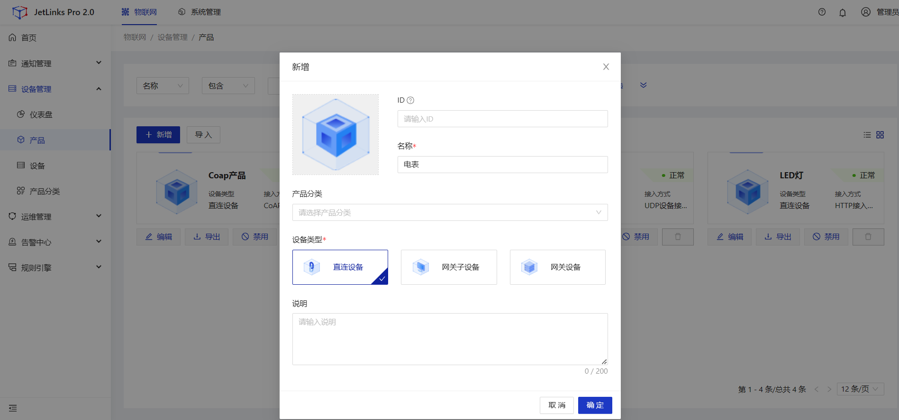

<p>3、点击创建的产品并进入产品详情页，选择<code>设备接入</code>，点击<code>选择</code>并选择上一步配置的<code>UDP设备接入网关</code>，点击确定。</p>

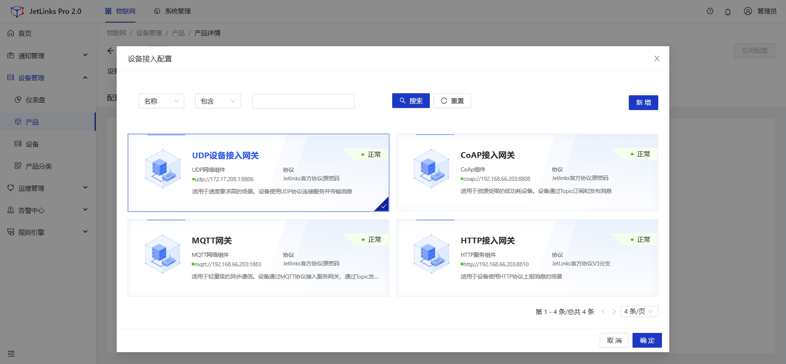

<p>4、继续在此页面的底端找到<code>UDP认证配置</code>，填入<code>secureKey</code>的值，此处配置为<code>admin</code>，然后点击<code>启用</code>产品。</p>

<div class='explanation primary'>
  <p class='explanation-title-warp'>
    <span class='iconfont icon-bangzhu explanation-icon'></span>
    <span class='explanation-title font-weight'>说明</span>
  </p>
    <p>
        <code>secureKey</code>是设备连接到平台时的身份验证，每次发送数据包都会携带，可以在协议包中进行配置一型一密还是一机一密。
    </p>
</div>


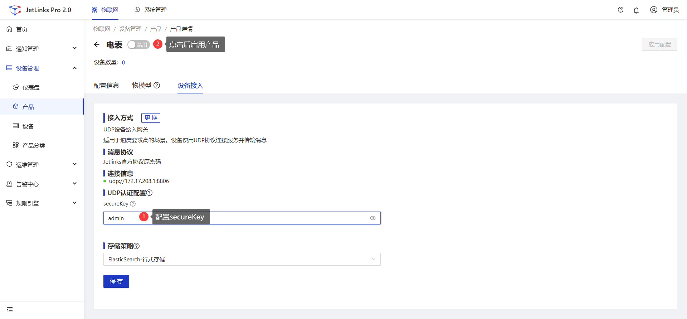


#### 新增udp设备

<p>
    1、 <code>登录</code>JetLinks平台，选择顶部导航栏<code>物联网</code>>>>左侧菜单栏<code>设备管理</code>>>><code>设备</code>。
</p>
<p>2、点击<code>新增</code>，填写设备<code>名称</code>，选择<code>所属产品</code>，此处选择之后点击<code>确定</code>，并在此页面<code>启用</code>设备。</p>

<div class='explanation primary'>
  <p class='explanation-title-warp'>
    <span class='iconfont icon-bangzhu explanation-icon'></span>
    <span class='explanation-title font-weight'>说明</span>
  </p>
    <p>
        此处设置ID为<code>ele_dev_a_1_13</code>是方便后续设备上线、属性上报等操作上报的报文一致。
    </p>
</div>


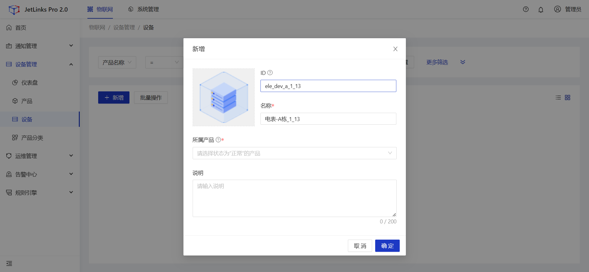

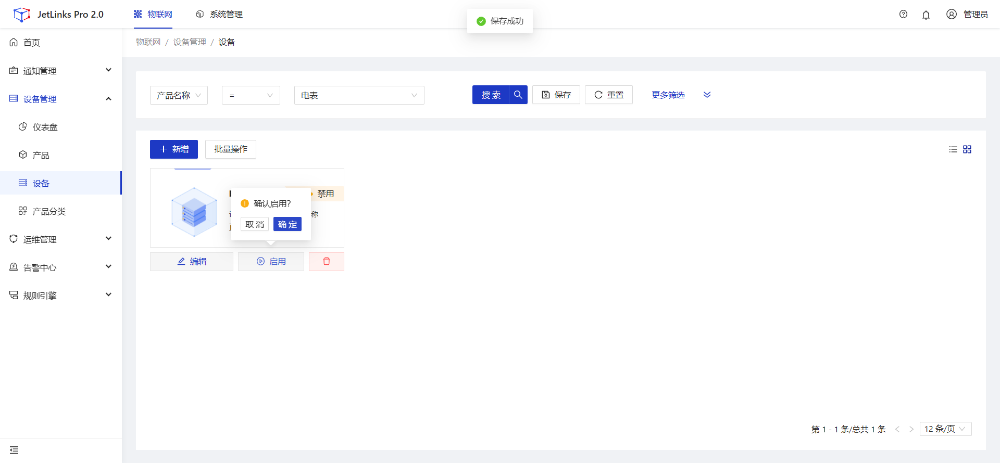


#### 配置udp产品物模型

<div class='explanation primary'>
  <p class='explanation-title-warp'>
    <span class='iconfont icon-bangzhu explanation-icon'></span>
    <span class='explanation-title font-weight'>说明</span>
  </p>
    <p>
        <a href='/Device_access/Configuration_model3.4.html' target='_blank'>物模型</a>是对某一类产品自身功能的一种抽象，在平台可表述为属性、功能、事件和标签。当在产品中配置物模型后，该类型下的设备都会继承该产品的物模型。但如果在设备中单独进行配置，即使未对继承的物模型进行更改，该设备的物模型也会脱离产品，需要独自进行维护。
    </p>
</div>


<p>
    1、 进入<code>物联网</code>>>><code>设备管理</code>>>><code>产品</code>页面，点击上文创建的产品，进入该产品的产品详情页，选择<code>物模型</code>。
</p>

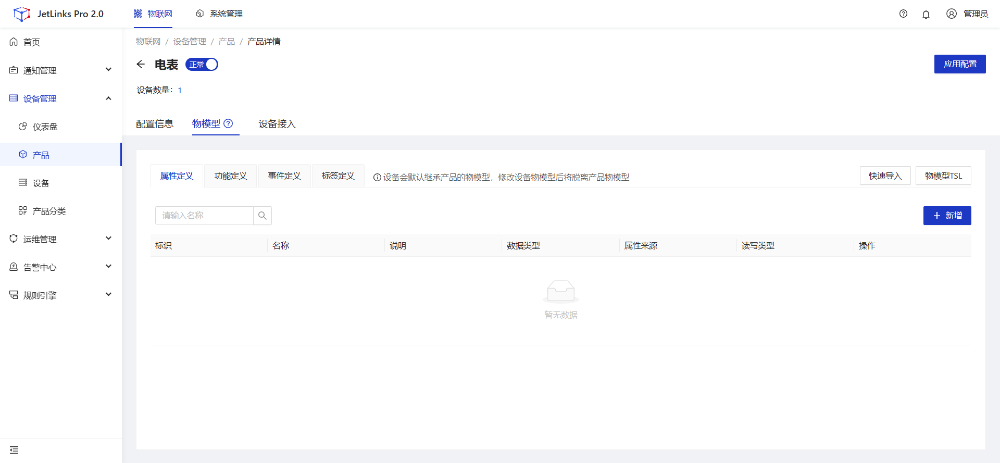

<p>2、在<code>物模型</code>>>><code>属性定义</code>内点击右侧的<code>新增</code>来新增<code>属性定义</code>。</p>

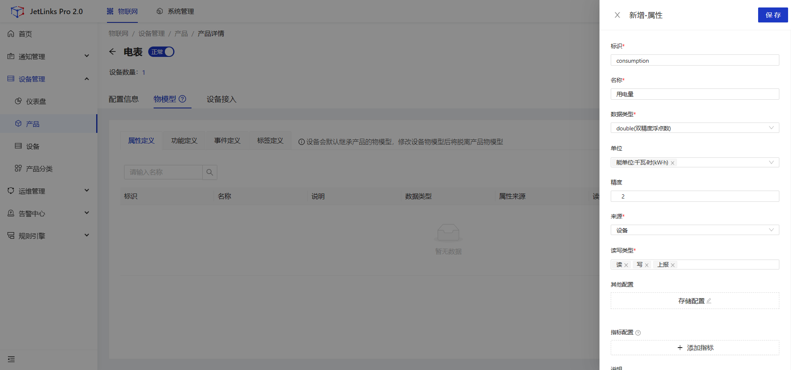

<p>3、选择<code>功能定义</code>>>>右侧<code>新增</code>，注意此处配置的为<code>输出参数</code>，参数配置完成后选择<code>保存</code>。</p>

输出参数选择为结构体。

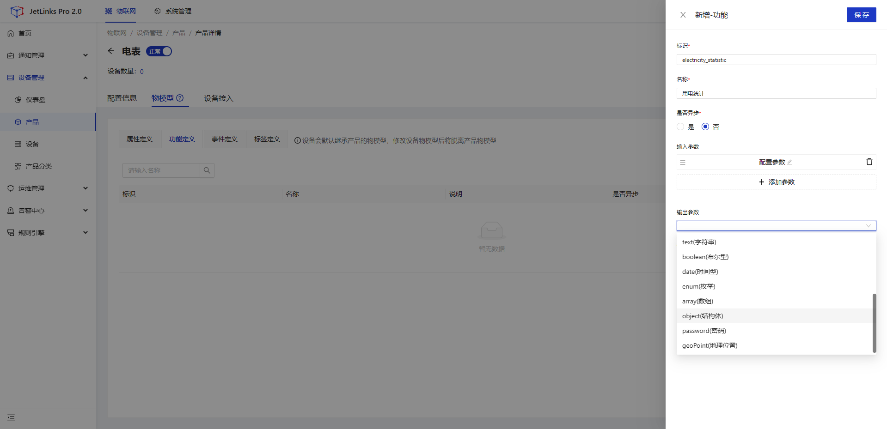

新增参数，标识`location`，名称`电表位置`，数据类型选择`text`。

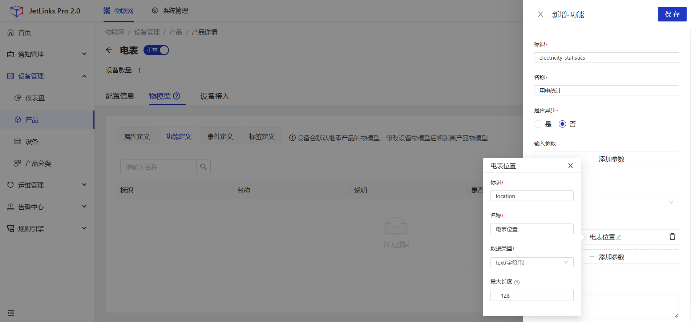

新增参数，标识`timestamp`，名称`时间戳`，数据类型选择`long`。

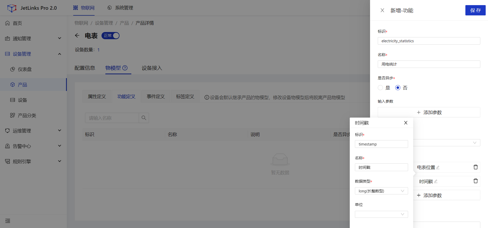

新增参数，标识`electricity_statistics`，名称`用电统计`，数据类型选择`double`。

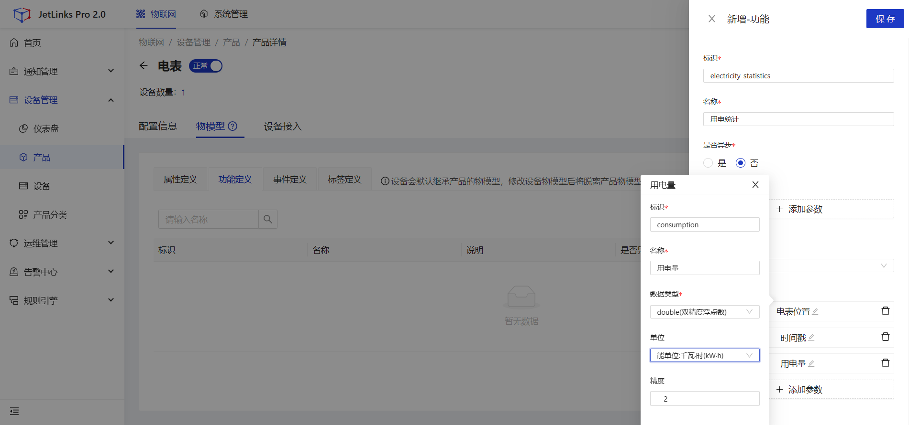

<p>4、选择<code>事件定义</code>>>>右侧<code>新增</code>，填入参数后右上角选择<code>保存</code>。</p>

新增参数，标识`location`，名称`位置`，数据类型选择`text`。

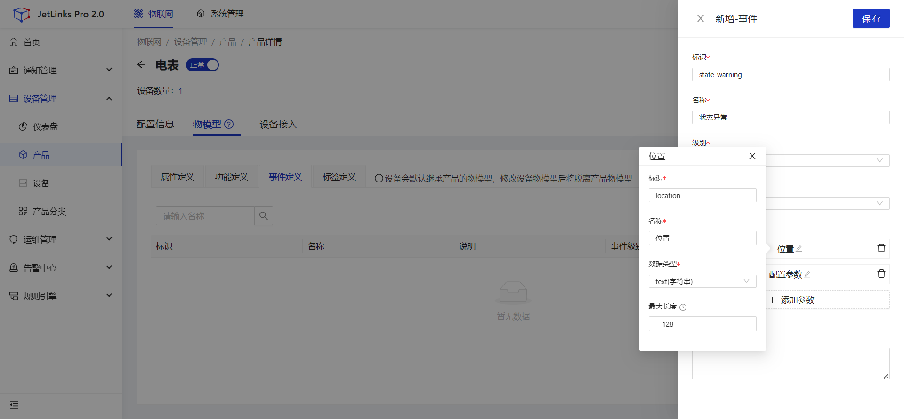

新增参数，标识`timestamp`，名称`时间戳`，数据类型选择`long`。


新增参数，标识`state_code`，名称`状态码`，数据类型选择`text`。


<p>4、配置完成后可以选择<code>设备</code>并找到对应产品下的设备，点击查看设备详情，选择<code>运行状态</code>，可以直观的看到配置完成的属性和事件，选择设备功能可以看到已经配置好的产品功能。</p>


### 使用SocketTool接入

#### udp设备接入

<div class='explanation primary'>
  <p class='explanation-title-warp'>
    <span class='iconfont icon-bangzhu explanation-icon'></span>
    <span class='explanation-title font-weight'>说明</span>
  </p>
    <p>
        本示例将使用<code>SocketTool</code>模拟设备进行连接平台以及属性、事件上报和功能调用回复。
    </p>
</div>


### 设备上线

<p>
    1、 下载<a href='https://pan.baidu.com/s/1Cpp4yCPaDDEcdybWZKIsDw&pwd=q14o' target='_blank'>SocketTool</a>，下载完成后打开。</b>
</p>


<p>2、配置连接参数连接平台。</p>


<p>3、填写报文<code>00000561646d696e01000001862606b03e0077000e656c655f6465765f615f315f3133000561646d696e</code>（<a href='/Best_practices/Device_access.html#报文是如何计算的'>报文是如何计算的?</a>），之后点击发送数据，进行设备上线。</p>


4、设备成功上线。


### 设备上报属性

<p>填写报文<code>00000561646D696E03000001862666B12B0088000E656C655F6465765F615F315F31330001000B636F6E73756D7074696F6E0A40888A8F5C28F5C3</code>（<a href='/Best_practices/Device_access.html#报文是如何计算的'>报文是如何计算的?</a>），之后点击发送数据，可以在设备运行状态页面查看上报的属性。</p>


### 设备事件上报

<p>填写报文（注意去除每一段之间的换行符）<code>00000561646D696E0a000001862666B12B0088000E656C655F6465765F615F315F3133000d73746174655f7761726e696e6700<br>0300086c6f636174696f6e0B000c6a696e6b655f615f315f3133000974696d657374616d700500000186281cb583000a7374617<br>4655f636f64650B000e696c6c656167616c5f7374617465</code>（<a href='/Best_practices/Device_access.html#报文是如何计算的'>报文是如何计算的?</a>），之后点击发送数据，可以在设备运行状态页面查看上报的事件。</p>


### 设备功能调用回复

<div class='explanation primary'>
  <p class='explanation-title-warp'>
    <span class='iconfont icon-bangzhu explanation-icon'></span>
    <span class='explanation-title font-weight'>说明</span>
  </p>
    <p>
        功能调用回复需要在<code>10秒</code>内回复，否则会出现<code>超时</code>的提示。
    </p>
</div>


在调试时，可以通过修改配置将功能调用回复的超时时间设置的比较长。


将超时时间设置为`120`秒，配置完成后需要重启后台服务。


在`Jetlinks`平台选择对应的设备，点击`设备功能`，点击`执行`。


选择日志管理查看最新一条的功能调用日志的内容，复制其中的`messageId`的值。如果提示设备已离线，则需要先发送上线报文`00000561646d696e01000001862606b03e0077000e656c655f6465765f615f315f3133000561646d696e`进行设备上线。


在`JetLinks官方协议`的代码中找到`testFunction`方法，路径为`org.jetlinks.protocol.official.binary.BinaryMessageTypeTest`。复制示例代码，并将`messageId`的值修改为上一步复制的`messageId`后运行。


```java
    @Test
    public void testFunction() {
        FunctionInvokeMessageReply reply = new FunctionInvokeMessageReply();
        reply.setDeviceId("ele_dev_a_1_13");
        reply.setMessageId("1622906517320265729");//修改为复制的messageId值
        Map<String, Object> output = new LinkedHashMap<>();
        output.put("location", "location");
        output.put("timestamp", "1675764401261");
        output.put("consumption", new Random().nextDouble());
        reply.setOutput(output);
        doTest(reply);
    }
```


在生成的报文段前加上`00000561646d696e`后通过工具发送，然后可以在平台日志查看调用功能回复的内容。


### 获取报文

1、找到官方协议中的`BinaryMessageTypeTest`类，完整路径为`org.jetlinks.protocol.official.binary.BinaryMessageTypeTest`


2、选择需要生成报文类型的方法


3、设置所需参数，运行后可以得到消息体报文


4、拼接固定报文

例如拼接的报文为`00000561646d696e`，其中`00`为固定值，`0005`表示平台配置的`secureKey`长度，使用十六进制表示。`61646d696e`表示平台配置的十六进制`secureKey`值，此处为字符串的`admin`。

5、获取完整报文

`00000561646d696e05000001862bd8d7be0002000474657374010001000474656d700a404070a3d70a3d71`，使用工具发送即可，此处生成的报文表示读取属性回复。


[comment]: <> "## HTTP接入"

[comment]: <> "### 系统配置"

[comment]: <> "1.**登录**Jetlinks物联网平台，进入**网络组件**菜单，创建HTTP服务网络组件。</br>"

[comment]: <> "![]&#40;./img/httpwl.png&#41;"

[comment]: <> "2.进入**协议管理**菜单，上传协议包。</br>"

[comment]: <> "![]&#40;./img/254.png&#41;"

[comment]: <> "3.进入**设备接入网关**，创建HTTP推送接入类型的接入网关。</br>"

[comment]: <> "![]&#40;./img/httpwg.png&#41;"

[comment]: <> "4.[创建产品]&#40;../Device_access/Create_product3.1.md&#41;，并选中接入方式为HTTP推送类型的设备接入网关。</br>"

[comment]: <> "![]&#40;./img/httpjr.png&#41;"

[comment]: <> "5.[创建设备]&#40;../Device_access/Create_Device3.2.md&#41;，所属产品选择HTTP推送接入类型的产品。</br>"

[comment]: <> "### 推送消息"

[comment]: <> "此处使用postman模拟设备请求。"

[comment]: <> "#### 模拟设备上报属性"

[comment]: <> "![]&#40;./img/276.png&#41;"

[comment]: <> "<div class='explanation primary'>"

[comment]: <> "  <p class='explanation-title-warp'>"

[comment]: <> "    <span class='iconfont icon-bangzhu explanation-icon'></span>"

[comment]: <> "    <span class='explanation-title font-weight'>说明</span>"

[comment]: <> "  </p>"

[comment]: <> "请求时路径中带的/report-property相当于mqtt中的topic，在demo协议将中根据路径来判断消息类型。"

[comment]: <> "</div>"

[comment]: <> "上报后，在**设备-运行状态**中进行查看。"

[comment]: <> "#### 模拟设备事件上报"

[comment]: <> "![]&#40;./img/277.png&#41;"

[comment]: <> "<div class='explanation primary'>"

[comment]: <> "  <p class='explanation-title-warp'>"

[comment]: <> "    <span class='iconfont icon-bangzhu explanation-icon'></span>"

[comment]: <> "    <span class='explanation-title font-weight'>说明</span>"

[comment]: <> "  </p>"

[comment]: <> "请求时路径中带的/fire-alarm相当于mqtt中的topic，在demo协议将中根据路径来判断消息类型。"

[comment]: <> "</div>"

[comment]: <> "上报后，在**设备-运行状态**中，点击左侧菜单，切换至对应事件，进行查看。"

[comment]: <> "![]&#40;./img/265.png&#41;"

[comment]: <> "#### 指令下发"

[comment]: <> "由于http是短链接,无法直接下发指令,可以在`消息拦截器中`或者`编码时`通过将消息设置到`device.setConfig`中,在收到 http请求拉取消息时，通过`device.getSelfConfig`获取配置,并返回。"

[comment]: <> "## 使用CoAP服务接入"

[comment]: <> "本文档使用[coap-cli]&#40;https://www.npmjs.com/package/coap-cli&#41;模拟设备接入平台。"

[comment]: <> "<div class='explanation info'>"

[comment]: <> "  <p class='explanation-title-warp'> "

[comment]: <> "    <span class='iconfont icon-tishi explanation-icon'></span>"

[comment]: <> "    <span class='explanation-title font-weight'>提示</span>"

[comment]: <> "  </p>"

[comment]: <> "本功能仅在企业版中提供。"

[comment]: <> "</div>"


[comment]: <> "### 系统配置"

[comment]: <> "1.**登录**Jetlinks物联网平台，进入**网络组件**菜单，创建CoAP服务网络组件。</br>"

[comment]: <> "![]&#40;./img/coapwl.png&#41;"

[comment]: <> "2.进入**协议管理**菜单，上传协议包。</br>"

[comment]: <> "![]&#40;./img/254.png&#41;"

[comment]: <> "3.进入**设备接入网关**，创建CoAP接入类型的接入网关。</br>"

[comment]: <> "![]&#40;./img/coapwg.png&#41;"

[comment]: <> "4.[创建产品]&#40;../Device_access/Create_product3.1.md&#41;，并选中接入方式为CoAP接入类型的设备接入网关。</br>"

[comment]: <> "![]&#40;./img/coapjr.png&#41;"

[comment]: <> "5.[创建设备]&#40;../Device_access/Create_Device3.2.md&#41;，所属产品选择CoAP接入类型的产品。</br>"

[comment]: <> "### 使用coap-cli模拟客户端接入"

[comment]: <> "1.下载并安装`coap-cli`。"

[comment]: <> "```shell script"

[comment]: <> "npm install coap-cli -g"

[comment]: <> "```"

[comment]: <> "2.模拟设备设备属性上报"

[comment]: <> "```shell script"

[comment]: <> "echo -n '{"deviceId":"coap-test-001","properties":{"temperature":36.5}}' | coap post coap://localhost:8009/report-property"

[comment]: <> "```"

[comment]: <> "在**设备-运行状态**中可以看到温度属性已发生变化。  </br>"

[comment]: <> "3.模拟设备上报事件"

[comment]: <> "```shell script"

[comment]: <> "echo -n '{"deviceId":"coap-test-001","pname":"智能温控","aid":105,"a_name":"未来科技城","b_name":"C2 栋","l_name":"12-05-201","timestamp":"2019-11-06 16:28:50","alarm_type":1,"alarm_describe":"火灾报警","event_id":1,"event_count":1}' | coap post coap://localhost:8009/fire_alarm"

[comment]: <> "```"

[comment]: <> "在**设备-运行状态**中点击左侧菜单，切换至对应事件，进行查看。"

[comment]: <> "![]&#40;./img/265.png&#41;"

[comment]: <> "## 使用UDP接入"


[comment]: <> "<div class='explanation info'>"

[comment]: <> "  <p class='explanation-title-warp'> "

[comment]: <> "    <span class='iconfont icon-tishi explanation-icon'></span>"

[comment]: <> "    <span class='explanation-title font-weight'>提示</span>"

[comment]: <> "  </p>"

[comment]: <> "本功能仅在企业版中提供。"

[comment]: <> "</div>"


[comment]: <> "### 系统配置"

[comment]: <> "1.**登录**Jetlinks物联网平台，进入**网络组件**菜单，创建UDP网络组件。</br>"

[comment]: <> "![]&#40;./img/udpwl.png&#41;"

[comment]: <> "2.进入**协议管理**菜单，上传协议包。</br>"

[comment]: <> "![]&#40;./img/254.png&#41;"

[comment]: <> "3.进入**设备接入网关**，创建UDP接入类型的接入网关。</br>"

[comment]: <> "![]&#40;./img/udpwg.png&#41;"

[comment]: <> "4.[创建产品]&#40;../Device_access/Create_product3.1.md&#41;，并选中接入方式为UDP接入类型的设备接入网关。</br>"

[comment]: <> "![]&#40;./img/udpjr.png&#41;"

[comment]: <> "5.[创建设备]&#40;../Device_access/Create_Device3.2.md&#41;，所属产品选择UDP接入类型的产品。</br>"

[comment]: <> "### 使用UDP模拟工具接入"

[comment]: <> "1.下载并安装`SocketTool4`。"

[comment]: <> "<div class='explanation primary'>"

[comment]: <> "  <p class='explanation-title-warp'>"

[comment]: <> "    <span class='iconfont icon-bangzhu explanation-icon'></span>"

[comment]: <> "    <span class='explanation-title font-weight'>说明</span>"

[comment]: <> "  </p>"

[comment]: <> "此处以json方式传输数据。"

[comment]: <> "</div>"

[comment]: <> "2.创建udp客户端。  "

[comment]: <> "![]&#40;./img/278.png&#41;"

[comment]: <> "3.模拟设备设备属性上报</br>"

[comment]: <> "在SocketTool4工具的**数据发送窗口**填写发送的报文。</br>"

[comment]: <> "此处使用的报文为："

[comment]: <> "```json"

[comment]: <> "{"

[comment]: <> "  "properties":{"

[comment]: <> "      "temperature":36.5 //温度属性"

[comment]: <> "     },"

[comment]: <> "  "messageType": "REPORT_PROPERTY",//org.jetlinks.core.message.MessageType"

[comment]: <> "  "deviceId": "udp-test-001",//设备id"

[comment]: <> "  "key": "admin"//udp认证配置，udp_auth_key	"

[comment]: <> "}"

[comment]: <> "```"

[comment]: <> "单击**发送数据**按钮发起发送数据。"

[comment]: <> "![]&#40;./img/279.png&#41;"

[comment]: <> "收到上报的消息后平台中设备状态将变为上线,在**设备-运行状态**中可以看到温度属性已发生变化。</br>"

[comment]: <> "4.模拟设备上报事件</br>"

[comment]: <> "在SocketTool4工具的**数据发送窗口**填写发送的报文。</br>"

[comment]: <> "此处使用的报文为：</br>"

[comment]: <> "```json"

[comment]: <> "{"

[comment]: <> "    "data": {"

[comment]: <> "          "pname":"智能温控","

[comment]: <> "          "aid":105,"

[comment]: <> "          "a_name":"未来科技城","

[comment]: <> "          "b_name":"C2 栋","

[comment]: <> "          "l_name":"12-05-201","

[comment]: <> "          "timestamp":"2019-11-06 16:28:50","

[comment]: <> "          "alarm_type":1,"

[comment]: <> "          "alarm_describe":"火灾报警","

[comment]: <> "          "event_id":1,"

[comment]: <> "          "event_count":1"

[comment]: <> "    },"

[comment]: <> "    "event": "fire_alarm",//事件标识"

[comment]: <> "    "messageType": "EVENT",//org.jetlinks.core.message.MessageType"

[comment]: <> "    "deviceId": "udp-test-001",//设备id"

[comment]: <> "    "key": "admin"//udp认证配置，udp_auth_key	"

[comment]: <> "}"

[comment]: <> "``` "

[comment]: <> "单击**发送数据**按钮发起发送数据。  "

[comment]: <> "![]&#40;./img/280.png&#41;"

[comment]: <> "在**设备-运行状态**中点击左侧菜单，切换至对应事件，进行查看。"

[comment]: <> "![]&#40;./img/265.png&#41;"

[comment]: <> "## TCP、MQTT短连接接入"

[comment]: <> "默认情况下,使用tcp和mqtt方式接入时,当连接断开时,则认为设备已离线。"

[comment]: <> "但是在某些场景&#40;如:低功率设备&#41;下,无法使用长连接进行通信,可以通过指定特定配置使平台保持设备在线状态。"

[comment]: <> "<div class='explanation primary'>"

[comment]: <> "  <p class='explanation-title-warp'>"

[comment]: <> "    <span class='iconfont icon-bangzhu explanation-icon'></span>"

[comment]: <> "    <span class='explanation-title font-weight'>说明</span>"

[comment]: <> "  </p>"

[comment]: <> "以下功能及API在jetlinks 1.4.0 后提供。"

[comment]: <> "</div>"

[comment]: <> "### 保持在线"

[comment]: <> "在自定义协议包解码出消息时，可通过在消息中添加头`keepOnline`来进行设置。如:"

[comment]: <> "```java"

[comment]: <> "message.addHeader&#40;Headers.keepOnline,true&#41;; //设置让会话强制在线"

[comment]: <> "message.addHeader&#40;Headers.keepOnlineTimeoutSeconds,600&#41;;//设置超时时间（可选,默认10分钟），如果超过这个时间没有收到任何消息则认为离线。"

[comment]: <> "```"

[comment]: <> "<div class='explanation primary'>"

[comment]: <> "  <p class='explanation-title-warp'>"

[comment]: <> "    <span class='iconfont icon-bangzhu explanation-icon'></span>"

[comment]: <> "    <span class='explanation-title font-weight'>说明</span>"

[comment]: <> "  </p>"

[comment]: <> "MQTT接入时添加到任意消息即可。TCP接入时添加到DeviceOnlineMessage即可。"

[comment]: <> "如果服务重启，将不会保存在线状态！</p>"

[comment]: <> "</div>"

[comment]: <> "### 缓存下发消息"

[comment]: <> "在进行消息下发时，因为会话是强制保持在线的，所以消息会直接通过session下发，但是此时设备可能已经断开了连接,"

[comment]: <> "将会抛出异常`DeviceOperationException&#40;ErrorCode.CLIENT_OFFLINE&#41;`。这时候可以通过将消息缓存起来，等待下次设备"

[comment]: <> "连接上来后再下发指令。"

[comment]: <> "一、在自定义协议包中使用消息拦截器拦截异常"

[comment]: <> "```java"

[comment]: <> "support.addMessageSenderInterceptor&#40;new DeviceMessageSenderInterceptor&#40;&#41; {"

[comment]: <> "    @Override"

[comment]: <> "    public <R extends DeviceMessage> Flux<R> afterSent&#40;DeviceOperator device, DeviceMessage message, Flux<R> reply&#41; {"

[comment]: <> "        return reply.onErrorResume&#40;DeviceOperationException.class, err -> {"

[comment]: <> "            if &#40;err.getCode&#40;&#41; == ErrorCode.CLIENT_OFFLINE&#41; {"

[comment]: <> "                return device"

[comment]: <> "                    .setConfig&#40;"will-msg", message&#41; //设置到配置中"

[comment]: <> "                    .thenReturn&#40;&#40;&#40;RepayableDeviceMessage<?>&#41; message&#41;"

[comment]: <> "                        .newReply&#40;&#41;"

[comment]: <> "                        .code&#40;ErrorCode.REQUEST_HANDLING.name&#40;&#41;&#41;"

[comment]: <> "                        .message&#40;"设备处理中..."&#41;"

[comment]: <> "                        .success&#40;&#41;"

[comment]: <> "                    &#41;"

[comment]: <> "                    .map&#40;r -> &#40;R&#41; r&#41;;"

[comment]: <> "            }"

[comment]: <> "            return Mono.error&#40;err&#41;;"

[comment]: <> "        }&#41;;"

[comment]: <> "    }"

[comment]: <> "}&#41;;"

[comment]: <> "```"

[comment]: <> "二、获取缓存的消息"

[comment]: <> "在收到设备指令后进行解码时,可以先获取是否有缓存到消息,然后发送到设备。"

[comment]: <> "伪代码如下:"

[comment]: <> "```java"

[comment]: <> "@Override"

[comment]: <> "public Mono<? extends Message> decode&#40;MessageDecodeContext context&#41; {"

[comment]: <> "    return context.getDevice&#40;&#41;"

[comment]: <> "        .getAndRemoveConfig&#40;"will-msg"&#41;"

[comment]: <> "        .map&#40;val -> val.as&#40;DeviceMessage.class&#41;&#41;"

[comment]: <> "        .flatMap&#40;&#40;msg&#41; -> {"

[comment]: <> "            return &#40;&#40;FromDeviceMessageContext&#41; context&#41;"

[comment]: <> "                .getSession&#40;&#41;"

[comment]: <> "                .send&#40;doEncode&#40;msg&#41;&#41;; //编码并发送给设备"

[comment]: <> "        }&#41;"

[comment]: <> "        .thenReturn&#40;doDecode&#40;context&#41;&#41;; //解码收到的消息"

[comment]: <> "}"

[comment]: <> "```"

[comment]: <> "<div class='explanation primary'>"

[comment]: <> "  <p class='explanation-title-warp'>"

[comment]: <> "    <span class='iconfont icon-bangzhu explanation-icon'></span>"

[comment]: <> "    <span class='explanation-title font-weight'>说明</span>"

[comment]: <> "  </p>"

[comment]: <> "以上代码仅作为演示功能逻辑,请根据实际情况进行相应的处理。"

[comment]: <> "</div>"

