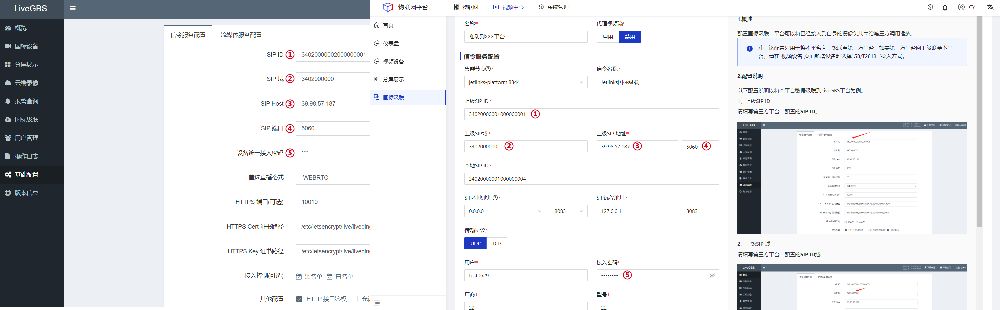
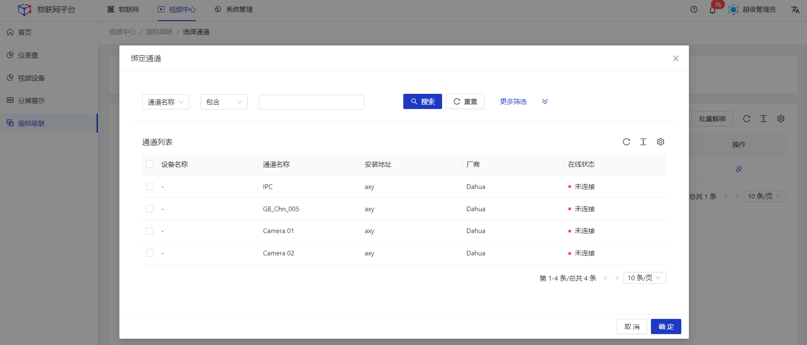
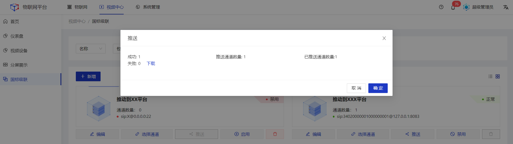

本文以将Jetlinks物联网平台中的视频类设备通过级联的方式推送到LiveGBS平台作为示例。

#### 操作步骤
1.**登录**Jetlinks物联网平台，点击**国标级联**菜单，进入卡片页，点击**新增**按钮，按照LiveGBS中的配置，在详情页填写级联配置。 

<table class='table'>
        <thead>
            <tr>
              <td>参数</td>
              <td>说明</td>
            </tr>
        </thead>
        <tbody>
          <tr>
            <td>名称</td>
            <td>国标级联命名，最多64个字符。</td>
          </tr>
          <tr>
            <td>代理视频流</td>
            <td>使用Jetlinks代理视频流。</td>
          </tr>
          <tr>
            <td>集群节点</td>
            <td>选择集群节点级联到上级平台。</td>
          </tr>
          <tr>
            <td>信令名称</td>
            <td>信令名称命名，最多64个字符。该名称将显示在上级平台中。</td>
          </tr>
          <tr>
          <td>上级SIP域</td>
            <td>上级SIP域地址，通常为18或20位。</td>
          </tr>
         <tr>
          <td>上级SIP地址</td>
            <td>上级SIP的主机地址。</td>
          </tr>
         <tr>
          <td>本地SIP ID</td>
            <td>本地SIP ID，通常为18位或20位。</td>
          </tr>
         <tr>
          <td>SIP本地地址</td>
            <td>使用指定的网卡和端口进行请求。</td>
          </tr>
         <tr>
          <td>SIP远程地址</td>
            <td>SIP远程主机地址。</td>
          </tr>
          <tr>
          <td>传输协议</td>
            <td>视频数据传输协议。</td>
          </tr>
         <tr>
          <td>用户</td>
            <td>部分平台有基于用户和接入密码的特殊认证。通常情况下,请填写本地SIP ID值。</td>
          </tr>
         <tr>
          <td>接入密码</td>
          <td>需与上级平台设置的接入密码一致，用于身份认证。</td>
          </tr>
         <tr>
          <td>厂商</td>
          <td>本平台的设备厂商名称。本平台级联到上级平台时将以一个“设备”的形式展现。</td>
         </tr>
         <tr>
          <td>型号</td>
          <td>本平台的型号。</td>
         </tr>
         <tr>
          <td>版本号</td>
          <td>本平台的版本号。</td>
         </tr>
         <tr>
          <td>心跳周期</td>
          <td>需与上级平台设置的心跳周期保持一致，通常默认60秒。</td>
         </tr>
         <tr>
          <td>注册间隔</td>
          <td>若SIP代理通过注册方式校时,其注册间隔时间宜设置为小于SIP代理与SIP服务器出现1s误差所经过的运行时间。</td>
         </tr>
        </tbody>
      </table>

2.在国标级联列表页，点击对应级联配置的**选择通道**按钮，进入选择通道列表页。点击**绑定通道**，在弹框中选择需要推送给上级平台的通道数据，然后点击**确定**。 

3.在国标级联列表页，点击对应级联配置的**推送**按钮，查看推送结果。
