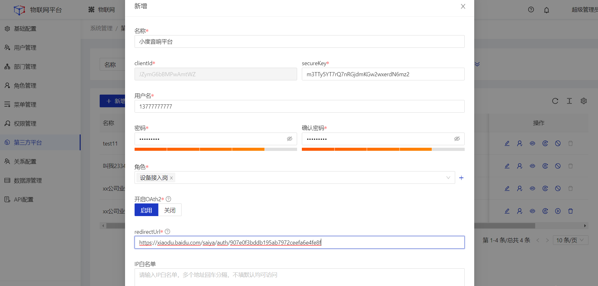
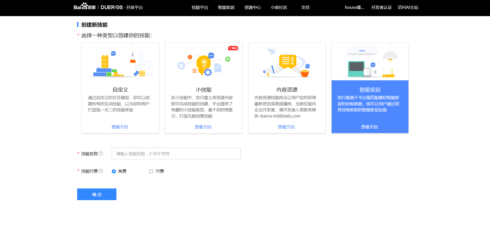
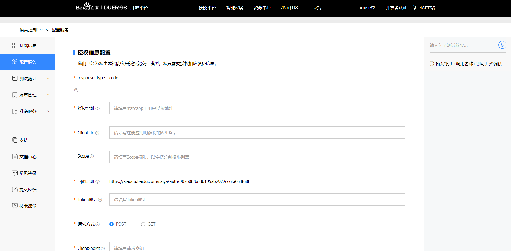
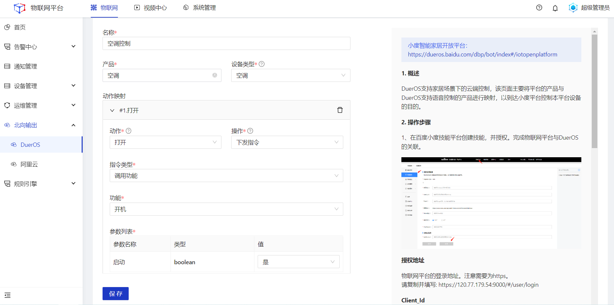
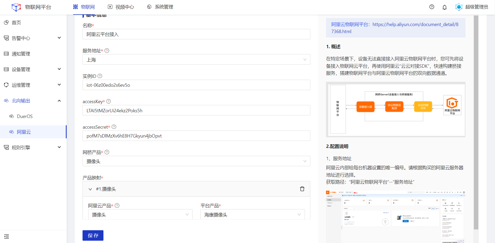
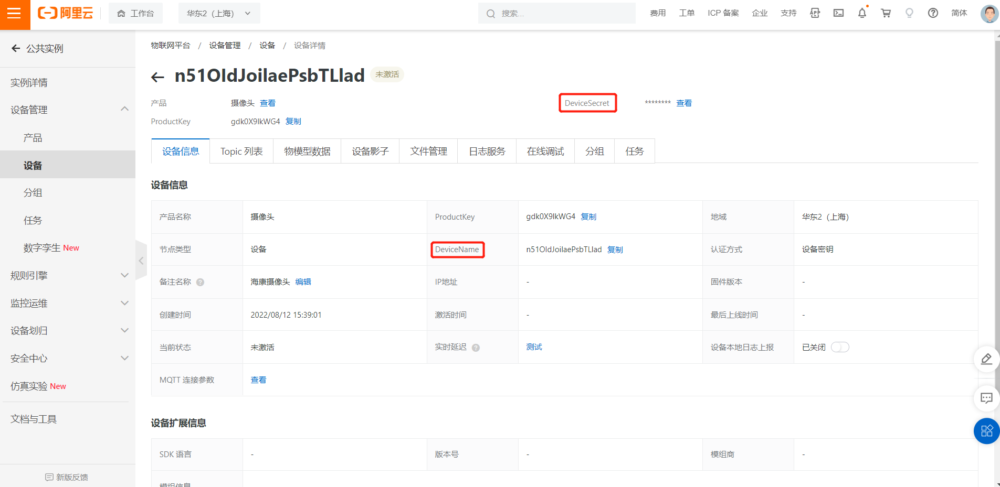

# 北向输出
将平台的设备数据北向输出到其他平台。

## DuerOS
本文以实现通过小度音响语音控制Jetlinks上的空调设备为例。

#### 前置条件
1.Jetlinks物联网平台已经创建好空调产品、空调设备以及空调物模型数据。
2.已创建好DuerOS开放平台账号。

#### 操作步骤
1.**登录**物联网平台，在**系统管理>第三方平台**页面。点击**新增**按钮，创建第三方平台账号。

  

    
    说明
  

<li>角色需要具备产品、设备管理的查看权限，否则第三方平台不能拉取到jetlinks平台中的产品、设备数据。</li>
<li>开启OAth2需选择启用，redirectUrl填写DuerOS授权信息配置页面中的回调地址。</li>

2.**登录**[小度智能家居开放平台](https://dueros.baidu.com/dbp/bot/index#/iotopenplatform)，点击**技能平台>控制台>创建技能>智能家居**，填写技能名称，点击确定。

3.完成DuerOS平台中的**授权信息配置**，填写完成后点击保存。

<table class='table'>
        <thead>
            <tr>
              <td>参数</td>
              <td>说明</td>
            </tr>
        </thead>
        <tbody>
          <tr>
            <td>授权地址</td>
            <td>请填写DuerOS详情页中右侧说明-授权地址的参数。注意需要为https。</td>
          </tr>
          <tr>
            <td>Client_Id</td>
            <td>请填写物联网平台-第三方平台的clientId</td>
          </tr>
          <tr>
            <td>Token</td>
            <td>请填写DuerOS详情页中右侧说明-Token地址的参数。</td>
          </tr>
          <tr>
            <td>ClientSecret</td>
            <td>请复制物联网平台-第三方平台中的secureKey，填写到DuerOS平台。</td>
          </tr>
         <tr>
            <td>WebService</td>
            <td>请填写：/dueros/product/_query</td>
          </tr>
        </tbody>
      </table>

4.进入物联网平台的**物联网>北向输出>Dueros**菜单，点击**新增**，在详情页建立平台内设备与DuerOS的功能、属性映射。

<table class='table'>
        <thead>
            <tr>
              <td>参数</td>
              <td>说明</td>
            </tr>
        </thead>
        <tbody>
          <tr>
            <td>名称</td>
            <td>为该北向输出配置命名，最多可输入64个字符。</td>
          </tr>
          <tr>
            <td>产品</td>
            <td>Jetlinks平台内的产品。</td>
          </tr>
          <tr>
            <td>设备类型</td>
            <td>DuerOS平台拟定的设备类型。</td>
          </tr>
          <tr>
            <td>动作</td>
            <td>DuerOS根据设备类型，拟定的动作。</td>
          </tr>
         <tr>
            <td>操作</td>
            <td>映射物联网平台中所选产品具备的动作。</td>
          </tr>
          <tr>
            <td>指令类型</td>
            <td>对当前所选的平台产品，下发对应类型的指令。</td>
          </tr>
         <tr>
            <td>DuerOS属性</td>
            <td>DuerOS根据设备类型，拟定的属性。</td>
          </tr>
         <tr>
            <td>平台属性</td>
            <td>映射物联网平台中所选产品具备的动平台产品属性。</td>
          </tr>
        </tbody>
      </table>

5.**登录**小度音响APP，对小度音响说：发现设备。小度音响将会通过配置的Jetlinks第三方账号拉取该账号下的设备信息。获取设备后即可以进行语音控制。

## 阿里云物联网平台
#### 前置条件 
1.已经创建好阿里云账号，并已开通阿里云物联网平台服务。
2.阿里云物联网平台已经创建好需要与Jetlinks物联网平台进行映射的摄像头产品、设备。

#### 操作步骤
1.**登录**物联网平台，在**物联网>北向输出>阿里云**页面中，点击**新增**按钮，进入详情页，配置完成后点击保存。

<table class='table'>
        <thead>
            <tr>
              <td>参数</td>
              <td>说明</td>
            </tr>
        </thead>
        <tbody>
          <tr>
            <td>名称</td>
            <td>为该北向输出配置命名，最多可输入64个字符。</td>
          </tr>
          <tr>
            <td>服务地址</td>
            <td>阿里云内部给每台机器设置的唯一编号，请根据开通的阿里云物联网平台所在地域进行选择。</td>
          </tr>
          <tr>
            <td>AccessKey</td>
            <td>用于程序通知方式调用云服务API的用户标识，请登录阿里云控制台后，点击个人中心>AccessKey
            管理进行查看。</td>
          </tr>
          <tr>
            <td>accessSecret</td>
            <td>用于程序通知方式调用云服务费API的秘钥标识，请登录阿里云控制台后，点击个人中心>AccessKey
            管理进行查看。</td>
          </tr>
         <tr>
            <td>网桥产品</td>
            <td>物联网平台对应的阿里云产品，物联网平台对于阿里云物联网平台，是一个网关设备，需要映射到阿里云物联网平台的具体产品。</td>
          </tr>
          <tr>
            <td>阿里云产品</td>
            <td>阿里云物联网平台产品标识。</td>
          </tr>
          <tr>
            <td>平台产品</td>
            <td>与阿里云产品进行映射的Jetlinks物联网平台产品。</td>
          </tr>
        </tbody>
      </table>
2.进入建立映射关系产品下每一个设备的实例信息页，填入对应的阿里云物联网平台设备的DeviceName、DeviceSecret进行一对一绑定。
