## 钉钉消息通知

#### 前置条件
1.已经在钉钉开放平台创建了三方应用。

#### 操作步骤
1.**登录**Jetlinks物联网平台，点击**通知管理**菜单，进入卡片页，点击钉钉类型的**通知配置**按钮，进入列表页，再点击**新增**按钮，进入通知配置详情页。填写钉钉消息通知相关配置 

2.进入钉钉类型的**通知模板**列表页，点击**新增**按钮，进入通知模板详情页，填写**钉钉消息**模板内容。
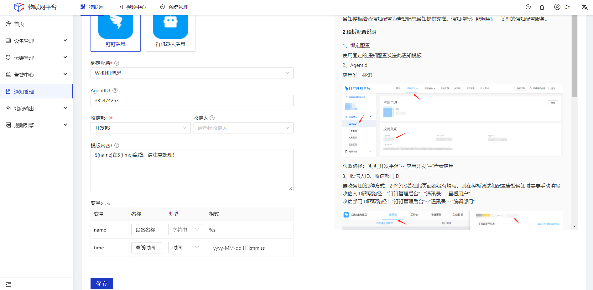

<table class='table'>
        <thead>
            <tr>
              <td>参数</td>
              <td>说明</td>
            </tr>
        </thead>
        <tbody>
          <tr>
            <td>名称</td>
            <td>通知模板命名，最多64个字符。</td>
          </tr>
          <tr>
            <td>绑定配置</td>
            <td>绑定通知配置。</td>
          </tr>
          <tr>
            <td>agentId</td>
            <td>每个应用都有唯一的agentId。 登录https://open-dev.dingtalk.com/fe/app-在管理后台->钉钉应用，点进某个应用，即可看到agentId。</td>
          </tr>
           <tr>
            <td>收信部门</td>
            <td>设置通知模板的收信部门，必填。</td>
          </tr>
           <tr>
            <td>收信人</td>
            <td>设置通知模板的收信人，非必填。如果不填写该字段，将在使用此模板发送通知时进行指定。</td>
          </tr>
           <tr>
            <td>模板内容</td>
            <td>模板的通知内容。支持输入变量，变量格式：${name}。</td>
          </tr>
          <tr>
            <td>变量列表</td>
            <td>变量列表名称、类型、格式配置。</td>
          </tr>
        </tbody>
      </table>

3.点击对应模板的**调试**按钮，在弹框页面填写相关参数，然后点击**确定**。
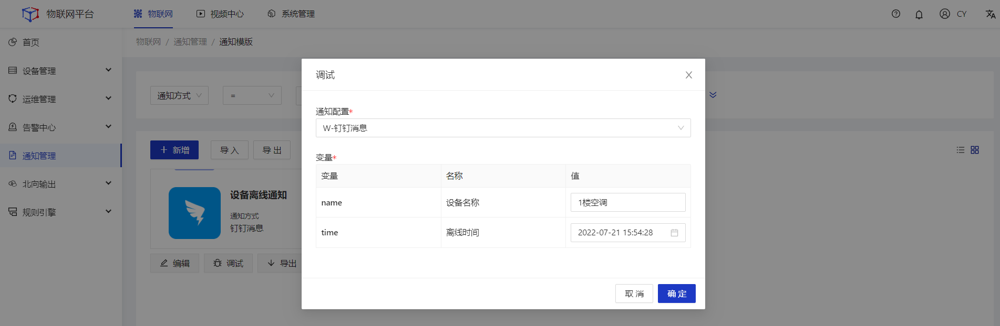

## 钉钉群机器人消息

#### 前置条件
1.已经在钉钉开放平台创建了机器人。

#### 操作步骤
1.**登录**Jetlinks物联网平台，点击**通知管理**菜单，进入卡片页，点击钉钉类型的**通知配置**按钮，进入列表页，再点击**新增**按钮，进入通知配置详情页。填写钉钉群机器人通知相关配置 
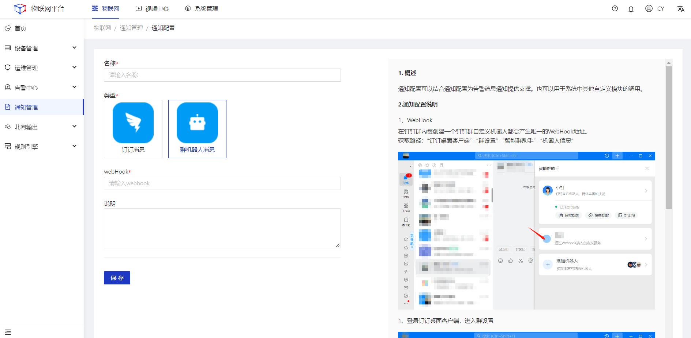
2.进入钉钉类型的**通知模板**列表页，点击**新增**按钮，进入通知模板详情页，填写**群机器人**模板内容。
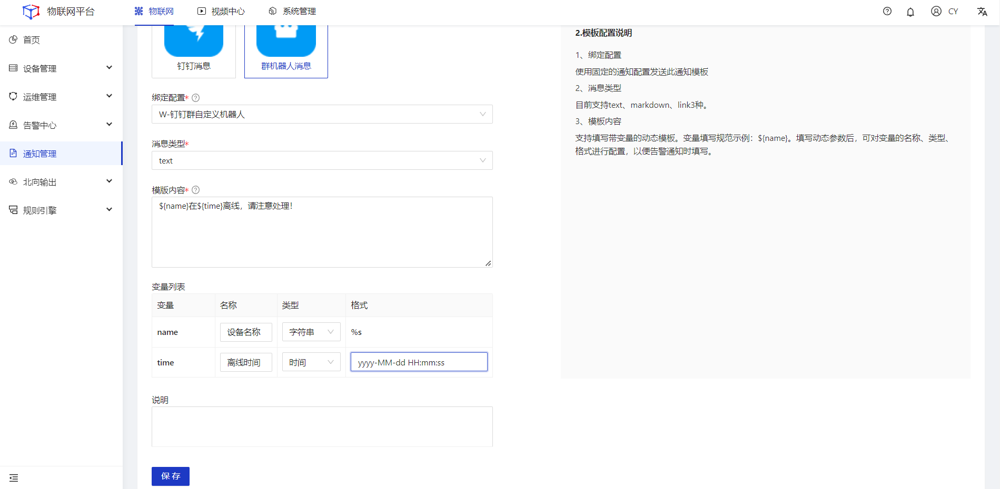

<table class='table'>
        <thead>
            <tr>
              <td>参数</td>
              <td>说明</td>
            </tr>
        </thead>
        <tbody>
          <tr>
            <td>名称</td>
            <td>通知模板命名，最多64个字符。</td>
          </tr>
          <tr>
            <td>绑定配置</td>
            <td>绑定通知配置。</td>
          </tr>
          <tr>
            <td>消息类型</td>
            <td>支持text、markdown、link3种。</td>
          </tr>
          <tr>
            <td>模板内容</td>
            <td>模板的通知内容。支持输入变量，变量格式：${name}。</td>
          </tr>
          <tr>
            <td>变量列表</td>
            <td>变量列表名称、类型、格式配置。</td>
          </tr>
        </tbody>
      </table>

3.点击对应模板的**调试**按钮，在弹框页面填写相关参数，然后点击**确定**。
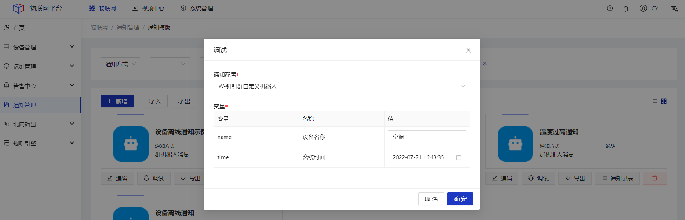

## 微信企业消息通知

#### 操作步骤
1.**登录**Jetlinks物联网平台，点击**通知管理**菜单，进入卡片页，点击微信类型的**通知配置**按钮，进入列表页，再点击**新增**按钮，进入通知配置详情页。填写企业消息通知相关配置。 
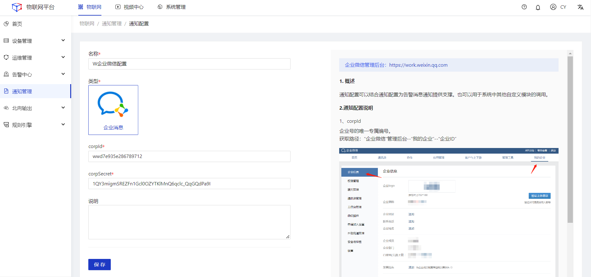
2.进入微信类型的**通知模板**列表页，点击**新增**按钮，进入通知模板详情页，填写**企业消息**模板内容。
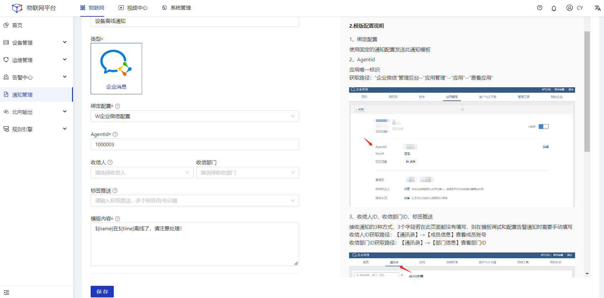
<table class='table'>
        <thead>
            <tr>
              <td>参数</td>
              <td>说明</td>
            </tr>
        </thead>
        <tbody>
          <tr>
            <td>名称</td>
            <td>通知模板命名，最多64个字符。</td>
          </tr>
          <tr>
            <td>绑定配置</td>
            <td>绑定通知配置。</td>
          </tr>
          <tr>
            <td>AgentId</td>
            <td>应用唯一标识。</td>
          </tr>
          <tr>
            <td>收信人</td>
            <td>按收信人进行消息通知，如果不填写该字段,将在使用此模版发送通知时进行指定。</td>
          </tr>
          <tr>
            <td>收信部门</td>
            <td>按部门进行消息通知。</td>
          </tr>
          <tr>
            <td>推送标签</td>
            <td>按标签进行消息通知。</td>
          </tr>
          <td>模板内容</td>
            <td>模板的通知内容。支持输入变量，变量格式：${name}。</td>
          </tr>
          <tr>
            <td>变量列表</td>
            <td>变量列表名称、类型、格式配置。</td>
          </tr>
        </tbody>
      </table>

3.点击对应模板的**调试**按钮，在弹框页面填写相关参数，然后点击**确定**。

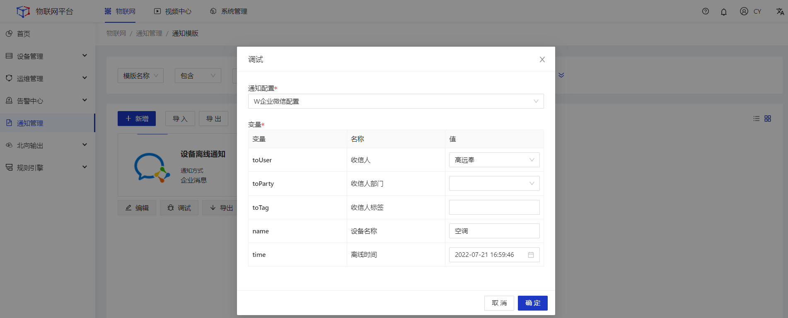

## 邮件通知
#### 操作步骤
1.**登录**Jetlinks物联网平台，点击**通知管理**菜单，进入卡片页，点击邮件类型的**通知配置**按钮，进入列表页，再点击**新增**按钮，进入通知配置详情页。填写邮件通知相关配置。 
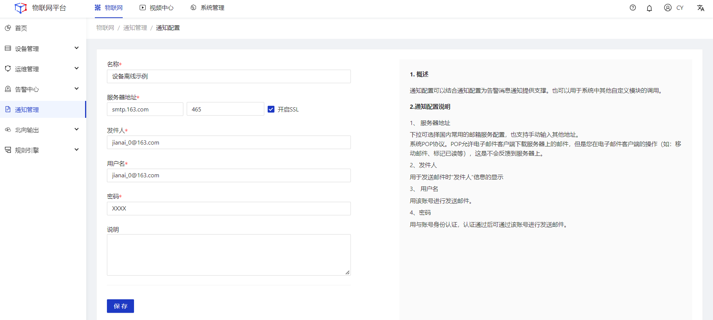

<table class='table'>
        <thead>
            <tr>
              <td>参数</td>
              <td>说明</td>
            </tr>
        </thead>
        <tbody>
          <tr>
            <td>名称</td>
            <td>通知配置命名，最多64个字符。</td>
          </tr>
          <tr>
            <td>服务器地址</td>
            <td>邮件服务商提供的服务器地址。例如：163邮箱服务器地址为：smtp.163.com。</td>
          </tr>
          <tr>
            <td>端口</td>
            <td>邮件服务商提供的服务端口。</td>
          </tr>
          <tr>
            <td>发件人</td>
            <td>用于发送邮件时“发件人“信息的显示。</td>
          </tr>
          <tr>
            <td>用户名</td>
            <td>发件人的用户名。</td>
          </tr>
          <tr>
            <td>密码</td>
            <td>发件人的账号登录密码。</td>
          </tr>
        </tbody>
      </table>

2.进入邮件类型的**通知模板**列表页，点击**新增**按钮，进入通知模板详情页，填写模板内容。
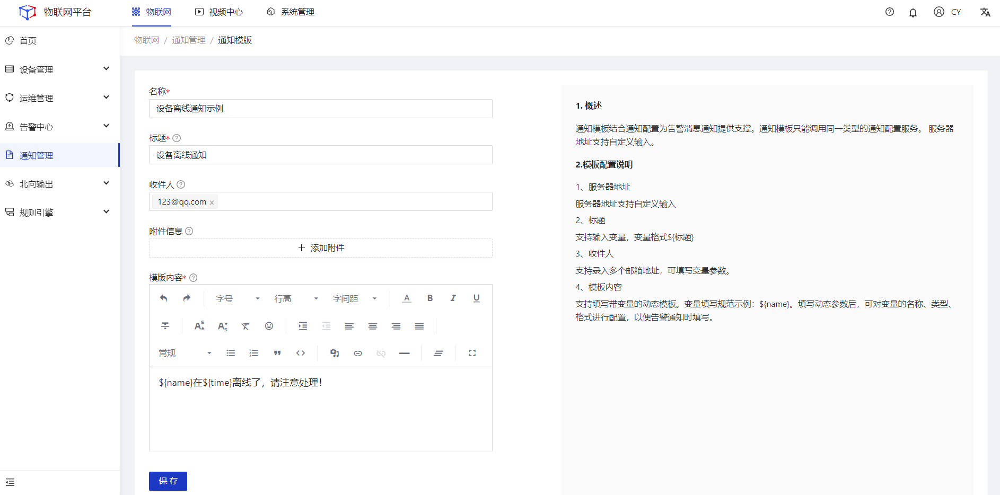
<table class='table'>
        <thead>
            <tr>
              <td>参数</td>
              <td>说明</td>
            </tr>
        </thead>
        <tbody>
          <tr>
            <td>名称</td>
            <td>通知模板命名，最多64个字符。</td>
          </tr>
          <tr>
            <td>标题</td>
            <td>邮件标题。</td>
          </tr>
          <tr>
            <td>收件人</td>
            <td>接收邮件的用户。多个收件人用换行分隔 最大支持1000个邮箱。</td>
          </tr>
          <tr>
            <td>附件信息</td>
            <td>邮件附件。附件只输入文件名称，附件内容将在发送邮件时进行文件上传。</td>
          </tr>
          </tr>
          <td>模板内容</td>
            <td>模板的通知内容。支持输入变量，变量格式：${name}。</td>
          </tr>
          <tr>
            <td>变量列表</td>
            <td>变量列表名称、类型、格式配置。</td>
          </tr>
        </tbody>
      </table>

  

    
    注意
  

邮箱端需要开启IMAP/SMTP服务、POP/SMTP服务。例如：
  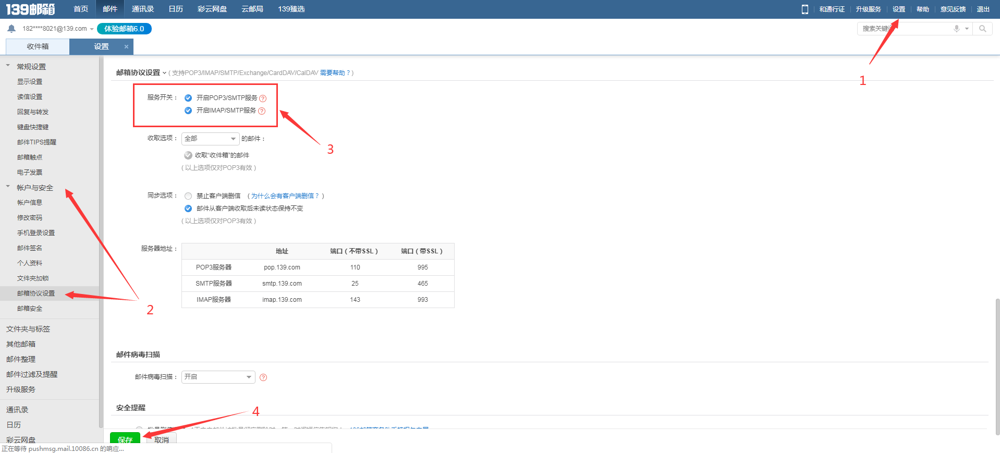

3.点击对应模板的**调试**按钮，在弹框页面填写相关参数，然后点击**确定**。
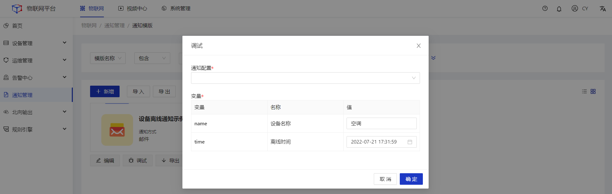

## 语音通知

#### 前置条件
1.使用阿里云语音通知时，已经在阿里云购买了语音通知服务。
#### 操作步骤
1.**登录**Jetlinks物联网平台，点击**通知管理**菜单，进入卡片页，点击语音类型的**通知配置**按钮，进入列表页，再点击**新增**按钮，进入通知配置详情页。填写语音通知相关配置。 

2.进入语音类型的**通知模板**列表页，点击**新增**按钮，进入通知模板详情页，填写模板内容。
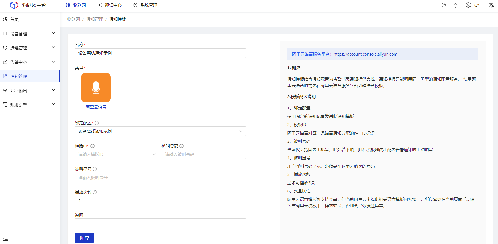
<table class='table'>
        <thead>
            <tr>
              <td>参数</td>
              <td>说明</td>
            </tr>
        </thead>
        <tbody>
          <tr>
            <td>名称</td>
            <td>通知模板命名，最多64个字符。</td>
          </tr>
          <tr>
            <td>绑定配置</td>
            <td>绑定通知配置。</td>
          </tr>
          <tr>
            <td>模板ID</td>
            <td>阿里云语音通知唯一标识。</td>
          </tr>
          <tr>
            <td>被叫号码</td>
            <td>被通知人手机号码，目前仅支持中国大陆号码。</td>
          </tr>
          </tr>
          <td>被叫显号</td>
            <td>用户呼叫号码显示，必须是在阿里云购买的号码。</td>
          </tr>
         </tr>
          <td>播放次数</td>
            <td>语音通知的播放次数。最多可播放3次。</td>
          </tr>
        </tbody>
      </table>

3.点击对应模板的**调试**按钮，在弹框页面填写相关参数，然后点击**确定**。

## 短信通知
#### 前置条件
1.使用阿里云短信通知时，已经在阿里云购买了短信通知服务。

#### 操作步骤
1.**登录**Jetlinks物联网平台，点击**通知管理**菜单，进入卡片页，点击短信类型的**通知配置**按钮，进入列表页，再点击**新增**按钮，进入通知配置详情页。填写短信通知相关配置。 
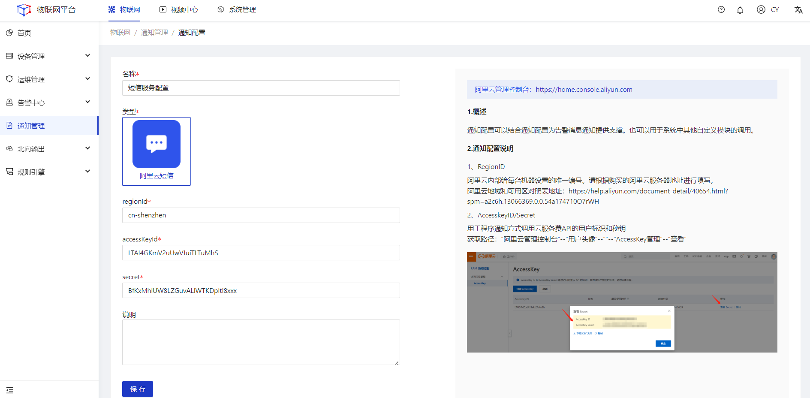

2.进入短信类型的**通知模板**列表页，点击**新增**按钮，进入通知模板详情页，填写模板内容。
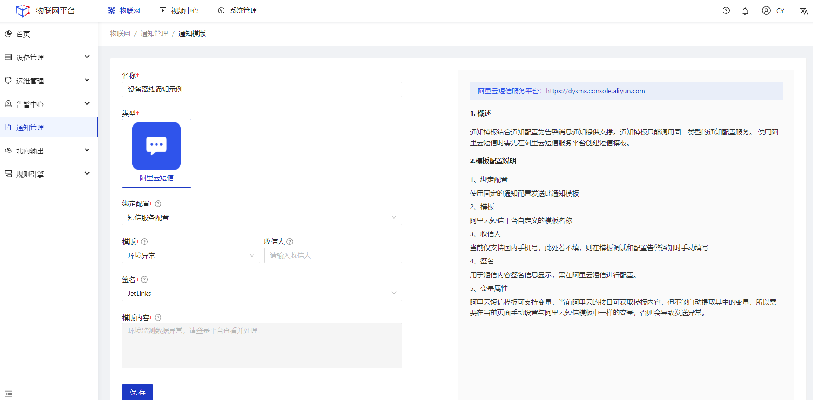
<table class='table'>
        <thead>
            <tr>
              <td>参数</td>
              <td>说明</td>
            </tr>
        </thead>
        <tbody>
          <tr>
            <td>名称</td>
            <td>通知模板命名，最多64个字符。</td>
          </tr>
          <tr>
            <td>绑定配置</td>
            <td>绑定通知配置。</td>
          </tr>
          <tr>
            <td>模板</td>
            <td>阿里云短信通知唯一标识。</td>
          </tr>
          <tr>
            <td>收信人</td>
            <td>被通知人手机号码，目前仅支持中国大陆号码。</td>
          </tr>
          </tr>
          <td>签名</td>
            <td>用于短信内容签名信息显示。</td>
          </tr>
         </tr>
          <td>模板内容</td>
            <td>阿里云短信中配置的通知内容。</td>
          </tr>
        </tbody>
      </table>

3.点击对应模板的**调试**按钮，在弹框页面填写相关参数，然后点击**确定**。
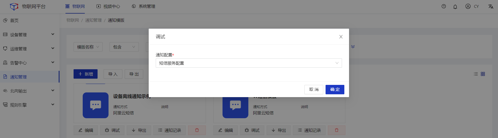

## webhook通知
#### 操作步骤
1.**登录**Jetlinks物联网平台，点击**通知管理**菜单，进入卡片页，点击webhook类型的**通知配置**按钮，进入列表页，再点击**新增**按钮，进入通知配置详情页。填写webhook通知相关配置。 
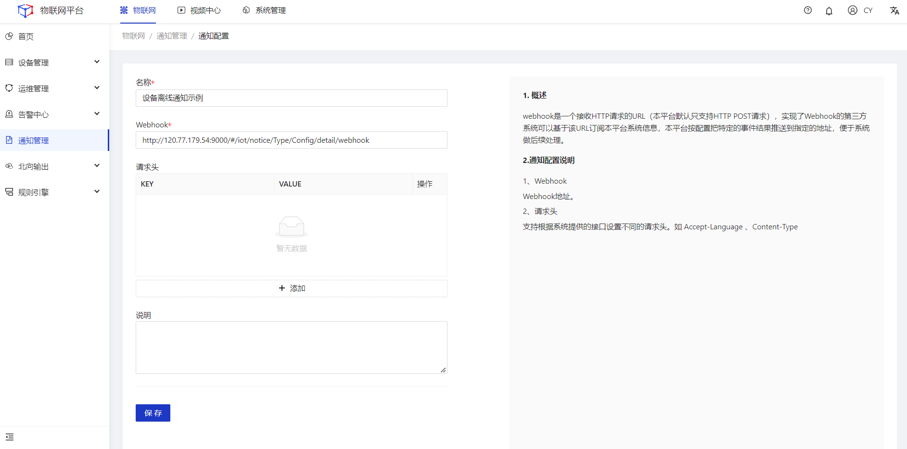
2.进入webhook类型的**通知模板**列表页，点击**新增**按钮，进入通知模板详情页，填写模板内容。
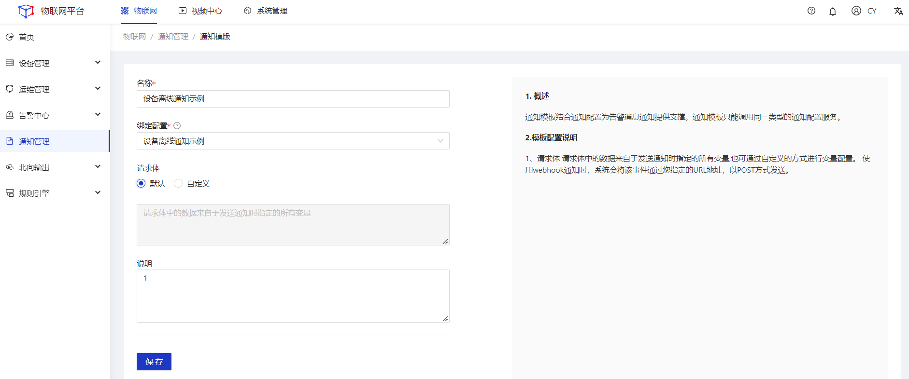
3.点击对应模板的**调试**按钮，在弹框页面填写相关参数，然后点击**确定**。
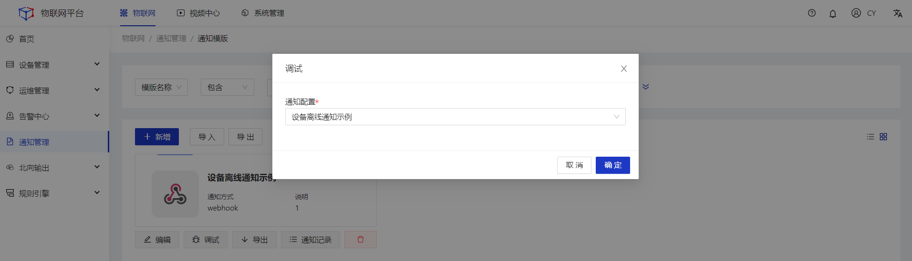