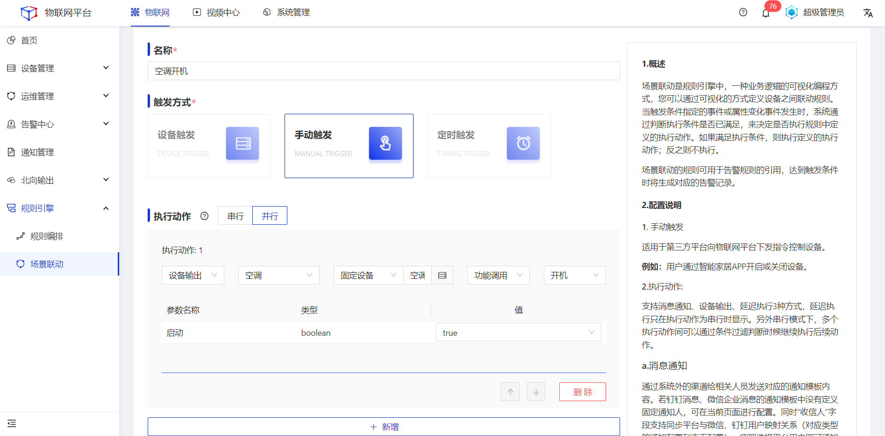
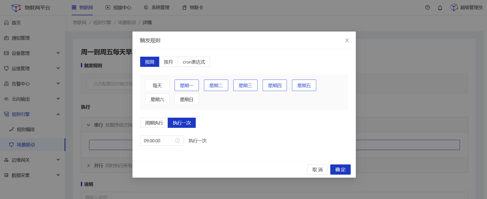
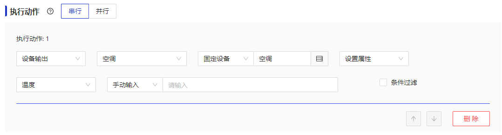
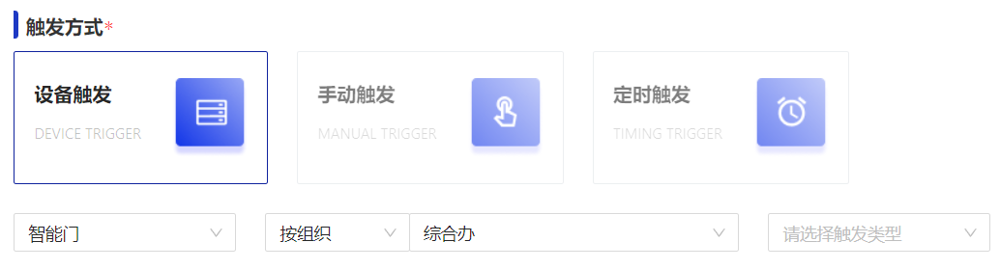
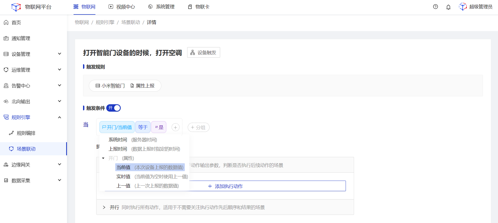
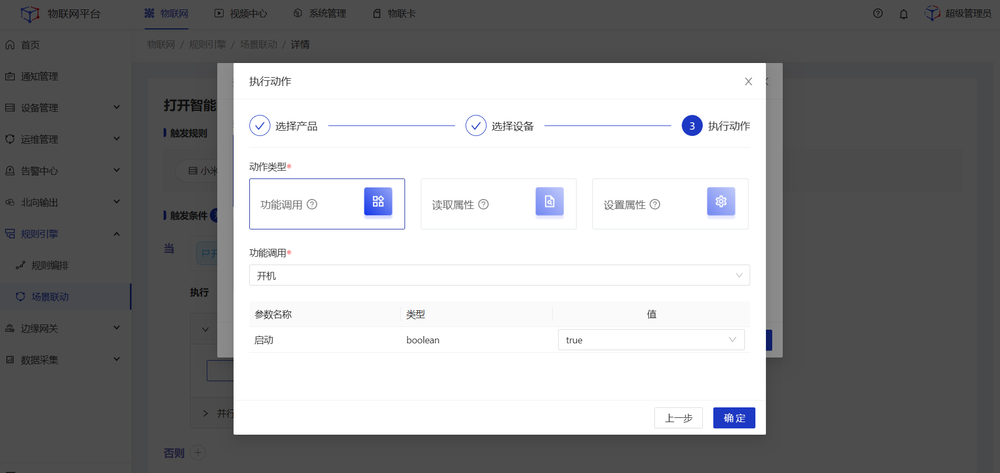
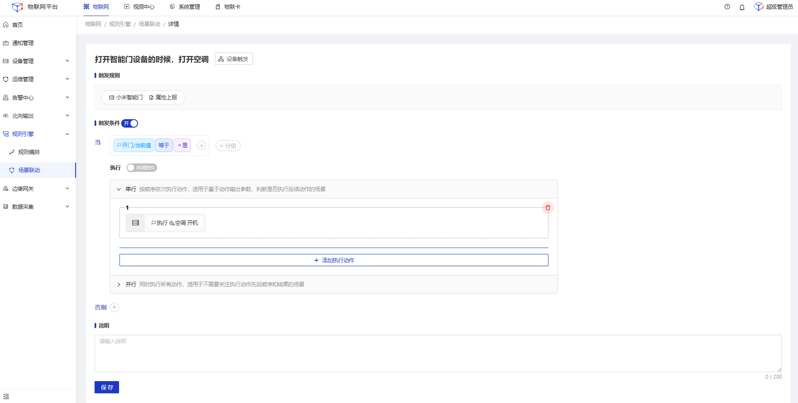
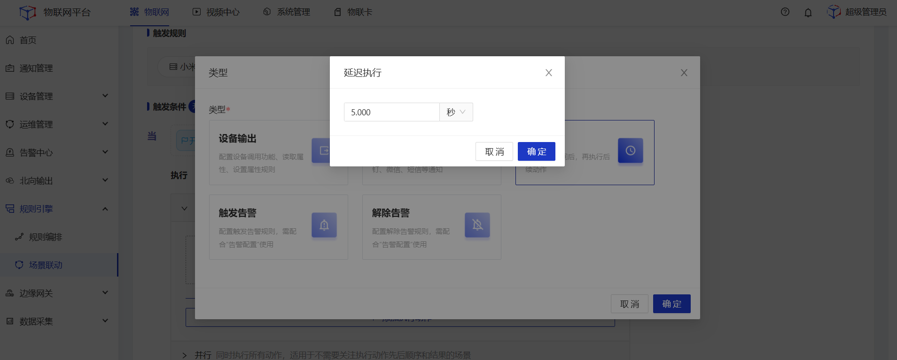
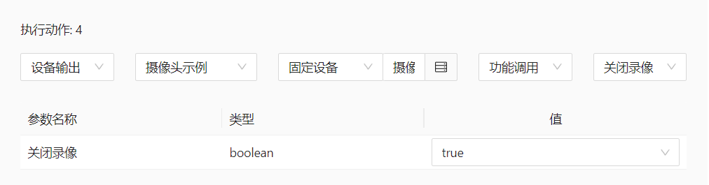

# 场景联动
场景联动是规则引擎中，一种业务逻辑的可视化编程方式，您可以通过可视化的方式定义设备之间联动规则。当触发条件指定的事件或属性变化事件发生时，系统通过判断执行条件是否已满足，来决定是否执行规则中定义的执行动作。如果满足执行条件，则执行定义的执行动作；反之则不执行。 

  

    
    注意
  

 场景联动规则仅支持以产品物模型进行配置，不支持以设备物模型进行配置。

## 手动触发
适用于第三方平台向物联网平台下发指令控制设备。 

**例如**：用户通过智能家居APP开启设备。

#### 前置条件
1.已经创建好空调产品。 
2.已经创建好空调设备以及对应的物模型，并已接入平台。 
3.已经通过第三方平台账号调用平台场景联动API服务。 

#### 操作步骤
1.**登录**Jetlinks物联网平台，进入**规则引擎>场景联动**菜单，点击**新增**，进入详情页。 
2.触发方式选择为**手动触发**，执行动作选择**设备输出**，产品选择**空调**，然后选择需要执行动作的**具体设备**，再选择**调用功能**，选择**开机**，设置具体参数值，最后点击**保存**。

## 定时触发
适用于第三方平台向物联网平台下发指令控制设备。支持按周、按月、按Corn表达式3种方式配置频率。 
**例如**：周一到周五每天早上9点打开空调，并将空调开到26度。

#### 前置条件
1.已经创建好空调产品。 
2.已经创建好空调设备以及对应的物模型，并已接入平台。 

#### 操作步骤
1.**登录**Jetlinks物联网平台，进入**规则引擎>场景联动**菜单，点击**新增**，进入详情页。 
2.触发方式选择为**定时触发**，选择**按周**，周一、周二、周三、周四、周五**执行一次**，时间选择09:00:00。 

执行动作选择**设备输出**，产品选择**空调**，然后选择需要执行动作的**具体设备**，再选择**设置属性**功能，选择**温度**，**手动输入**属性值。

## 设备触发
适用于多个不同设备间执行动作的联动。 
**例如**：打开综合办部门房间门的时候，打开电空调，开启摄像头录像功能，5秒后关闭录像功能。

#### 前置条件
1.已经创建好智能门、摄像头产品。 
2.已经创建好智能门设备、摄像头设备以及对应的物模型，并已接入平台。 

#### 操作步骤
1.**登录**Jetlinks物联网平台，进入**规则引擎>场景联动**菜单，点击**新增**，进入详情页。 
2.触发方式选择为**设备触发**，产品选择**智能门**，设备**按部门**选择为**综合办**。 

3.触发条件设置参数为**开门/当前值**，**等于**手动输入**是**。 

4.执行动作选择**串行**。 
&nbsp;(1)**执行动作1：**设置参数为**设备输出**，产品选择**空调**，设备选择**固定设备**并勾选具体空调设备，然后选择**功能调用**，选择**开机**，参数值选择**true**。

  
  说明
选择设备支持固定设备、按关系、按标签3种方式进行选择。 
例如：
<li>选择空调产品下，与触发设备为同一个"设备负责人"的空调设备</li>
<li>选择空调产品下，品牌标签为格力的设备</li>

&nbsp;(2)**执行动作2：**设置参数为**设备输出**，产品选择**摄像头**，设备选择**固定设备**并勾选具体摄像头设备，然后选择**功能调用**，选择**开启录像**，参数值选择**true**。

&nbsp;(3)**执行动作3：**设置参数为**延迟执行**，填写值为**5**秒。

&nbsp;(4)**执行动作4：**设置参数为**设备输出**，产品选择**摄像头**，设备选择**固定设备**并勾选具体摄像头设备，然后选择**功能调用**，选择**关闭录像**，参数值选择**true**。
