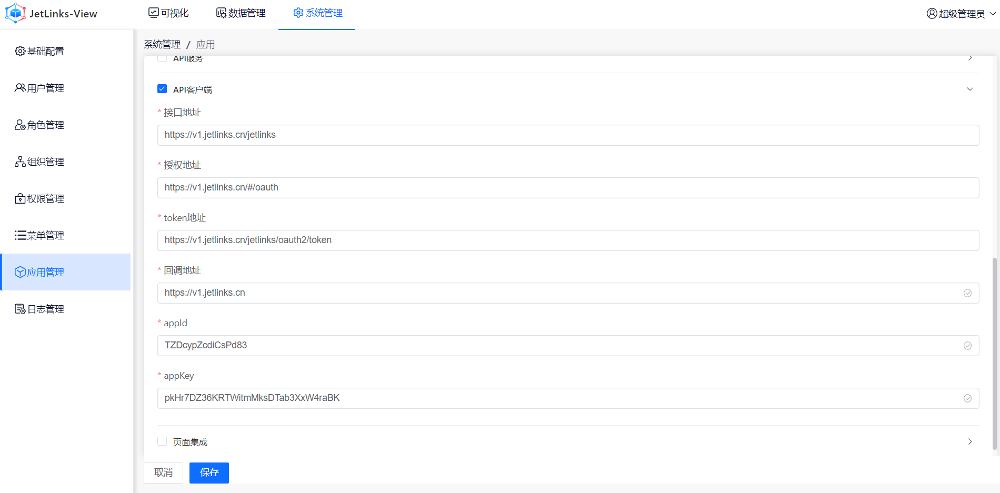
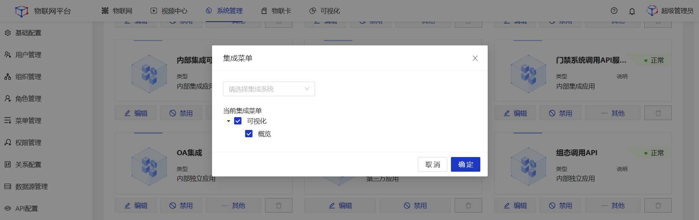
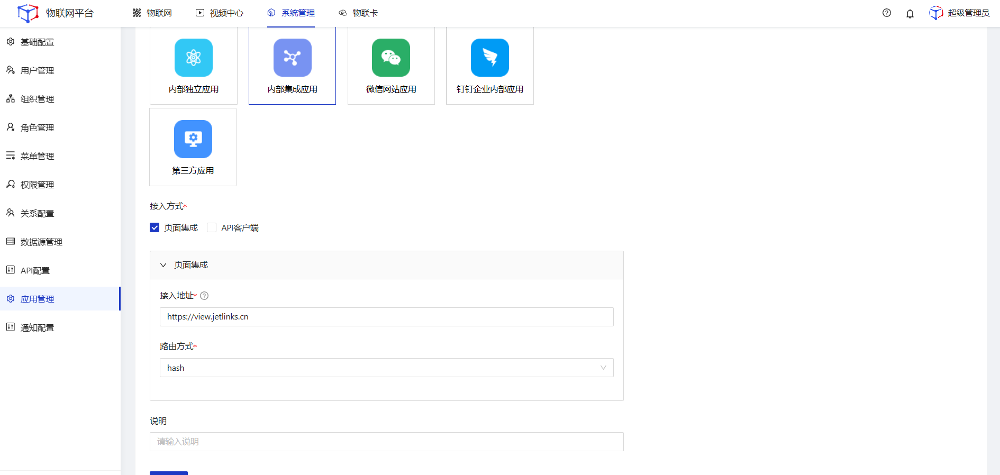
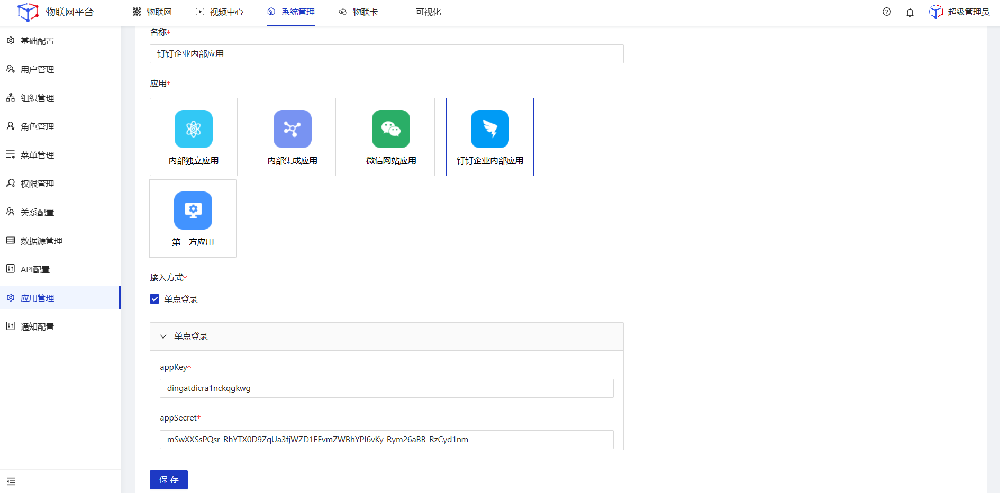

# 应用管理

应用管理将多个应用系统的登录简化为一次登录，实现多处访问、集中管控的业务场景。

  
 
    
    提示
  

本功能仅在企业版中提供。

## 名称解释

<table class='table'>
        <thead>
            <tr>
              <td>参数</td>
              <td>说明</td>
            </tr>
        </thead>
        <tbody>
          <tr>
            <td>应用</td>
            <td>
            <li>内部独立应用</li>
            适用于将官方开发的其他应用集成至jetlinks物联网平台。例如将大屏可视化平台集成至物联网平台。集成时jetlinks物联网平台端需要勾选页面集成、API服务，大屏可视化平台需勾选API客户端、单点登录。集成后的可视化大屏后端独立运行。
             <li>内部集成应用</li>
             适用于将官方开发的其他应用集成至jetlinks物联网平台。例如可将大屏可视化平台集成至物联网平台。集成时jetlinks物联网平台端需要勾选页面集成，大屏可视化平台需勾选API客户端、单点登录。集成后的大屏可视化后端与jetlinks物联网平台后端在同一环境下运行。
            <li>微信网站应用</li>
            适用于通过微信账户登录jetlinks物联网平台。
           <li>钉钉企业内部应用</li>
           适用于通过钉钉账户登录jetlinks物联网平台。
           <li>第三方应用</li>
           适用于将其他三方应用集成至jetlinks物联网平台。例如可将某公司OA系统集成至物联网平台。集成时jetlinks物联网平台端需要勾选页面集成、API服务，OA系统端作为客户端需自行设置接入所需的接入配置。
            </td>
          </tr>
          <tr>
            <td>接入方式</td>
            <td>
            <li>页面集成</li>
            将其他应用系统的页面集成至jetlinks物联网平台。集成时通常需要配置API服务。
            <li>API客户端</li>
            将jetlinks物联网平台作为客户端集成到其他应用系统中，其他应用系统可通过Oauth2的方式访问物联网平台。
             <li>API服务</li>
             将jetlinks物联网API能力提供给其他应用，其他应用可通过接口的方式直接使用API能力，无须自行编写后端逻辑。
             <li>单点登录</li>
             使用第三方应用账户登录jetlinks物联网平台。
            </td>
          </tr>
             </tbody>
        </table>

## 内部独立应用
适用于将官方开发的其他应用与物联网平台相互集成，例如将可视化平台集成至物联网平台，或者将物联网平台集成至可视化平台。本文以将可视化平台集成至物联网平台为例。

### 操作步骤
1.**登录**view可视化大屏系统，进入**系统管理>应用管理**菜单，点击**新增**，配置**API客户端**。

<table class='table'>
        <thead>
            <tr>
              <td>参数</td>
              <td>说明</td>
            </tr>
        </thead>
        <tbody>
          <tr>
            <td>接口地址</td>
            <td>访问API服务的地址，url地址+端口</td>
          </tr>
          <tr>
            <td>授权地址</td>
            <td>认证授权地址，url地址+端口</td>
          </tr>
          <tr>
            <td>token地址</td>
            <td>身份认证地址，url地址+端口</td>
          </tr>
          <tr>
            <td>回调地址</td>
            <td>授权之后跳转到具体页面的回调地址，url地址+端口</td>
          </tr>
          <tr>
            <td>appid</td>
            <td>填写iot端生成的appid</td>
          </tr>
          <tr>
            <td>appKey</td>
            <td>填写iot端生成的appkey</td>
          </tr>
        </tbody>
      </table>

2.**登录**Jetlinks物联网平台，进入**系统管理>应用管理**菜单，点击**新增**。 

3.选择**内部独立应用**，勾选**页面集成**、**API服务**配置，填写相关配置后点击**保存**。

<table class='table'>
        <thead>
            <tr>
              <td>参数</td>
              <td>说明</td>
            </tr>
        </thead>
        <tbody>
          <tr>
            <td>appid</td>
            <td>调用API服务时所需的用户账号。配置API服务时，系统自动创建</td>
          </tr>
          <tr>
            <td>secureKey</td>
            <td>调用API服务时所需的用户密码,系统自动创建，可自定义编辑</td>
          </tr>
          <tr>
            <td>回调地址</td>
            <td>授权之后跳转到具体页面的回调地址，url地址+端口</td>
          </tr>
          <tr>
            <td>角色</td>
            <td>为API用户分配角色，根据绑定的角色，进行系统菜单赋权</td>
          </tr>
          <tr>
            <td>组织</td>
            <td>为API用户分配所属组织，根据绑定的组织，进行数据隔离</td>
          </tr>
          <tr>
            <td>接入地址</td>
            <td>访问其它平台的地址，url地址+端口</td>
          </tr>
           <tr>
            <td>路由方式</td>
            <td><li>hash：使用URL的hash来模拟一个完整的URL, 其显示的网络路径中会有 “#” 号</li>
            <li>history：路径中不包含“#”。依赖于Html5 的 history api</li>
            </td>
          </tr>
        </tbody>
      </table>

4.在弹出的**集成菜单**弹框中，勾选需要集成的菜单，然后点击**确定**。

  

    
    说明
  

 接入方式选择页面集成时将在其应用卡片中出现集成菜单按钮，可选择要集成哪些菜单至系统中。

## 内部集成应用
适用于将官方开发的其他应用集成至jetlinks物联网平台，并且共享后端服务。本文以接入view可视化大屏系统为例。

### 操作步骤
1.**登录**view可视化大屏系统，进入**系统管理>应用管理**菜单，点击**新增**，配置**API客户端**。

<table class='table'>
        <thead>
            <tr>
              <td>参数</td>
              <td>说明</td>
            </tr>
        </thead>
        <tbody>
          <tr>
            <td>接口地址</td>
            <td>访问API服务的地址，url地址+端口</td>
          </tr>
          <tr>
            <td>授权地址</td>
            <td>认证授权地址，url地址+端口</td>
          </tr>
          <tr>
            <td>token地址</td>
            <td>身份认证地址，url地址+端口</td>
          </tr>
          <tr>
            <td>回调地址</td>
            <td>授权之后跳转到具体页面的回调地址，url地址+端口</td>
          </tr>
          <tr>
            <td>appid</td>
            <td>填写iot端生成的appid</td>
          </tr>
          <tr>
            <td>appKey</td>
            <td>填写iot端生成的appkey</td>
          </tr>
        </tbody>
      </table>

2.**登录**Jetlinks物联网平台，进入**系统管理>应用管理**菜单，点击**新增**。 

3.选择**内部集成应用**，勾选**页面集成**配置，填写相关配置后点击**保存**。

  

    
    说明
  

接入地址请填写被集成应用的URL地址。

4.在弹出的**集成菜单**弹框中，勾选需要集成的菜单，然后点击**确定**。

  

    
    说明
  

 接入方式选择页面集成时将在其应用卡片中出现集成菜单按钮，可选择要集成哪些菜单至系统中。

## 微信网站应用
适用于通过微信账户登录jetlinks物联网平台。
### 前置条件
1.已经在微信开放平台开通网站应用。

### 操作步骤
1.**登录**微信开放平台，进入**系统管理>应用管理**菜单，查看**AppID**、**AppSecret**。

2.**登录**Jetlinks物联网平台，进入**系统管理>应用管理**菜单，点击**新增**。 

3.选择**微信网站应用**，勾选**单点登录**配置，填写相关配置后点击**保存**。

  

    
    说明
  

 自动创建用户开启后，初次通过微信网站应用登录JetLinks物联网平台时将自动在平台端创建与之绑定的新用户。

## 钉钉企业内部应用
适用于通过钉钉账户登录jetlinks物联网平台。
### 前置条件
1.已经在钉钉开放平台开通了企业内部应用。

### 操作步骤
1.**登录**钉钉开发平台，进入**系统管理>应用管理**菜单，查看**appKey**、**appSecret**。

2.**登录**Jetlinks物联网平台，进入**系统管理>应用管理**菜单，点击**新增**。 

3.选择**微信网站应用**，勾选**单点登录**配置，填写相关配置后点击**保存**。

## 第三方应用
适用于将其他三方应用集成至jetlinks物联网平台。本文以第三方应用集成jetlinks物联网平台API服务为例，实现三方系统通过接口调用平台API能力。

### 操作步骤
1.**登录**Jetlinks物联网平台，进入**系统管理>应用管理**菜单，点击**新增**。 

2.选择**第三方应用**，勾选**API服务**配置，填写相关配置后点击**保存**。

<table class='table'>
        <thead>
            <tr>
              <td>参数</td>
              <td>说明</td>
            </tr>
        </thead>
        <tbody>
          <tr>
            <td>appid</td>
            <td>调用API服务时所需的用户账号。配置API服务时，系统自动创建</td>
          </tr>
          <tr>
            <td>secureKey</td>
            <td>调用API服务时所需的用户密码,系统自动创建，可自定义编辑</td>
          </tr>
          <tr>
            <td>角色</td>
            <td>为API用户分配角色，用以访问平台内的菜单</td>
          </tr>
          <tr>
            <td>组织</td>
            <td>为API用户绑定所属组织</td>
          </tr>
          <tr>
            <td>redirectUrl</td>
            <td>授权之后跳转到具体页面的回调地址，url地址+端口</td>
          </tr>
          <tr>
            <td>IP白名单</td>
            <td>白名单中的地址可调用API服务，多个地址用回车分隔，不填默认均可访问</td>
          </tr>
        </tbody>
      </table>

3.点击对应**应用管理卡片**的**其他**按钮，选择**赋权**。该应用可调用已赋权范围内的API服务。

  

    
    说明
  

 接入方式选择API服务时将在对应应用的卡片中出现赋权、查看API按钮。

