# 应用管理

应用管理将多个应用系统的登录简化为一次登录，实现多处访问、集中管控的业务场景。
<div class='explanation info'>
  <p class='explanation-title-warp'> 
    <span class='iconfont icon-tishi explanation-icon'></span>
    <span class='explanation-title font-weight'>提示</span>
  </p>
   本功能仅在企业版中提供。
</div>

## 指导介绍
  <p>1. <a href="/Best_practices/application_management.html#名词解释" >名词解释</a></p>
  <p>2. <a href="/Best_practices/application_management.html#内部独立应用" >内部独立应用</a></p>
  <p>3. <a href="/Best_practices/application_management.html#内部集成应用" >内部集成应用</a></p>
  <p>4. <a href="/Best_practices/application_management.html#微信网站应用" >微信网站应用</a></p>
  <p>5. <a href="/Best_practices/application_management.html#第三方应用" >第三方应用</a></p>
  <p>6. <a href="/Best_practices/application_management.html#单点登录" >单点登录</a></p>
  <p>7. <a href="/Best_practices/application_management.html#页面集成和api服务配置" >页面集成和Api服务配置</a></p>


## 问题指引
   <p>1. <a href="/Best_practices/application_management.html#存在错误-无效的登录回调地址" >存在错误,无效的登录回调地址</a></p>
   <p>2. <a href="Best_practices/application_management.html#单点登录时-前端出现invalid-character" >单点登录时-前端出现invalid-character</a></p>

## 名称解释

<table class='table'>
        <thead>
            <tr>
              <td>参数</td>
              <td>说明</td>
            </tr>
        </thead>
        <tbody>
          <tr>
            <td>应用</td>
            <td>
            <li>内部独立应用</li>
            适用于将官方开发的其他应用集成至jetlinks物联网平台。例如可将可视化大屏集成至物联网平台。集成时jetlinks物联网平台端需要勾选页面集成、API服务，view端需勾选API客户端。集成后的view后端独立运行。
             <li>内部集成应用</li>
             适用于将官方开发的其他应用集成至jetlinks物联网平台。例如可将可视化大屏集成至物联网平台。集成时jetlinks物联网平台端需要勾选页面集成，view端需勾选API客户端。集成后的view后端与jetlinks在同一环境下运行。
            <li>微信网站应用</li>
            适用于通过微信账户登录jetlinks物联网平台。
           <li>钉钉企业内部应用</li>
           适用于通过钉钉账户登录jetlinks物联网平台。
           <li>第三方应用</li>
           适用于将其他三方应用集成至jetlinks物联网平台。例如可将某公司OA系统集成至物联网平台。集成时jetlinks物联网平台端需要勾选页面集成、API服务，OA系统端作为客户端需自行设置接入所需的接入配置。
            </td>
          </tr>
          <tr>
            <td>接入方式</td>
            <td>
            <li>页面集成</li>
            将其他的页面集成至jetlinks物联网平台。集成时通常也需要配置API服务。
            <li>API客户端</li>
            将jetlinks物联网平台作为客户端集成到其他系统中，其他系统可通过Oauth2的方式直接访问物联网平台。
             <li>API服务</li>
             将jetlinks物联网API能力提供给其他应用，其他应用可通过接口的方式直接使用API能力，无须自行编写后端逻辑。
             <li>单点登录</li>
             使用第三方应用账户登录jetlinks物联网平台。
            </td>
          </tr>
             </tbody>
        </table>


## 内部独立应用
适用于将官方开发的其他应用集成至jetlinks物联网平台，并且后端各自独立运行。本文以接入view可视化大屏系统为例。

### 操作步骤
1.**登录**Jetlinks物联网平台，进入**系统管理>应用管理**菜单，点击**新增**。</br>
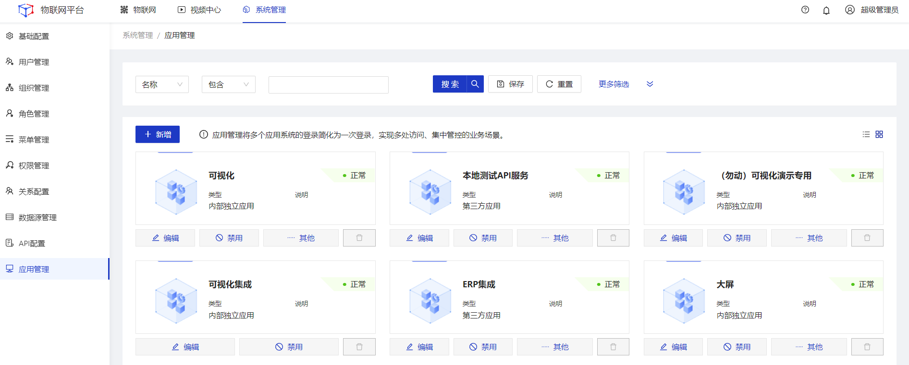
2.选择**内部独立应用**，勾选**页面集成**、**API服务**配置，填写相关配置后点击**保存**。
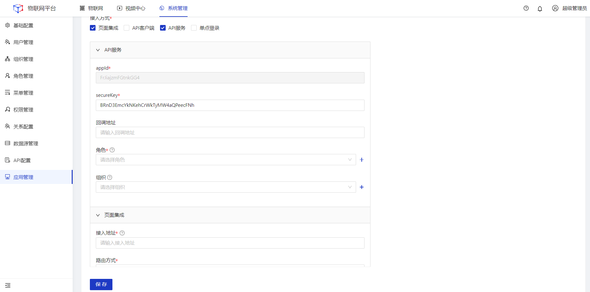
3.**登录**view可视化大屏系统，进入**系统管理>应用管理**菜单，点击**新增**，配置**API客户端**。
<div class='explanation primary'>
  <p class='explanation-title-warp'>
    <span class='iconfont icon-bangzhu explanation-icon'></span>
    <span class='explanation-title font-weight'>说明</span>
  </p>
 接入方式选择页面集成时将在其应用卡片中出现集成菜单按钮。
</div>

## 内部集成应用
适用于将官方开发的其他应用集成至jetlinks物联网平台，并且共享后端服务。本文以接入view可视化大屏系统为例。

### 操作步骤
1.**登录**Jetlinks物联网平台，进入**系统管理>应用管理**菜单，点击**新增**。</br>

2.选择**内部集成应用**，勾选**页面集成**、**API服务**配置，填写相关配置后点击**保存**。

3.**登录**view可视化大屏系统，进入**系统管理>应用管理**菜单，点击**新增**，配置**API客户端**。

## 微信网站应用
适用于通过微信账户登录jetlinks物联网平台。
### 前置条件
1.已经在微信开放平台开通网站应用。

### 操作步骤
1.**登录**Jetlinks物联网平台，进入**系统管理>应用管理**菜单，点击**新增**。</br>

2.选择**微信网站应用**，勾选**单点登录**配置，填写相关配置后点击**保存**。
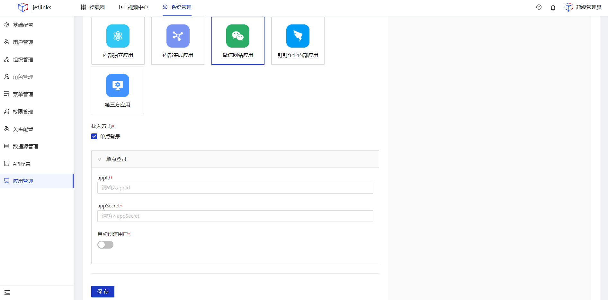
3.**登录**微信开放平台，进入**系统管理>应用管理**菜单，点击**新增**，配置**API客户端**。
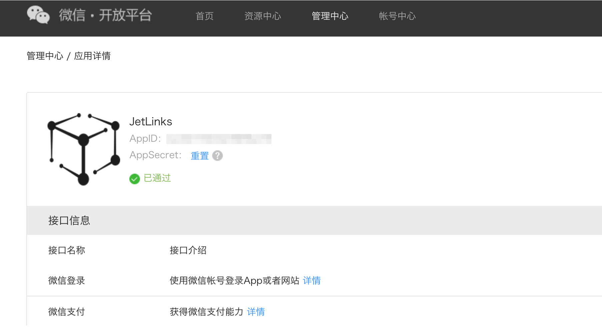

## 第三方应用
适用于将其他三方应用集成至jetlinks物联网平台。本文以第三方应用集成jetlinks物联网平台API服务为例，实现三方系统通过接口调用平台API能力。

### 操作步骤
1.**登录**Jetlinks物联网平台，进入**系统管理>应用管理**菜单，点击**新增**。</br>

2.选择**第三方应用**，勾选**API服务**配置，填写相关配置后点击**保存**。
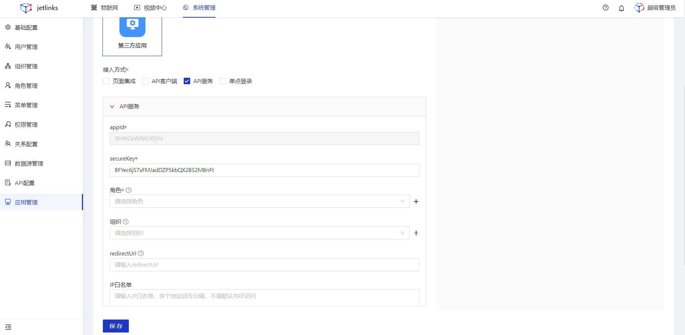
3.点击对应**应用管理卡片**的**其他**按钮，选择**赋权**。该应用可调用已赋权范围内的API能力。
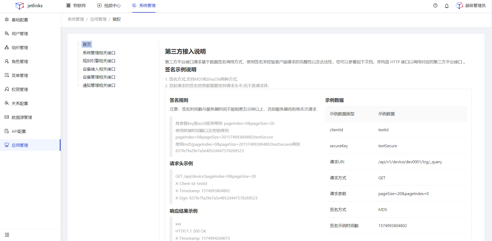
<div class='explanation primary'>
  <p class='explanation-title-warp'>
    <span class='iconfont icon-bangzhu explanation-icon'></span>
    <span class='explanation-title font-weight'>说明</span>
  </p>
 接入方式选择API服务时将在对应应用的卡片中出现赋权、查看API按钮。
</div>

## 单点登录
<div class='explanation info'>
  <p class='explanation-title-warp'> 
    <span class='iconfont icon-tishi explanation-icon'></span>
    <span class='explanation-title font-weight'>提示</span>
  </p>
   本案例以Gitee举例
</div>

### 操作步骤
#### 1.登录Gitee-账号设置-第三方应用-点击创建应用

<div class='explanation primary'>
  <p class='explanation-title-warp'>
    <span class='iconfont icon-bangzhu explanation-icon'></span>
    <span class='explanation-title font-weight'>说明</span>
  </p>
   应用回调地址中的{appId}参数为平台应用的id，先随意填写，创建平台应用后需要进行更改
</div>

   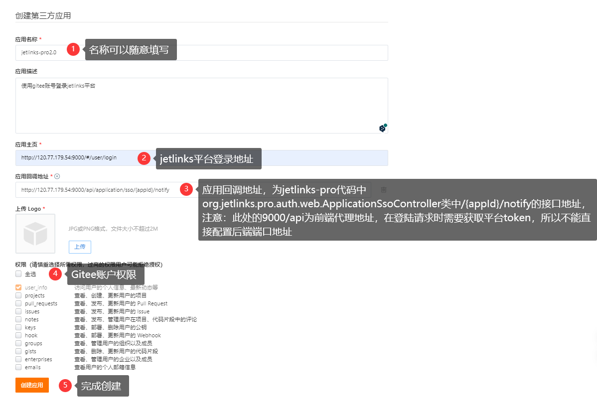
#### 2.创建好的gitee应用会提供Client ID和Client Serect

   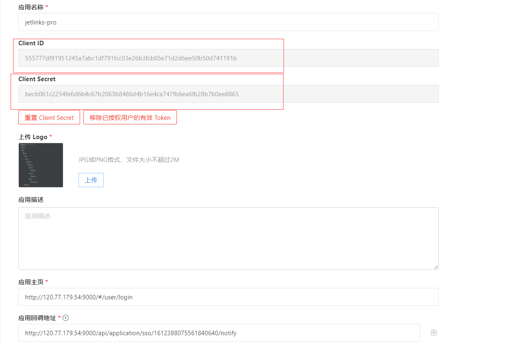

#### 3.创建平台第三方应用的单点登陆
<div class='explanation primary'>
  <p class='explanation-title-warp'>
    <span class='iconfont icon-bangzhu explanation-icon'></span>
    <span class='explanation-title font-weight'>说明</span>
  </p>
   下面两张图为同一个页面，client_id和client_secret为Gitee应用中的client ID和client Secret
</div>
  
  [Gitee文档相关资料](https://gitee.com/api/v5/swagger#/getV5User)
  可以获取oAuth文档：授权地址、token地址和API文档：获取授权用户的资料地址
  如果用户要使用自己的业务系统，可以参照自己的系统定义操作
<div class='explanation primary'>
  <p class='explanation-title-warp'>
    <span class='iconfont icon-bangzhu explanation-icon'></span>
    <span class='explanation-title font-weight'>说明</span>
  </p>
  单点登录的scope配置多个gitee权限时，需要在输入法切换成英文的状态下，使用分号（;）进行分割
</div>

   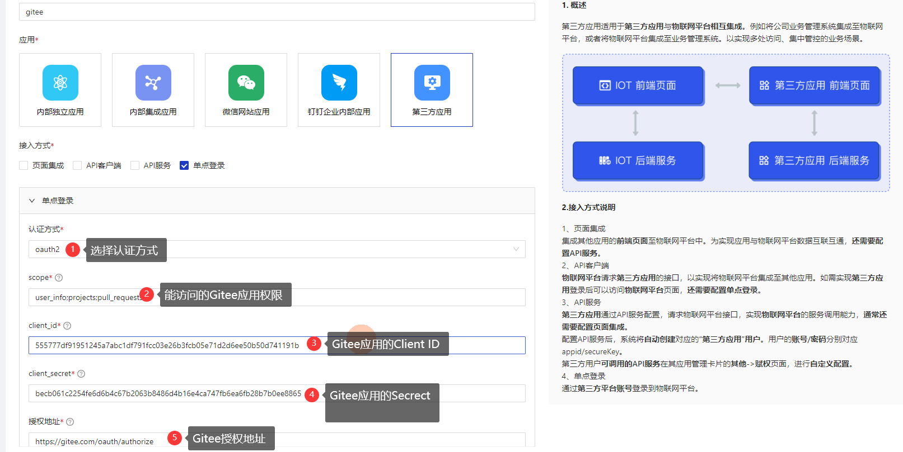
   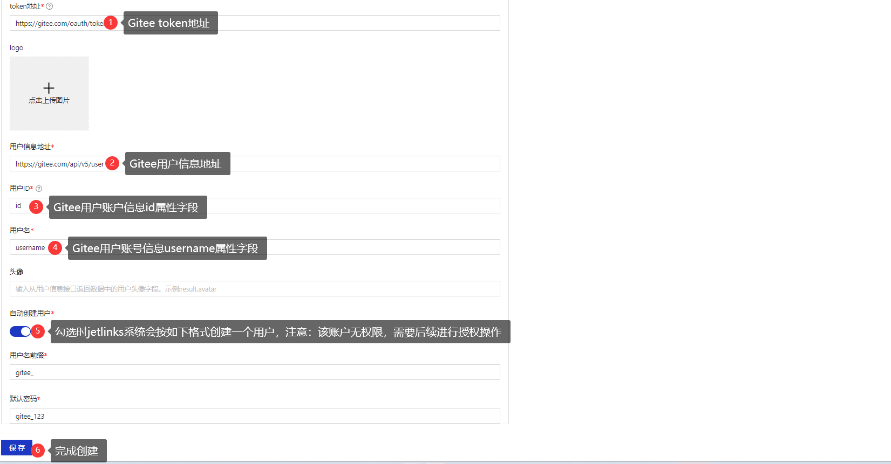
#### 4.在应用管理中找到创建的第三方应用，点击编辑，在浏览器URL路劲的最后一个参数id值代替Gitee中回调地址中的appId

  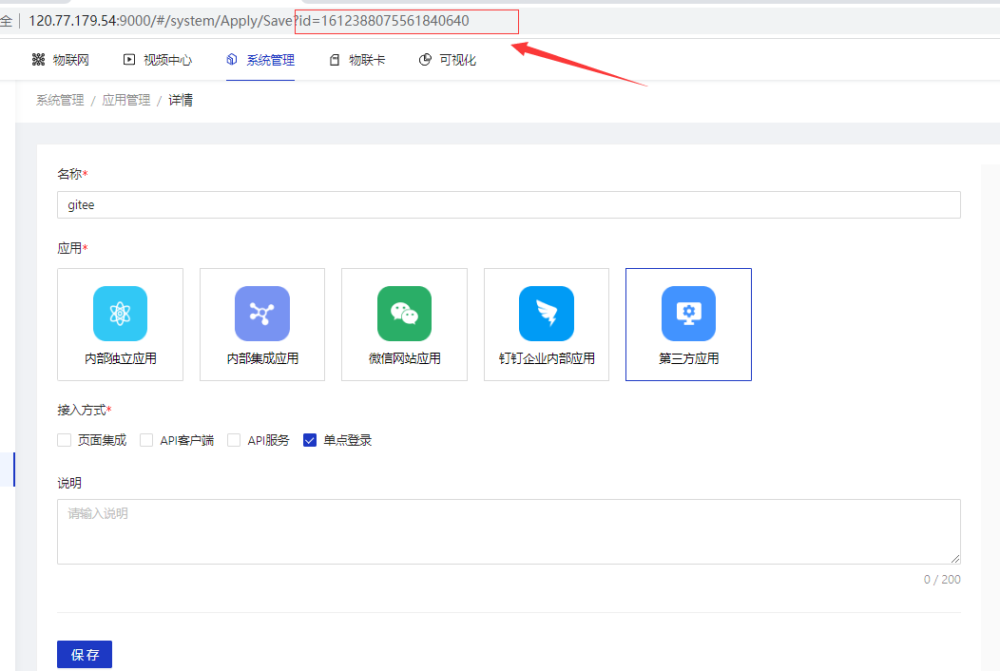
  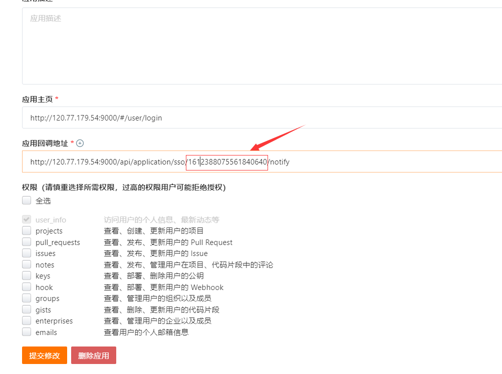
#### 5.根据图示进行单点登录
  
#### 6.单点登录成功
  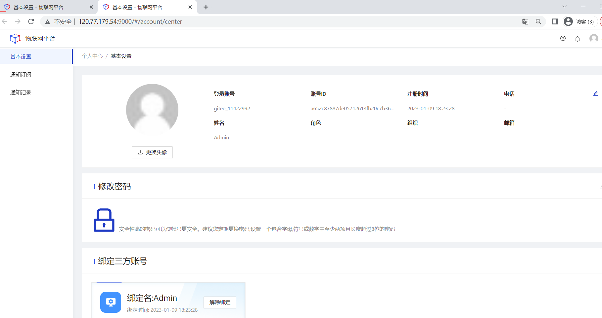
  
### 流程图
  ### 创建Gitee应用
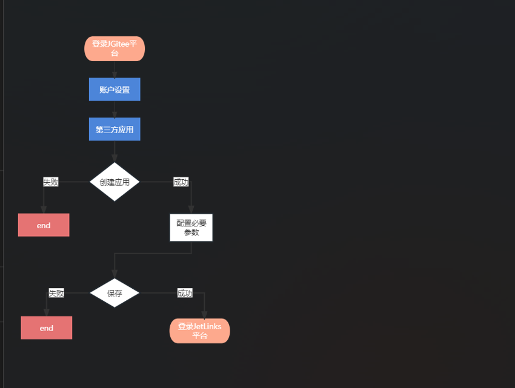
  ### 创建平台应用
  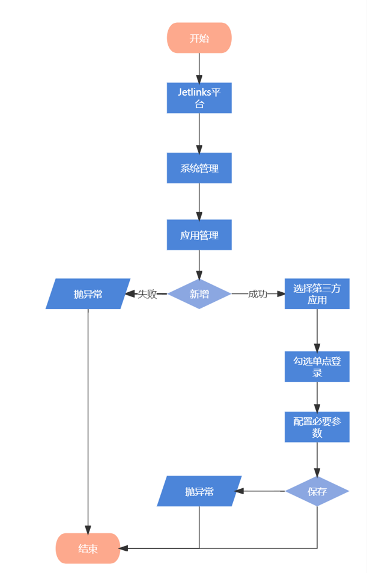


## 页面集成和Api服务配置
### 操作步骤
#### 1.登录JetLinks平台-系统管理-应用管理-新增-填写相关信息
 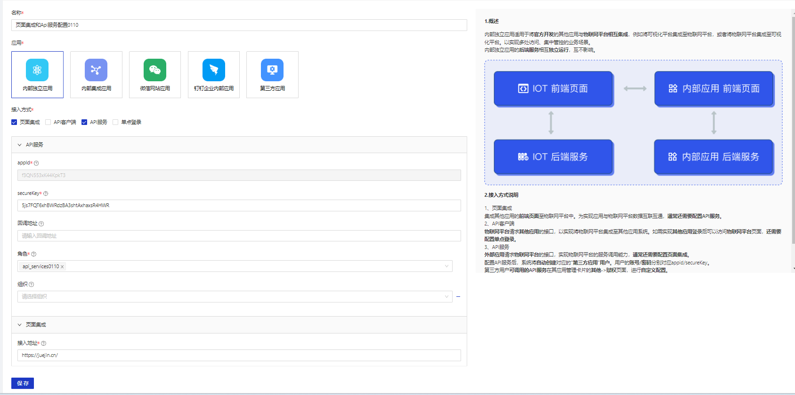

<div class='explanation primary'>
  <p class='explanation-title-warp'>
    <span class='iconfont icon-bangzhu explanation-icon'></span>
    <span class='explanation-title font-weight'>说明</span>
  </p>
   <p>保存集成:点击保存，弹出集成菜单，选择菜单进行集成;如果保存时没有增加菜单，可以先关掉集成界面，后续在：应用管理-应用卡片-其他-集成菜单，进行菜单集成</p>
</div>

#### 2.在JetLinks官方仓库获取代码包[jetlinks-openapi-demo](https://github.com/jetlinks),用于生成请求头信息 
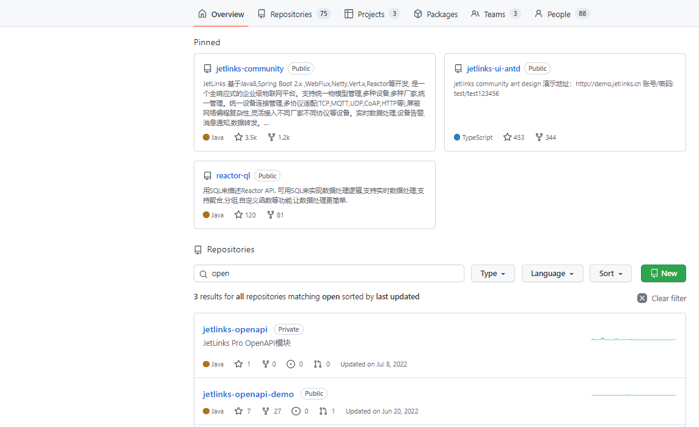

#### 3.根据appId和secureKey、body获取请求token，详情参见：[第三方平台请求JetLinks服务接口](/dev-guide/request-jetlinks-interface.html)
根据请求头参数,调用获取平台token接口地址：（post）http://ip:9000(默认)/api/token

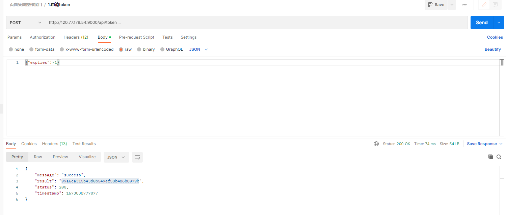

<div class='explanation primary'>
  <p class='explanation-title-warp'>
    <span class='iconfont icon-bangzhu explanation-icon'></span>
    <span class='explanation-title font-weight'>说明</span>
  </p>
   X-Timestamp平台默认为当前时间5分钟以内，可以在平台<code>org.jetlinks.pro.openapi.interceptor.OpenApiFilter</code>进行更改
</div>

```java
 private Duration timestampMaxInterval = Duration.ofMinutes(5);
```
##### 更多token相关信息参见：[第三方平台请求JetLinks服务接口](/dev-guide/request-jetlinks-interface.html)

#### 4.根据token,调用生成菜单接口地址：（post）http://ip:端口号/menu

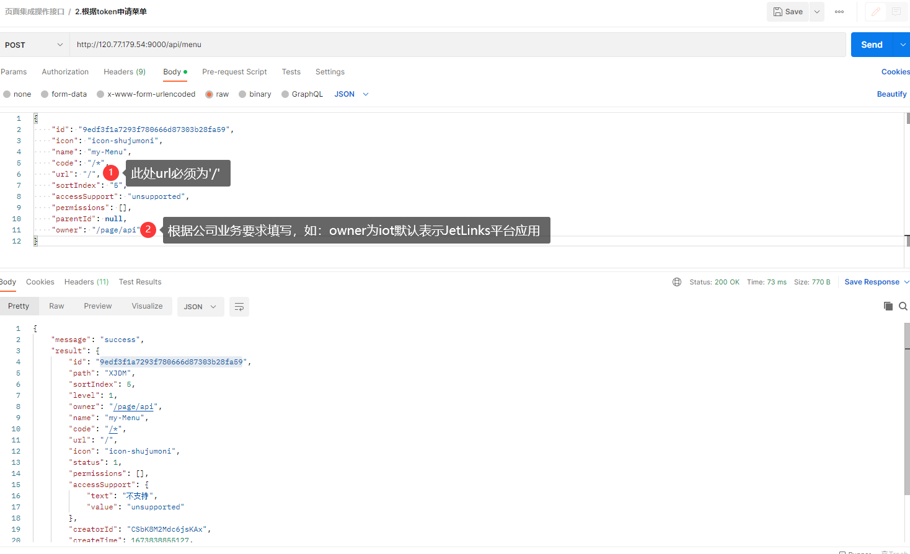

#### 5.选择集成菜单
//todo  目前前端出现问题
#### 6.选择集成菜单
//todo  赋权
#### 7.给当前账号分配新创建的菜单权限：角色管理-编辑-权限分配
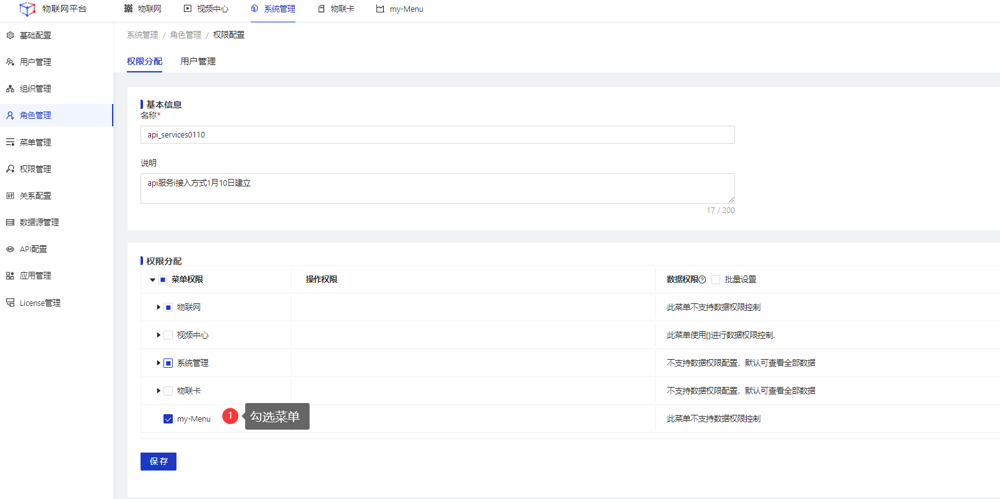

### 流程图
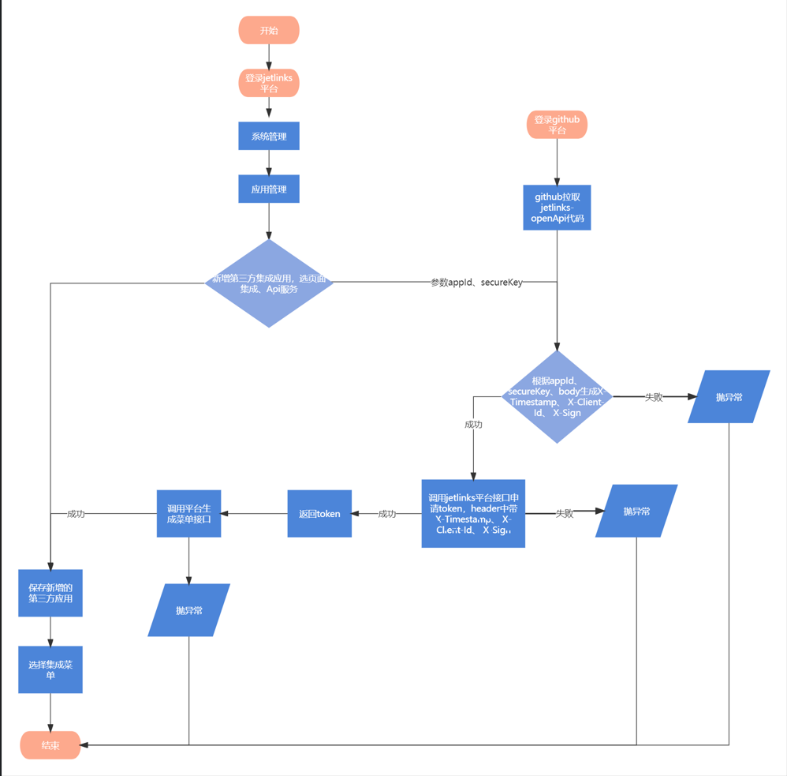

## 常见问题
### 存在错误,无效的登录回调地址

<div class='explanation warning'>
  <p class='explanation-title-warp'>
    <span class='iconfont icon-bangzhu explanation-icon'></span>
    <span class='explanation-title font-weight'>问题1</span>
  </p>
<p>Q：存在错误,无效的登录回调地址</p>
<p>A：查看Gitee回调地址是否是代理地址(即：（默认前端端口）9000/api/）</p></div>

### 单点登录时，前端出现<code>Invalid character '；'</code>

<div class='explanation warning'>
  <p class='explanation-title-warp'>
    <span class='iconfont icon-bangzhu explanation-icon'></span>
    <span class='explanation-title font-weight'>问题1</span>
  </p>
<p>Q：<code>{"message":"Invalid character '；' for QUERY_PARAM in \"user_info；projects；pull_requests\"","status":400,
"code":"illegal_argument","timestamp":1673317514494}</code></p>
<p>A：单点登录的scope配置多个权限范围时，需要输入法在英文的状态前提下，输入分号</p></div>

