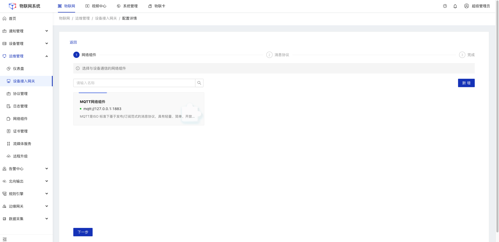
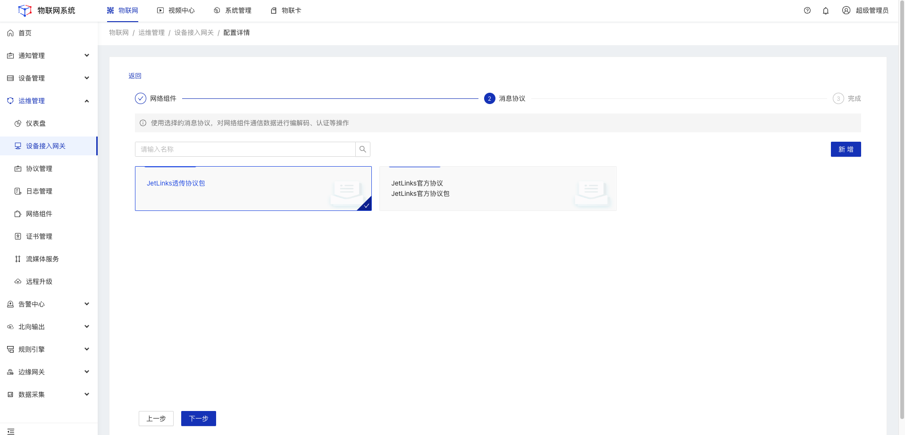
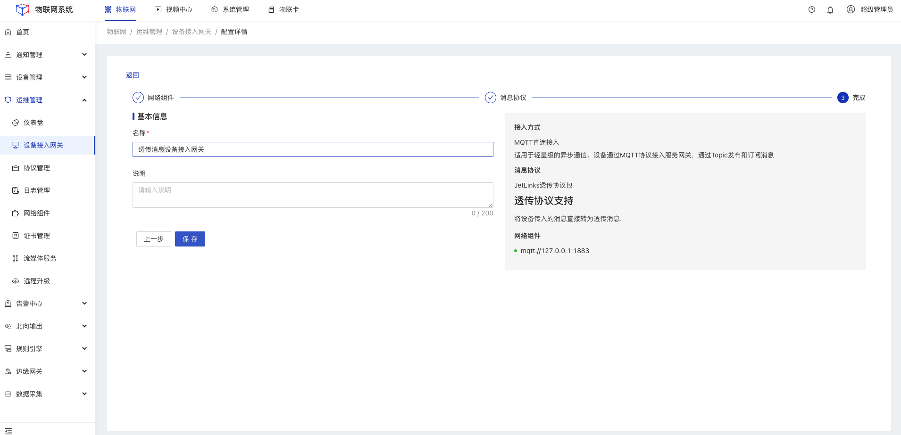
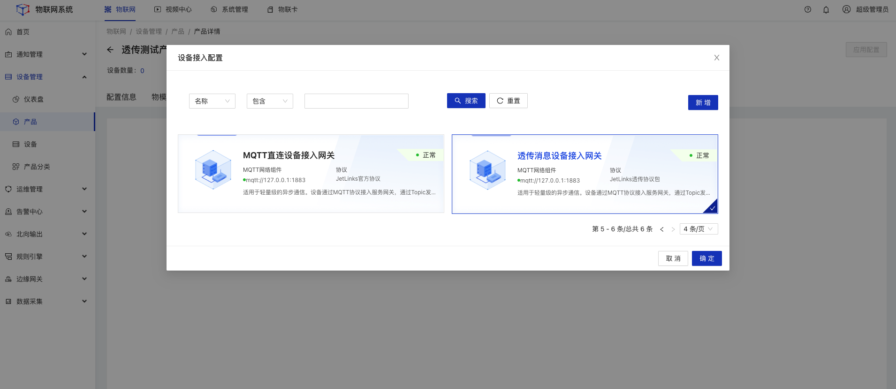
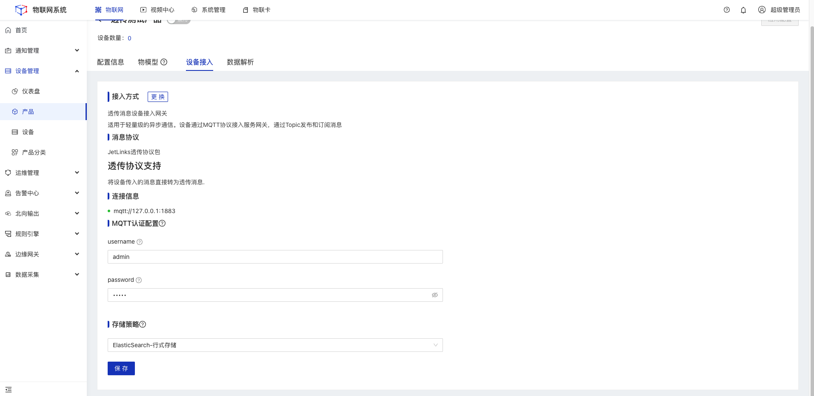
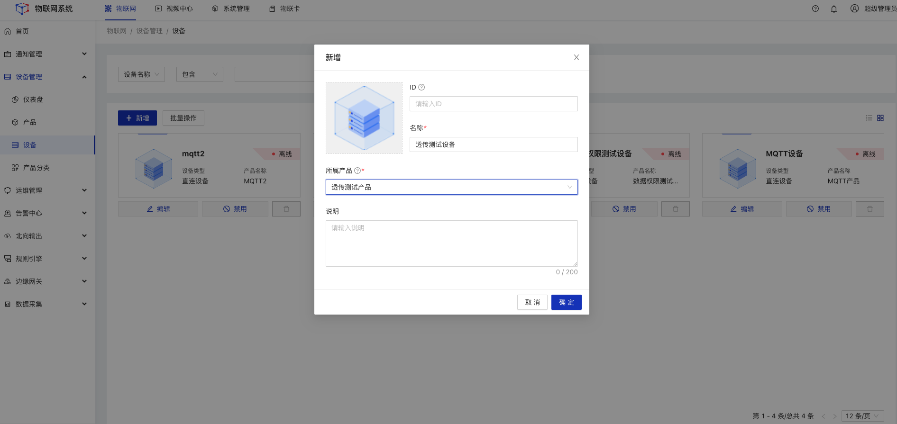

## 透传消息数据解析

本文档以MQTTX模拟设备为例，介绍设备数据不做任何编解码处理，透传到平台后，使用脚本做数据解析过程

### 下载并安装MQTTX
前往[官网下载](https://mqttx.app/)安装

### 系统配置
#### 操作步骤
1.**登录**Jetlinks物联网平台，进入**协议管理**菜单，上传协议。 

<a target='_blank' href='https://github.com/jetlinks/transparent-protocol'>获取透传协议包源码</a>

2.进入**网络组件**菜单，配置**MQTT服务**类型的网络组件。 

3.进入**设备接入网关**菜单，配置接入方式为**MQTT直连**的网关。 
&emsp;（1）选择第2步创建的MQTT服务网络组件 

&emsp;（2）选择第1步创建的协议包 

&emsp;（3）填写设备接入网关名称 

4.创建产品，并进入**设备接入**tab，选择第3步的设备接入网关然后**启用**产品。

5.在**设备接入**tab页面中填写官方协议包认证信息；然后**启用**产品。

  

    
    说明
  

不同协议包在设备接入界面所需要填写的方式不同。官方协议包，需要填写设备认证所需要的的账号密码

`在设备接入tab页的MQTT认证配置项中填写  secureId为：admin    secureKey为：admin。`

6.创建设备，选择对应的所属产品，然后**启用**设备。

  

    
    注意
  

需要先启用产品，才能基于产品创建设备

