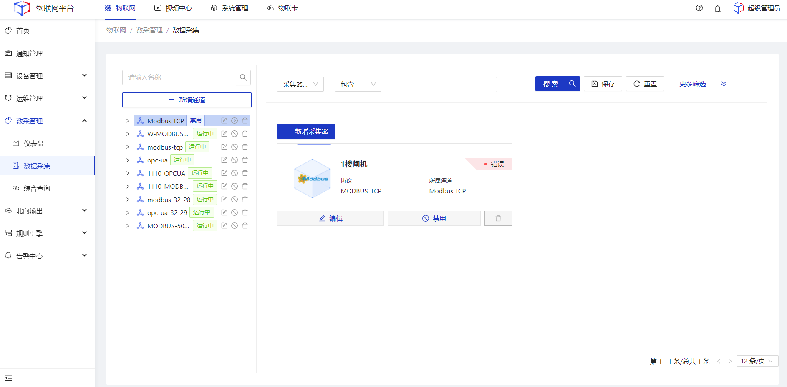
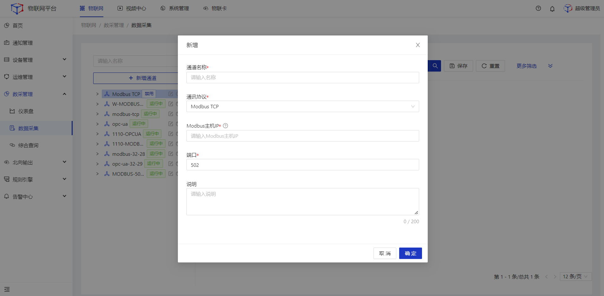
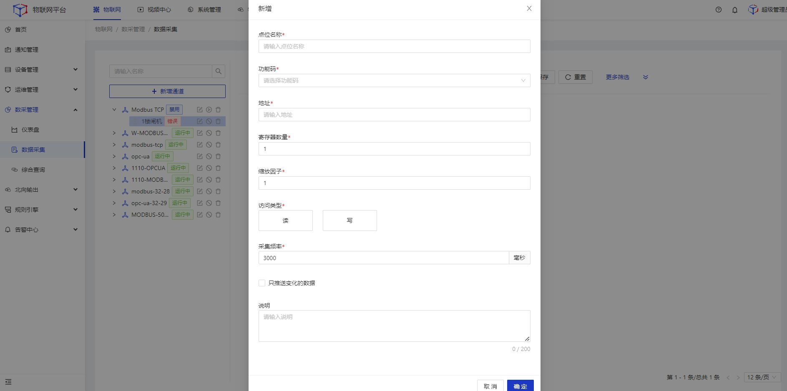
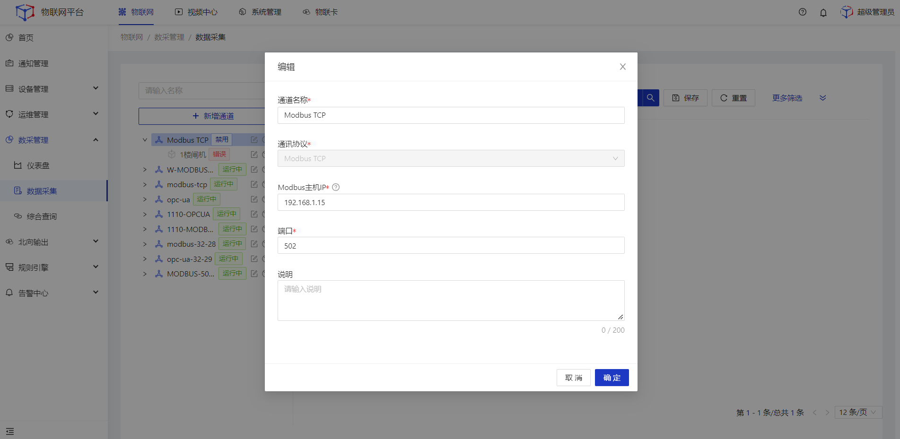
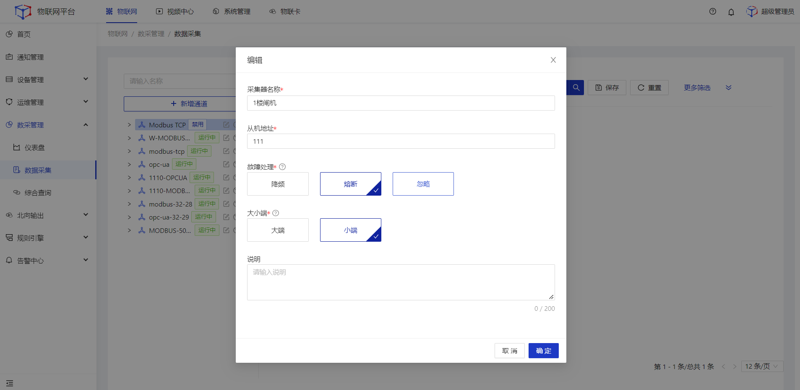
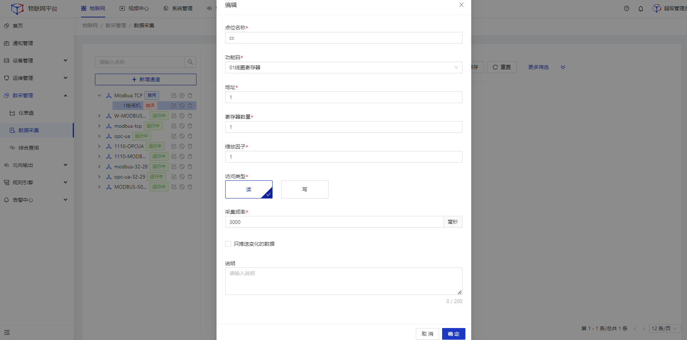
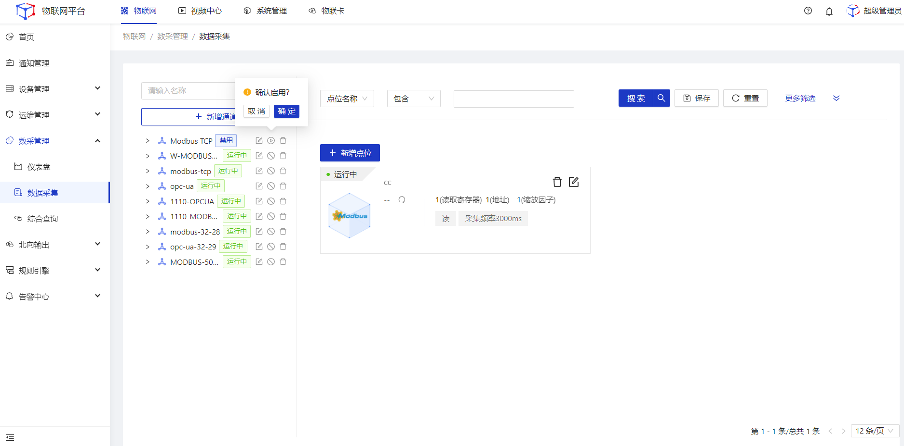
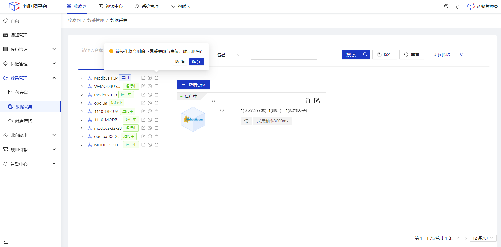
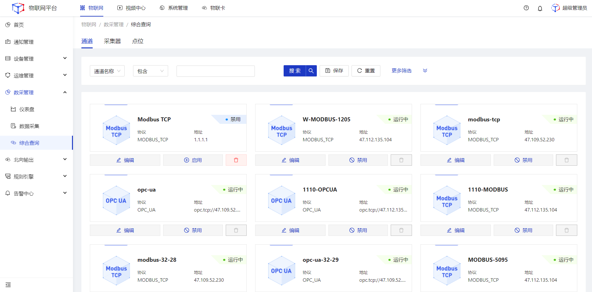

# 数采管理

## 数据采集
采集**Modbus TCP**、**OPC UA**协议的采集器数据。

  

    
    说明
  

  采集器：现实中用于提供采集数据的真实物理设备。

### 新增
#### 新增通道
##### 操作步骤
1.**登录**Jetlinks物联网平台。 
2.点击顶部**物联卡**，在左侧导航栏，选择**数采管理>数据采集**，进入列表页。 

3.点击左侧的**新增通道**按钮，弹出弹框，填写通道信息，然后点击**确定**。 

#### 新增采集器
##### 操作步骤
1.**登录**Jetlinks物联网平台。 
2.点击顶部**物联卡**，在左侧导航栏，选择**数采管理>数据采集**，进入列表页。 

3.点击左侧的具体通道节点，在点击右侧页面的**新增采集器**按钮，弹出弹框，填写采集器信息，然后点击**确定**。 

#### 新增点位
##### 操作步骤
1.**登录**Jetlinks物联网平台。 
2.点击顶部**物联卡**，在左侧导航栏，选择**数采管理>数据采集**，进入列表页。 

3.点击左侧的具体采集器节点，在点击右侧页面的**新增采集器**按钮，弹出弹框，填写点位信息，然后点击**确定**。 

  

    
    注意
  

  添加点位后，平台能获取点位上报的源数据，若需在**设备-运行状态**页面查看采集器的上报数据，需在**设备-Modbus TCP/OPC UA**页面将采集器点位数据与设备物模型进行映射绑定。

### 编辑
#### 编辑通道
##### 操作步骤
1.**登录**Jetlinks物联网平台。 
2.点击顶部**物联卡**，在左侧导航栏，选择**数采管理>数据采集**，进入列表页。 

3.点击左侧的通道数据的**编辑**按钮，弹出弹框，编辑通道信息，然后点击**确定**。 

#### 编辑采集器
##### 操作步骤
1.**登录**Jetlinks物联网平台。 
2.点击顶部**物联卡**，在左侧导航栏，选择**数采管理>数据采集**，进入列表页。 

3.点击左侧采集器数据的**编辑**按钮，弹出弹框，编辑通道信息，然后点击**确定**。 

#### 编辑点位
##### 操作步骤
1.**登录**Jetlinks物联网平台。 
2.点击顶部**物联卡**，在左侧导航栏，选择**数采管理>数据采集**，进入列表页。 

3.点击左侧采集器节点，在页面右侧选中需要编辑的点位，点击**编辑**按钮，弹出弹框，编辑点位信息，然后点击**确定**。 

### 启用/禁用
##### 操作步骤
1.**登录**Jetlinks物联网平台。 
2.点击顶部**物联卡**，在左侧导航栏，选择**数采管理>数据采集**，进入列表页。 

3.点击左侧通道、采集器节点的**启用/禁用**按钮，弹出弹框，然后点击**确定**。 

### 删除
##### 操作步骤
1.**登录**Jetlinks物联网平台。 
2.点击顶部**物联卡**，在左侧导航栏，选择**数采管理>数据采集**，进入列表页。 

3.点击通道、采集器、点位的**删除**按钮，弹出弹框，然后点击**确定**。 

## 综合查询

多维度全量搜索平台内的所有**通道**、**采集器**、**点位数据**。 

##### 操作步骤
1.**登录**Jetlinks物联网平台。 
2.点击顶部**物联卡**，在左侧导航栏，选择**数采管理>综合查询**，进入列表页。 

3.点击tab页可切换至查询采集器、点位数据。 
