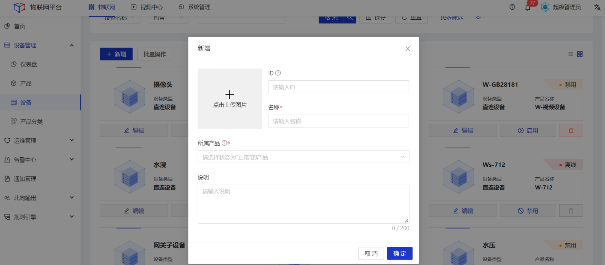
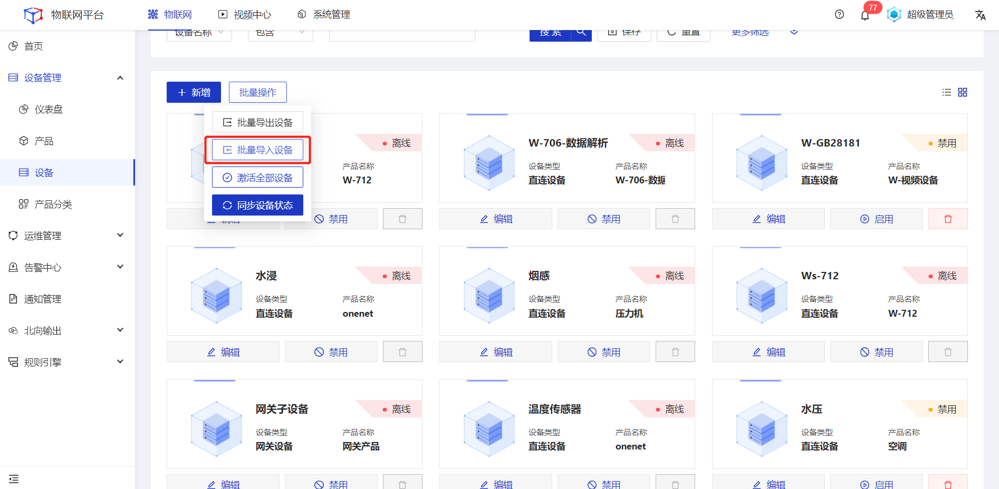
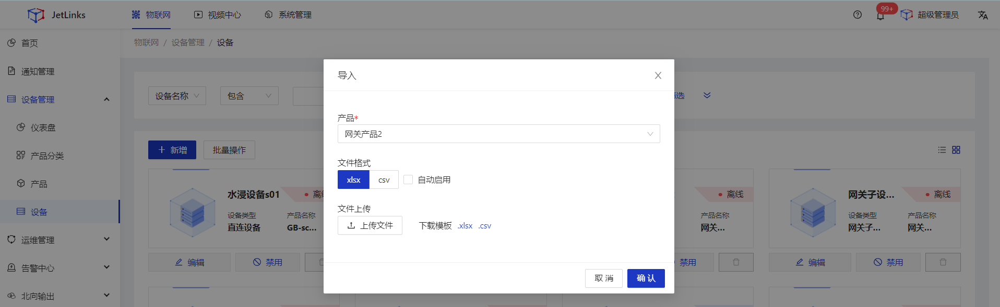

# 创建设备

产品是设备的集合，通常指一组具有相同功能的设备。创建产品完成，并启用产品后，需在产品下添加设备。您可在物联网平台上，同时创建一个或多个设备。

### 创建单个设备

#### 操作步骤
1.**登录**Jetlinks物联网平台。 
2.在左侧导航栏，选择**设备管理>设备**，点击**新增**。 
3.在新增弹框中，输入设备信息，点击**确定**。 

<table class='table'>
        <thead>
            <tr>
              <td>参数</td>
              <td>说明</td>
            </tr>
        </thead>
        <tbody>
          <tr>
            <td>ID</td>
            <td>设备唯一标识，在系统内具有全局唯一性。</td>
          </tr>
          <tr>
            <td>名称</td>
            <td>为设备命名，最多可输入64个字符。</td>
          </tr>
          <tr>
            <td>所属产品</td>
            <td>单选下拉框，非必填。可根据业务实际情况选择产品分类。</td>
          </tr>
          <tr>
            <td>说明</td>
            <td>备注说明信息，最多可输入200个字符。</td>
          </tr>
       </tbody>
</table>

### 批量创建设备

#### 操作步骤
1.**登录**Jetlinks物联网平台。 
2.在左侧导航栏，选择**设备管理>设备**，点击**批量操作>批量导入设备**。 

3.在导入弹框中，选择设备**所属产品**。 

4.点击**下载模板**，线下填写设备基本信息。 
5.点击**上传文件**。 

  

    
    注意
  

  <li>导入的设备ID重复时,将自动覆盖原数据。</li>
  <li>批量导入时，系统会从上到下的读取并导入文件中的数据，一旦某条数据导入失败，将终止后续数据的导入。</li>

