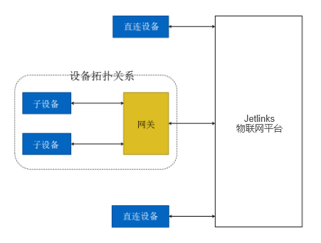
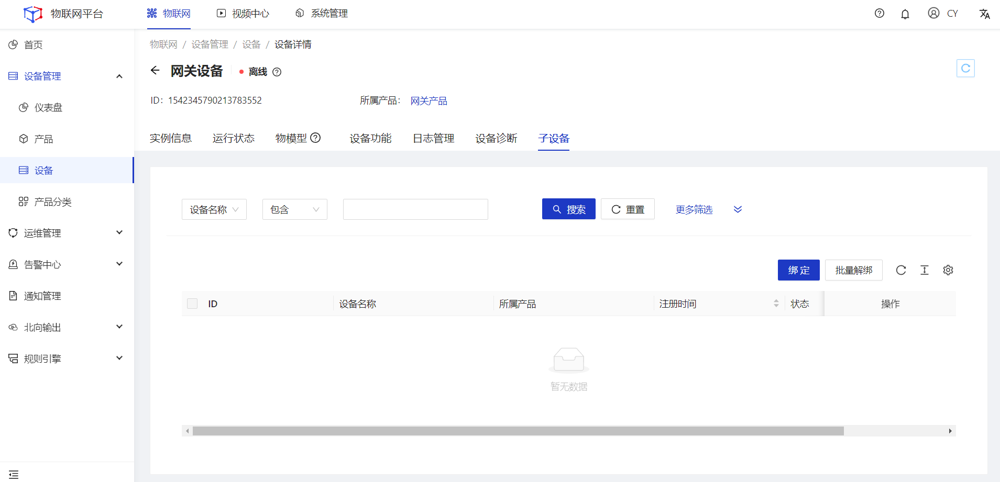
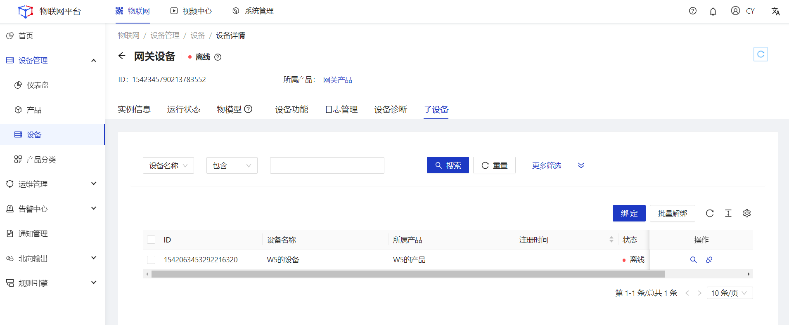

# 创建网关与子设备

### 网关与子设备
Jetlinks物联网平台支持**设备直连**，也支持设备挂载在网关上，作为网关的子设备，由**网关直连**。

#### 适用场景
适用于子设备不具备直连以太网，或者需要拓扑关系管理的场景。

#### 网关与设备
<li>直连设备：直连Jetlinks物联网平台，但不能挂载子设备的设备。
<li>网关子设备：作为网关的子设备，由网关代理连接到Jetlinks物联网平台。
<li>网关设备：能挂载子设备，是多个网络间提供数据转换服务的设备。</li> 
网关与子设备的拓扑关系如下图：

#### 接入步骤
网关连接物联网平台后，将拓扑关系同步至物联网平台，代理子设备进行设备认证、消息上传、指令接收等与物联网平台的通信。 
1.创建网关设备、网关子设备类型的产品。详见[创建产品](../Device_access/Create_product3.1.md)。 
2.在网关设备、网关子设备的产品下创建对应的设备。详见[创建设备](../Device_access/Create_Device3.2.md)。 
3.建立网关设备与网关子设备的拓扑关系。 

### 添加拓扑关系
若子设备通过网关代理连接到物联网平台，则需要添加网关与子设备的拓扑关系，将子设备关联到网关设备下。本文介绍网关设备关联子设备的具体操作。 

#### 前提条件
1.已创建网关产品和设备，创建产品时，设备类型需选择为网关设备。具体操作，请参见[创建产品](../Device_access/Create_product3.1.md)、[创建设备](../Device_access/Create_Device3.2.md)。 
2.已创建网关子设备产品和设备，创建产品时，设备类型需选择为网关子设备。具体操作，请参见[创建产品](../Device_access/Create_product3.1.md)、[创建设备](../Device_access/Create_Device3.2.md)。 

#### 操作步骤
1.**登录**Jetlinks物联网平台。 
2.在左侧导航栏，选择**设备管理>设备**，点击查看具体的网关，选择**子设备**tab。 

  

    
    说明
  

  只有设备类型为**网关设备**的设备，才有**子设备tab**页选项。

3.点击页面右上方的**绑定**按钮，选择需要绑定的子设备，然后点击**确定**。 

#### 后续操作
1.勾选需要解绑的子设备，然后点击页面右上方**批量解绑**按钮，解除网关与子设备拓扑关系。 

  

    
    说明
  

解除绑定不会删除子设备。

2.点击列表操作列中的**查看**按钮，可查看子设备详情信息。 
3.点击列表操作列中的**解绑**按钮，可解除当前子设备与网关的拓扑关系。 

### 子设备上线

子设备不直接连接物联网平台，而是通过网关与物联网平台建立连接，复用网关与物联网平台的通信通道。子设备的状态可以依据父设备状态，也可以独立于父设备。具体规则需在协议包中拟定。

#### 子设备上线过程
网关代理子设备上线过程如下： 
1.在Jetlinks物联网平台中创建网关产品与网关设备。 
2.网关设备接入Jetlinks物联网平台。 
3.子设备线下连接到网关。 
4.在Jetlinks物联网平台中创建网关子设备产品与网关子设备。 
5.建立网关设备与网关子设备的拓扑关系。 

