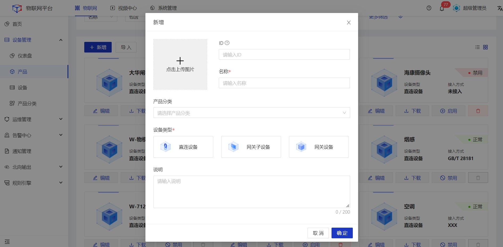

# 创建产品

产品是设备的集合，通常是一组具有相同功能定义的设备集合。例如，产品指同一个型号的产品，设备就是该型号下的某个设备。使用物联网平台接入设备前，您需在物联网平台控制台创建产品。本文介绍创建产品的具体操作。

### 创建单个产品

#### 操作步骤
1.**登录**Jetlinks物联网平台。 
2.在左侧导航栏，选择**设备管理>产品**，点击**新增**。 
3.在**新建**弹框中，根据设备实际情况，按照页面提示填写信息，然后单击**确定**。 

<table class='table'>
        <thead>
            <tr>
              <td>参数</td>
              <td>说明</td>
            </tr>
        </thead>
        <tbody>
          <tr>
            <td>ID</td>
            <td>产品唯一标识，在系统内具有全局唯一性。</td>
          </tr>
          <tr>
            <td>名称</td>
            <td>为产品命名，最多可输入64个字符。</td>
          </tr>
          <tr>
            <td>产品分类</td>
            <td>单选下拉框，非必填。可根据业务实际情况选择产品分类。</td>
          </tr>
              <tr>
            <td>设备类型</td>
            <td>直连设备：能直接通过以太网连接到Jetlinks物联网平台。 网关设备：能挂载子设备，是多个网络间提供数据转换服务的设备。 网关子设备：不能直接通过以太网连接到Jetlinks物联网平台的设备，需要作为网关的子设备，由网关代理连接到Jetlinks物联网平台。 

    说明
    <ul>
网关子设备在选择接入方式时只能选择“网关子设备”类型的网关。
    </ul>
  

</td>
          </tr>
                  <tr>
            <td>说明</td>
            <td>备注说明信息，最多可输入200个字符。</td>
          </tr>
          </tbody>
</table>

#### 后续操作
1.配置设备接入方式。 
2.进入产品详情页，选择**设备接入**tab，根据实际情况选择设备接入网关。 

