# 物联卡管理

## 物联卡管理

物联卡管理支持对物联卡进行统一纳管。现支持**移动OneLink**、**电信CTWing**、**联通Unicon**3个平台。 

#### 新增
##### 操作步骤
1.**登录**Jetlinks物联网平台。 
2.点击顶部**物联卡**，在左侧导航栏，选择**物联卡管理**，进入列表页。 

3.点击**新增**按钮，弹出弹框，填写物联卡信息，然后点击**确定**。 
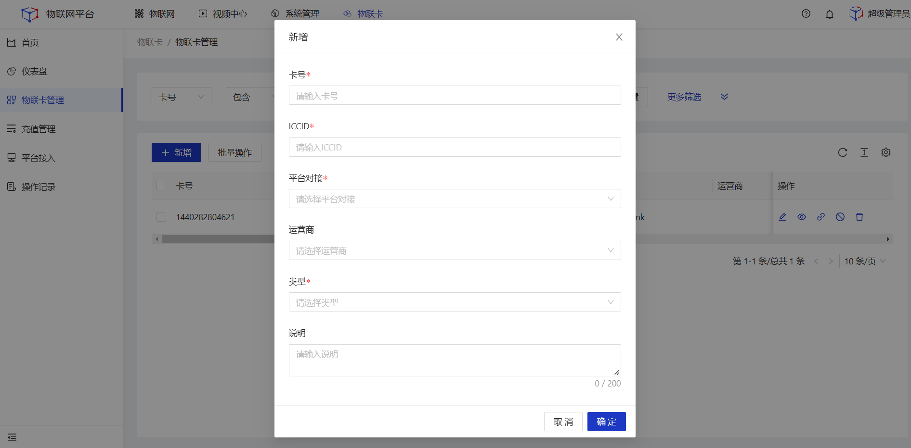

  

    
    说明
  

  ICCID需符合对应第三方平台定义的输入规范，否则不能成功添加物联卡。系统会基于ICCID判断该物联卡属于哪一个平台。

<table class='table'>
        <thead>
            <tr>
              <td>参数</td>
              <td>说明</td>
            </tr>
        </thead>
        <tbody>
          <tr>
            <td>卡号</td>
            <td>物联卡号码</td>
          </tr>
          <tr>
            <td>ICCID</td>
            <td>集成电路卡识别码，IC卡的唯一识别号码。</td>
          </tr>
          <tr>
            <td>平台对接</td>
            <td>定义该物联卡使用具体的平台接入配置与IOT平台进行数据交互。</td>
          </tr>
          <tr>
            <td>运营商</td>
            <td>定义该物联卡所属通信运营商。</td>
          </tr>
          <tr>
            <td>类型</td>
            <td>定义该物联卡的业务类型，包括年卡、季卡、月卡、其他。</td>
          </tr>
        </tbody>
      </table>

#### 编辑
##### 操作步骤
1.**登录**Jetlinks物联网平台。 
2.点击顶部**物联卡**，在左侧导航栏，选择**物联卡管理**，进入列表页。 

3.点击具体物联卡的**编辑**按钮，弹出弹框，编辑物联卡信息，然后点击**确定**。 
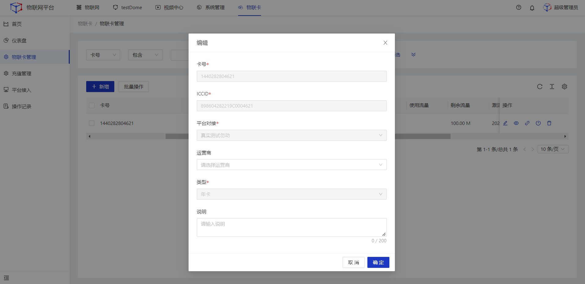

#### 查看
##### 操作步骤
1.**登录**Jetlinks物联网平台。 
2.点击顶部**物联卡**，在左侧导航栏，选择**物联卡管理**，进入列表页。 

3.点击具体物联卡的**查看**按钮，进入详情页。 
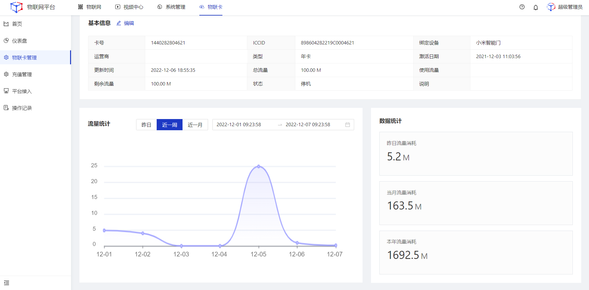

#### 绑定设备
##### 操作步骤
1.**登录**Jetlinks物联网平台。 
2.点击顶部**物联卡**，在左侧导航栏，选择**物联卡管理**，进入列表页。 

3.点击具体物联卡的**绑定设备**按钮，弹出弹框，勾选需要绑定的设备后，点击**确定**。 
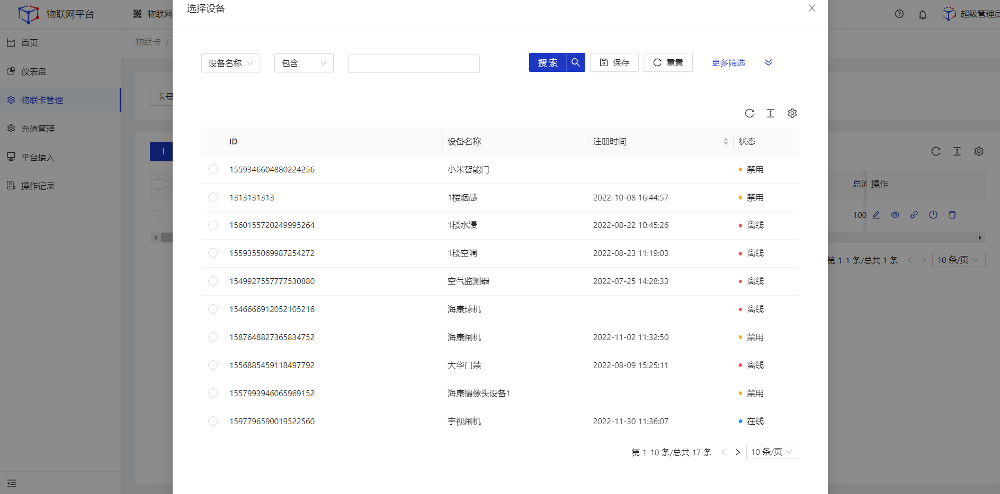

#### 激活
##### 操作步骤
1.**登录**Jetlinks物联网平台。 
2.点击顶部**物联卡**，在左侧导航栏，选择**物联卡管理**，进入列表页。 

3.点击具体物联卡的**激活**按钮，弹出弹框，然后点击**确定**。 
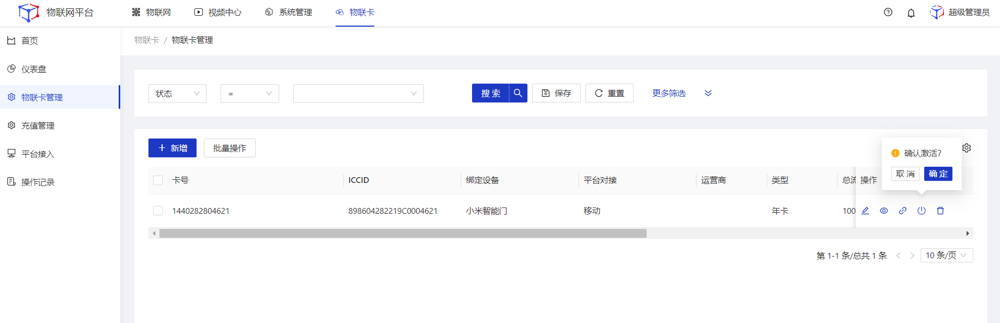

  

    
    说明
  

  激活指一张新卡正式投入使用，激活后物联卡将置为**正常**状态。

#### 删除
##### 操作步骤
1.**登录**Jetlinks物联网平台。 
2.点击顶部**物联卡**，在左侧导航栏，选择**物联卡管理**，进入列表页。 

3.点击具体物联卡的**删除**按钮，弹出弹框，然后点击**确定**。 

#### 批量操作
##### 操作步骤
1.**登录**Jetlinks物联网平台。 
2.点击顶部**物联卡**，在左侧导航栏，选择**物联卡管理**，进入列表页。 

3.勾选需要批量操作的数据，然后点击页面左上方的**批量操作**按钮，选择要执行的操作，然后点击**确定**。 
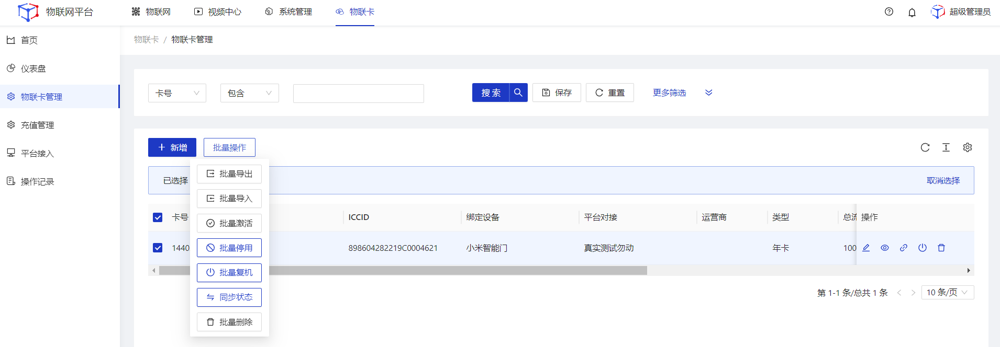

  

    
    说明
  

  未勾选数据时直接点击批量导出，将导出所有分页的数据。

## 充值管理

对**移动OneLink**的物联卡账户进行充值。 

  

    
    注意
  

  本平台仅提供充值入口，具体充值结果需以运营商的充值结果为准。

#### 充值
##### 操作步骤
1.**登录**Jetlinks物联网平台。 
2.点击顶部**物联卡**，在左侧导航栏，选择**充值管理**，进入列表页。 
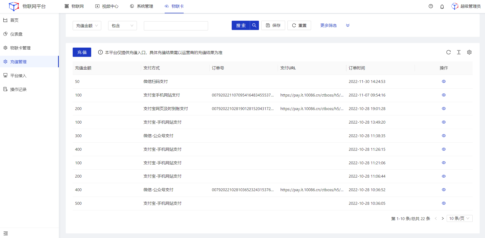
3.点击**新增**按钮，弹出弹框，填写充值信息，然后点击**确定**。 
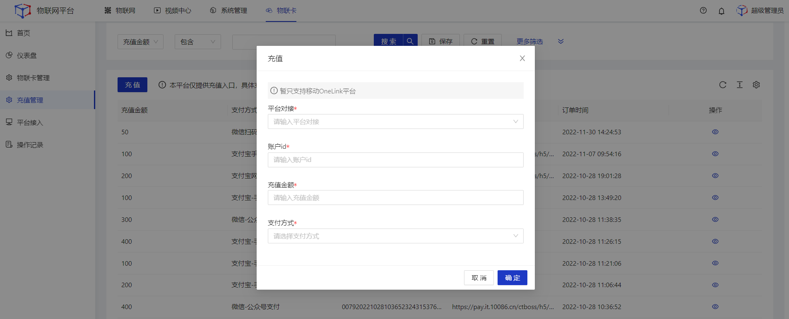
<table class='table'>
        <thead>
            <tr>
              <td>参数</td>
              <td>说明</td>
            </tr>
        </thead>
        <tbody>
          <tr>
            <td>平台对接</td>
            <td>选择具体的移动OneLink平台。</td>
          </tr>
          <tr>
            <td>账户ID</td>
            <td>移动OneLink平台中申请的账户ID。</td>
          </tr>
          <tr>
            <td>充值金额</td>
            <td>填写充值金额，可输入1~500之间的数字，最多支持2位小数。</td>
          </tr>
          <tr>
            <td>支付方式</td>
            <td>选择充值方式，充值时将根据该选项进入不同的充值支付页面。</td>
          </tr>
        </tbody>
      </table>

4.在对应渠道的支付页面完成支付。

## 平台接入

配置IOT平台与其他第三方物联卡平台对接所需的参数，实现平台间的数据互联互通。

#### 移动OneLink新增
##### 操作步骤
1.**登录**Jetlinks物联网平台。 
2.点击顶部**物联卡**，在左侧导航栏，选择**平台接入**，进入列表页。 
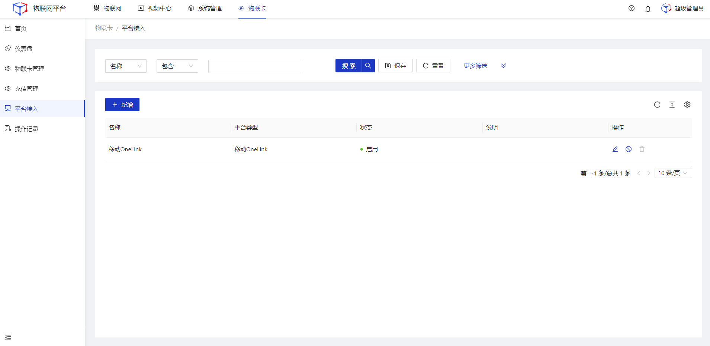
3.点击**新增**按钮，进入详情页，平台类型选择**移动OneLink**，填写平台接入配置信息，然后点击**保存**。 
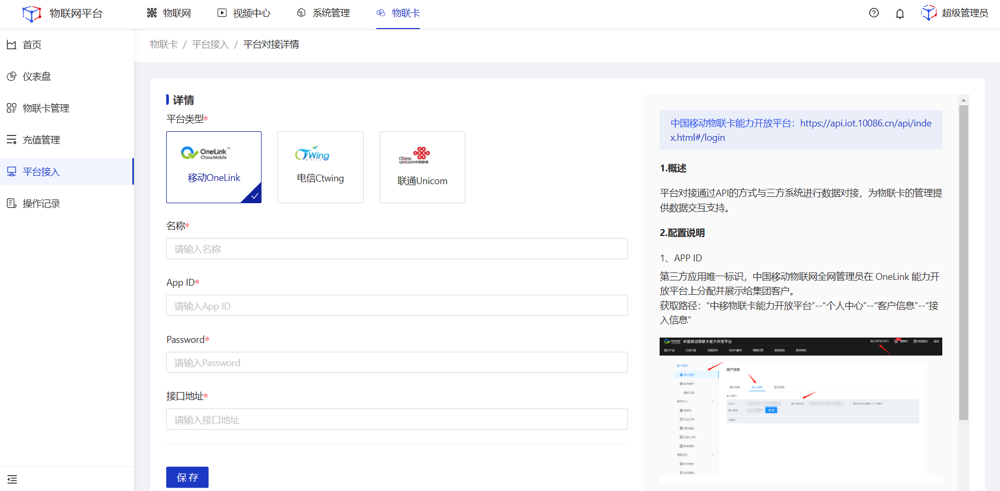

  

    
    注意
  

  第三方平台的接口暂不支持点击保存时校验配置是否正确，在**物联卡管理**页面进行物理卡激活、停用、复机、同步状态时将进行相应提示。

<table class='table'>
        <thead>
            <tr>
              <td>参数</td>
              <td>说明</td>
            </tr>
        </thead>
        <tbody>
           <tr>
            <td>平台类型</td>
            <td>选择需要对接的平台，将基于不同的类型展示关联的配置参数。</td>
          </tr>
          <tr>
            <td>名称</td>
            <td>为平台对接命名，最多可输入64个字符。</td>
          </tr>
          <tr>
            <td>AppID</td>
            <td>第三方应用唯一标识，获取路径：“中移物联卡能力开放平台”--“个人中心”--“客户信息”--“接入信息”。</td>
          </tr>
          <tr>
            <td>Password</td>
            <td>API接入秘钥，由中国移动物联网提供，集团客户从“OneLink 能力开放平台”获取。获取路径：“中移物联卡能力开放平台”--“个人中心”--“客户信息”--“接入信息”。</td>
          </tr>
          <tr>
            <td>接口地址</td>
            <td>调用移动OneLink接口的地址。https://api.iot.10086.cn/v5/ec/get/token （token后缀请根据实际情况填写）。</td>
          </tr>
           <tr>
            <td>说明</td>
            <td>平台接入备注说明，非必填。</td>
          </tr>
        </tbody>
      </table>

#### 电信CTWing新增
##### 操作步骤
1.**登录**Jetlinks物联网平台。 
2.点击顶部**物联卡**，在左侧导航栏，选择**平台接入**，进入列表页。 

3.点击**新增**按钮，进入详情页，平台类型选择**电信CTWing**，填写平台接入配置信息，然后点击**保存**。 
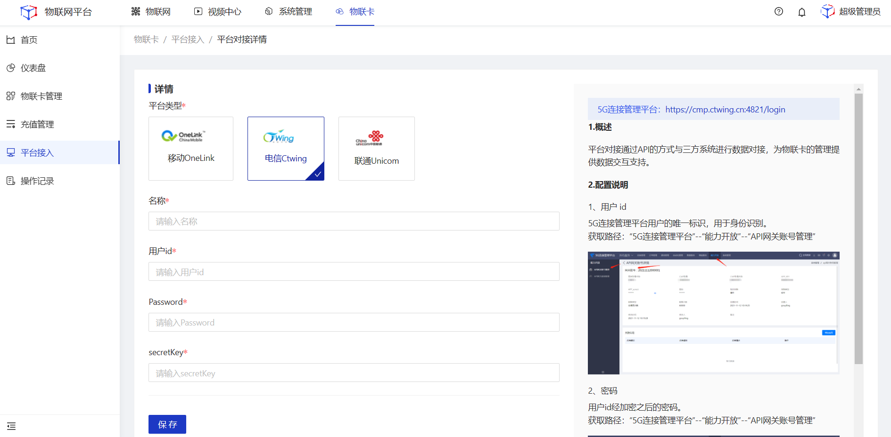

<table class='table'>
        <thead>
            <tr>
              <td>参数</td>
              <td>说明</td>
            </tr>
        </thead>
        <tbody>
           <tr>
            <td>平台类型</td>
            <td>选择需要对接的平台，将基于不同的类型展示关联的配置参数。</td>
          </tr>
          <tr>
            <td>名称</td>
            <td>为平台对接命名，最多可输入64个字符。</td>
          </tr>
          <tr>
            <td>用户id</td>
            <td>5G连接管理平台用户的唯一标识，用于身份识别，获取路径：“5G连接管理平台”--“能力开放”--“API网关账号管理”。</td>
          </tr>
          <tr>
            <td>Password</td>
            <td>用户id对应的密码，获取路径：“5G连接管理平台”--“能力开放”--“API网关账号管理”。</td>
          </tr>
          <tr>
            <td>secretKey</td>
            <td>APP secret唯一秘钥，获取路径：“5G连接管理平台”--“能力开放”--“API网关账号管理”。</td>
          </tr>
           <tr>
            <td>说明</td>
            <td>平台接入备注说明，非必填。</td>
          </tr>
        </tbody>
      </table>

#### 联通Unicom新增
##### 操作步骤
1.**登录**Jetlinks物联网平台。 
2.点击顶部**物联卡**，在左侧导航栏，选择**平台接入**，进入列表页。 

3.点击**新增**按钮，进入详情页，平台类型选择**电信CTWing**，填写平台接入配置信息，然后点击**保存**。 
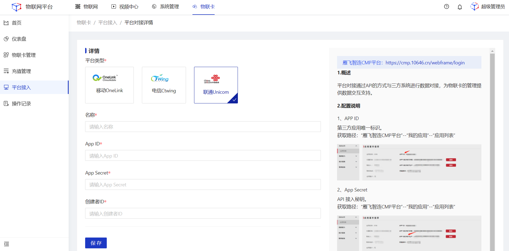

<table class='table'>
        <thead>
            <tr>
              <td>参数</td>
              <td>说明</td>
            </tr>
        </thead>
        <tbody>
           <tr>
            <td>平台类型</td>
            <td>选择需要对接的平台，将基于不同的类型展示关联的配置参数。</td>
          </tr>
          <tr>
            <td>名称</td>
            <td>为平台对接命名，最多可输入64个字符。</td>
          </tr>
          <tr>
            <td>APP ID</td>
            <td>第三方应用唯一标识，获取路径：“雁飞智连CMP平台”--“我的应用”--“应用列表”。</td>
          </tr>
          <tr>
            <td>App Secret</td>
            <td>API 接入秘钥，获取路径：“雁飞智连CMP平台”--“我的应用”--“应用列表”。</td>
          </tr>
          <tr>
            <td>创建者ID</td>
            <td>接口参数中的 OpenId，获取路径：“雁飞智连CMP平台”--“我的应用”--“应用列表”。</td>
          </tr>
           <tr>
            <td>说明</td>
            <td>平台接入备注说明，非必填。</td>
          </tr>
        </tbody>
      </table>

#### 编辑
##### 操作步骤
1.**登录**Jetlinks物联网平台。 
2.点击顶部**物联卡**，在左侧导航栏，选择**平台接入**，进入列表页。 

3.点击具体平台配置的**编辑**按钮，进入详情页，编辑平台接入配置信息，然后点击**保存**。 
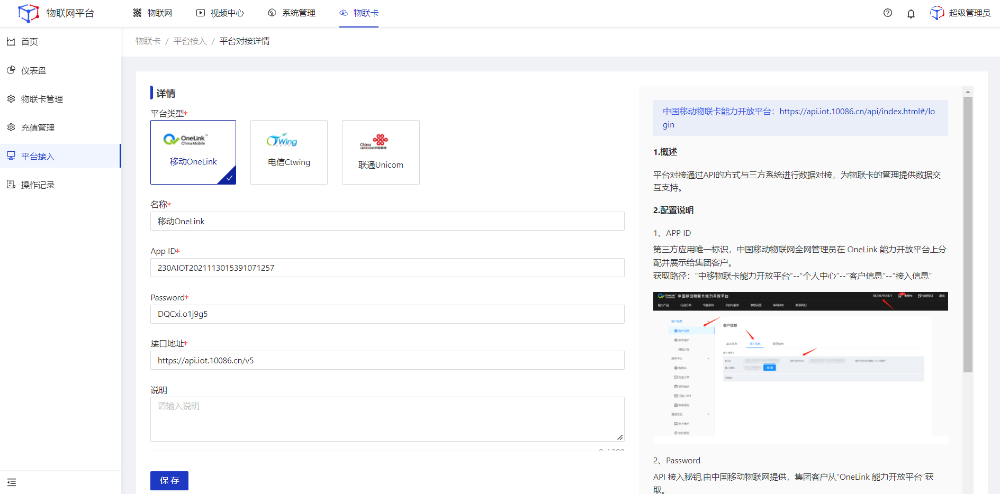

#### 启用禁用
##### 操作步骤
1.**登录**Jetlinks物联网平台。 
2.点击顶部**物联卡**，在左侧导航栏，选择**平台接入**，进入列表页。 

3.点击具体平台配置的**启用/禁用**按钮，弹出弹框，然后点击**确定**。 
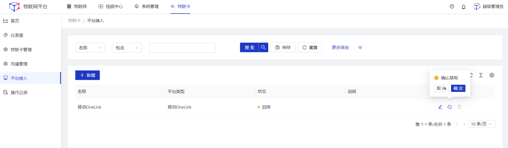

#### 删除
##### 操作步骤
1.**登录**Jetlinks物联网平台。 
2.点击顶部**物联卡**，在左侧导航栏，选择**平台接入**，进入列表页。 

3.点击具体平台配置的**删除**按钮，弹出弹框，然后点击**确定**。 
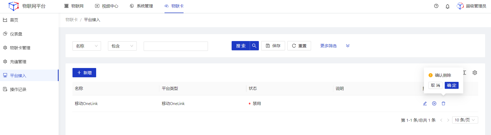

  

    
    说明
  

  正常状态下，不可删除。不能删除已配置物联卡的平台接入配置。

## 操作记录

对物联卡的激活、停用、复机进行详细记录。

#### 查看
##### 操作步骤
1.**登录**Jetlinks物联网平台。 
2.点击顶部**物联卡**，在左侧导航栏，选择**操作记录**，进入列表页。 
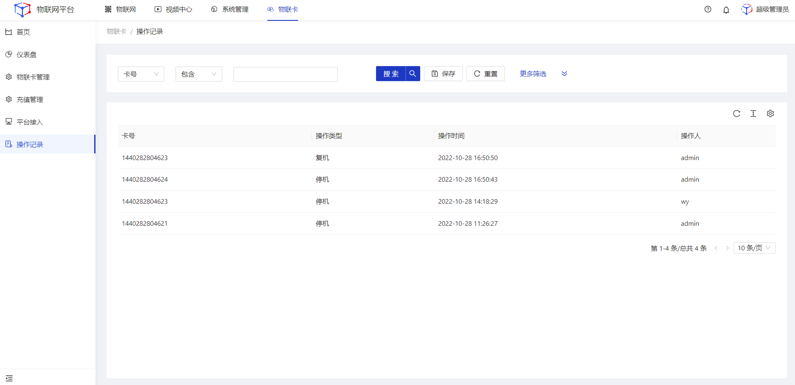
