## 设备接入网关
设备接入网关聚合了设备接入Jetlinks物联网平台的所需的相关配置信息，支持自定义接入、视频类设备接入、云平台接入、通道类设备接入等方式。

#### 新增
##### 操作步骤
1.**登录**Jetlinks物联网平台。 
2.在左侧导航栏，选择**运维管理>设备接入网关**，进入设备接入网关列表页。 
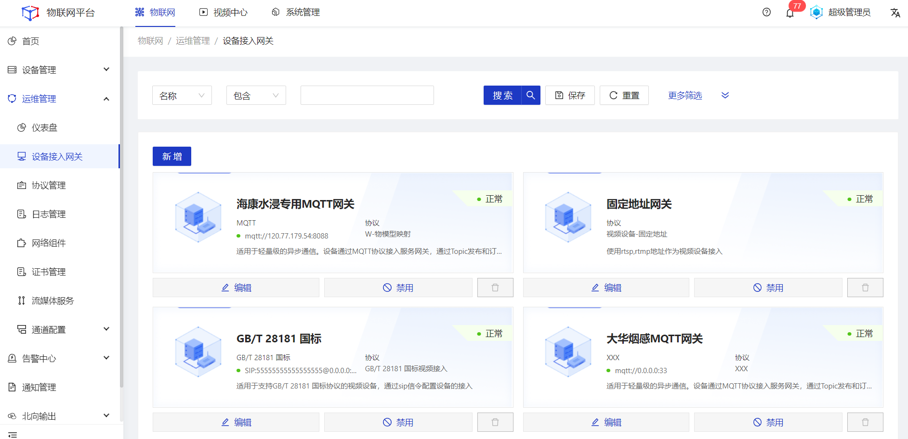
3.点击**新增**按钮，进入网关类型选择页面，点击所需配置累的的卡片，进入详情页。 
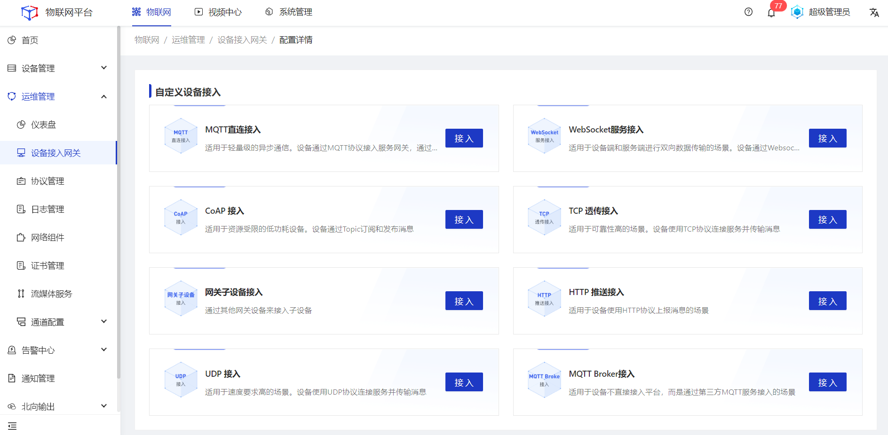
网关类型包括**自定义设备接入**、**视频类设备接入**、**云平台接入**、**通道类设备接入**4大类。不同的类型，具体配置项不同。 
4.按步骤填写所需的网关参数，填写完成后，点击**保存**。 
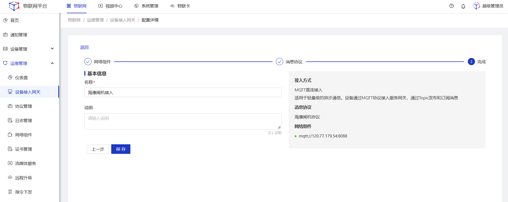

#### 编辑
##### 操作步骤
1.**登录**Jetlinks物联网平台。 
2.在左侧导航栏，选择**运维管理>设备接入网关**，进入设备接入网关列表页。 
3.点击具体网关的**编辑**按钮，进入详情页步骤条第一步。 
4.编辑所需要修改的配置参数，然后点击**保存**。 

  

    
    说明
  

  <li>已选定的网关类型不可编辑。</li>
  <li>设备接入网关被产品引用后，不可修改协议。</li>

#### 启用/禁用
##### 操作步骤
1.**登录**Jetlinks物联网平台。 
2.在左侧导航栏，选择**运维管理>设备接入网关**，进入设备接入网关列表页。 
3.点击具体网关的**启用/禁用**按钮，然后点击**确定**。 
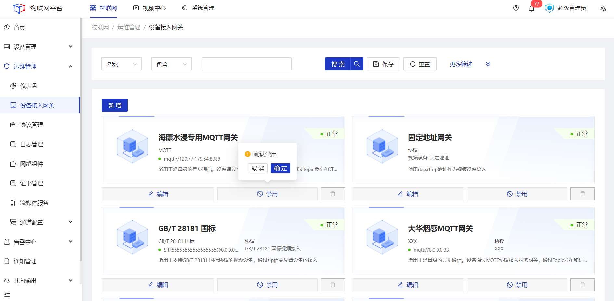

#### 删除
##### 操作步骤
1.**登录**Jetlinks物联网平台。 
2.在左侧导航栏，选择**运维管理>设备接入网关**，进入设备接入网关列表页。 
3.点击具体网关的**删除**按钮，然后点击**确定**。 

## 协议管理

协议是设备与平台通信的一种标准，设备与Jetlinks物联网平台进行通信就必须按照协议标准进行规定上报的数据格式。协议管理可对系统内的协议包进行统一的维护管理。

#### 新增
##### 操作步骤
1.**登录**Jetlinks物联网平台。 
2.在左侧导航栏，选择**运维管理>协议管理**，进入协议管理列表页。 
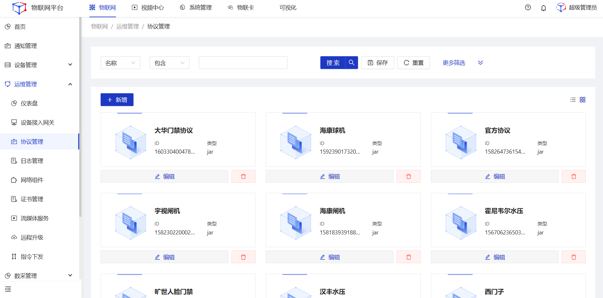
3.点击新增按钮，在弹框页中填写配置信息，然后点击**确定**。 
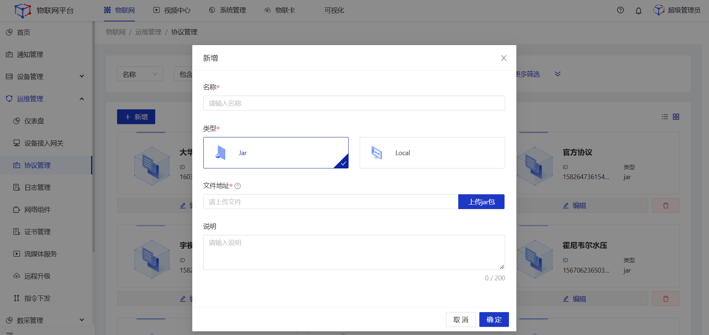

  

    
    说明
  

  <li>jar:上传协议jar包,文件格式支持.jar或.zip。</li>
  <li>local:填写本地协议编译目录绝对地址,如:d:/protocol/target/classes</li>

#### 编辑
##### 操作步骤
1.**登录**Jetlinks物联网平台。 
2.在左侧导航栏，选择**运维管理>协议管理**，进入协议管理列表页。 
3.点击具体协议的**编辑**按钮，在弹框页面中修改配置信息，然后点击**确定**。
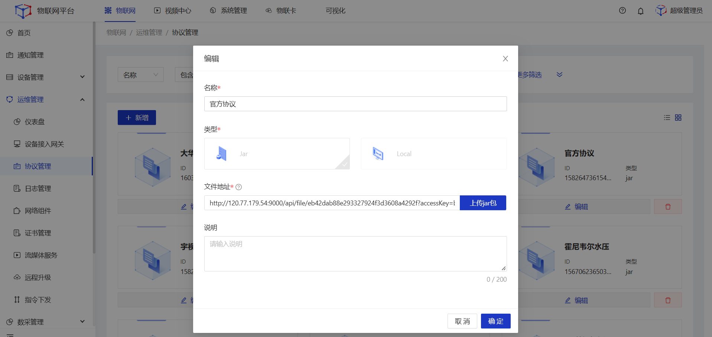

  

    
    说明
  

  协议类型不可编辑。

#### 启用/禁用
##### 操作步骤
1.**登录**Jetlinks物联网平台。 
2.在左侧导航栏，选择**运维管理>协议管理**，进入协议管理列表页。 
3.点击具体协议的**启用/禁用**按钮，然后点击**确定**。 
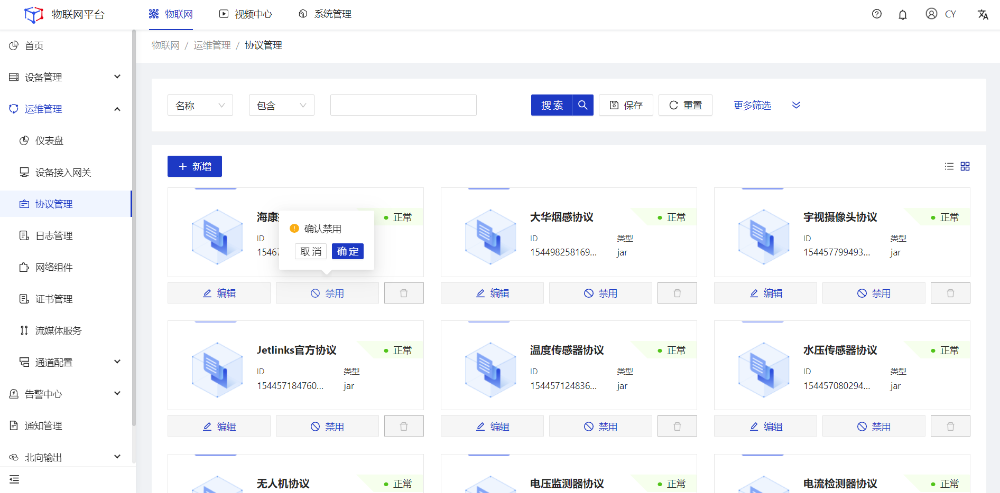

  

    
    说明
  

协议包被网关使用后，不支持禁用。

#### 删除
##### 操作步骤
1.**登录**Jetlinks物联网平台。 
2.在左侧导航栏，选择**运维管理>协议管理**，进入协议管理列表页。 
3.点击具体协议的**删除**按钮，然后点击**确定**。 

  

    
    说明
  

 正常状态下的协议不支持删除。

## 日志管理
访问日志与系统日志记录。
#### 查看
##### 操作步骤
1.**登录**Jetlinks物联网平台。 
2.在左侧导航栏，选择**运维管理>日志管理**，进入列表页。 
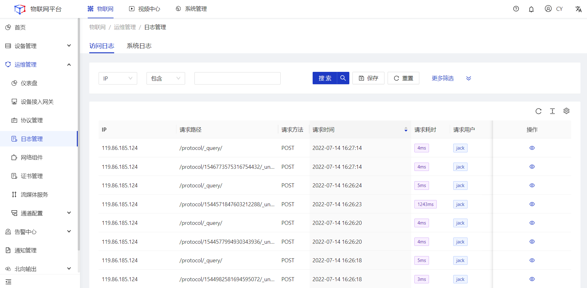
3.点击具体日志的**查看**按钮，查看**日志详情**。 
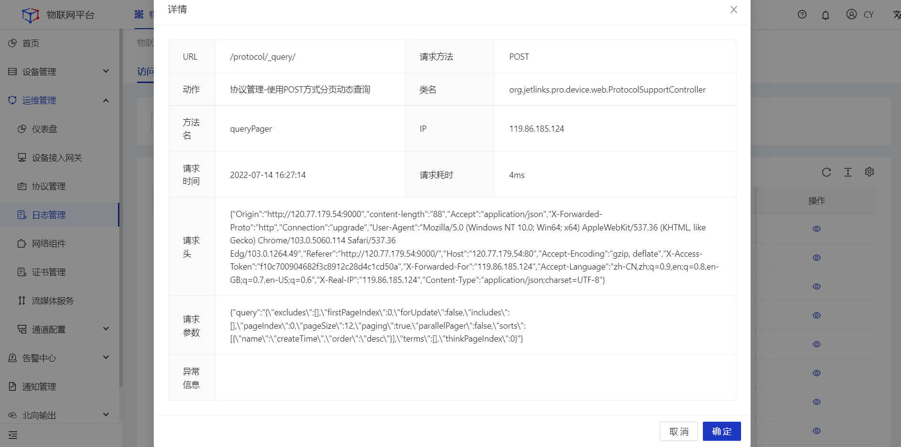
4.（可选操作）点击页面顶部**系统日志tab**，查看系统日志信息。 
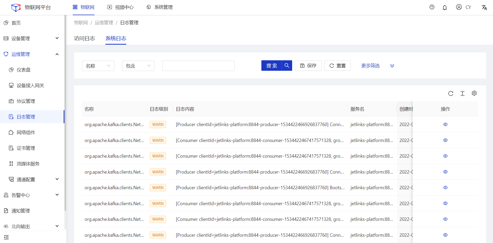

## 网络组件
管理设备与平台通信的网络组件，Jetlinks物联网平台支持UDP、TCP服务、WebSocket服务、MQTT客户端、HTTP服务、MQTT服务、CoAP服务等类型。

#### 新增
##### 操作步骤
1.**登录**Jetlinks物联网平台。 
2.在左侧导航栏，选择**运维管理>网络组件**，进入列表页。 
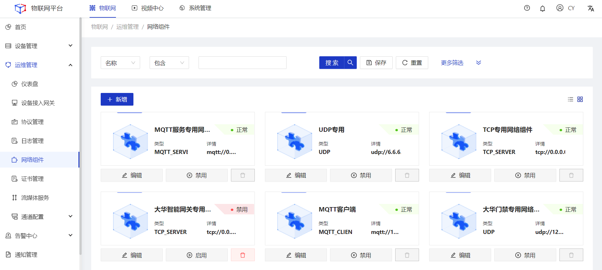
3.点击页面左上角**新增**按钮，进入详情页。 
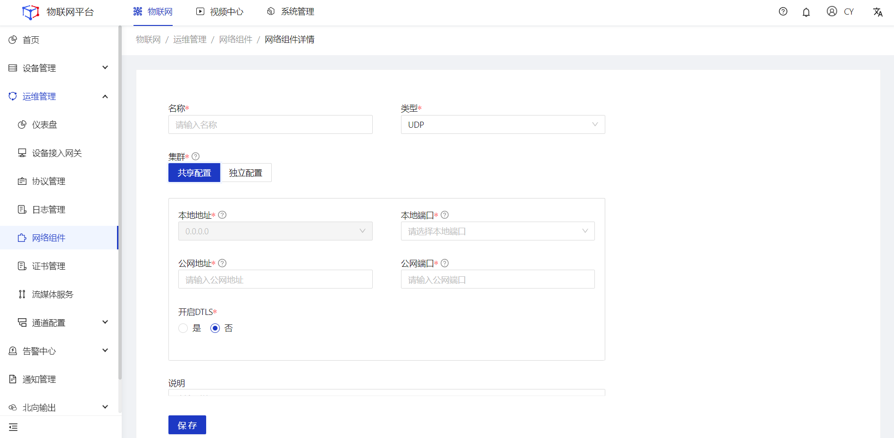

  

    
    说明
  

 <li>共享配置:集群下所有节点共用同一配置。 共享配置时本地地址默认为0.0.0.0</li>
 <li>独立配置:集群下不同节点使用不同配置。</li>

4.根据不同的网络组件类型配置对应的参数，然后点击**保存**。 

UDP参数说明
<table class='table'>
        <thead>
            <tr>
              <td>参数</td>
              <td>说明</td>
            </tr>
        </thead>
        <tbody>
          <tr>
            <td>名称</td>
            <td>为网络组件命名，最多可输入64个字符。</td>
          </tr>
          <tr>
            <td>类型</td>
            <td>单选下拉框，可根据业务需要进行选择。</td>
          </tr>
          <tr>
            <td>集群</td>
            <td>选择是否所有服务器共享一个网络配置或者每个服务器单独配置。</td>
          </tr>
          <tr>
            <td>本地地址</td>
            <td>绑定到服务器上的网卡地址,绑定到所有网卡:0.0.0.0</td>
          </tr>
           <tr>
            <td>本地端口</td>
            <td>监听指定端口的请求</td>
          </tr>
           <tr>
            <td>公网地址</td>
            <td>对外提供访问的地址,内网环境是填写服务器的内网IP地址。</td>
          </tr>
          <tr>
            <td>公网端口</td>
            <td>对外提供访问的端口。</td>
          </tr>
           <tr>
            <td>DTLS</td>
            <td>是否开启DTLS，用于数据加密配置。</td>
          </tr>
            <tr>
            <td>证书</td>
            <td>数据加密证书配置。</td>
          </tr>
           <tr>
            <td>私钥别名</td>
            <td>证书的私钥别名。</td>
          </tr>
        </tbody>
</table>

TCP服务参数说明
<table class='table'>
        <thead>
            <tr>
              <td>参数</td>
              <td>说明</td>
            </tr>
        </thead>
        <tbody>
          <tr>
            <td>名称</td>
            <td>为网络组件命名，最多可输入64个字符。</td>
          </tr>
          <tr>
            <td>类型</td>
            <td>单选下拉框，可根据业务需要进行选择。</td>
          </tr>
          <tr>
            <td>集群</td>
            <td>选择是否所有服务器共享一个网络配置或者每个服务器单独配置。</td>
          </tr>
          <tr>
            <td>本地地址</td>
            <td>绑定到服务器上的网卡地址,绑定到所有网卡:0.0.0.0</td>
          </tr>
           <tr>
            <td>本地端口</td>
            <td>监听指定端口的请求</td>
          </tr>
           <tr>
            <td>公网地址</td>
            <td>对外提供访问的地址,内网环境是填写服务器的内网IP地址。</td>
          </tr>
          <tr>
            <td>公网端口</td>
            <td>对外提供访问的端口。</td>
          </tr>
           <tr>
            <td>DTLS</td>
            <td>是否开启DTLS，用于数据加密配置。</td>
          </tr>
            <tr>
            <td>证书</td>
            <td>数据加密证书配置。</td>
          </tr>
           <tr>
            <td>私钥别名</td>
            <td>证书的私钥别名。</td>
          </tr>
            <tr>
            <td>粘拆包规则</td>
            <td>单选下拉框，用于配置粘拆包方式。</td>
          </tr>
        </tbody>
</table>

WebSocket/HTTP服务参数说明
<table class='table'>
        <thead>
            <tr>
              <td>参数</td>
              <td>说明</td>
            </tr>
        </thead>
        <tbody>
          <tr>
            <td>名称</td>
            <td>为网络组件命名，最多可输入64个字符。</td>
          </tr>
          <tr>
            <td>类型</td>
            <td>单选下拉框，可根据业务需要进行选择。</td>
          </tr>
          <tr>
            <td>集群</td>
            <td>选择是否所有服务器共享一个网络配置或者每个服务器单独配置。</td>
          </tr>
          <tr>
            <td>本地地址</td>
            <td>绑定到服务器上的网卡地址,绑定到所有网卡:0.0.0.0</td>
          </tr>
           <tr>
            <td>本地端口</td>
            <td>监听指定端口的请求</td>
          </tr>
           <tr>
            <td>公网地址</td>
            <td>对外提供访问的地址,内网环境是填写服务器的内网IP地址。</td>
          </tr>
          <tr>
            <td>公网端口</td>
            <td>对外提供访问的端口。</td>
          </tr>
           <tr>
            <td>TLS</td>
            <td>是否开启TLS，用于数据加密配置。</td>
          </tr>
            <tr>
            <td>证书</td>
            <td>数据加密证书配置。</td>
          </tr>
           <tr>
            <td>私钥别名</td>
            <td>证书的私钥别名。</td>
          </tr>
        </tbody>
</table>

MQTT客户端参数说明
<table class='table'>
        <thead>
            <tr>
              <td>参数</td>
              <td>说明</td>
            </tr>
        </thead>
        <tbody>
          <tr>
            <td>名称</td>
            <td>为网络组件命名，最多可输入64个字符。</td>
          </tr>
          <tr>
            <td>类型</td>
            <td>单选下拉框，可根据业务需要进行选择。</td>
          </tr>
          <tr>
            <td>集群</td>
            <td>选择是否所有服务器共享一个网络配置或者每个服务器单独配置。</td>
          </tr>
          <tr>
            <td>远程地址</td>
            <td>连接远程连接地址</td>
          </tr>
           <tr>
            <td>远程端口</td>
            <td>连接远程端口的请求</td>
          </tr>
           <tr>
            <td>clientId</td>
            <td>客户端唯一标识。</td>
          </tr>
          <tr>
            <td>用户名</td>
            <td>客户端用户名。</td>
          </tr>
           <tr>
            <td>密码</td>
            <td>客户端密码。</td>
          </tr>
            <tr>
            <td>最大消息长度</td>
            <td>单次收发消息的最大长度,单位:字节;设置过大可能会影响性能。</td>
          </tr>
           <tr>
            <td>订阅前缀</td>
            <td>当连接的服务为EMQ时,可能需要使用共享的订阅前缀,如:$queue或$share</td>
           <tr>
            <td>DTLS</td>
            <td>是否开启DTLS，用于数据加密配置。</td>
          </tr>
            <tr>
            <td>证书</td>
            <td>数据加密证书配置。</td>
          </tr>
           <tr>
            <td>私钥别名</td>
            <td>证书的私钥别名。</td>
          </tr>
          </tbody>
</table>

MQTT服务参数说明
<table class='table'>
        <thead>
            <tr>
              <td>参数</td>
              <td>说明</td>
            </tr>
        </thead>
        <tbody>
          <tr>
            <td>名称</td>
            <td>为网络组件命名，最多可输入64个字符。</td>
          </tr>
          <tr>
            <td>类型</td>
            <td>单选下拉框，可根据业务需要进行选择。</td>
          </tr>
          <tr>
            <td>集群</td>
            <td>选择是否所有服务器共享一个网络配置或者每个服务器单独配置。</td>
          </tr>
          <tr>
            <td>本地地址</td>
            <td>绑定到服务器上的网卡地址,绑定到所有网卡:0.0.0.0</td>
          </tr>
           <tr>
            <td>本地端口</td>
            <td>监听指定端口的请求</td>
          </tr>
           <tr>
            <td>公网地址</td>
            <td>对外提供访问的地址,内网环境是填写服务器的内网IP地址。</td>
          </tr>
          <tr>
            <td>公网端口</td>
            <td>对外提供访问的端口。</td>
          </tr>
           <tr>
            <td>DTLS</td>
            <td>是否开启DTLS，用于数据加密配置。</td>
          </tr>
            <tr>
            <td>证书</td>
            <td>数据加密证书配置。</td>
          </tr>
           <tr>
            <td>私钥别名</td>
            <td>证书的私钥别名。</td>
          </tr>
           <tr>
            <td>最大消息长度</td>
            <td>单次收发消息的最大长度,单位:字节;设置过大可能会影响性能。</td>
          </tr>
          </tbody>
</table>

CoAP服务参数说明
<table class='table'>
        <thead>
            <tr>
              <td>参数</td>
              <td>说明</td>
            </tr>
        </thead>
        <tbody>
          <tr>
            <td>名称</td>
            <td>为网络组件命名，最多可输入64个字符。</td>
          </tr>
          <tr>
            <td>类型</td>
            <td>单选下拉框，可根据业务需要进行选择。</td>
          </tr>
          <tr>
            <td>集群</td>
            <td>选择是否所有服务器共享一个网络配置或者每个服务器单独配置。</td>
          </tr>
          <tr>
            <td>本地地址</td>
            <td>绑定到服务器上的网卡地址,绑定到所有网卡:0.0.0.0</td>
          </tr>
           <tr>
            <td>本地端口</td>
            <td>监听指定端口的请求</td>
          </tr>
           <tr>
            <td>公网地址</td>
            <td>对外提供访问的地址,内网环境是填写服务器的内网IP地址。</td>
          </tr>
          <tr>
            <td>公网端口</td>
            <td>对外提供访问的端口。</td>
          </tr>
           <tr>
            <td>DTLS</td>
            <td>是否开启DTLS，用于数据加密配置。</td>
          </tr>
            <tr>
            <td>证书</td>
            <td>数据加密证书配置。</td>
          </tr>
           <tr>
            <td>私钥别名</td>
            <td>证书的私钥别名。</td>
          </tr>
          </tbody>
</table>

#### 编辑
##### 操作步骤
1.**登录**Jetlinks物联网平台。 
2.在左侧导航栏，选择**运维管理>网络组件**，进入列表页。 

3.点击具体网络组件的**编辑**按钮，进入详情页。 
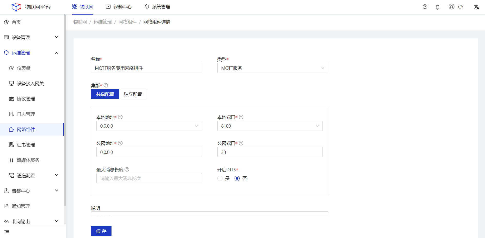
4.编辑所需要修改的网络组件配置参数，然后点击**保存**。 

#### 启用/禁用
##### 操作步骤
1.**登录**Jetlinks物联网平台。 
2.在左侧导航栏，选择**运维管理>网络组件**，进入列表页。 
3.点击具体网络组件的**启用/禁用**按钮，然后点击**确定**。 

#### 删除
##### 操作步骤
1.**登录**Jetlinks物联网平台。 
2.在左侧导航栏，选择**运维管理>网络组件**，进入列表页。 
3.点击具体网络组件的**删除**按钮，然后点击**确定**。 
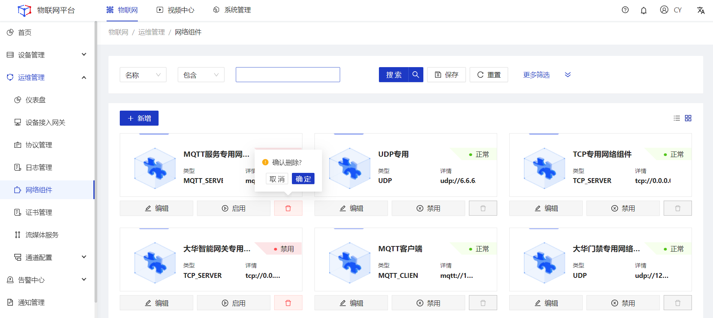

## 证书管理
证书管理用于管理各个网络组件所需的证书,可对设备与平台间的通信数据进行加密处理。
#### 新增
##### 操作步骤
1.**登录**Jetlinks物联网平台。 
2.在左侧导航栏，选择**运维管理>证书管理**，进入列表页。 
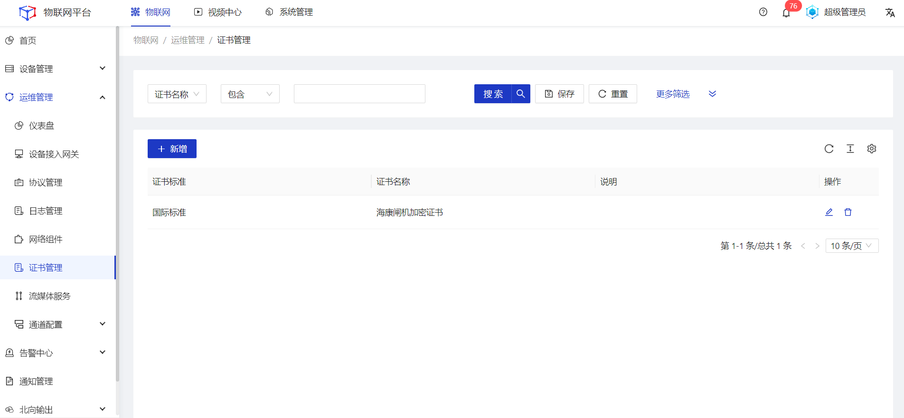
3.点击新增按钮，进入证书详情页。填写完证书信息后，点击**保存**。 
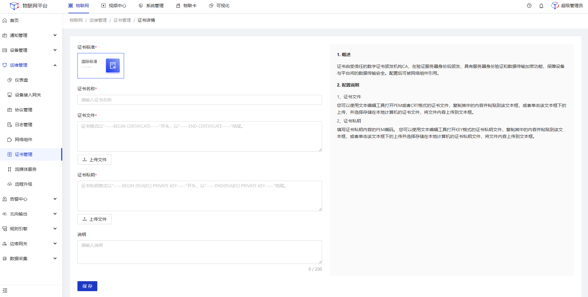

#### 编辑
##### 操作步骤
1.**登录**Jetlinks物联网平台。 
2.在左侧导航栏，选择**运维管理>证书管理**，进入列表页。 
3.点击具体证书的**编辑**按钮，进入到证书详情页。 
4.编辑所需要修改的配置参数，然后点击**保存**。 
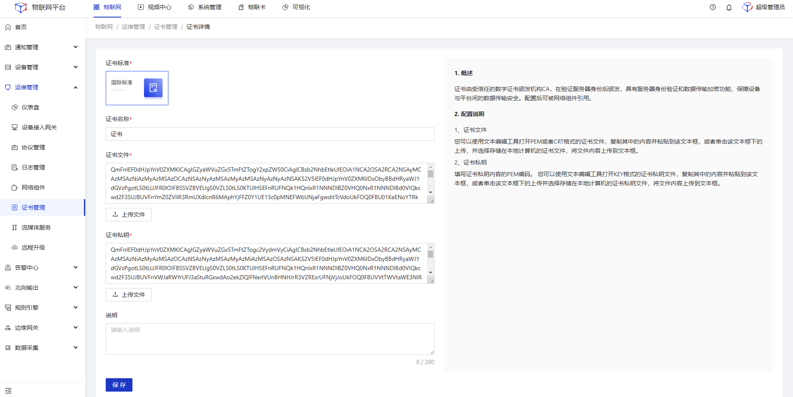

#### 删除
##### 操作步骤
1.**登录**Jetlinks物联网平台。 
2.在左侧导航栏，选择**运维管理>证书管理**，进入列表页。 
3.点击具体证书的**删除**按钮，然后点击**确定**。 
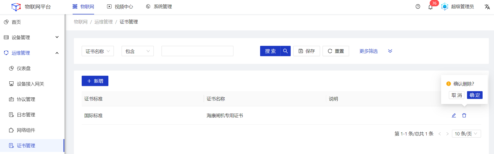

  

    
    说明
  

  证书被网络组件使用时，不支持删除。

## 流媒体服务
管理系统内用于视频流播放的流媒体服务配置。

#### 新增
##### 操作步骤
1.**登录**Jetlinks物联网平台。 
2.在左侧导航栏，选择**运维管理>流媒体服务**，进入列表页。 

3.点击**新增**按钮，进入流媒体详情页。 
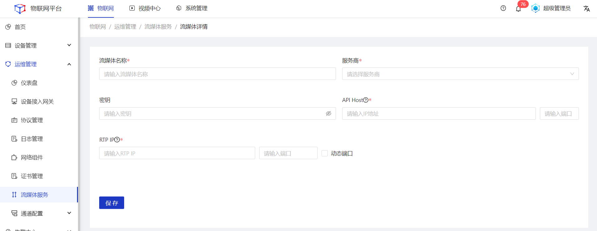
4.填写流媒体服务配置信息，然后点击**保存**。 

流媒体服务配置参数说明：
<table class='table'>
        <thead>
            <tr>
              <td>参数</td>
              <td>说明</td>
            </tr>
        </thead>
        <tbody>
          <tr>
            <td>流媒体名称</td>
            <td>为流媒体服务命名，最多可输入64个字符。</td>
          </tr>
          <tr>
            <td>服务商</td>
            <td>配置流媒体服务商。</td>
          </tr>
          <tr>
            <td>秘钥</td>
            <td>调用流媒体API服务的秘钥。</td>
          </tr>
          <tr>
            <td>API Host</td>
            <td>调用流媒体接口时请求的服务地址。</td>
          </tr>
           <tr>
            <td>RTP IP</td>
            <td>视频设备将流推送到该IP地址下，部分设备仅支持IP地址，建议全是用IP地址。</td>
          </tr>
          </tbody>
</table>

  

    
    说明
  

  若系统中存在多个流媒体服务，播放视频时会进行随机调用。

#### 编辑
##### 操作步骤
1.**登录**Jetlinks物联网平台。 
2.在左侧导航栏，选择**运维管理>流媒体服务**，进入列表页。 
3.点击具体流媒体服务的**编辑**按钮，进入流媒体详情页。 
4.编辑所需要修改的配置参数，然后点击**保存**。 
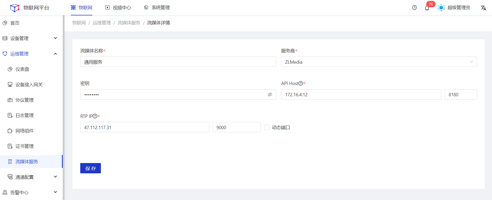

#### 删除
##### 操作步骤
1.**登录**Jetlinks物联网平台。 
2.在左侧导航栏，选择**运维管理>流媒体服务**，进入列表页。 
3.点击具体流媒体服务的**删除**按钮，然后点击**确定**。 
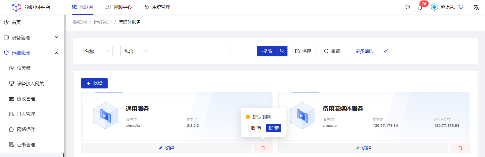

## Modbus通道配置
管理Modbus通道以及通道下的点位数据。
#### 新增
##### 操作步骤
1.**登录**Jetlinks物联网平台。 
2.在左侧导航栏，选择**运维管理>通道配置>Modbus**，进入列表页。 
3.点击页面左侧**新增**按钮，在弹框页中填写通道相关信息，然后点击**确定**。
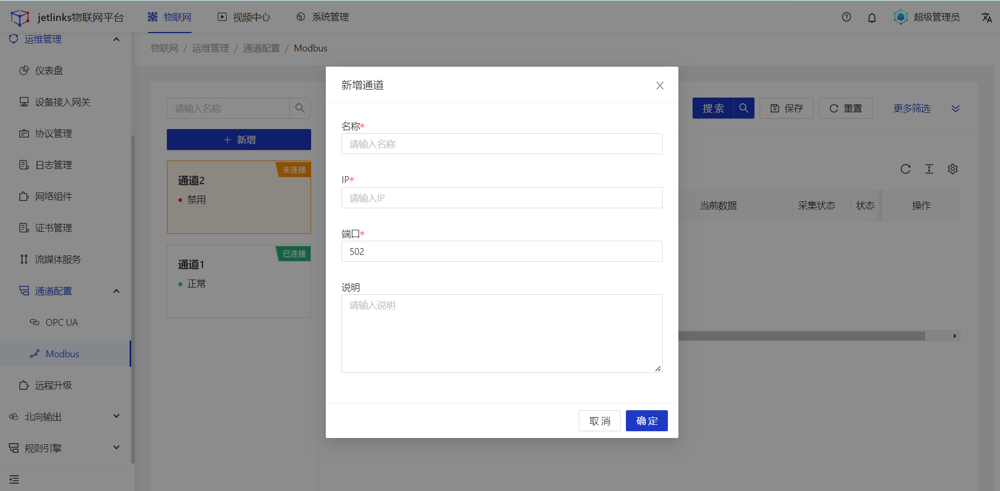

#### 编辑
##### 操作步骤
1.**登录**Jetlinks物联网平台。 
2.在左侧导航栏，选择**运维管理>通道配置>Modbus**，进入列表页。 
3.鼠标移入通道卡片，点击卡片中的**编辑**按钮，在弹框页中编辑通道相关信息，然后点击**确定**。 
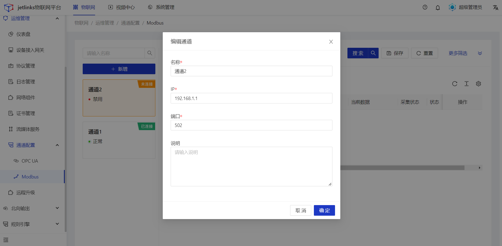

#### 启用禁用
##### 操作步骤
1.**登录**Jetlinks物联网平台。 
2.在左侧导航栏，选择**运维管理>通道配置>Modbus**，进入列表页。 
3.鼠标移入通道卡片，点击卡片中的**启用禁用**按钮，然后点击**确定**。 
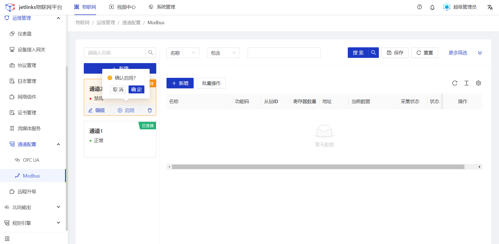

#### 删除
##### 操作步骤
1.**登录**Jetlinks物联网平台。 
2.在左侧导航栏，选择**运维管理>通道配置>Modbus**，进入列表页。 
3.鼠标移入通道卡片，点击卡片中的**删除**按钮，然后点击**确定**。 
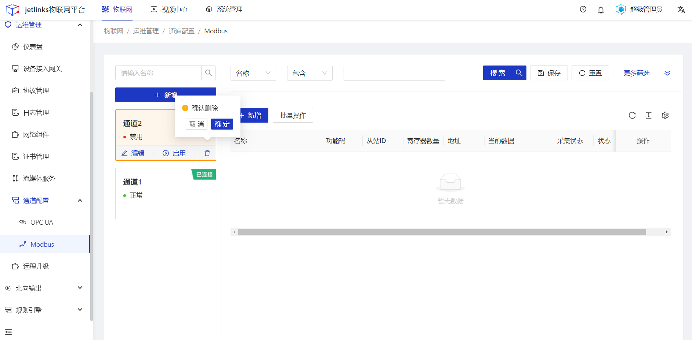

  

    
    说明
  

删除通道后，与该通道绑定的设备属性将自动解绑。

#### 新增数据点
##### 操作步骤
1.**登录**Jetlinks物联网平台。 
2.在左侧导航栏，选择**运维管理>通道配置>Modbus**，进入列表页。 
3.点击页面右侧的**新增**按钮，在弹框页中填写点位相关信息，然后点击**确定**。
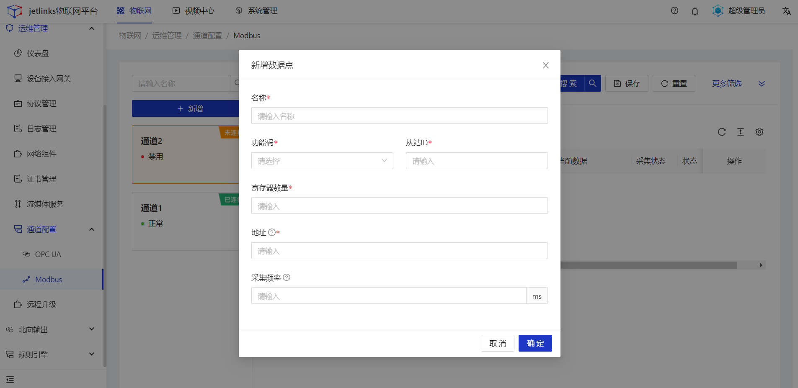

#### 编辑数据点
##### 操作步骤
1.**登录**Jetlinks物联网平台。 
2.在左侧导航栏，选择**运维管理>通道配置>Modbus**，进入列表页。 
3.点击页面右侧具体点位数据的**编辑**按钮，在弹框页中编辑点位相关信息，然后点击**确定**。
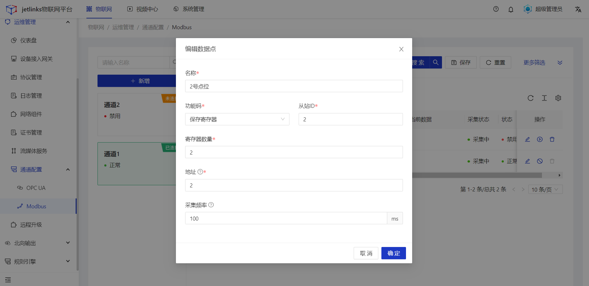

#### 数据点启用禁用
##### 操作步骤
1.**登录**Jetlinks物联网平台。 
2.在左侧导航栏，选择**运维管理>通道配置>Modbus**，进入列表页。 
3.点击页面右侧具体点位数据的**启用禁用**按钮，然后点击**确定**。
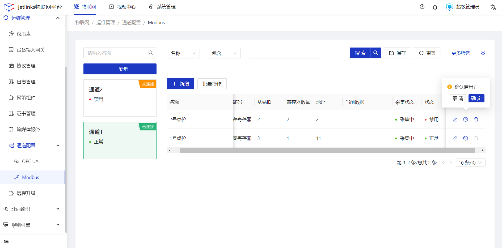

#### 数据点删除
##### 操作步骤
1.**登录**Jetlinks物联网平台。 
2.在左侧导航栏，选择**运维管理>通道配置>Modbus**，进入列表页。 
3.点击页面右侧具体点位数据的**删除**按钮，然后点击**确定**。
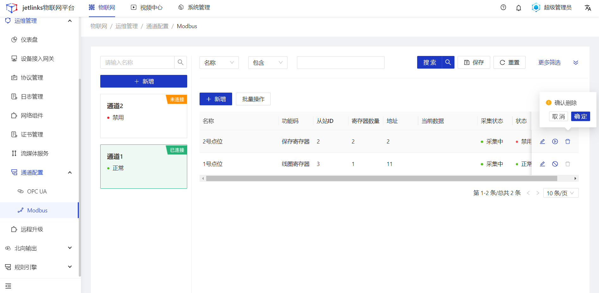

  

    
    说明
  

删除点位后，与该点位绑定的设备属性将自动解绑。

## 远程升级
远程升级及空中下载技术，通过Jetlinks物联网平台的远程升级功能，可对分布在各地的IoT设备进行远程升级。
#### 新增
##### 操作步骤
1.**登录**Jetlinks物联网平台。 
2.在左侧导航栏，选择**运维管理>远程升级**，进入列表页。 
3.点击**新增**按钮，在弹框页填写相关信息，然后点击**确定**。
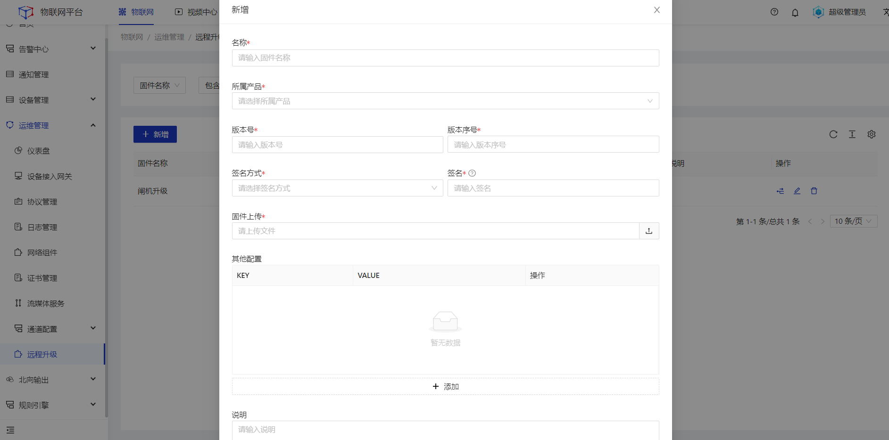
<table class='table'>
        <thead>
            <tr>
              <td>参数</td>
              <td>说明</td>
            </tr>
        </thead>
        <tbody>
          <tr>
            <td>名称</td>
            <td>为固件命名，最多可输入64个字符。</td>
          </tr>
          <tr>
            <td>所属产品</td>
            <td>选择支持固件升级的产品与固件进行关联。产品是否支持升级由关联的协议包决定。</td>
          </tr>
          <tr>
            <td>版本号</td>
            <td>拟定上传固件的版本号。 </td>
          </tr>
           <tr>
            <td>版本序号</td>
            <td>拟定固件版本序号。 设备拉取时可按序号从小往大升级，也可直接拉取最大序号的固件。</td>
          </tr>
          <tr>
            <td>签名方式</td>
            <td>固件加密方式</td>
          </tr>
           <tr>
            <td>签名</td>
            <td>输入本地文件进行签名加密后的值，以验证上传后的文件是否与本地一致。</td>
          </tr>
           <tr>
            <td>固件上传</td>
            <td>上传固件文件</td>
          </tr>
           <tr>
            <td>其他配置</td>
            <td>自定义远程升级所需的其他参数配置。</td>
          </tr>
           <tr>
            <td>说明</td>
            <td>备注说明，最多可输入200个字符。</td>
          </tr>
        </tbody>
      </table>

#### 升级任务
##### 操作步骤
1.**登录**Jetlinks物联网平台。 
2.在左侧导航栏，选择**运维管理>远程升级**，进入列表页。 
3.点击具体数据的**升级任务**按钮，进入列表页。 
4.点击**新增**按钮，在弹框页填写任务信息，然后点击确定。 
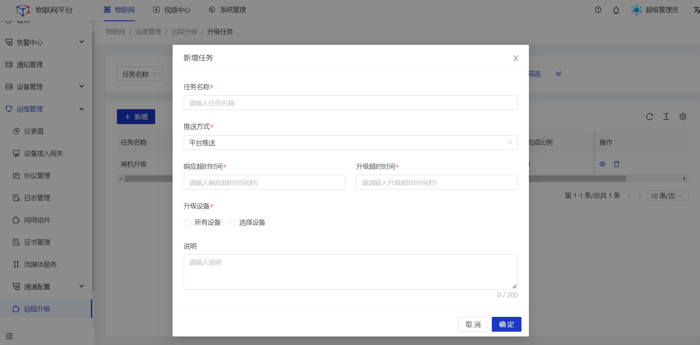

##### 后续操作
1.点击**查看**按钮，查看升级进度。 
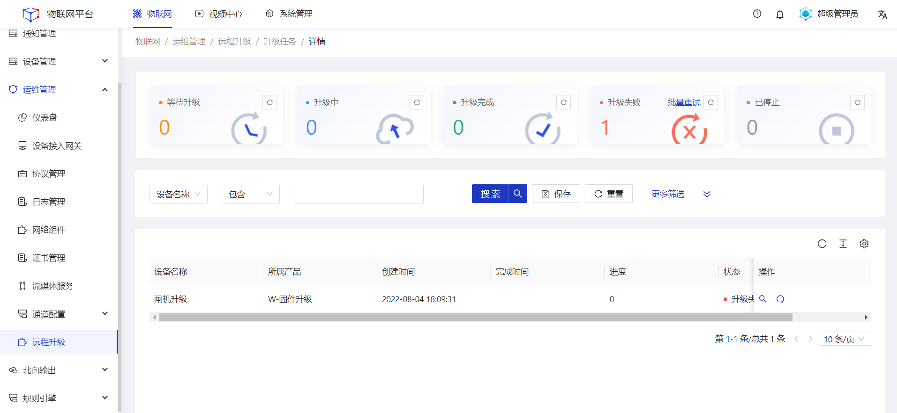
2.点击**批量重试**按钮，对升级失败的升级进行再次下方升级指令。

  

    
    说明
  

只有升级方式为平台推送类型时才支持此功能

3.点击**停止**按钮，不再对等待升级的设备下发升级指令，或点击**继续升级**按钮，对已停止状态的设备继续下发升级指令。

  

    
    说明
  

存在等待升级状态的设备时显示停止按钮，存在已停止状态的设备时显示继续升级按钮。

#### 编辑
1.**登录**Jetlinks物联网平台。 
2.在左侧导航栏，选择**运维管理>远程升级**，进入列表页。 
3.点击具体数据的**编辑**按钮，在弹框页中编辑相关信息，然后点击**确定**。 
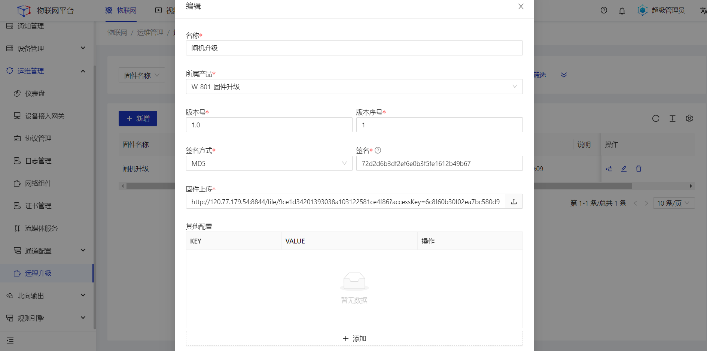

#### 删除
1.**登录**Jetlinks物联网平台。 
2.在左侧导航栏，选择**运维管理>远程升级**，进入列表页。 
3.点击具体数据的**删除**按钮，然后点击**确定**。 
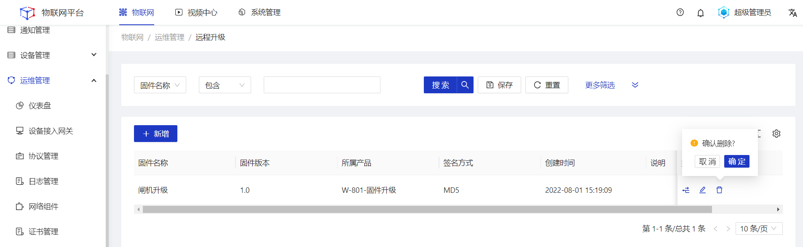

  

    
    说明
  

固件下存在升级任务数据时，不可删除。

