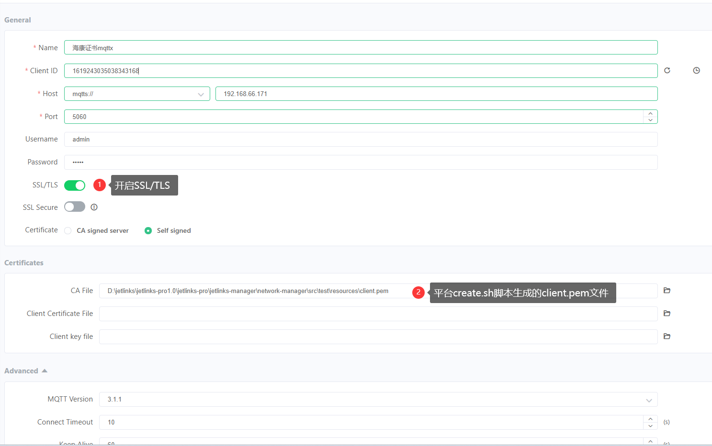

# 证书管理
<div class='explanation primary'>
  <p class='explanation-title-warp'>
    <span class='iconfont icon-bangzhu explanation-icon'></span>
    <span class='explanation-title font-weight'>说明</span>
  </p>

证书管理用于管理各个网络组件所需的证书,可对设备与平台间的通信数据进行加密处理。

</div>

## 指导介绍

  <p>1. <a href="/Mocha_ITOM/certificate_management.html#新增">新增</a></p>
  <p>2. <a href="/Mocha_ITOM/certificate_management.html#编辑">编辑</a></p>
  <p>3. <a href="/Mocha_ITOM/certificate_management.html#删除">删除</a></p>
  <p>4. <a href="/Mocha_ITOM/certificate_management.html#使用平台脚本生成证书">使用平台脚本生成证书</a></p>


## 新增
### 操作步骤
1.**登录**Jetlinks物联网平台。</br>
2.在左侧导航栏，选择**运维管理>证书管理**，进入列表页。</br>

3.点击新增按钮，进入证书详情页。填写完证书信息后，点击**保存**。</br>


## 编辑
### 操作步骤
1.**登录**Jetlinks物联网平台。</br>
2.在左侧导航栏，选择**运维管理>证书管理**，进入列表页。</br>
3.点击具体证书的**编辑**按钮，进入到证书详情页。</br>
4.编辑所需要修改的配置参数，然后点击**保存**。</br>


## 删除
##### 操作步骤
1.**登录**Jetlinks物联网平台。</br>
2.在左侧导航栏，选择**运维管理>证书管理**，进入列表页。</br>
3.点击具体证书的**删除**按钮，然后点击**确定**。</br>

<div class='explanation primary'>
  <p class='explanation-title-warp'>
    <span class='iconfont icon-bangzhu explanation-icon'></span>
    <span class='explanation-title font-weight'>说明</span>
  </p>
  证书被网络组件使用时，不支持删除。
</div>


## 使用平台脚本生成证书
### 生成证书
<div class='explanation primary'>
  <p class='explanation-title-warp'>
    <span class='iconfont icon-bangzhu explanation-icon'></span>
    <span class='explanation-title font-weight'>说明</span>
  </p>

<p>平台提供了<code>create.sh</code>脚本可以生成证书</p>
<p>使用平台脚本生成的加密文件进行连接测试。</p>
<p>平台生成脚本在目录 </p><code>D:\code\jetlinks\jetlinks-pro\jetlinks-manager\network-manager\src\test\resources
\create.sh</code>
<p>windows环境,在create.sh目录下执行以下命令</p>

</div>

```java
./create.sh
```
会生成以下文件
```resource
├─ resource
│  ├─ client.csr        #基于私钥创建客户端证书的签名请求文件
│  ├─ client.p12        #用于生成P12证书类型的客户端秘钥的文件
│  ├─ client.pem        # 导出的PEM类型客户端CA文件
│  ├─ ec_private.pem    #生成的ec算法私钥文件
│  ├─ ec_public.pem     #生成的ec算法公钥文件
│  ├─ keyStore.jks      #生成JKS证书类型的服务秘钥(server key)和证书文件
│  ├─ server.csr        #用于生成服务端私钥和证书的文件
│  ├─ server.p12        #用于生成P12证书类型的服务端秘钥的文件
│  ├─ server.pem        #PEM类型服务端私钥文件
│  ├─ trustStore.jks    #生成JKS证书类型的根秘钥(root key)和证书的文件
│  ├─ trustStore.p12    #用于生成P12证书类型秘钥的文件
│  └─ trustStore.pem    #信任库文件
```
### 使用PEM证书
 <p>1.将<code>create.sh</code>脚本生成的<code>ec_private.pem</code>文件重新复制一份出来,重命名为：<code>ec_private_copy.pem</code></p>
 <p>2.将<code>create.sh</code>脚本生成的<code>client.pem</code>文件中全部内容粘贴到<code>ec_private_copy.pem</code>文件后面</p>
 <p>3.在证书管理中以文件的形式上传<code>ec_private_copy.pem</code>作为证书文件和证书私钥</p>

<div class='explanation error'>
  <p class='explanation-title-warp'>
    <span class='iconfont icon-jinggao explanation-icon'></span>
    <span class='explanation-title font-weight'>危险</span>
  </p>
  <p>平台证书管理只允许上传证书文件，不允许复制内容粘贴在输入框内，粘贴的方式会报错</p>

</div>

### MQTTX连接配置



