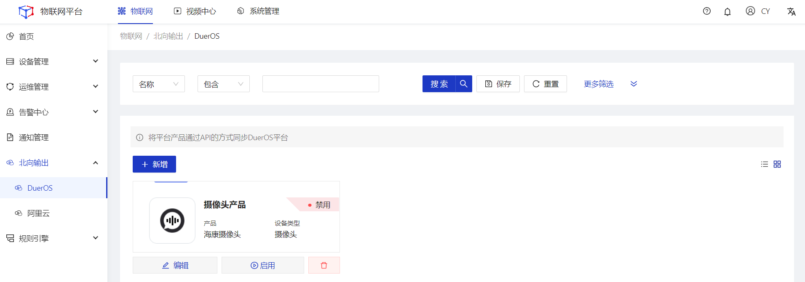
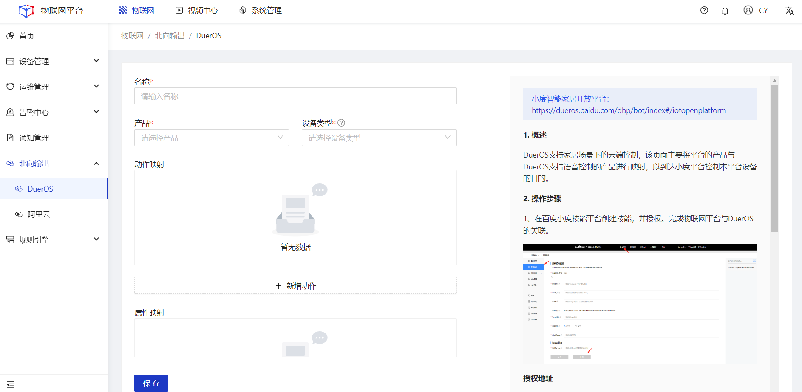
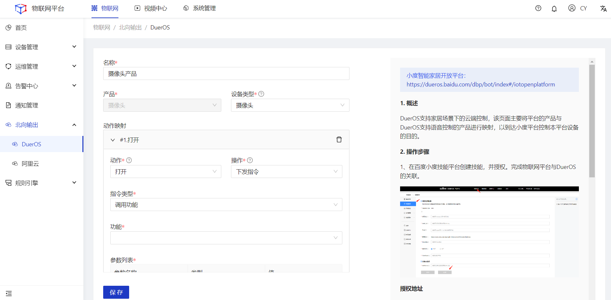
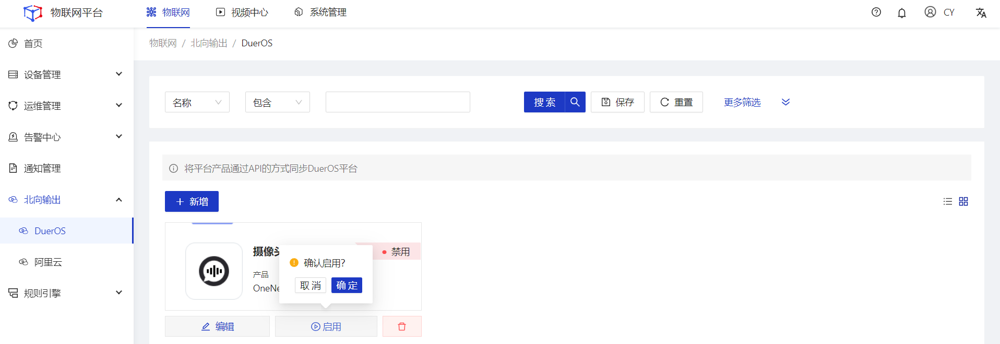
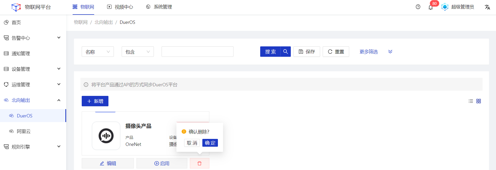

## DuerOS

  
 
    
    提示
  

本功能仅在企业版中提供。

#### 新增
##### 操作步骤
1.**登录**Jetlinks物联网平台。 
2.在左侧导航栏，选择**北向输出>DuerOS**，进入列表页。 

3.点击**新增**按钮，进入详情页填写配置信息，然后点击**保存**按钮。 

<table class='table'>
        <thead>
            <tr>
              <td>参数</td>
              <td>说明</td>
            </tr>
        </thead>
        <tbody>
          <tr>
            <td>名称</td>
            <td>为该北向输出配置命名，最多可输入64个字符。</td>
          </tr>
          <tr>
            <td>产品</td>
            <td>Jetlinks平台内的产品。</td>
          </tr>
          <tr>
            <td>设备类型</td>
            <td>DuerOS平台拟定的设备类型。</td>
          </tr>
          <tr>
            <td>动作</td>
            <td>DuerOS根据设备类型，拟定的动作。</td>
          </tr>
         <tr>
            <td>操作</td>
            <td>映射物联网平台中所选产品具备的动作。</td>
          </tr>
          <tr>
            <td>指令类型</td>
            <td>对当前所选的平台产品，下发对应类型的指令。</td>
          </tr>
         <tr>
            <td>DuerOS属性</td>
            <td>DuerOS根据设备类型，拟定的属性。</td>
          </tr>
         <tr>
            <td>平台属性</td>
            <td>映射物联网平台中所选产品具备的动平台产品属性。</td>
          </tr>
        </tbody>
      </table>

#### 编辑
##### 操作步骤
1.**登录**Jetlinks物联网平台。 
2.在左侧导航栏，选择**北向输出>DuerOS**，进入列表页。 
3.选择具体配置的**编辑**按钮，进入详情页编辑配置信息，然后点击**保存**按钮。 

  

    
    说明
  

  产品不支持编辑，同一个产品只能配置一个映射规则。

#### 启用/禁用
##### 操作步骤
1.**登录**Jetlinks物联网平台。 
2.在左侧导航栏，选择**北向输出>DuerOS**，进入列表页。 
3.选择具体配置的**启用/禁用**按钮，然后点击**确定**。 

#### 删除
##### 操作步骤
1.**登录**Jetlinks物联网平台。 
2.在左侧导航栏，选择**北向输出>DuerOS**，进入列表页。 
3.选择具体配置的**删除**按钮，然后点击**确定**。 
