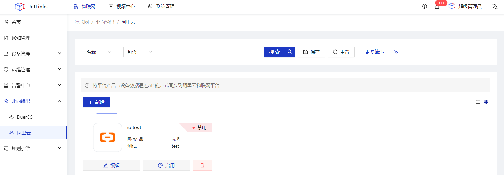
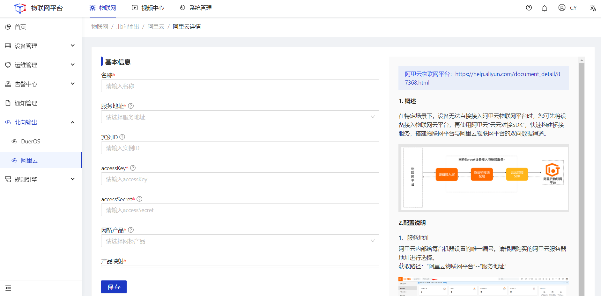
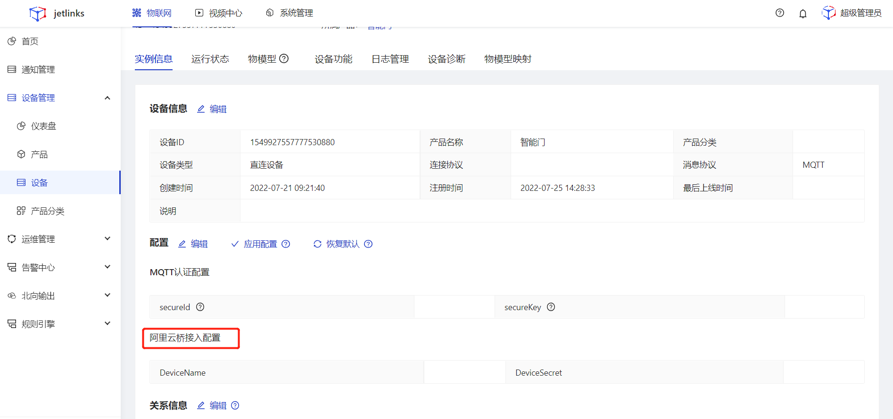
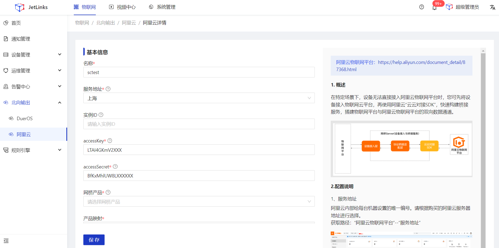
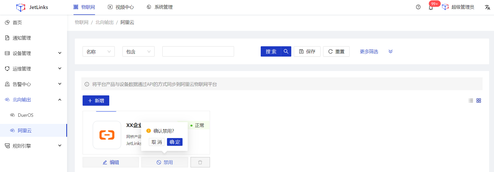
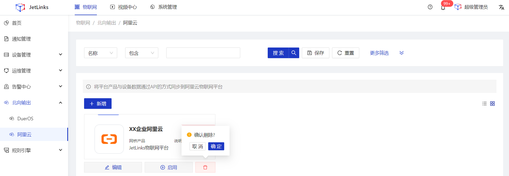

# 阿里云

  
 
    
    提示
  

本功能仅在企业版中提供。

## 指导介绍

  
1. <a href="/Northbound_output/Northbound_output8_aliyun.html#新增">新增</a>

  
2. <a href="/Northbound_output/Northbound_output8_aliyun.html#编辑">编辑</a>

  
3. <a href="/Northbound_output/Northbound_output8_aliyun.html#启用-禁用">启用/禁用</a>

  
4. <a href="/Northbound_output/Northbound_output8_aliyun.html#删除">删除</a>

## 新增
### 操作步骤
1.**登录**Jetlinks物联网平台。 
2.在左侧导航栏，选择**北向输出>阿里云**，进入列表页。 

3.点击**新增**按钮，进入详情页填写配置信息，然后点击**保存**按钮。 

  

    
    说明
  

  Jetlinks物联网平台北向输出到阿里云物联网平台，将以一个网关设备进行展示。

<table class='table'>
        <thead>
            <tr>
              <td>参数</td>
              <td>说明</td>
            </tr>
        </thead>
        <tbody>
          <tr>
            <td>名称</td>
            <td>为该北向输出配置命名，最多可输入64个字符。</td>
          </tr>
          <tr>
            <td>服务地址</td>
            <td>阿里云内部给每台机器设置的唯一编号，请根据开通的阿里云物联网平台所在地域进行选择。</td>
          </tr>
          <tr>
            <td>AccessKey</td>
            <td>用于程序通知方式调用云服务API的用户标识。</td>
          </tr>
          <tr>
            <td>accessSecret</td>
            <td>用于程序通知方式调用云服务费API的秘钥标识。</td>
          </tr>
         <tr>
            <td>网桥产品</td>
            <td>物联网平台对应的阿里云产品，物联网平台对于阿里云物联网平台，是一个网关设备，需要映射到阿里云物联网平台的具体产品。</td>
          </tr>
          <tr>
            <td>阿里云产品</td>
            <td>阿里云物联网平台产品标识。</td>
          </tr>
          <tr>
            <td>平台产品</td>
            <td>与阿里云产品进行映射的Jetlinks物联网平台产品。</td>
          </tr>
        </tbody>
      </table>

### 后续步骤
1.进入**设备实例信息**页面，填写阿里云桥接入配置，建立平台设备与与阿里云设备的映射关系。

  

    
    说明
  

  设备所属产品与阿里云平台产品映射后，平台产品所属设备的实例信息页面将新增阿里云桥接入配置。

## 编辑
### 操作步骤
1.**登录**Jetlinks物联网平台。 
2.在左侧导航栏，选择**北向输出>阿里云**，进入列表页。 
3.点击具体数据的**编辑**按钮，进入详情页编辑配置信息，然后点击**保存**按钮。 

## 启用/禁用
### 操作步骤
1.**登录**Jetlinks物联网平台。 
2.在左侧导航栏，选择**北向输出>阿里云**，进入列表页。 
3.点击具体数据的**启用/禁用**按钮，然后点击**确定**。 

## 删除
### 操作步骤
1.**登录**Jetlinks物联网平台。 
2.在左侧导航栏，选择**北向输出>阿里云**，进入列表页。 
3.点击具体数据的**删除**按钮，然后点击**确定**。 
