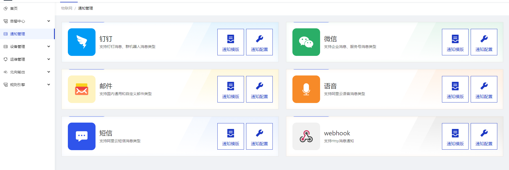
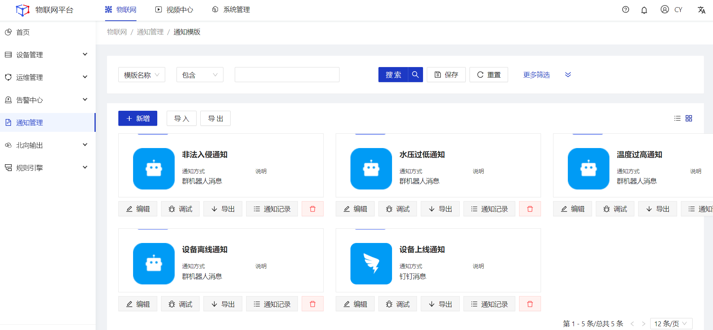
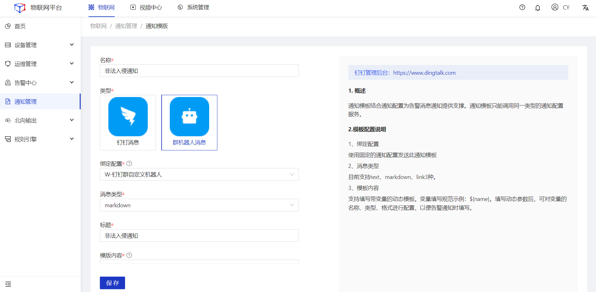
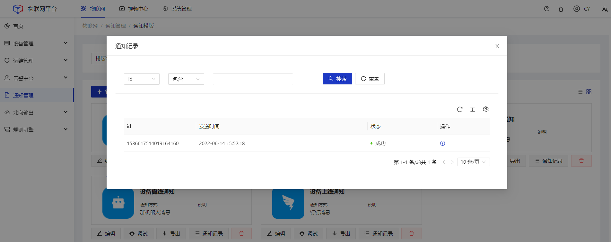
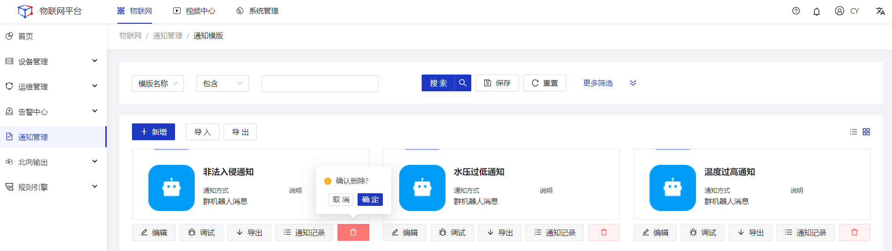

# 通知管理

通知管理用于统一管理、维护各种消息通知配置以及模版。可在场景联动的执行动作中被引用，也可通过统一的接口发送短信、邮件、微信消息、钉钉消息等消息通知。 
支持的**通知方式**：
<table class='table'>
        <thead>
            <tr>
              <td>通知方式</td>
              <td>类型</td>
            </tr>
        </thead>
        <tbody>
          <tr>
            <td>钉钉</td>
            <td><li>钉钉消息</li><li>群机器人消息</li></td>
          </tr>
          <tr>
            <td>微信</td>
            <td><li>企业消息</li></td>
          </tr>
          <tr>
            <td>邮件</td>
            <td><li>内置163、126、qq等类型</li><li>自定义其他邮件类型</li></td>
          </tr>
          <tr>
            <td>语音</td>
            <td><li>阿里云语音</li></td>
          </tr>
          <tr>
            <td>短信</td>
            <td><li>阿里云短信</li></td>
          </tr>
            <tr>
            <td>webhook</td>
            <td><li>自定义webhook地址</li></td>
          </tr>
       </tbody>
</table>

## 新增
##### 操作步骤
1.**登录**Jetlinks物联网平台。 
2.在左侧导航栏，选择**通知管理**，进入卡片页。 

3.点击**通知模板/通知配置**按钮，进入列表页，点击**新增**按钮。 

4.在详情页中填写通知模板/通知配置信息，然后点击**保存**。 

## 编辑
##### 操作步骤
1.**登录**Jetlinks物联网平台。 
2.在左侧导航栏，选择**通知管理**，进入卡片页。 
3.点击**通知模板/通知配置**按钮，进入列表页，点击具体数据的**编辑**按钮。 
4.在详情页中编辑通知模板/通知配置信息，然后点击**保存**。 

## 调试
##### 操作步骤
1.**登录**Jetlinks物联网平台。 
2.在左侧导航栏，选择**通知管理**，进入卡片页。 
3.点击**通知模板/通知配置**按钮，进入列表页，点击具体数据的**调试**按钮。 
4.在弹框中填写调试信息，然后点击**确定**。 

  

    
    说明
  

 调试弹框中的“变量”，来自于模板内容中填写的变量，不存在变量时，将不显示该字段。

## 通知记录
##### 操作步骤
1.**登录**Jetlinks物联网平台。 
2.在左侧导航栏，选择**通知管理**，进入卡片页。 
3.点击**通知模板/通知配置**按钮，进入列表页，点击具体数据的**通知记录**按钮。 

## 删除
##### 操作步骤
1.**登录**Jetlinks物联网平台。 
2.在左侧导航栏，选择**通知管理**，进入卡片页。 
3.点击**通知模板/通知配置**按钮，进入列表页，点击具体数据的**删除**按钮。 

## 同步用户
当通知配置所选方式为**企业微信**、**钉钉消息**时，对应的配置卡片将出现**同步用户**按钮。该功能主要目的为将平台内的用户与钉钉、企业微信用户进行关联，实现在通知时通过选择平台内的用户、角色，即可将消息发送给关联的企业微信、钉钉用户。
##### 操作步骤
1.**登录**Jetlinks物联网平台。 
2.在左侧导航栏，选择**通知管理**，进入卡片页。 
3.点击**钉钉/微信通知配置**按钮，进入列表页，点击具体数据的**同步用户**按钮。 

4.在弹框页中建立平台与钉钉/企业微信用户的关联关系，然后点击**关闭**。 

  

    
    说明
  

  第一次进行绑定时，点击自动绑定按钮，程序根据相同名称进行自动绑定。

