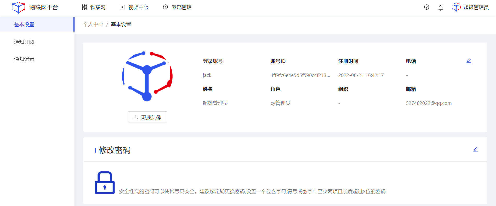
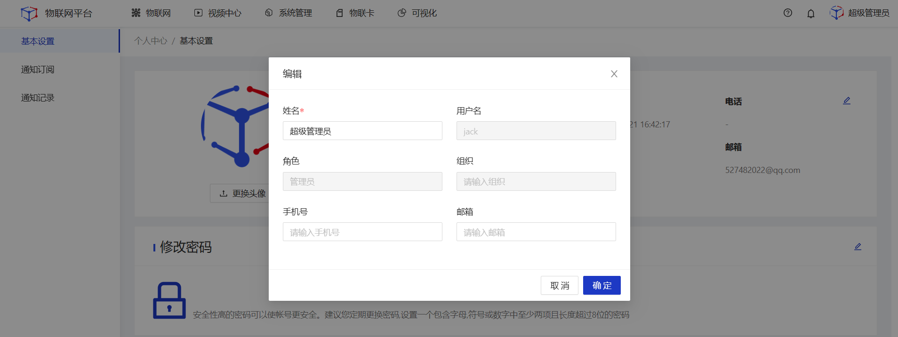
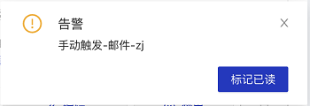
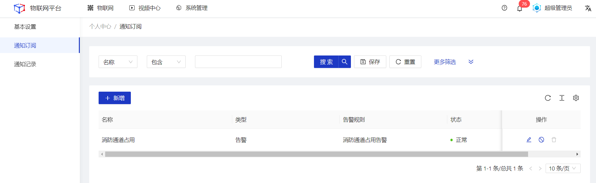
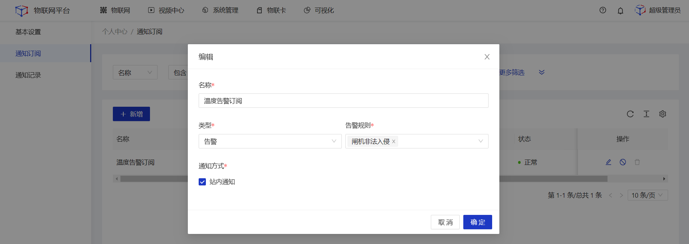
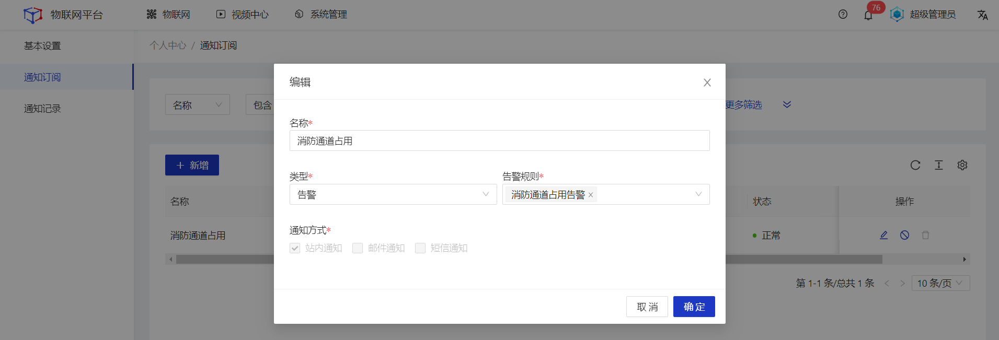
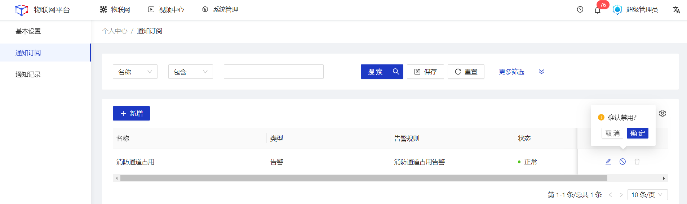
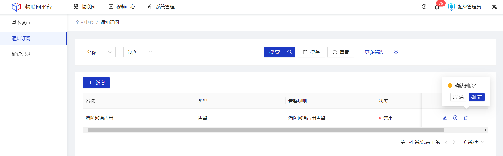
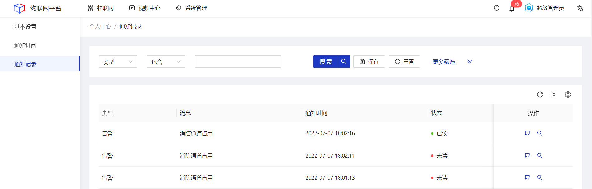

# 个人中心
## 基础设置
维护管理个人相关信息。
#### 基础设置维护
##### 操作步骤
1.**登录**Jetlinks物联网平台。 
2.鼠标移入顶部右上角**账号**，点击**个人中心**按钮，进入基本设置页面。 

3.点击各个卡片的编辑按钮，在弹框页修改信息，然后点击**保存**。 

  

    
    说明
  

 绑定第三方账号功能需在配置文件中进行配置。未配置时页面不显示该模块。

## 通知订阅
订阅告警信息，订阅的信息将在系统内进行强提示。如下图：

#### 新增
##### 操作步骤
1.**登录**Jetlinks物联网平台。 
2.鼠标移入顶部右上角**账号**，点击**个人中心**按钮，然后选择**通知订阅**菜单。 

3.点击**新增**按钮，在弹框页面填写订阅信息，然后点击**确定**。 

  

    
    说明
  

通知方式默认勾选站内通知，其他选项来自于配置文件。

#### 编辑
##### 操作步骤
1.**登录**Jetlinks物联网平台。 
2.鼠标移入顶部右上角**账号**，点击**个人中心**按钮，然后选择**通知订阅**菜单。 
3.点击具体订阅的**编辑**按钮，在弹框页面编辑订阅信息，然后点击**确定**。 

#### 启用/禁用
##### 操作步骤
1.**登录**Jetlinks物联网平台。 
2.鼠标移入顶部右上角**账号**，点击**个人中心**按钮，然后选择**通知订阅**菜单。 
3.点击具体订阅的**启用/禁用**按钮，然后点击**确定**。 

#### 删除
##### 操作步骤
1.**登录**Jetlinks物联网平台。 
2.鼠标移入顶部右上角**账号**，点击**个人中心**按钮，然后选择**通知订阅**菜单。 
3.点击具体订阅的**删除**按钮，然后点击**确定**。 

## 通知记录
#### 查看
##### 操作步骤
1.**登录**Jetlinks物联网平台。 
2.鼠标移入顶部右上角**账号**，点击**个人中心**按钮，然后选择**通知记录**菜单，进入列表页。 

3.点击具体记录的**查看**按钮，在弹框页面查看详细信息。 