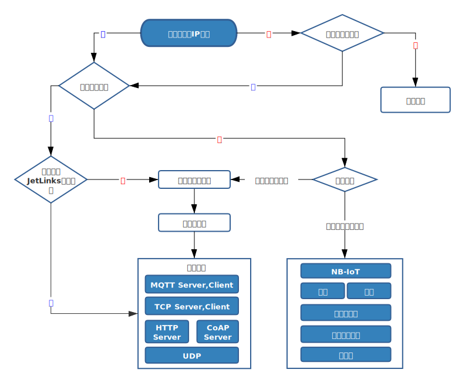

# JetLinks 开源物联网平台

JetLinks 基于Java8,Spring Boot 2.x,WebFlux,Netty,Vert.x,Reactor等开发, 
是一个开箱即用,可二次开发的企业级物联网基础平台。平台实现了物联网相关的众多基础功能,
能帮助你快速建立物联网相关业务系统。

## 核心特性

支持统一物模型管理,多种设备,多种厂家,统一管理。

统一设备连接管理,多协议适配(TCP,MQTT,UDP,CoAP,HTTP等),屏蔽网络编程复杂性,灵活接入不同厂家不同协议的设备。

灵活的规则引擎,设备告警,消息通知,数据转发.可基于SQL进行复杂的数据处理逻辑.

地理位置:统一管理地理位置信息,支持区域搜索. 

数据可视化: 实现拖拽配置数据图表,设备组态等.

官方QQ群: `2021514`

## 技术栈

1. [Spring Boot 2.2.x](https://spring.io/projects/spring-boot)
2. [Spring WebFlux](https://spring.io/) 响应式Web支持
3. [R2DBC](https://r2dbc.io/) 响应式关系型数据库驱动
4. [Project Reactor](https://projectreactor.io/) 响应式编程框架
4. [Netty](https://netty.io/),[Vert.x](https://vertx.io/) 高性能网络编程框架
5. [ElasticSearch](https://www.elastic.co/cn/products/enterprise-search) 全文检索，日志，时序数据存储
6. [PostgreSQL](https://www.postgresql.org) 业务功能数据管理
7. [hsweb framework 4](https://github.com/hs-web) 业务功能基础框架

## 架构

## 设备接入流程

