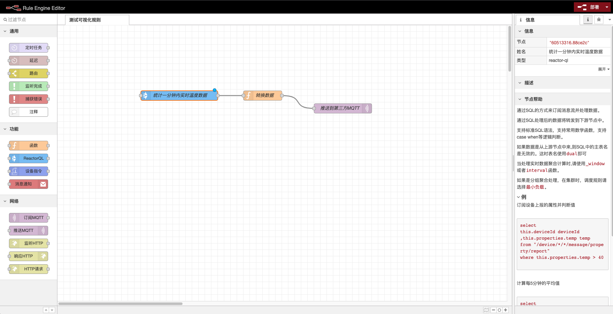
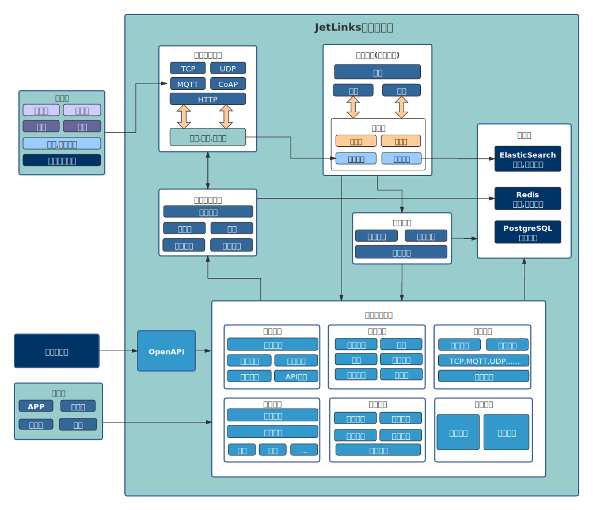

# JetLinks 开源物联网平台

JetLinks 基于Java8,Spring Boot 2.x,WebFlux,Netty,Vert.x,Reactor等开发, 
是一个开源的企业级物联网基础开发平台，实现了物联网相关以及相关业务开发的众多基础功能,
能帮助你快速建立物联网相关业务系统。

点击添加官方QQ:

在线演示地址: [http://v1.jetlinks.cn](http://v1.jetlinks.cn) 用户名:`test` 密码: `test123456`.
测试用户未开放全部权限,建议本地运行社区版体验或者联系商务试用企业版.

:::warning 特此声明
近日有不法分子利用`低价JetLinks企业版源代码`实施诈骗，我方已报警备案。购买企业版请联系`官方QQ群管理员`，QQ群内一切`主动私聊你的都是骗子`。
在第三方获取到的企业版源码，由此带来的法律后果自行承担。
:::

## 核心特性

**开放源代码**

全部源代码开放,可自由拓展功能,不再受制于人.前后端分离,接口全开放.

**统一设备接入,海量设备管理**

TCP/UDP/MQTT/HTTP、TLS/DTLS、不同厂商、不同设备、不同报文、统一接入，统一管理.

**规则引擎**

灵活的规则模型配置,支持多种规则模型以及[自定义规则模型](./dev-guide/rule-engine.md).
设备告警,场景联动,均由统一的规则引擎管理.

强大的可视化规则设计器.

::: tip 说明
可视化规则设计器基于node-red,后端使用纯java实现.
:::

**数据权限控制**

灵活的非侵入[数据权限控制](./dev-guide/assets.md)。可实现不同机构,不同用户共享数据。
可控制单条数据的操作权限。支持自定义维度(公司,部门...)

**多种数据存储策略**

支持灵活的设备[数据存储策略](./best-practices/start.md#存储策略选择)，可将不同类型的设备数据存储到不同的地方。

## 技术栈

1. [Spring Boot 2.3.x](https://spring.io/projects/spring-boot)
2. [Spring WebFlux](https://spring.io/) 响应式Web支持
3. [R2DBC](https://r2dbc.io/) 响应式关系型数据库驱动
4. [Project Reactor](https://projectreactor.io/) 响应式编程框架
4. [Netty](https://netty.io/),[Vert.x](https://vertx.io/) 高性能网络编程框架
5. [ElasticSearch](https://www.elastic.co/cn/products/enterprise-search) 全文检索，日志，时序数据存储
6. [Redis](https://redis.io/) Redis,设备配置,状态管理,缓存.
7. [PostgreSQL](https://www.postgresql.org) 业务功能数据管理
8. [hsweb framework 4](https://github.com/hs-web) 业务功能基础框架

## 架构

## 设备接入流程

## 许可版本

JetLinks所有版本均开放源代码.
::: tip 注意
JetLinks使用模块化(`git submodule`+`maven`)管理,部分核心模块是单独的仓库并定期发布到maven中央仓库.
可在[github](https://github.com/jetlinks)中找到全部代码.
:::

| 功能                         | 社区版 | 企业版                    |
| ---------------------------- | ------ |  ------------------------- |
| 开放源代码                   | ✅      | ✅                         |
| 设备管理,设备接入            | ✅      | ✅                         |
| 多消息协议支持               | ✅      |  ✅                         |
| 规则引擎-设备告警            | ✅      |  ✅                         |
| 规则引擎-数据转发            | ✅      |  ✅                         |
| 系统监控,数据统计            | ✅      |  ✅                         |
| 邮件消息通知                 | ✅      |  ✅                         |
| 微信企业消息                 | ✅      | ✅                         |
| 钉钉消息通知                 | ✅      | ✅                         |
| MQTT(TLS)                    | ✅      |  ✅                         |
| TCP(TLS)                     | ✅      | ✅                         |
| UDP,CoAP(DTLS)                   | ⭕      |  ✅                         |
| Http,WebSocket(TLS)          | ⭕      |  ✅                         |
| 转发设备数据到RabbitMQ,Kafka | ⭕      |  ✅                         |
| Geo地理位置支持              | ⭕      |  ✅                         |
| 规则引擎-可视化设计器        | ⭕      |  ✅                         |
| OpenAPI,OAuth2认证           | ⭕      | ✅                         |
| 数据权限控制                 | ⭕      |  ✅                         |
| 集群支持                     | ⭕      |  ✅                         |
| QQ群技术支持                 | ⭕      |  ✅                         |
| 一对一技术支持               | ⭕      | ✅                         |
| 微服务架构                   | ⭕      |  ✅                         |
| 可视化大屏设计器             | ⭕      | ✅                         |
| 定制开发                     | ⭕      |  ✅                         |
| 阿里云协议适配               | ⭕      |  ✅ (付费选配模块)          |
| 阿里云平台接入               | ⭕      |  ✅ (付费选配模块)          |
| 小度平台接入                 | ⭕      |  ✅ (付费选配模块)          |
| 电信CTWing平台接入           | ⭕      |  ✅ (付费选配模块)          |
| 移动OneNet平台接入           | ⭕      |  ✅ (付费选配模块)          |
| GBT/28181视频设备接入        | ⭕      |  ✅ (付费选配模块)          |
| OPC UA                     | ⭕      |  ✅ (付费选配模块)          |
| 商业限制                    | 仅用于自有项目 禁止售卖源代码.  | 不限项目数量 |
| 定价                         | 免费   |  加QQ群`780133058`联系商务     |
