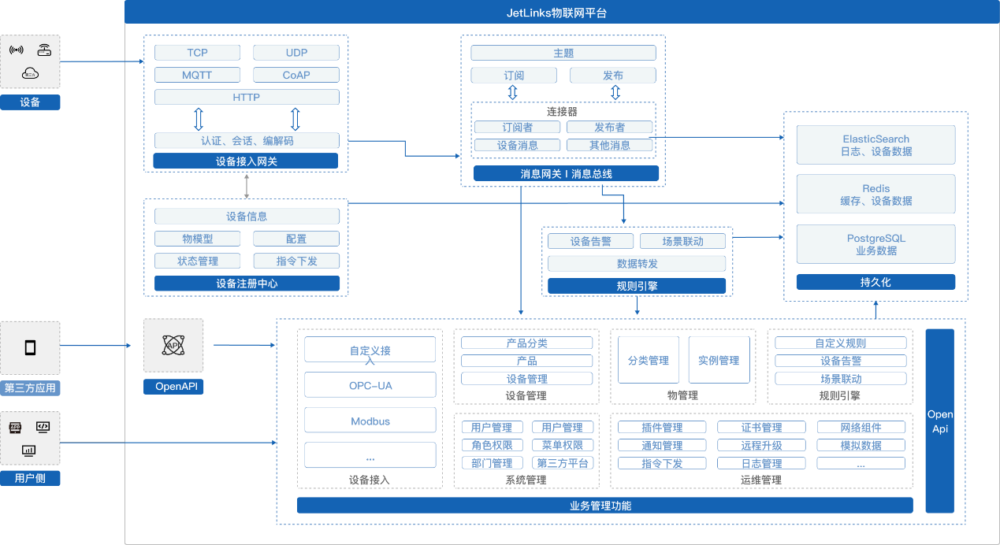

# 开源物联网平台

## 概述

**JetLinks物联网平台** 基于Java8,Spring Boot 2.x,WebFlux,Netty,Vert.x,Reactor等开发, 是一个开源的企业级物联网基础开发平台，实现了物联网相关以及相关业务开发的众多基础功能, 能帮助你快速建立物联网相关业务系统。

点击添加官方QQ:①群(已满)[2021514](https://qm.qq.com/cgi-bin/qm/qr?k=LGf0OPQqvLGdJIZST3VTcypdVWhdfAOG&jump_from=webapi)
,②群(已满)[324606263](https://qm.qq.com/cgi-bin/qm/qr?k=IMas2cH-TNsYxUcY8lRbsXqPnA2sGHYQ&jump_from=webapi)
,③群[647954464](https://qm.qq.com/cgi-bin/qm/qr?k=K5m27CkhDn3B_Owr-g6rfiTBC5DKEY59&jump_from=webapi)

在线演示地址: [https://v2.jetlinks.cn](https://v2.jetlinks.cn) 用户名:`test` 密码: `test123456`.
测试用户未开放全部权限,建议本地运行社区版体验或者联系商务试用企业版.

  

    
    特此申明！
  

   近日有不法分子利用低价JetLinks企业版源代码实施诈骗，我方已报警备案。购买企业版请联系官方QQ群管理员，QQ群内一切主动私聊你的都是骗子。在第三方获取到的企业版源码，由此带来的法律后果自行承担。

## 核心特性

#### 开放源代码

全部源代码开放,可自由拓展功能,不再受制于人.前后端分离,接口全开放。

#### 统一设备接入,海量设备管理
TCP/UDP/MQTT/HTTP、TLS/DTLS、不同厂商、不同设备、不同报文、统一接入，统一管理。

#### 规则引擎
灵活的规则模型配置,支持多种规则模型以及自定义规则模型. 设备告警,场景联动,均由统一的规则引擎管理。

#### 数据权限控制
灵活的非侵入数据权限控制。可实现菜单、按钮、数据三维维度的数据权限控制。可控制单条数据的操作权限。

## 技术栈

1. [Spring Boot 2.3.x](https://spring.io/projects/spring-boot)
2. [Spring WebFlux](https://spring.io/) 响应式Web支持
3. [R2DBC](https://r2dbc.io/) 响应式关系型数据库驱动
4. [Project Reactor](https://projectreactor.io/) 响应式编程框架
4. [Netty](https://netty.io/),[Vert.x](https://vertx.io/) 高性能网络编程框架
5. [ElasticSearch](https://www.elastic.co/cn/products/enterprise-search) 全文检索，日志，时序数据存储
6. [PostgreSQL](https://www.postgresql.org) 业务功能数据管理
7. [hsweb framework 4](https://github.com/hs-web) 业务功能基础框架

## 架构

## 设备接入流程

## 许可版本

JetLinks所有版本均开放源代码.

  

    
    说明
  

JetLinks使用模块化(`git submodule`+`maven`)管理,部分核心模块是单独的仓库并定期发布到maven中央仓库.
  
可在[github](https://github.com/jetlinks)中找到全部代码.

| 功能                         | 社区版 | 企业版                    |
| ---------------------------- | ------ |  ------------------------- |
| 开放源代码                   | ✅      | ✅                         |
| 设备管理,设备接入            | ✅      | ✅                         |
| 多消息协议支持               | ✅      |  ✅                         |
| 规则引擎-设备告警            | ✅      |  ✅                         |
| 规则引擎-数据转发            | ✅      |  ✅                         |
| 系统监控,数据统计            | ✅      |  ✅                         |
| 邮件消息通知                 | ✅      |  ✅                         |
| 微信企业消息                 | ✅      | ✅                         |
| 钉钉消息通知                 | ✅      | ✅                         |
| MQTT(TLS)                    | ✅      |  ✅                         |
| TCP(TLS)                     | ✅      | ✅                         |
| UDP,CoAP(DTLS)                   | ⭕      |  ✅                         |
| Http,WebSocket(TLS)          | ⭕      |  ✅                         |
| 转发设备数据到RabbitMQ,Kafka | ⭕      |  ✅                         |
| Geo地理位置支持              | ⭕      |  ✅                         |
| 规则引擎-可视化设计器        | ⭕      |  ✅                         |
| OpenAPI,OAuth2认证           | ⭕      | ✅                         |
| 数据权限控制                 | ⭕      |  ✅                         |
| 集群支持                     | ⭕      |  ✅                         |
| QQ群技术支持                 | ⭕      |  ✅                         |
| 一对一技术支持               | ⭕      | ✅                         |
| 微服务架构                   | ⭕      |  ✅                         |
| 可视化大屏设计器             | ⭕      | ✅                         |
| 定制开发                     | ⭕      |  ✅                         |
| 阿里云协议适配               | ⭕      |  ✅ (付费选配模块)          |
| 阿里云平台接入               | ⭕      |  ✅ (付费选配模块)          |
| 小度平台接入                 | ⭕      |  ✅ (付费选配模块)          |
| 电信CTWing平台接入           | ⭕      |  ✅ (付费选配模块)          |
| 移动OneNet平台接入           | ⭕      |  ✅ (付费选配模块)          |
| GBT/28181视频设备接入        | ⭕      |  ✅ (付费选配模块)          |
| OPC UA                     | ⭕      |  ✅ (付费选配模块)          |
| Modbus/TCP                     | ⭕      |  ✅ (付费选配模块)          |
| 商业限制                    | 仅用于自有项目 禁止售卖源代码.  | 不限项目数量 |
| 定价                         | 免费   |  加QQ群`2021514`联系商务     |

## 常见问题

    

        <ul>
            <li><a href="/common-problems/install.html">安装启动常见问题</a></li>
            <li><a href="/protocol/faq.html">协议开发常见问题</a></li>
            <li><a href="/common-problems/mqtt-connection.html">使用MQTT接入时的常见问题</a></li>
            <li><a href="/common-problems/tcp-network-components.html">TCP网络组件常见问题</a></li>
            <li><a href="/common-problems/FAQ.html#项目在本地环境安装的时候镜像总是拉取不下来">项目在本地环境安装的时候镜像总是拉取不下来</a></li>
        </ul>
    

    

        <ul>
            <li><a href="/common-problems/FAQ.html#项目在启动时报类缺失或者找不到">项目在启动时报类缺失或者找不到</a></li>
            <li><a href="/common-problems/FAQ.html#设备无法连接上jetlinks平台">设备无法连接上jetlinks平台</a></li>
            <li><a href="/common-problems/FAQ.html#启动报elasticsearch节点无法进入">启动报elasticsearch节点无法进入</a></li>
            <li><a href="/common-problems/FAQ.html#启动无故失败">启动无故失败</a></li>
            <li><a href="/common-problems/FAQ.html#项目启动时发现admin用户没有完整的权限">项目启动时发现admin用户没有完整的权限</a></li>
        </ul>
    

