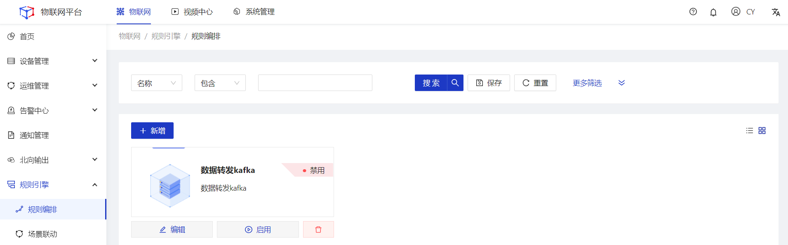
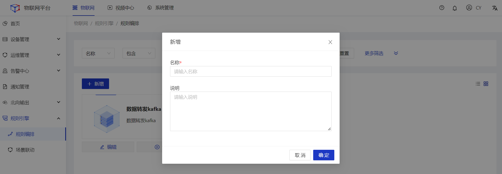
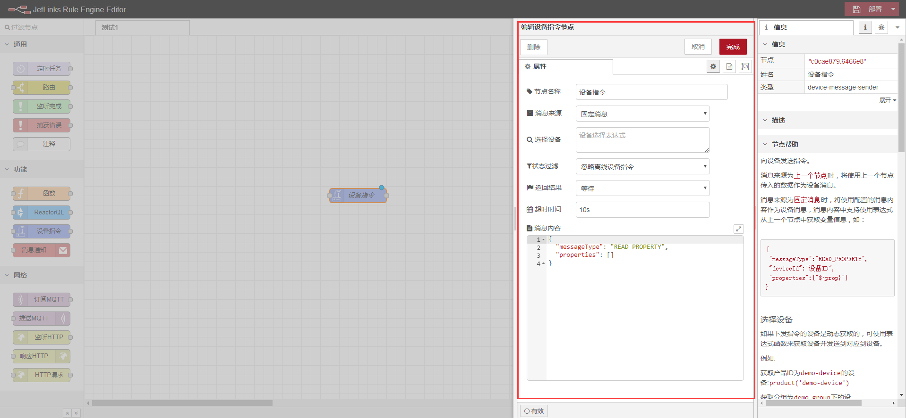
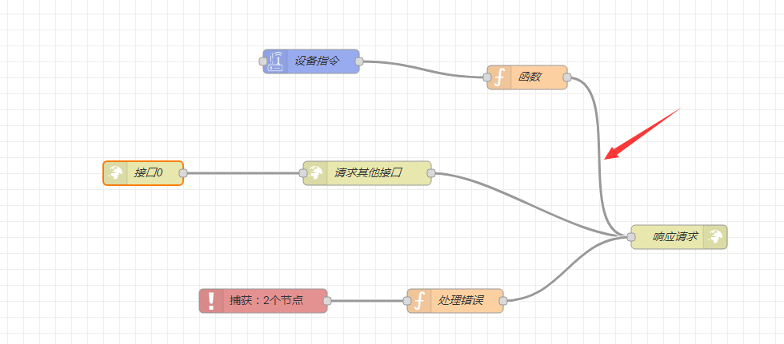
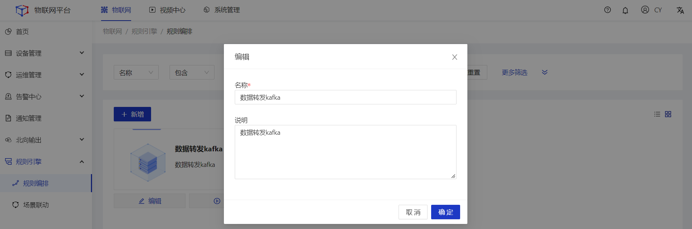
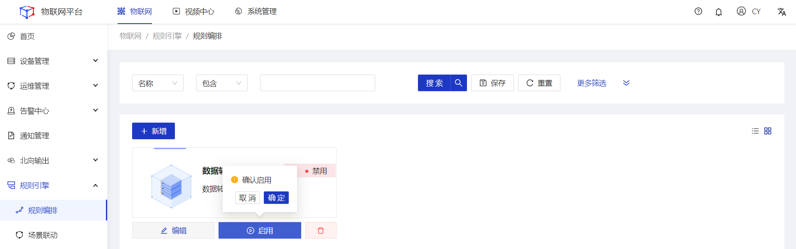
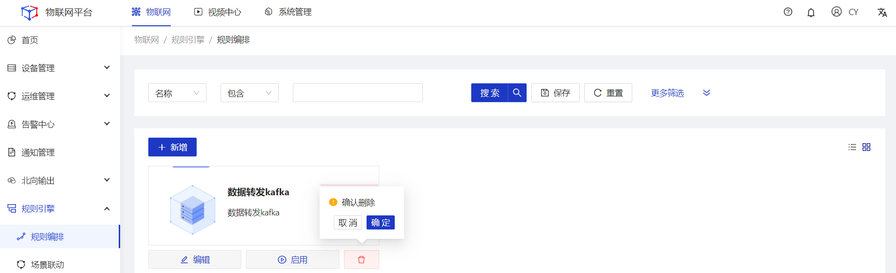
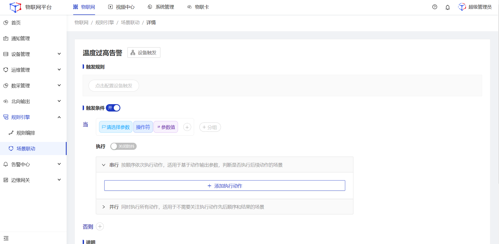
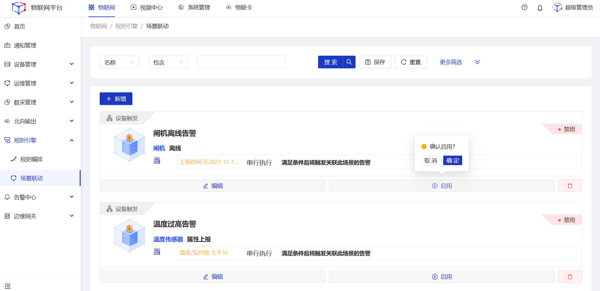
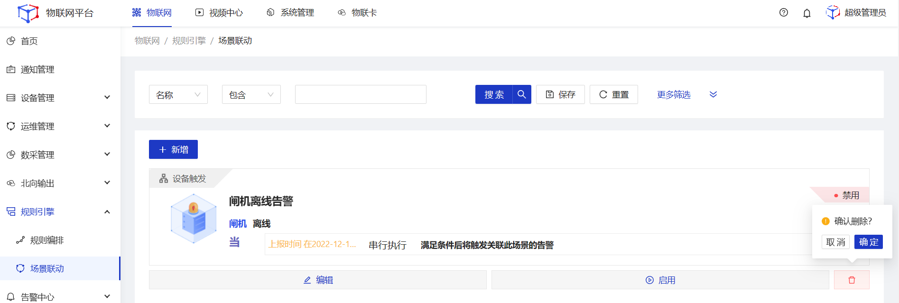

# 规则引擎

规则引擎是**可视化**的系统数据逻辑处理工具，可自定义数据处理**规则编排**，以及可视化的**场景联动**规则配置。 

## 规则编排
#### 新增
##### 操作步骤
1.**登录**Jetlinks物联网平台。 
2.在左侧导航栏，选择**规则引擎>规则编排**，进入列表页。 

3.点击**新增**按钮，在弹框页填写名称，然后点击**确定**按钮。 

4.点击卡片，进入画布页，**拖拽**左侧组件到画布页，并**双击**组件，填写相关配置。 

5.将多个组件之间，通过**连线**进行连接。 

6.点击页面右上角**部署**。 

#### 编辑
##### 操作步骤
1.**登录**Jetlinks物联网平台。 
2.在左侧导航栏，选择**规则引擎>规则编排**，进入列表页。 
3.点击具体数据的**编辑**按钮，在弹框页编辑名称，然后点击**确定**按钮。 

#### 启用/禁用
##### 操作步骤
1.**登录**Jetlinks物联网平台。 
2.在左侧导航栏，选择**规则引擎>规则编排**，进入列表页。 
3.点击具体数据的**启用/禁用**按钮，然后点击**确定**。 

#### 删除
##### 操作步骤
1.**登录**Jetlinks物联网平台。 
2.在左侧导航栏，选择**规则引擎>规则编排**，进入列表页。 
3.选择具体数据的**删除**按钮，然后点击**确定**。 

## 场景联动
#### 新增
##### 操作步骤
1.**登录**Jetlinks物联网平台。 
2.在左侧导航栏，选择**规则引擎>场景联动**，进入列表页。 
3.点击**新增**按钮，在详情页选择**触发方式**。 
4.根据触发方式填写**触发条件**（选择设备触发时有此配置项）、**执行动作**，然后点击**保存**。 

  

    
    说明
  

      <li> 选择设备触发时将显示关联的“选择设备”相关参数  </li>
      <li> 选择定时触发时将显示关联的“定时触发”相关参数  </li>
      <li> 防抖：触发条件在一定时间内触发多次时，可选择只执行第一次或最后一次。  </li>

##### 设备触发关联配置项说明
<table class='table'>
        <thead>
            <tr>
              <td>参数</td>
              <td>说明</td>
            </tr>
        </thead>
        <tbody>
          <tr>
            <td>选择产品</td>
            <td>单选下拉框，选择用作触发条件的产品。</td>
          </tr>
          <tr>
            <td>选择设备</td>
            <td>支持全部设备、部分设备、按部门选择设备3种方式。</td>
          </tr>
          <tr>
            <td>触发类型</td>
            <td>下拉的数据根据物模型配置动态显示。默认有设备上线、设备离线。 
             

    说明
    <ul>
   <li>产品已配置属性时，下拉框中将会显示：属性读取、属性上报、修改属性</li>
   <li>产品已配置功能时，下拉框中将会显示：功能调用</li>
   <li>产品已配置事件时，下拉框中将会显示：事件上报</li>
    </ul>
  

            </td>
          </tr>
        </tbody>
      </table>

##### 定时触发关联配置项说明
<table class='table'>
        <thead>
            <tr>
              <td>参数</td>
              <td>说明</td>
            </tr>
        </thead>
        <tbody>
          <tr>
            <td>按周</td>
            <td>定时触发维度，可选择按周、按月。</td>
          </tr>
          <tr>
            <td>时间</td>
            <td>
            

    说明
    <ul>
       <li>选择按周时，显示每天、星期一、星期二...星期天</li>
            <li>选择按月时，显示每天、1号、2号...31号</li>
            <li>选择cron表达式时，显示cron表达式输入框</li>
    </ul>
  

           </td>
          </tr>
          <tr>
            <td>执行周期</td>
            <td>支持一定时间段内每隔固定时间进行触发，也支持在固定时间点定时执行一次。  </td>
          </tr>
        </tbody>
      </table>

##### 串行并行说明
<table class='table'>
        <thead>
            <tr>
              <td>参数</td>
              <td>说明</td>
            </tr>
        </thead>
        <tbody>
          <tr>
            <td>串行</td>
            <td>执行动作可根据条件过滤，按照先后顺序逐一执行后续动作。</td>
          </tr>
          <tr>
            <td>并行</td>
            <td>所有执行动作同时执行
             

    说明
    <ul>
     并行时，执行动作不支持延迟执行类型。
    </ul>
  

            </td>
          </tr>
          <tr>
            <td>条件过滤</td>
            <td>根据上游执行动作的执行结果配置条件，满足条件时继续执行后续动作。  </td>
          </tr>
        </tbody>
      </table>

#### 编辑
##### 操作步骤
1.**登录**Jetlinks物联网平台。 
2.在左侧导航栏，选择**规则引擎>场景联动**，进入列表页。 
3.点击具体数据的**编辑**按钮，在详情页填写具体配置，然后点击**保存**。 

  

    
    说明
  

  以下情况将会导致部分配置参数或引用关系被清空或删除。 

定时触发-->手动触发 
<li>已经配置的定时规则将会自动删除</li>

设备触发-->定时触发/手动触发 
<li>选择产品区域卡片自动删除</li>
<li>触发条件卡片自动删除</li>
<li>执行动作-设备输出中按关系选择的设备自动清空，内置参数自动清空</li>
<li>执行动作-消息通知中按关系选择的用户自动清空，内置参数自动清空</li>

设备触发： 
<li>设备触发：更换页面顶部的产品时，清空所选设备、触发类型（如设备上线、读取属性等）、触发条件，以及下属执行动作中所选择的内置参数，并将【条件过滤】的第一个下拉框至于请选择参数状态，不显示后续的关联配置项</li>
<li>设备触发：同一个产品，更换页面顶端设备时，不改变其他配置参数</li>
<li>设备触发：同一个产品，更换页面顶端触发类型（如设备上线、读取属性等）时，清空触发条件，以及下属执行动作中所选择的内置参数，并将<li>【条件过滤】的第一个下拉框至于请选择参数状态，不显示后续的关联配置项</li>

执行动作： 
<li>执行动作：更换产品时，清空当前执行动作中的设备、触发类型（如设备上线、读取属性等），以及下属执行动作中所选择的内置参数，并将【条件过滤】的第一个下拉框至于请选择参数状态，不显示后续的关联配置项</li>
<li>串行-->并行时，清空执行动作中所有的内置参数值，删除过滤条件 </li> 

#### 启用/禁用
##### 操作步骤
1.**登录**Jetlinks物联网平台。 
2.在左侧导航栏，选择**规则引擎>场景联动**，进入列表页。 
3.点击具体数据的**启用/禁用**按钮，然后点击**确定**。 

#### 删除
##### 操作步骤
1.**登录**Jetlinks物联网平台。 
2.在左侧导航栏，选择**规则引擎>场景联动**，进入列表页。 
3.选择具体数据的**删除**按钮，然后点击**确定**。 

  

    
    说明
  

场景联动被告警引用时不可删除。

