## 基础配置
对系统的名称、风格、登录页、LOGO等基础信息进行维护管理。 

#### 基础信息配置
##### 操作步骤
1.**登录**Jetlinks物联网平台。 
2.点击顶部**系统管理**，在左侧导航栏，选择**基础配置**，进入详情页。 
3.填写基础信息，然后点击**保存**。 
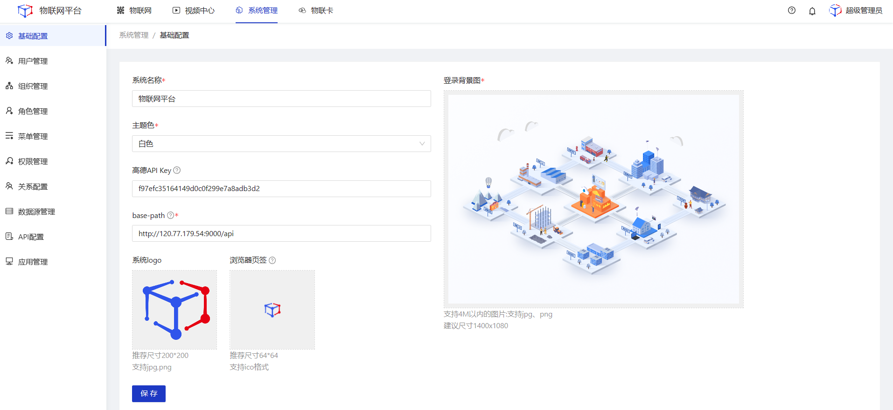

  

    
    说明
  

  不填写高德API Key，系统内基于地图展示的功能均不可使用。

## 用户管理
统一维护管理系统内的所有用户信息，用户的账号密码可用于登录本系统。 

#### 新增
##### 操作步骤
1.**登录**Jetlinks物联网平台。 
2.点击顶部**系统管理**，在左侧导航栏，选择**用户管理**，进入列表页。 
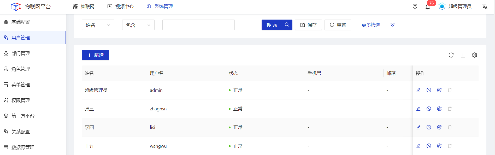
3.点击**新增**按钮，在弹框页中填写用户信息，然后点击**确定**。 
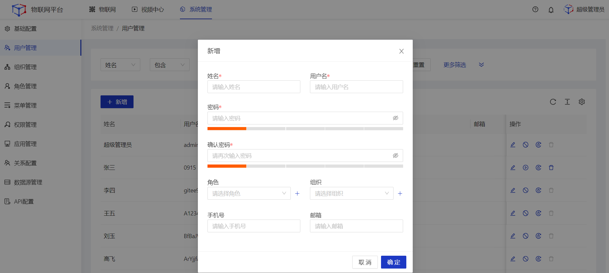

  

    
    说明
  

  <li>点击角色、部门右侧的添加icon，将会在浏览器打开新tab页，添加完成后将自动关闭对应的tab页，并将添加的信息回填到当前页的下拉框中。</li>
  <li>用户具有多个角色时，拥有多个角色权限的并集。</li>

#### 编辑
##### 操作步骤
1.**登录**Jetlinks物联网平台。 
2.点击顶部**系统管理**，在左侧导航栏，选择**用户管理**，进入列表页。 
3.点击具体用户的**编辑**按钮，在弹框页中编辑用户信息，然后点击**确定**。 

#### 启用/禁用
##### 操作步骤
1.**登录**Jetlinks物联网平台。 
2.点击顶部**系统管理**，在左侧导航栏，选择**用户管理**，进入列表页。 
3.点击具体用户的**启用/禁用**按钮，然后点击**确定**。 
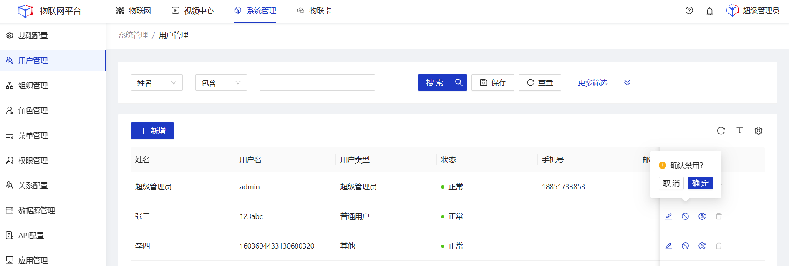

#### 重置密码
##### 操作步骤
1.**登录**Jetlinks物联网平台。 
2.点击顶部**系统管理**，在左侧导航栏，选择**用户管理**，进入列表页。 
3.点击具体用户的**重置密码**按钮，在弹框页重新设置用户登录密码，然后点击**确定**。 
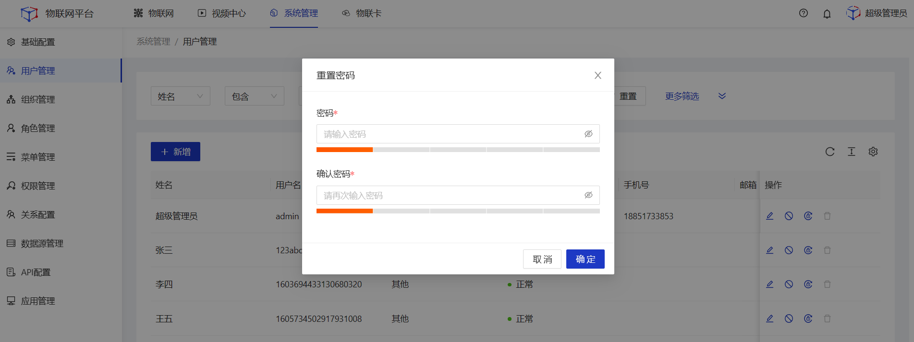

#### 删除
##### 操作步骤
1.**登录**Jetlinks物联网平台。 
2.点击顶部**系统管理**，在左侧导航栏，选择**用户管理**，进入列表页。 
3.点击具体用户的**删除**按钮，然后点击**确定**。 
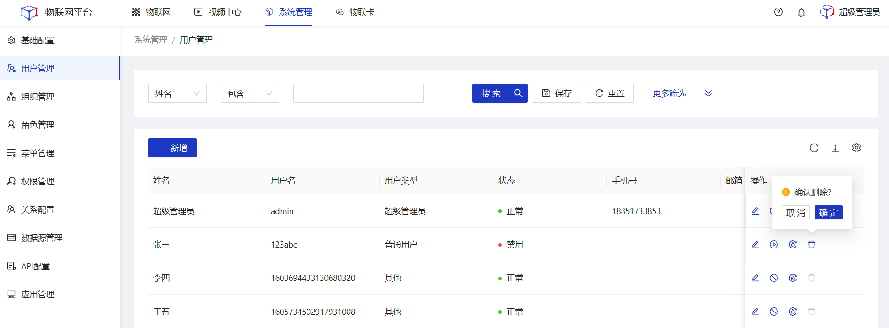

  
  警告
超级管理员被删除后，需手动修改数据库，请谨慎操作！

## 部门管理
统一维护管理系统内的组织架构信息，支持为每个部门分配产品、设备、用户。 

#### 新增
##### 操作步骤
1.**登录**Jetlinks物联网平台。 
2.点击顶部**系统管理**，在左侧导航栏，选择**部门管理**，进入列表页。 
3.点击左侧**新增**按钮，在弹框页填写部门信息，然后点击**确定**。 
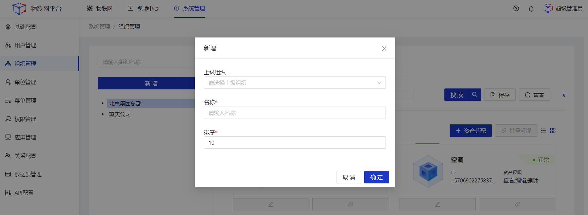

#### 编辑
##### 操作步骤
1.**登录**Jetlinks物联网平台。 
2.点击顶部**系统管理**，在左侧导航栏，选择**部门管理**，进入列表页。 
3.鼠标移入左侧树中的具体数据，点击**编辑**按钮，在弹框页编辑部门信息，然后点击**确定**。 
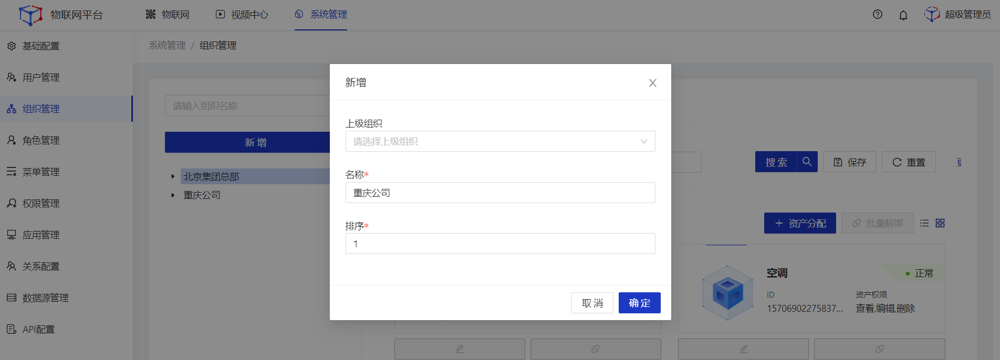

#### 删除
##### 操作步骤
1.**登录**Jetlinks物联网平台。 
2.点击顶部**系统管理**，在左侧导航栏，选择**部门管理**，进入列表页。 
3.鼠标移入左侧树中的具体数据，点击**删除**按钮，然后点击**确定**。 
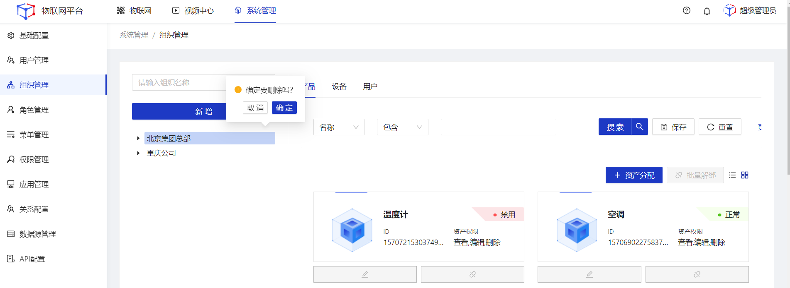

#### 分配资产
##### 操作步骤
1.**登录**Jetlinks物联网平台。 
2.点击顶部**系统管理**，在左侧导航栏，选择**部门管理**，进入列表页。 
3.鼠标点击左侧树中的具体节点，点击页面右侧tab，选择要分类的资产类型（产品、设备、用户），点击**资产分配**按钮，在弹框页勾选需要分配的资产，然后点击**确定**。 
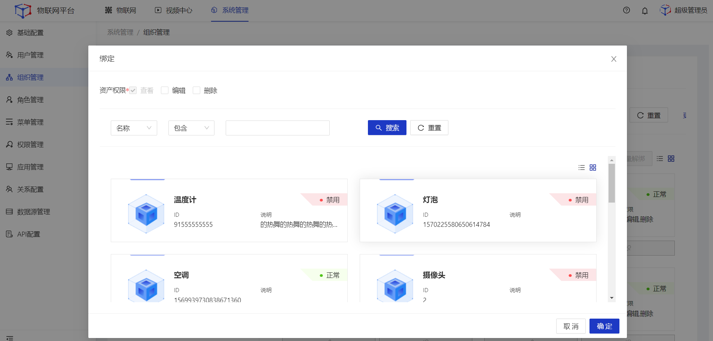

##### 后续步骤
1.资产解绑 
勾选需要解绑的资产数据或点击具体资产的解绑按钮，可进行**批量解绑**或**单个解绑**。 
2.编辑资产权限 
点击具体资产的**编辑**按钮，在弹框页面编辑资产数据权限。 

  

    
    说明
  

<li>用户类型的资产不涉及此功能。</li>
<li>同一个设备可以被分配至多个部门。</li>

## 角色管理
统一维护管理系统内的角色，角色可与权限进行关联，以实现不同角色查看不同菜单，不同用户查看同一菜单下的不同数据。

  

    
    说明
  

当前只有产品、设备、产品分类3个菜单支持数据权限。

#### 新增
##### 操作步骤
1.**登录**Jetlinks物联网平台。 
2.点击顶部**系统管理**，在左侧导航栏，选择**角色管理**，进入列表页。 
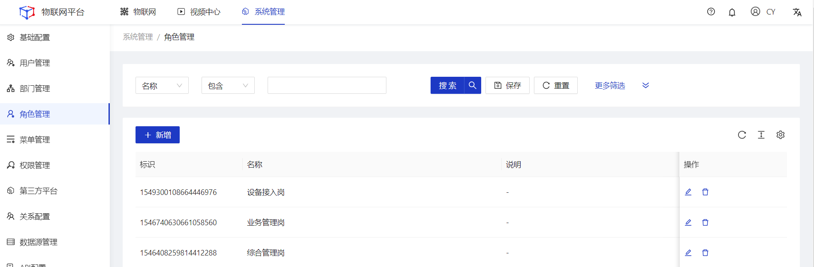
3.鼠标点击**新增**按钮，填写角色名称，然后点击**确定**。 
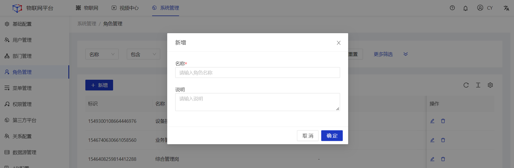
4.点击具体角色的**编辑**按钮，进入详情页，勾选所需的菜单、操作、数据权限，然后点击**保存**。 
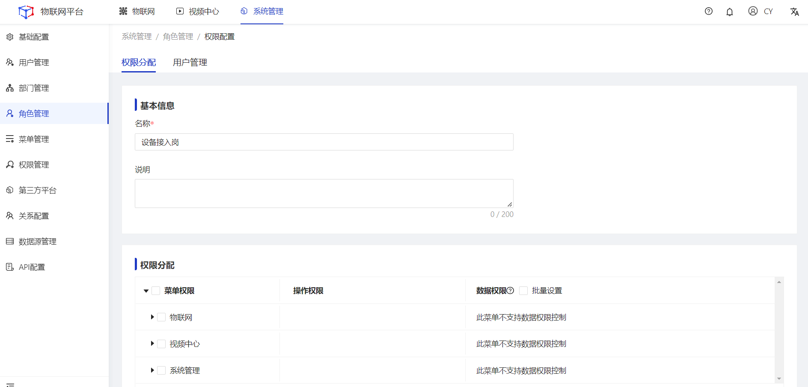

  

    
    说明
  

勾选父菜单会自动关联勾选下属子菜单，以及子菜单中的所有操作权限。数据权限默认是选择自己创建的数据。

##### 后续步骤
1.绑定用户 
在角色详情页，切换至**用户管理**tab页，点击**添加**按钮，将用户与角色关联。 
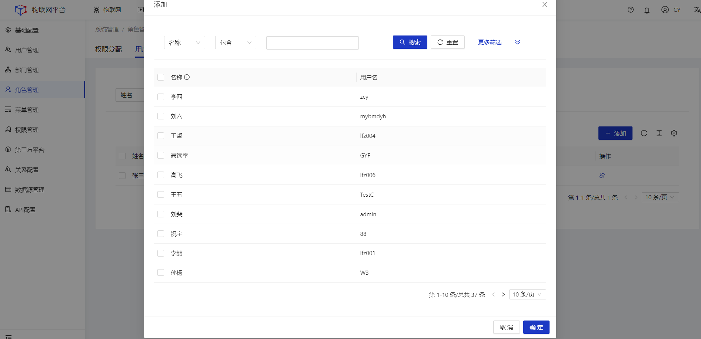
2.解绑用户 
在角色详情页，切换至**用户管理**tab页，勾选已经绑定角色的用户然后点击批量解绑，或直接点击对应用户操作列的**解绑**按钮，可实现批量或单独解绑。

  

    
    说明
  

同一个用户可以绑定多个角色，拥有多个角色权限的并集。

#### 编辑
##### 操作步骤
1.**登录**Jetlinks物联网平台。 
2.点击顶部**系统管理**，在左侧导航栏，选择**角色管理**，进入列表页。 
3.点击具体角色的**编辑**按钮，进入详情页，编辑相关信息，然后点击**保存**。 
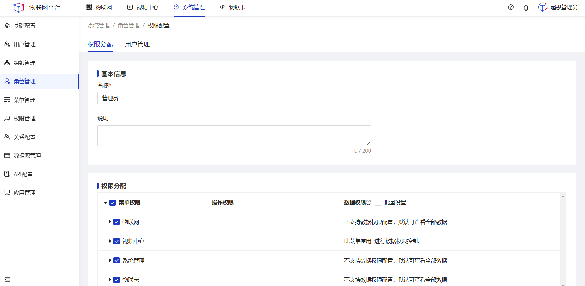

#### 删除
##### 操作步骤
1.**登录**Jetlinks物联网平台。 
2.点击顶部**系统管理**，在左侧导航栏，选择**角色管理**，进入列表页。 
3.点击具体角色的**删除**按钮，然后点击**确定**。 
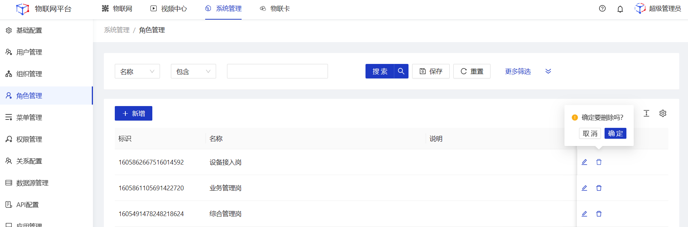

## 菜单管理
统一管理系统内的菜单，可调整菜单基础信息与权限信息。
#### 新增
##### 操作步骤
1.**登录**Jetlinks物联网平台。 
2.点击顶部**系统管理**，在左侧导航栏，选择**菜单管理**，进入列表页。 
3.点击**新增**按钮，进入详情页填写菜单信息，然后点击**保存**。 
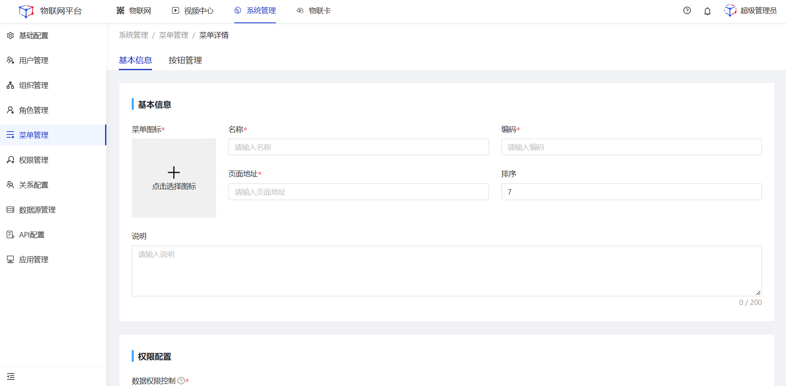

  

    
    说明
  

菜单的数据权限由后端代码控制，若后端代码不支持数据权限，即使前端页面配置为支持数据权限也无法生效。

4.（可选操作）点击切换至**按钮管理**tab，点击**新增**按钮，在弹框页面填写按钮权限信息，然后点击**保存**。 
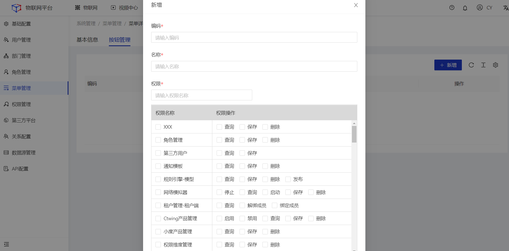

#### 菜单配置
##### 操作步骤
1.**登录**Jetlinks物联网平台。 
2.点击顶部**系统管理**，在左侧导航栏，选择**菜单管理**，进入列表页。 
3.点击页面左侧的**菜单配置**按钮，进入详情页。 
4.拖拽左侧源菜单至右侧系统菜单中，然后点击保存。 
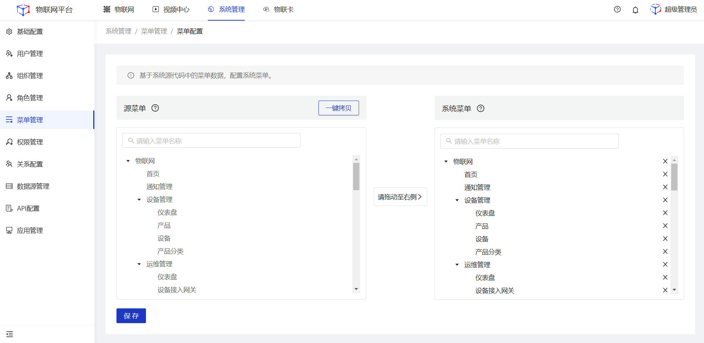

  

    
    说明
  

源菜单基于系统代码自动读取而来，系统菜单为展现在菜单管理页面中的菜单数据。 
同一个源菜单，只能配置一次。拖动源菜单父节点时会将下属子节点一并移动。

#### 编辑
##### 操作步骤
1.**登录**Jetlinks物联网平台。 
2.点击顶部**系统管理**，在左侧导航栏，选择**菜单管理**，进入列表页。 
3.点击具体菜单的**查看**按钮，进入详情页编辑菜单信息，然后点击**保存**。 
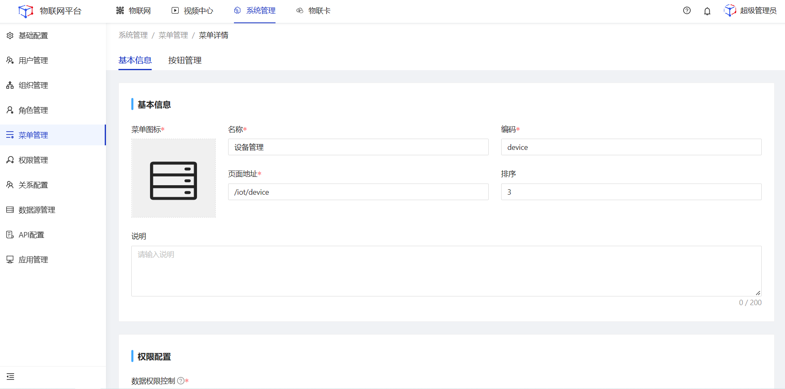

#### 删除
##### 操作步骤
1.**登录**Jetlinks物联网平台。 
2.点击顶部**系统管理**，在左侧导航栏，选择**菜单管理**，进入列表页。 
3.点击具体菜单的**删除**按钮，然后点击**保存**。 
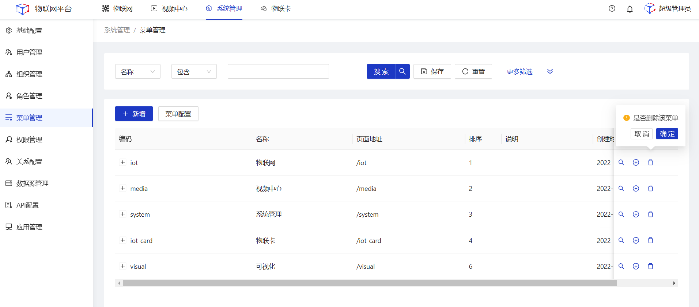

  

    
    说明
  

删除父菜单将一并删除下属子菜单。

## 权限管理
创建、编辑和删除系统权限，作为菜单权限以及按钮权限配置项的数据来源。 
#### 新增
##### 操作步骤
1.**登录**Jetlinks物联网平台。 
2.点击顶部**系统管理**，在左侧导航栏，选择**权限管理**，进入列表页。 
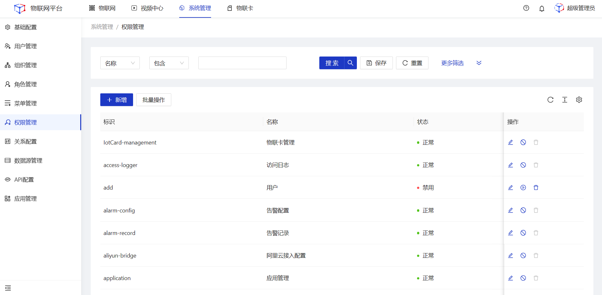
3.点击**新增**按钮，填写权限信息，然后点击**确定**。
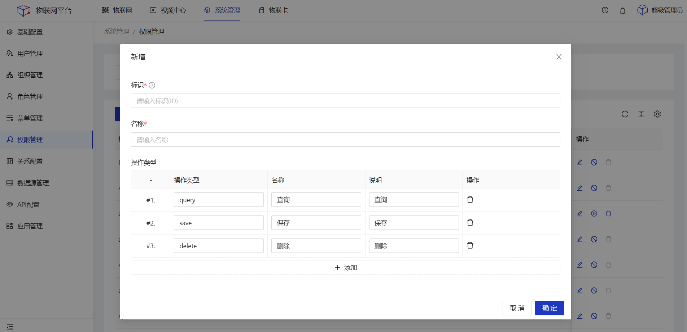

  

    
    说明
  

标识必须与代码中的标识ID一致，否则配置将不生效。

#### 导入
##### 操作步骤
1.**登录**Jetlinks物联网平台。 
2.点击顶部**系统管理**，在左侧导航栏，选择**权限管理**，进入列表页。 
3.鼠标移入**批量操作**按钮，选择**导入**，选择JSON文件后，点击**确定**。 

#### 导出
##### 操作步骤
1.**登录**Jetlinks物联网平台。 
2.点击顶部**系统管理**，在左侧导航栏，选择**权限管理**，进入列表页。 
3.鼠标移入**批量操作**按钮，选择**导出**。 

#### 编辑
##### 操作步骤
1.**登录**Jetlinks物联网平台。 
2.点击顶部**系统管理**，在左侧导航栏，选择**权限管理**，进入列表页。 
3.点击具体权限的**编辑**按钮，在弹框页中编辑权限信息，然后点击**确定**。 
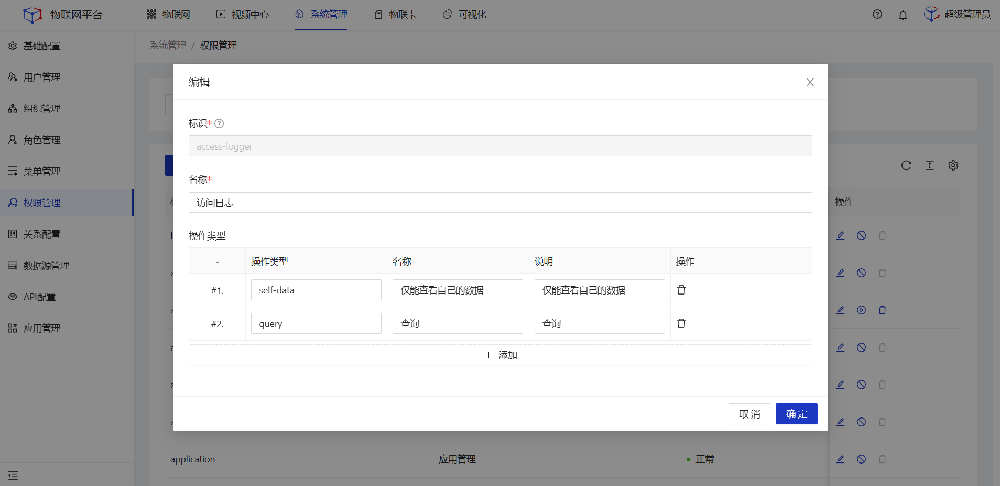

#### 启用/禁用
##### 操作步骤
1.**登录**Jetlinks物联网平台。 
2.点击顶部**系统管理**，在左侧导航栏，选择**权限管理**，进入列表页。 
3.点击具体权限的**启用/禁用**按钮，然后点击**确定**。 
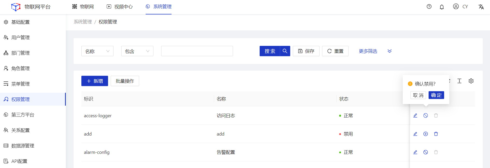

#### 删除
##### 操作步骤
1.**登录**Jetlinks物联网平台。 
2.点击顶部**系统管理**，在左侧导航栏，选择**权限管理**，进入列表页。 
3.点击具体权限的**删除**按钮，然后点击**确定**。 
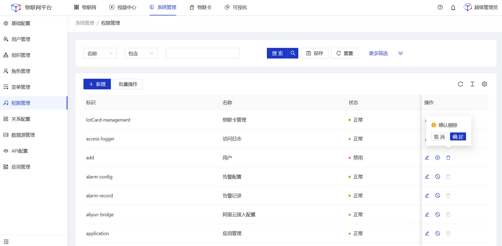

## 第三方平台
第三方平台用户是一个身份实体，代表您的组织中需要访问物联网平台资源的三方系统或应用程序，用于提供对外开放接口的认证方式，第三方平台可以调用平台的API服务。

#### 新增
##### 操作步骤
1.**登录**Jetlinks物联网平台。 
2.点击顶部**系统管理**，在左侧导航栏，选择**第三方平台**，进入列表页。 
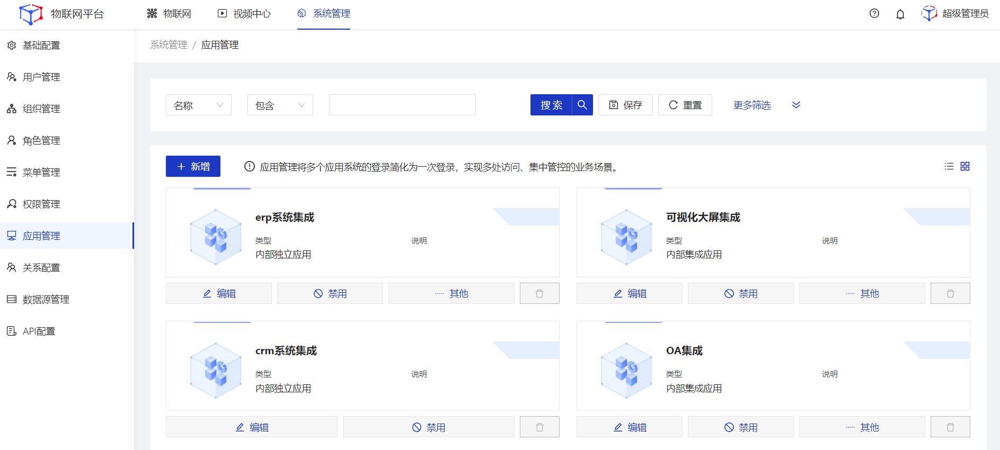
3.点击**新增**按钮，然后点击**确定**。 
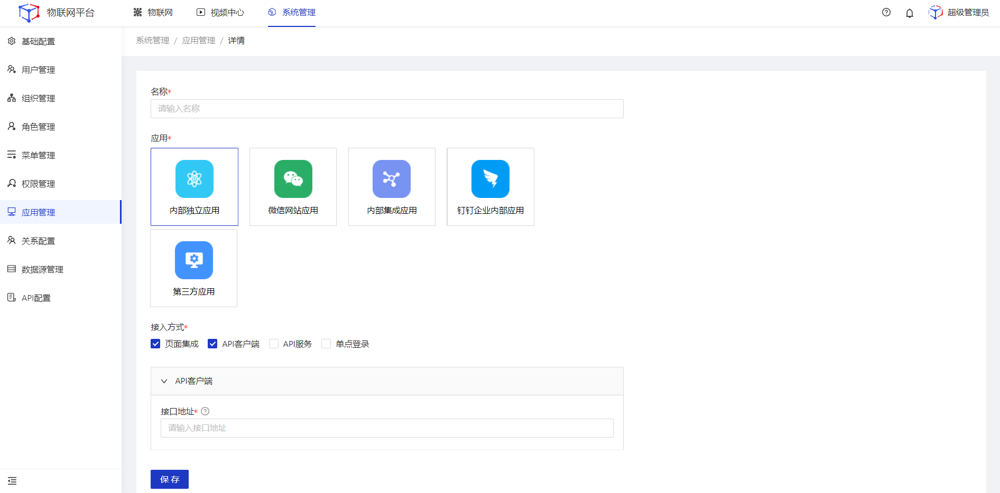

  

    
    说明
  

clientId和secureKey需要提供给客户端开发者。 用户名和密码是系统统一的用户主体,会自动创建到用户管理中，使用此用户名密码也能登录到系统中。

4.点击具体第三方平台的**赋权**按钮，勾选对应的API权限，然后点击**保存**。
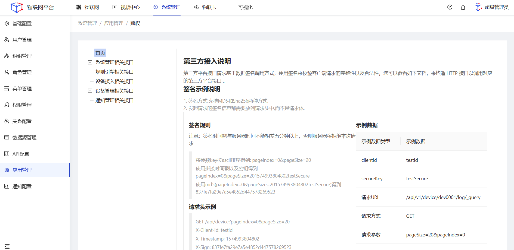

#### 编辑
##### 操作步骤
1.**登录**Jetlinks物联网平台。 
2.点击顶部**系统管理**，在左侧导航栏，选择**第三方平台**，进入列表页。 
3.点击具体第三方平台的**编辑**按钮，在弹框页中编辑第三方平台信息，然后点击**确定**。 
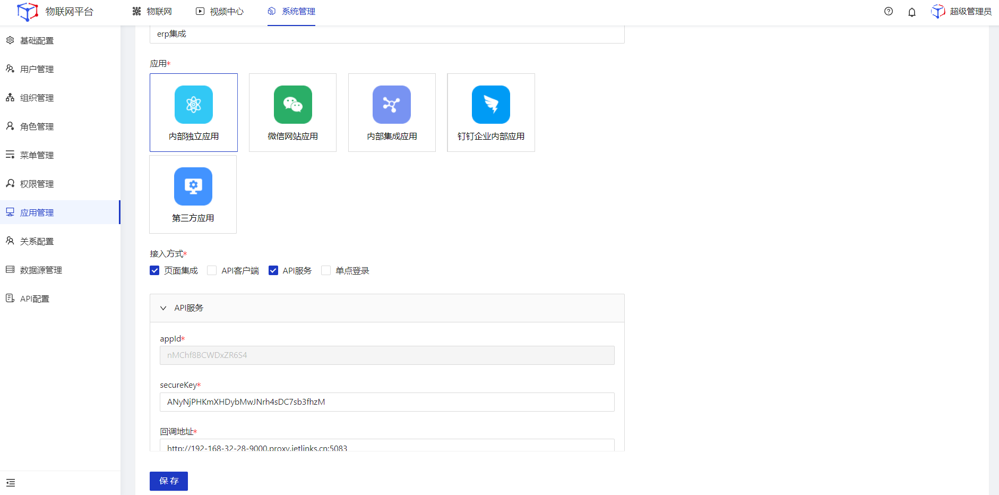

#### 重置密码
##### 操作步骤
1.**登录**Jetlinks物联网平台。 
2.点击顶部**系统管理**，在左侧导航栏，选择**第三方平台**，进入列表页。 
3.点击具体第三方平台的**重置密码**按钮，在弹框页中填写密码，然后点击**确定**
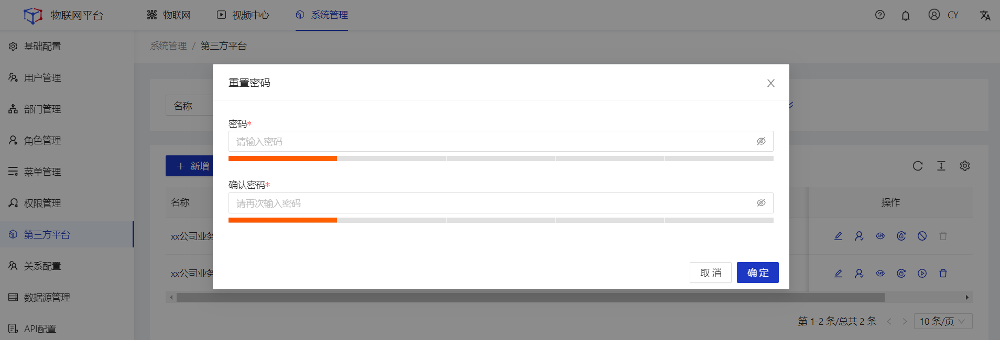

#### 启用/禁用
##### 操作步骤
1.**登录**Jetlinks物联网平台。 
2.点击顶部**系统管理**，在左侧导航栏，选择**第三方平台**，进入列表页。 
3.点击具体第三方平台的**启用/禁用**按钮，然后点击**确定**
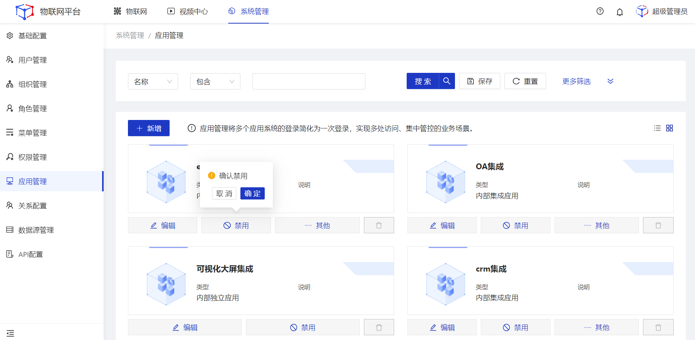

#### 删除
##### 操作步骤
1.**登录**Jetlinks物联网平台。 
2.点击顶部**系统管理**，在左侧导航栏，选择**第三方平台**，进入列表页。 
3.点击具体第三方平台的**删除**按钮，然后点击**确定**
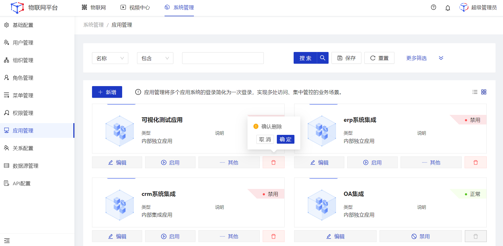

## 关系配置
自定义系统内，各类数据资产之间的**关系**。该关系可用于系统其他功能进行调用，例如设备与用户的关系可用于场景联动引用。

  

    
    说明
  

目前系统只支持设备与用户之间的关系配置。该配置在系统内全局生效。

#### 新增
##### 操作步骤
1.**登录**Jetlinks物联网平台。 
2.点击顶部**系统管理**，在左侧导航栏，选择**关系配置**，进入列表页。 
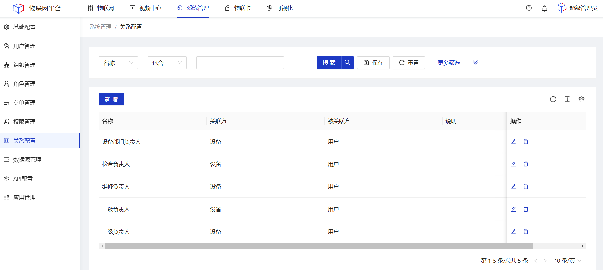
3.点击**新增**按钮，在弹框页填写关系信息，然后点击**确定**。 
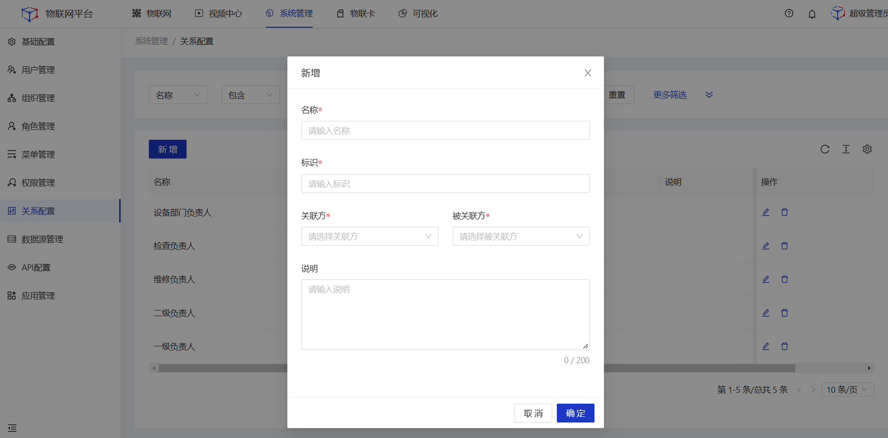
4.选择需要**配置关系**的设备，进入设备**实例信息**页面，点击关系配置的**编辑**按钮，填写关系，然后点击**保存**。 
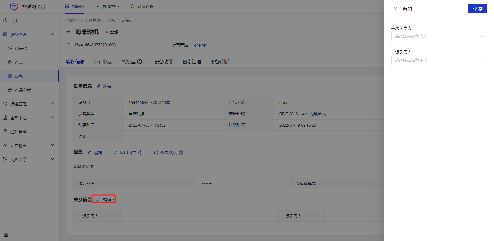

#### 编辑
##### 操作步骤
1.**登录**Jetlinks物联网平台。 
2.点击顶部**系统管理**，在左侧导航栏，选择**关系配置**，进入列表页。 
3.点击具体配置数据**编辑**按钮，在弹框页编辑关系信息，然后点击**确定**。 
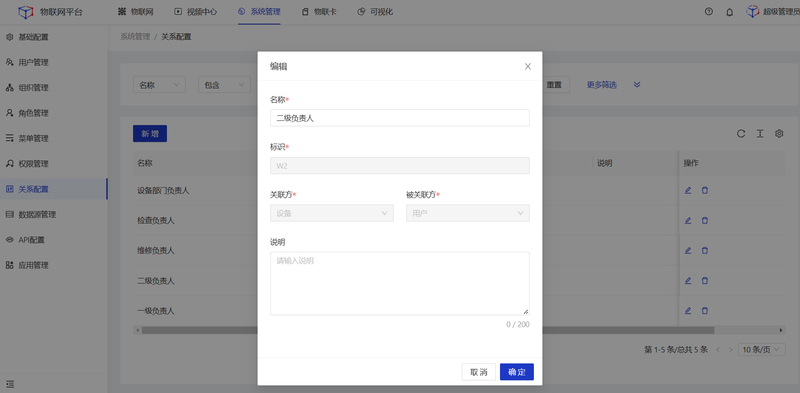

#### 删除
##### 操作步骤
1.**登录**Jetlinks物联网平台。 
2.点击顶部**系统管理**，在左侧导航栏，选择**关系配置**，进入列表页。 
3.点击具体配置数据**删除**按钮，然后点击**确定**。 
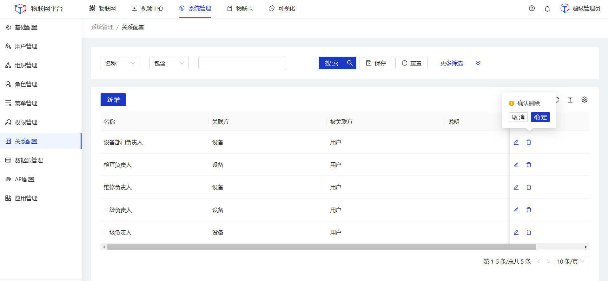

## 数据源管理
统一维护管理系统内的数据源信息，配置的数据源可被系统其他模块引用，例如规则编排。
#### 新增
##### 操作步骤
1.**登录**Jetlinks物联网平台。 
2.点击顶部**系统管理**，在左侧导航栏，选择**数据源管理**，进入列表页。 
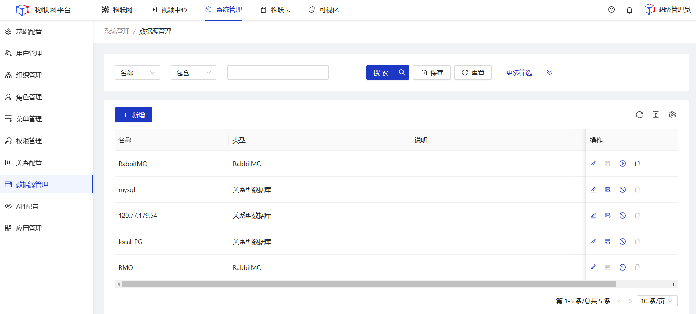
3.点击**新增**按钮，在弹框页填写信息，然后点击**确定**。 
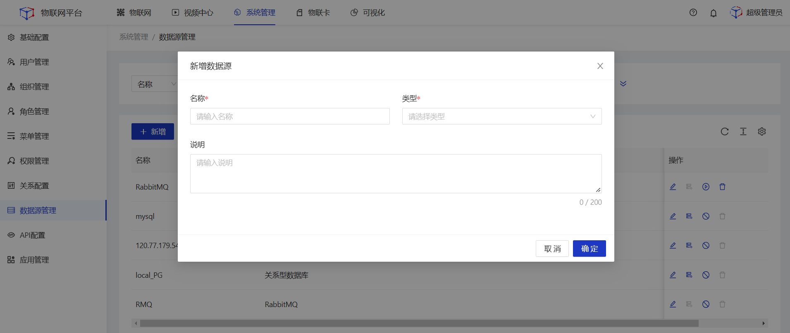
4.点击**管理**按钮，进入详情页，点击右侧页面的**新增行**按钮，填写列表信息，然后点击右上角**保存**。
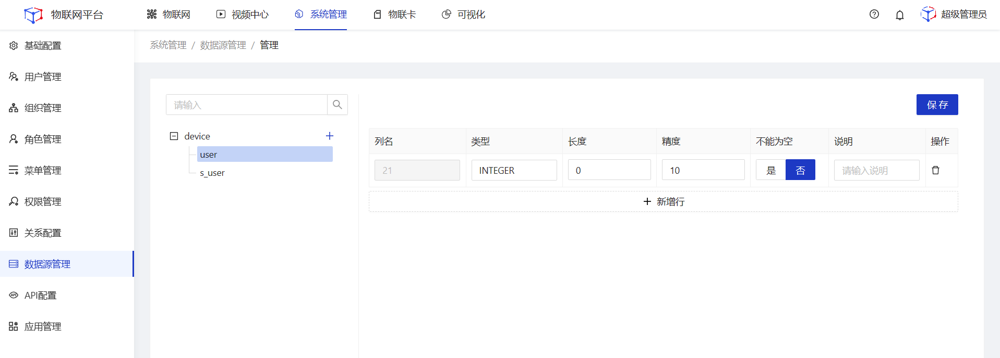

  

    
    说明
  

禁用状态下，管理按钮不可点击。

#### 启用/禁用
##### 操作步骤
1.**登录**Jetlinks物联网平台。 
2.点击顶部**系统管理**，在左侧导航栏，选择**数据源管理**，进入列表页。 
3.点击具体数据源的**启用/禁用**按钮，然后点击**确定**。 
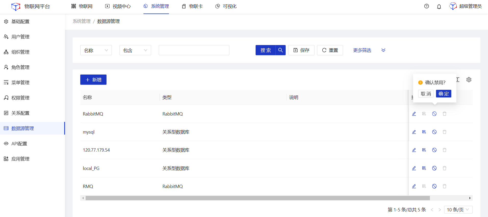

#### 删除
##### 操作步骤
1.**登录**Jetlinks物联网平台。 
2.点击顶部**系统管理**，在左侧导航栏，选择**数据源管理**，进入列表页。 
3.点击具体数据源的**删除**按钮，然后点击**确定**。 

## API配置
统一配置系统内对外输出的API服务，API配置将在为第三方平台赋权时引用。
##### 操作步骤
1.**登录**Jetlinks物联网平台。 
2.点击顶部**系统管理**，在左侧导航栏，选择**API配置**，进入详情页。 
3.勾选需要支持对外输出的API服务，然后点击**保存**。 

