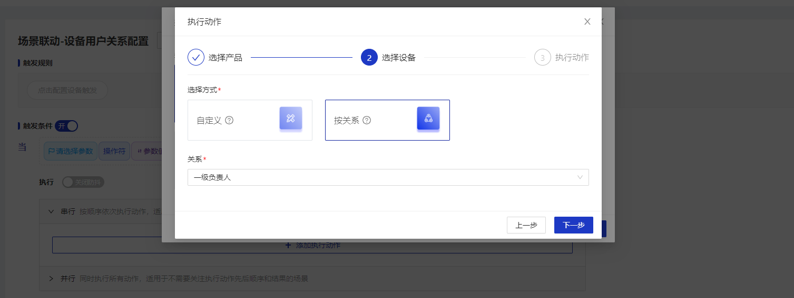

## 关系配置

  

    
    说明
  

 自定义系统内，各类数据资产之间的关系。该关系可用于系统其他功能进行调用，例如设备与用户的关系可用于场景联动引用。

## 指导介绍

  
1. <a href="/System_settings/System_relation_configuration.html#新增" >新增</a>

  
2. <a href="/System_settings/System_relation_configuration.html#编辑" >编辑</a>

  
3. <a href="/System_settings/System_relation_configuration.html#删除" >删除</a>

  
4. <a href="/System_settings/System_relation_configuration.html#按照关系进行场景联动">按照关系进行场景联动</a>

  

    
    说明
  

目前系统只支持设备与用户之间的关系配置。该配置在系统内全局生效。

## 新增
### 操作步骤
1.**登录**Jetlinks物联网平台。 
2.点击顶部**系统管理**，在左侧导航栏，选择**关系配置**，进入列表页。 

3.点击**新增**按钮，在弹框页填写关系信息，然后点击**确定**。 

4.选择需要**配置关系**的设备，进入设备**实例信息**页面，点击关系配置的**编辑**按钮，填写关系，然后点击**保存**。 

## 编辑
### 操作步骤
1.**登录**Jetlinks物联网平台。 
2.点击顶部**系统管理**，在左侧导航栏，选择**关系配置**，进入列表页。 
3.点击具体配置数据**编辑**按钮，在弹框页编辑关系信息，然后点击**确定**。 

## 删除
### 操作步骤
1.**登录**Jetlinks物联网平台。 
2.点击顶部**系统管理**，在左侧导航栏，选择**关系配置**，进入列表页。 
3.点击具体配置数据**删除**按钮，然后点击**确定**。 

## 按照关系进行场景联动

  

    
    说明
  

按照关系进行场景联动时：
  
1.触发方式要选择设备触发

  
2.执行动作类型要选择设备输出

### 操作步骤
1.**登录**Jetlinks物联网平台。 
2.点击顶部**物联网**，在左侧导航栏，点击**规则引擎**，选择**场景联动**，进入列表页。 
3.点击**新增**按钮，在弹框页填写名称，触发方式选择设备触发，然后点击**确定**。 
4.添加执行动作,选择设备时,选择按关系,点击**下一步**，添加动作类型,点击**确定**

5.[场景联动更多详情配置：参考场景联动](/dev-guide/scene-link.html#定时触发)

