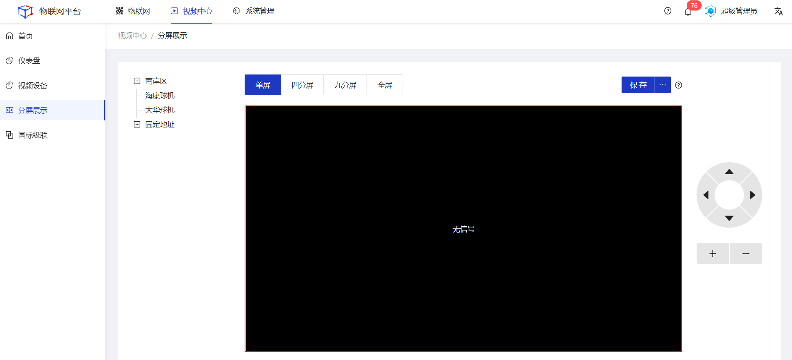

## 分屏展示

分屏展示对摄像头监控画面进行播放，支持单屏，四分屏，九分屏，和全屏，对于可以旋转的摄像头也可以通过右边的操作按钮调整摄像头方向。 

#### 查看
##### 操作步骤
1.**登录**Jetlinks物联网平台。
2.点击顶部**视频中心**，在左侧导航栏，选择**分屏展示**，进入详情页。
3.点击左侧通道树，点击需要被查看的通道。

##### 后续步骤
1.保存分屏信息
点击页面右上角**保存**按钮，可保存当前页面所选择的通道数据，后续进入该页面时，点击点击保存按钮右侧的折叠按钮，可选择保存的分屏展示信息。

