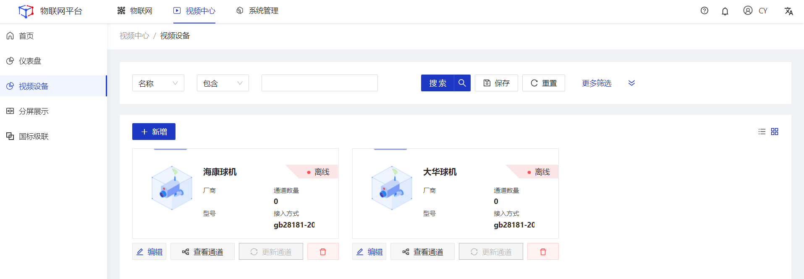
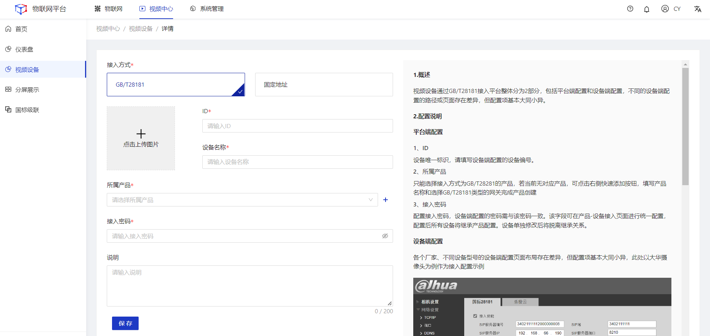
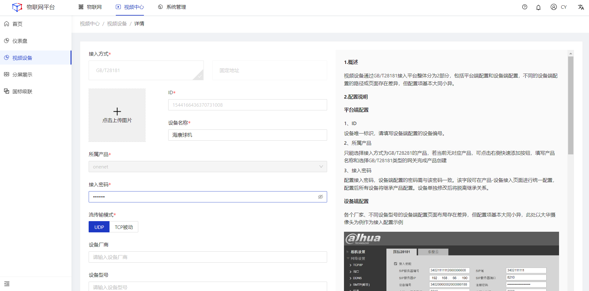
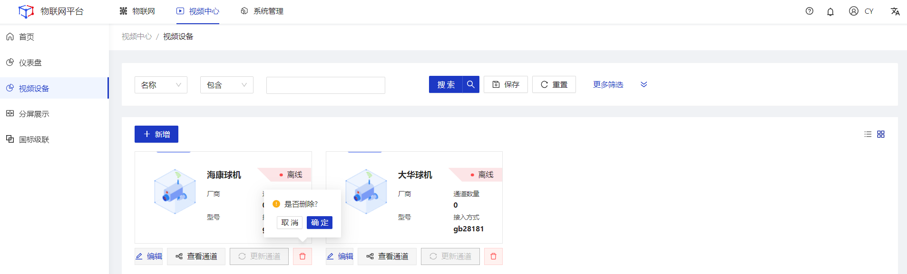
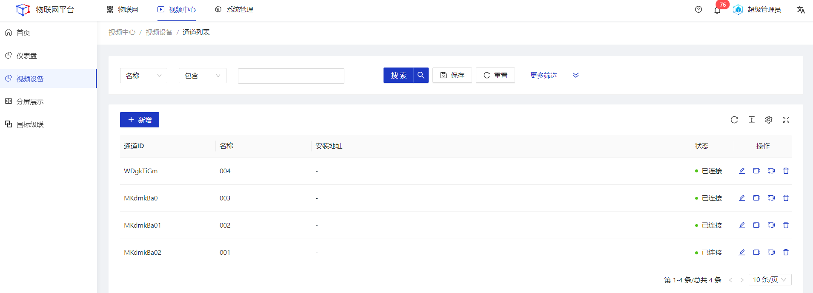
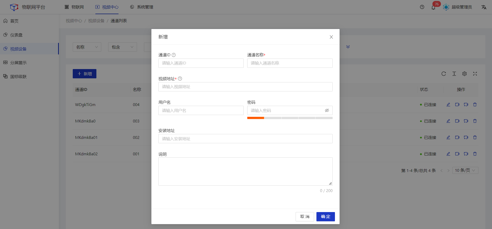
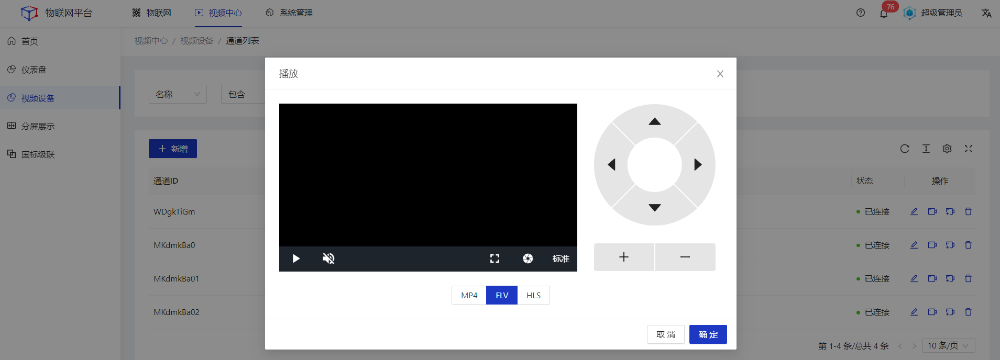
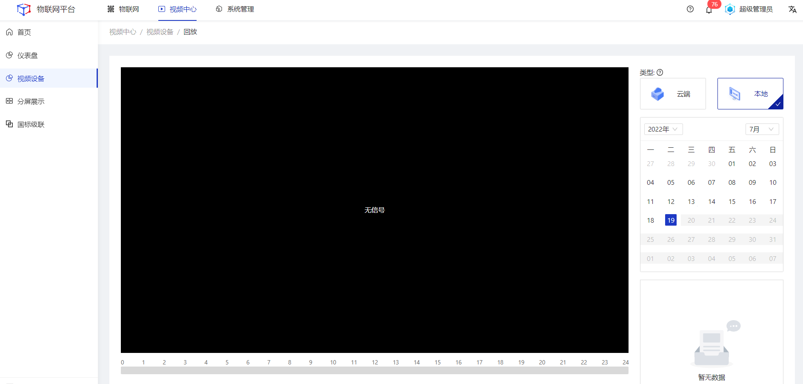

# 视频设备

  

    
    说明
  

视频设备是对系统内所有视频类设备的统一接入与管理。支持GB/T28181和固定地址2种方式的接入。

## 指导介绍

  
1. <a href="/Video_Center/Video_equipment10_device.html#新增">新增</a>

  
2. <a href="/Video_Center/Video_equipment10_device.html#编辑">编辑</a>

  
3. <a href="/Video_Center/Video_equipment10_device.html#删除">删除</a>

  
4. <a href="/Video_Center/Video_equipment10_device.html#查看通道">查看通道</a>

  
5. <a href="/Video_Center/Video_equipment10_device.html#更新通道">更新通道</a>

  
 
    
    提示
  

本功能仅在企业版中提供。

## 新增
### 操作步骤
1.**登录**Jetlinks物联网平台。 
2.点击顶部**视频中心**，在左侧导航栏，选择**视频设备**，进入列表页。 

3.点击**新增**按钮，进入详情页，填写设备信息，然后点击**保存**。 

  

    
    说明
  

接入密码需与设备端配置的接入密码一致。

## 编辑
### 操作步骤
1.**登录**Jetlinks物联网平台。 
2.点击顶部**视频中心**，在左侧导航栏，选择**视频设备**，进入列表页。 
3.点击具体数据的**编辑**按钮，进入详情页，编修所需要修改的信息，然后点击**确定**按钮。 

  

    
    说明
  

接入方式不可编辑。

## 删除
### 操作步骤
1.**登录**Jetlinks物联网平台。 
2.点击顶部**视频中心**，在左侧导航栏，选择**视频设备**，进入列表页。 
3.点击具体数据的**删除**按钮，然后点击**确定**。 

## 查看通道
### 操作步骤
1.**登录**Jetlinks物联网平台。 
2.点击顶部**视频中心**，在左侧导航栏，选择**视频设备**，进入列表页。 
3.点击具体数据的**查看通道**按钮，进入详情页。 

### 后续操作
1.新增通道 
点击页面左上角新增按钮，填写通道信息。

  

    
    说明
  

 只有固定地址接入类型的设备才可以新增通道。

2.播放通道实时视频流 

3.回放视频 

  

    
    说明
  

<li>云端：存储在服务器中</li>
<li>本地：存储在设备本地</li>

4.删除通道 
点击通道操作列的**删除**按钮，然后点击确定。

  

    
    说明
  

  只有固定地址接入类型的设备才可以删除通道。

## 更新通道
1.**登录**Jetlinks物联网平台。 
2.点击顶部**视频中心**，在左侧导航栏，选择**视频设备**，进入列表页。 
3.点击具体数据的**更新通道**按钮。 

  

    
    说明
  

  状态为离线的设备，更新通道按钮不可点击。

