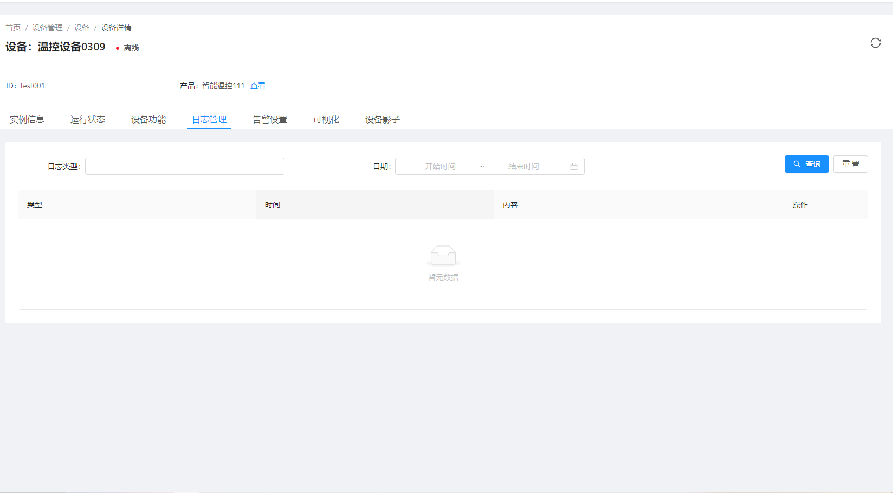
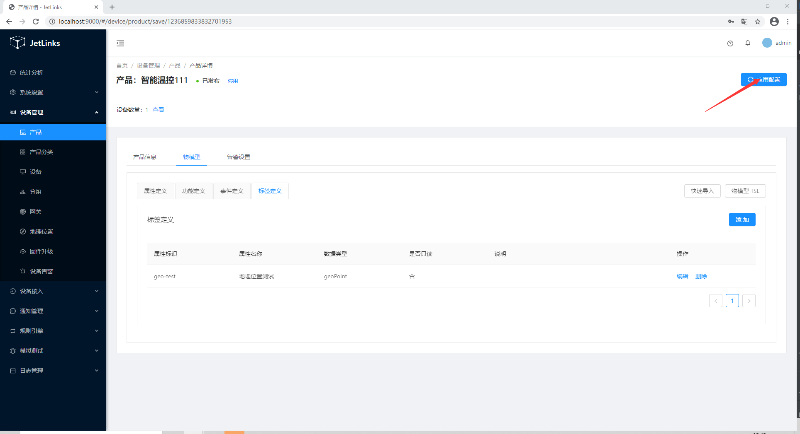

# 使用MQTT服务网关接入设备

本文档以MQTT.fx为例，介绍使用第三方软件以MQTT协议接入物联网平台。MQTT.fx是一款基于Eclipse Paho，使用Java语言编写的MQTT客户端工具。支持通过Topic订阅和发布消息。

## 创建协议

> 自定义消息协议创建，请参考[消息协议定义](../basics-guide/protocol-support.md)。

**例**

i. 选择 `设备接入`-->`协议管理`--> 点击`新建`按钮


ii.输入协议ID

iii. 输入型号名称

iv. 选择型号类型为 `jar`

v. 输入类名`org.jetlinks.demo.protocol.DemoProtocolSupportProvider`

vi. 上传jar包`demo-protocol-1.0.jar`，  请检出[demo-protocol](https://github.com/jetlinks/demo-protocol)自行打包。

vii. 点击确认，完成协议新增。

### 创建完成信息展示  


viii. 在操作列表中将协议发布。

## 创建产品

**例**

i.下载型号文件[配置JSON](../basics-guide/files/device-connection/设备型号-智能温控.json)

ii. 选择 `设备管理`-->`产品`--> 点击`导入配置`按钮


iii. 选择[配置JSON](../basics-guide/files/device-connection/设备型号-智能温控.json)文件

::: tip 注意：
上传文件需要将standalone/src/main/resources/application.yml中的static-location修改为  
http://后台服务ip:8848/upload，参考[协议上传问题](../common-problems/install.md#协议发布失败或出现不支持的协议：xxx)
:::

iv.产品导入完成后，产品状态为`未发布`,效果如下图

  

 v.点击刚导入产品中的`...`按钮会出现`发布`按钮，点击`发布`按钮完成产品发布，导航栏中发布状态变为`已发布`代表发布成功。  


### 创建成功的产品信息展示 

i. 点击产品中`编辑`链接查看和编辑产品的基本信息


ii. 点击产品中`查看`→`物模型`,对产品设备定义


iii. 点击属性定义信、事件定义对应操作下的编辑按钮查看更详细的型号息  

属性定义参数：  
  

功能定义参数：  
  

事件定义参数：  


## 创建设备

> 自定义创建设备，请参考[添加设备](../basics-guide/device-manager.md#添加设备)。

**例**

i. 下载设备Excel文件[设备Excel](../basics-guide/files/device-connection/智能温控测试设备.xlsx)

ii. 选择 `设备管理`-->`设备`--> `其他批量操作`-->`批量导入设备`


iii. 选择需要导入的产品,点击文件上传  

  

iv. 设备导入完成效果如下图


v. 点击上图中`启用`链接完成设备激活，状态栏中发布状态变为`离线`代表设备激活成功。


### 创建成功的设备信息展示

i. 点击查看链接可以看到设备基本信息（实例信息）


ii. 设备运行状态信息（运行状态）


iii.设备功能信息（设备功能）


iv. 设备日志（日志管理）



v.告警设置


vi.可视化


vii.设备影子


## 创建网关配置

参照[启动设备网关服务](../basics-guide/course/device-gateway.md)

**例**
i.创建MQTT服务网络组件以及MQTT服务组件配置 

::: tip 注意：
此处使用的端口为1889，docker启动时没有默认开启，使用docker启动jetlinks时请映射1889端口或者使用1883端口。  
:::
ii.启动MQTT服务组件（灰色为未启动，蓝色为启动）


iii.创建MQTT服务设备网关以及MQTT服务设备网关配置  


iv.启动MQTT服务设备网关，点击 `启动`，`状态`变为`已启动`


::: tip 注意：
大部分情况无需选择认证协议. 
:::
## 使用MQTT.fx接入

1.下载并安装MQTT.fx软件。请访问[MQTT.fx官网](https://mqttfx.jensd.de/index.php/download?spm=a2c4g.11186623.2.16.20ab5800HxuVJR)。

2.打开MQTT.fx软件，单击设置图标。


3.设置连接参数。

::: tip 注意
设置参数时，请确保参数值中或参数值的前后均没有空格。
:::

i. 设置基本信息


| 参数         | 说明    |
| :-----   | :-----  |
| Profile Name       | 输入您的自定义名称。   |
| Profile Type        |   选择为**MQTT Broker**。   |

MQTT Broker Profile Settings

| 参数         | 说明    |
| :-----   | :-----  |
| Broker Address       | 连接域名。本地连接可直接填写 `127.0.0.1`,如为远程连接，请填写远程连接地址 |
| Broker Port        |   设置为`1889`   |
| Client ID        |    设备Id。本文档中为演示设备`test001`   |

General栏目下的设置项可保持系统默认，也可以根据您的具体需求设置。

ii. 单击User Credentials，设置User Name和Password。

> 在消息协议未定义前,username,password可以填写任意字符,但是不能留空。


| 参数         | 说明    |
| :-----   | :-----  |
| User Name       | 由[消息协议定义](../basics-guide/protocol-support.md)中决定User Name值（消息协议未定义时可填写任意值）   |
| Password         |   由[消息协议定义](../basics-guide/protocol-support.md)中决定Password值  （消息协议未定义时可填写任意值） |

4.设置完成后，单击右下角的**OK**。

## 设备消息

设备连接上平台，并进行一些基本的事件收发、属性读取操作。

### 设备上下线

单击 Mqtt fx 中`Connect`进行连接


平台中设备状态变为上线即为连接成功


点击该设备的`查看`→`日志管理`，在设备日志模块可以看到设备上线日志


单击 Mqtt fx 中`Disconnect`断开连接


平台中设备状态变为离线即为断开连接成功


点击该设备的`查看`→`日志管理`，在设备日志模块可以看到设备离线日志


### 读取设备属性
::: tip 注意
第2步中回复平台属性值需要在第1步平台发送订阅以后的十秒钟内完成，否则平台会视为该次操作超时，导致读取属性值失败。
:::

1.平台告知设备（MQTT.fx）需要设备返回设备属性

在MQTT.fx上订阅消息，订阅物联网平台下发设备返回属性的Topic

i.  在MQTT.fx上，单击Subscribe。

ii. 输入平台获取设备属性会发送给网关的topic`/read-property`

iii.  单击Subscribe，订阅这个topic


iv. 平台发送订阅操作

单击设备页面中`test001`设备对应的`查看`链接

选择弹出框中`运行状态板块`

单击属性刷新


v. 订阅topic: `/read-property`对应的消息


::: tip 注意:
 复制好订阅该topic收到的消息中的messageId。此messageId将作为回复与平台设备属性的凭据之一
:::

2.设备（MQTT.fx）回复平台设备属性值

在MQTT.fx上发送消息，发送平台所需要的设备属性值。

i.  在MQTT.fx上，单击 `Publish`。

ii.  输入一个回复平台属性值消息Topic和要发送的消息内容，单击Publish，向平台推送该消息。


| 参数         | 说明    |
| :-----   | :-----  |
| messageId       | 第一步订阅平台topic“/read-property”所收到的messageId值   |
| deviceId        |   设备Id   |
| timestamp        |   当前时间戳   |
| success        |   成功标识   |
| properties        |   设备属性值对象。例如： { "threshold":"50"}   |

该文档所使用的回复内容

```json
{
    "messageId":"第一步订阅平台topic“/read-property”所收到的messageId值",
    "deviceId":"test001",
    "timestamp":1583809148000,
    "success":true,
    "properties":{
      "temperature":36.5
     }
}
```

iii. 平台收到Mqtt.fx推送的属性值


iv. 读取设备属性回复的日志


#### 获取设备属性值完整演示

::: warning 注意：在下图中，从在界面上刷新属性开始直到动图结束的所有操作，需要在十秒钟内完成。否则平台会视为该次操作超时，导致读取属性值失败。
:::


### 设备事件上报

MQTT.fx 推送设备事件消息到平台

以火灾报警事件为例。

1.在MQTT.fx上，单击 `Publish`。  

2.输入事件上报Topic和要发送的事件内容，单击Publish按钮，向平台推送该事件消息。


该文档使用的topic: `/fire_alarm`

该文档所使用的回复内容

```json
{
   "deviceId":"test001",
    "pname":"智能温控",
    "aid":105,
    "a_name":"未来科技城",
    "b_name":"C2 栋",
    "l_name":"12-05-201",
    "timestamp":"2019-11-06 16:28:50",
    "alarm_type":1,
    "alarm_describe":"火灾报警",
    "event_id":1,
    "event_count":1
}
```

| 参数         | 说明    |
| :-----   | :-----  |
| deviceId       | 设备Id   |
| pname        |   产品名称   |
| aid        |   区域Id   |
| a_name        |   区域名称   |
| b_name        |   建筑名称   |
| l_name        |   位置名称   |
| timestamp        |   上报时间   |
| alarm_type        |   报警类型   |
| alarm_describe        |   报警描述   |
| event_id        |   事件 ID   |
| event_count        |   该事件上报次数   |

3.事件上报设备日志


4.事件上报内容


### 地理位置上报

1. 物模型中添加地理位置。通过属性定义添加地理位置类型属性。
    
  
     
2. 在设备产品详情页面点击`应用配置`按钮。  
  

3. 使用mqtt.fx连接到平台，设备上线后推送地理位置消息到平台， 此处使用topic为`/report-property`。  

  

此处使用的报文为：  
```json
{
    "deviceId":"test001",
    "properties":{
      "geo-test": "36.523,102.321"
     }
}
```
::: tip 注意:
上报geo地理位置类型数据有三种格式，一是字符串以逗号分隔，如：`"36.523,102.321"`;  
二是数组类型，如:`[36.523,102.321]`;  
三是map类型，如：`{"lat":36.523,"lon":102.321}`。  
:::

4. 上报成功后将在设备的运行状态中显示。  

  

也可查看上报历史消息。  

  

::: tip 注意：
物模型中的标签也可创建geo类型，但不可通过标签上报地理位置信息，只能通过属性上报。  
地理位置标签将主要运用在地图查询中。  
:::