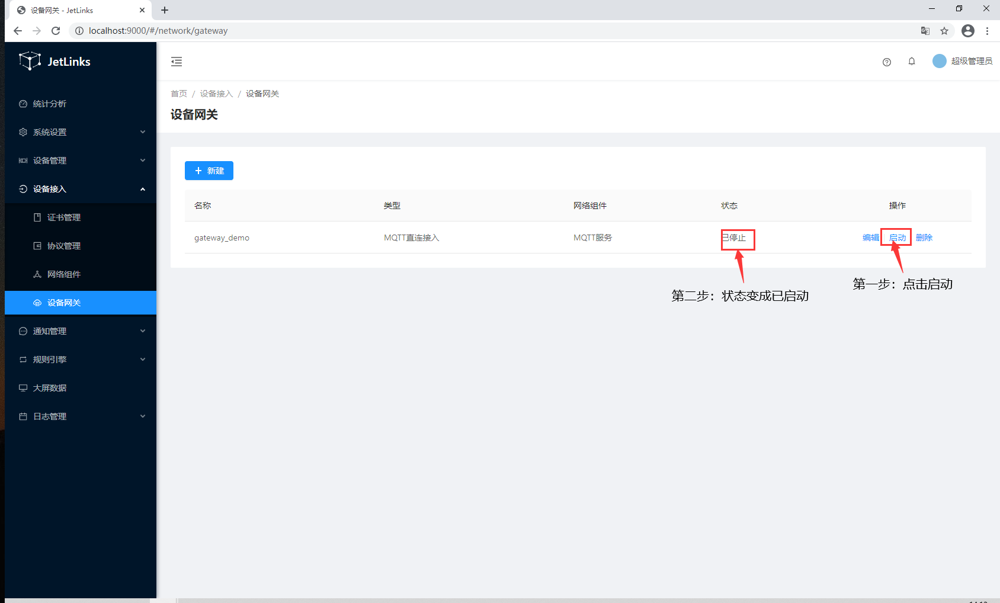
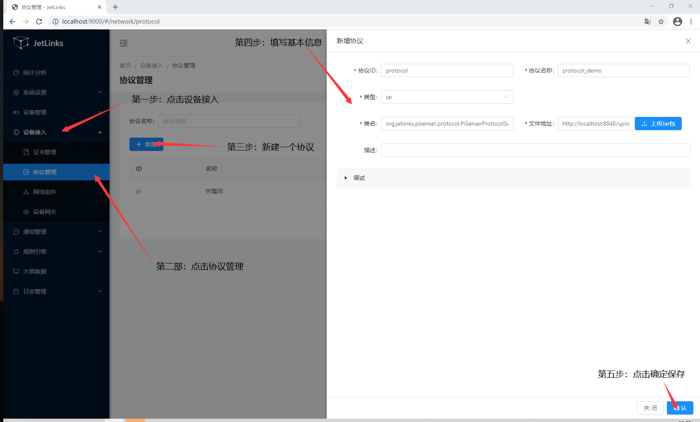
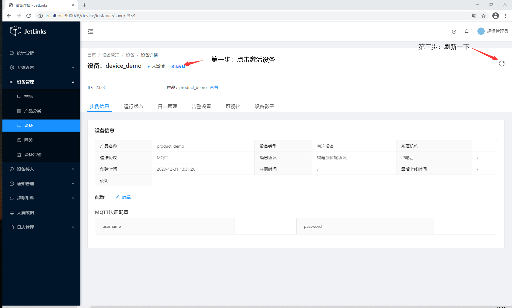
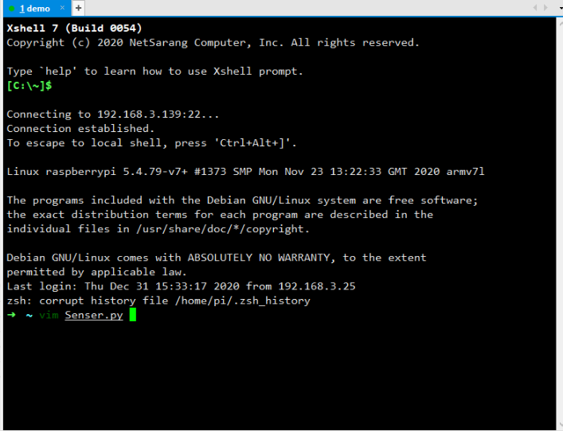
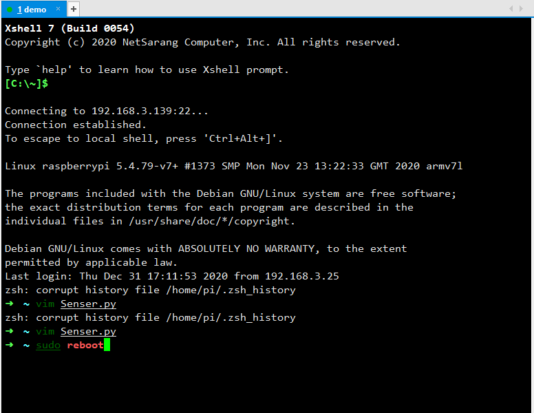

# DemoDevicies手册

## 新建

### 新建网络组件

1.进入系统,点击`设备接入` → `网络组件` → `新增组件`

2.创建完后启动组件（蓝色为启动成功）

### 新建设备网关

1.点击 `设备接入 `→ `设备网关` → `新建`

2.创建成功后，找到刚创建的网关，开启网关

### 创建协议
1.点击 `设备接入` → `协议管理` → `新建`

输入类名org.jetlinks.pisenser.protocol.PiSenserProtocolSupportProvider

2.在操作栏中点击点击`发布`

### 创建产品
1.点击 `设备管理` →`产品`→ `新建`

2.点击新建过后会跳转到创建产品界面，如下图：

3.点击保存过后会跳转到产品基本信息界面，点击 `发布` → `应用配置` ，如图下：

4.导入物模型

·下载快速导入物模型的文件,再点击`应用配置`

### 创建设备:

1.点击 `设备管理` → `设备` → `添加设备`

2.点击保存过后会跳转到设备的基本信息，点击激活设备，如下图：

## 模拟设备接入
1.下载并安装MQTT.fx软件。请访问[MQTT官网](https://mqttfx.jensd.de/index.php/download?spm=a2c4g.11186623.2.16.20ab5800HxuVJR)下载。

2.打开MQTT.fx软件，单击设置图标。

3.填写相应的信息

4.点击 `ok` 保存后，测试连接设备，如下图：

5.返回系统界面,查看设备是否上线，如下图：

6.断开设备连接，如下图：

::: tip 温馨提示：
如果回到系统，设备还是显示的在线，请刷新一下页面
:::

## 真实设备接入
设备通过网线接入路由器后，会通过DHCP协议自动获取IP地址，在路由器界面查询到设备IP地址。

:::warning 注意:
此处的IP地址根据你的实际地址确认
:::

1.下载并安装Xshell软件。请访问[Xshell官网](https://www.xshellcn.com/xiazai.html)下载。

2.打开软件，新建一个会话，点击连接。（主机：192.168.3.139）

:::warning 注意:
此处的IP地址根据你的实际地址确认
:::

3.登录名和密码（name:pi    password:  qwer1234 ）

3.连接设备成功后，执行命令 : $vim Senser.py

4.执行完成后，在最下面修改配置文件（按i键切换为编辑模式）

5.编辑完过后，按ESC键退出编辑，执行命令 ：$:wq保存文件并退出该文件

6.执行$sudo reboot,重启程序,如下图

7.进入系统查看设备是否上线

