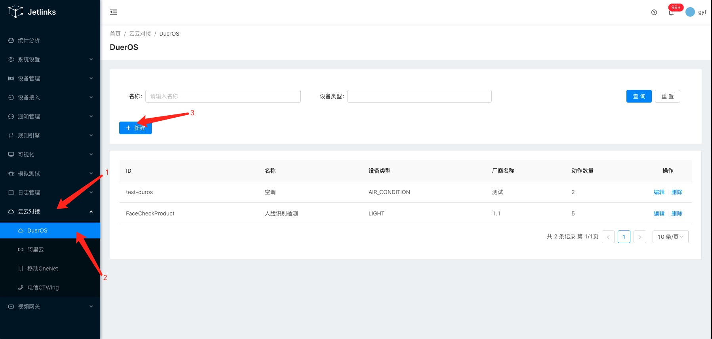
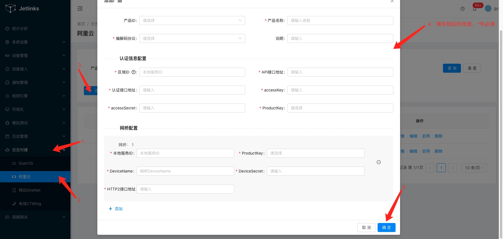
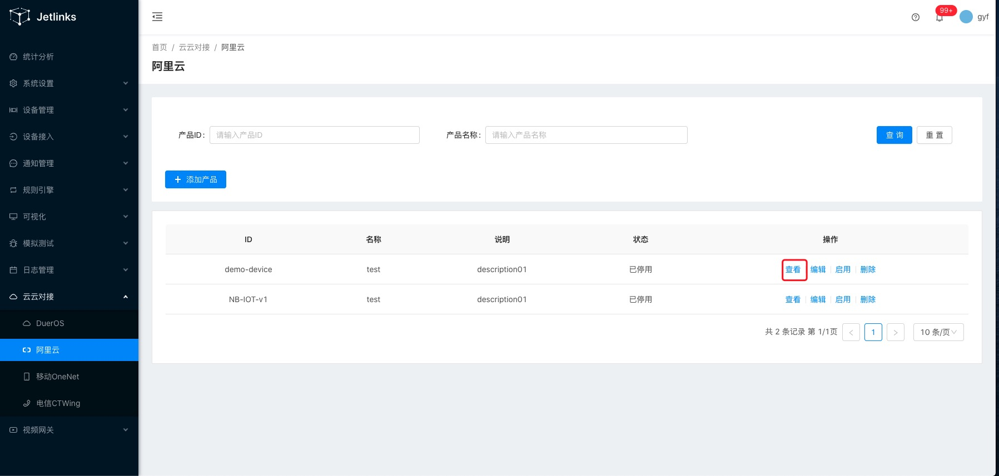
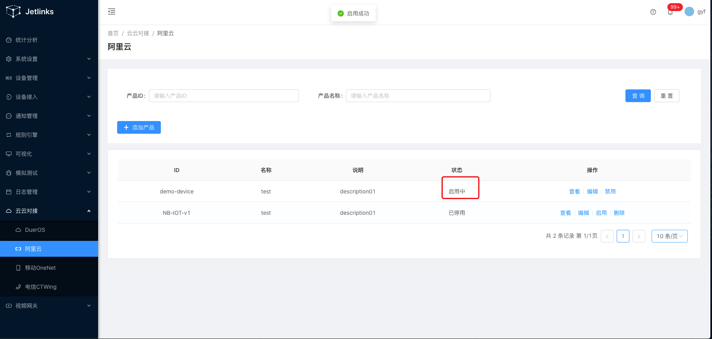
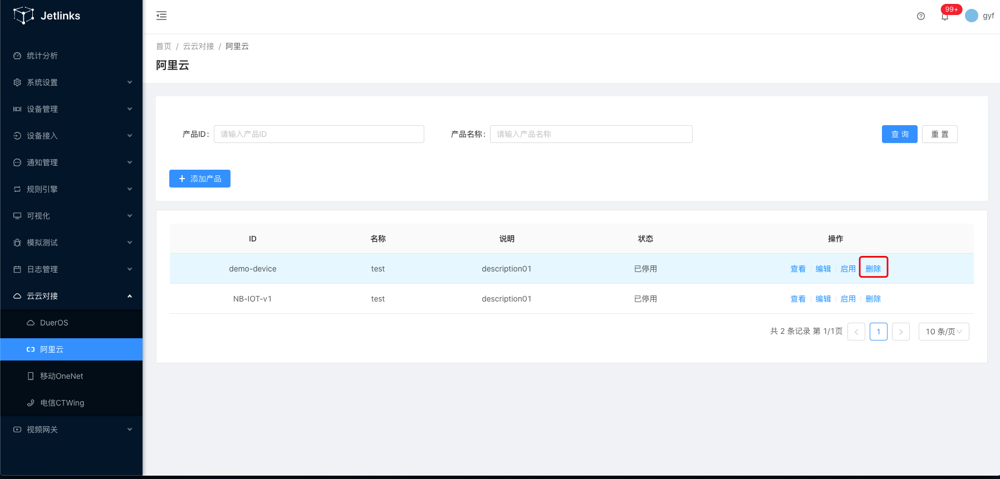
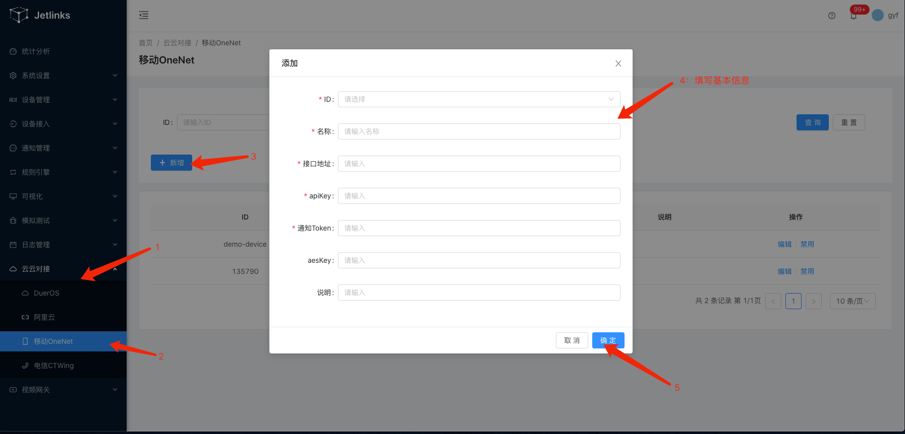
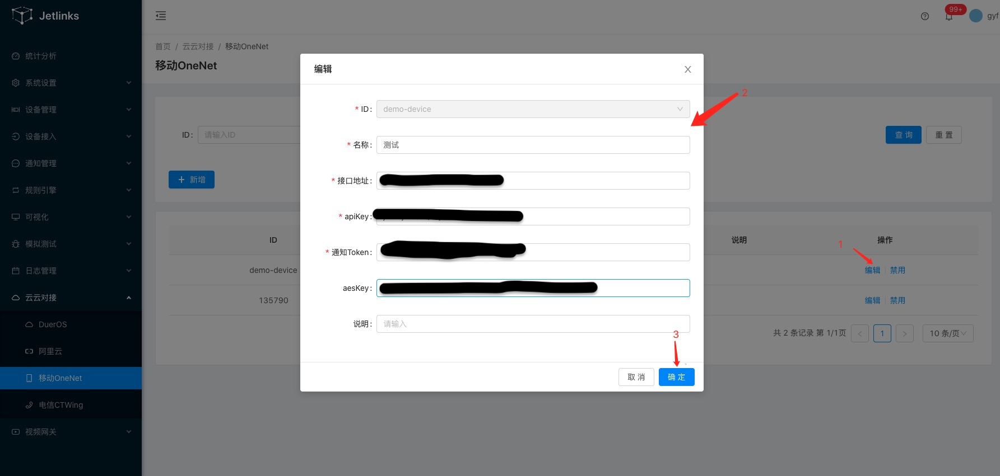
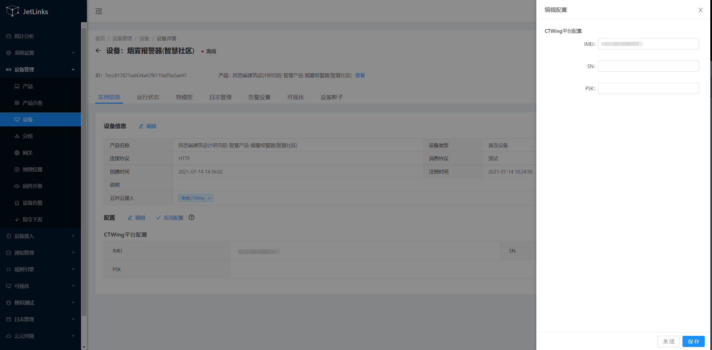

# 云云对接

目前小度，阿里云，移动和电信平台能支持控制jetlinks平台的设备。
## DuerOS

### 新建产品

#### 操作步骤

1、进入系统：`云云对接`-`DuerOS`- `新建`

2、输入必填的产品，名称，厂商名称和设备版本。

3、点击确定进行`保存`。

### 修改

在创建完产品后，可以点击`编辑`来修改创建好的内容。

### 删除

对于不需要的产品可以选择操作栏的`删除`按钮将其删除

##  阿里云

### 新建产品

#### 操作步骤

1、进入系统：`云云对接`-`阿里云`- `添加产品`

2、输入产品所需要的信息。

3、点击确定进行`保存`。

### 查看
在成功创建产品过后，可以点击查看按钮跳转到产品的基本信息页面。

### 修改

在创建完产品后，可以点击`编辑`来修改产品内容，修改完成后点击`保存`。

### 启用与禁用
刚创建的产品默认为禁用状态，在操作栏点击启用按钮，状态栏变为启用中，说明启动成功。

在启动中的设备，操作栏的启动按钮变为禁用。
### 删除

对于不需要的产品可以选择操作栏的`删除`按钮将其删除

::: tip 注意
所有平台启动中的设备不允许删除
:::

## 移动OneNet

### 新建产品

#### 操作步骤

1、进入系统：`云云对接`-`OneNet`- `新增`

2、输入产品基本信息

3、点击确定进行`保存`。

### 修改

在创建完产品后，可以点击`编辑`来修改创建好的内容,修改完成后点击保存。

### 删除

对于不需要的产品可以选择操作栏的`删除`按钮将其删除

##  电信CTWing

1. 新建一个产品
 协议自行开发。默认是HTTP协议。

::: tip
本例默认使用演示协议。
:::
    
2. 新建一个云云对接配置信息

    填入ctwing平台提供的`appKey`、`appSecret`、`masterKey`.
    appKey和appSecret在AEP平台的应用管理里面创建后查看详情里面可以看见
    masterKey在产品详情里面查看'
    ID选择第一步创建的产品。
    点击`确定`
    
3. 创建设备
4. 点击查看详情

配置`IMEI`，IMEI在AEP平台设备管理->设备详情内查看
然后应用配置后，可以看见设备信息内新增一栏云云接入的类型。

5. 接收云云对接的消息推送
进入电信AEP平台，
产品管理->订阅管理->新增订阅->选择订阅的消息类型->填写基本信息及推送消息地址。
消息地址格式：http://host:port/ctwing/产品ID/notify、
host:可访问的公网域名/ip
port:端口
产品ID：第一步新增的产品的ID

6. 查看日志输出 `/ctwing/sx-smart-pro/notify -ctwing通知接口-通知设备消息` 即成功收到了ctwing平台推送的报文

