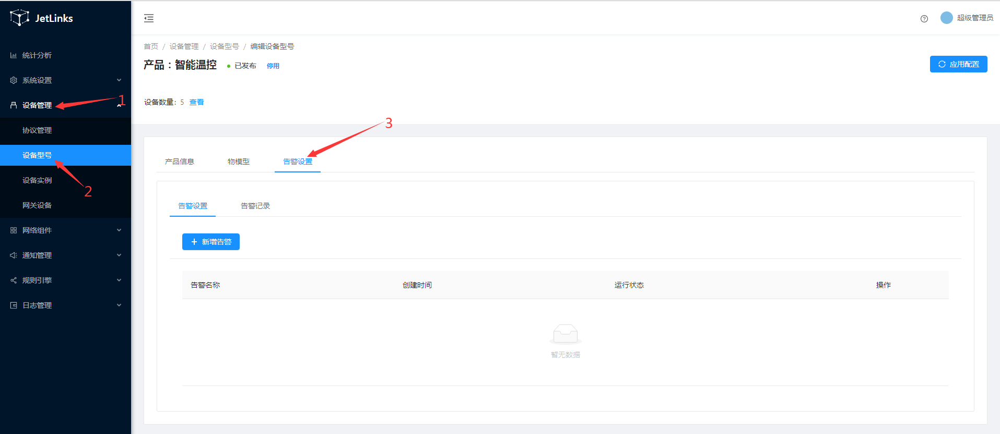
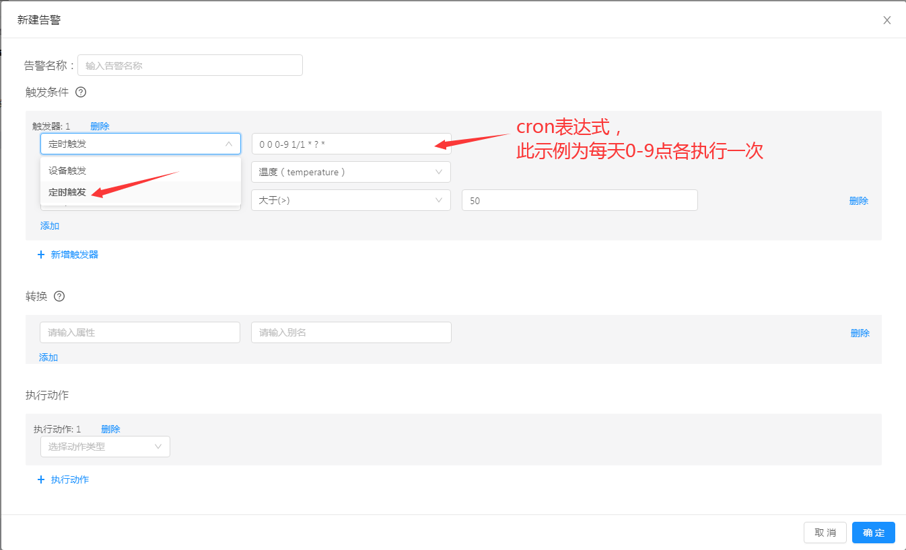

# 设备告警
通过规则引擎来设置告警规则，并启用相应动作如通知来转发告警消息。  

## 配置型号下所有设备的告警规则

### 创建告警
**操作步骤：**
1. 进入系统: `设备管理`-`设备型号`-`告警设置`。  

  

单击`新增告警`进入告警设置页面。  

2. 设置触发条件，告警设置页面默认存在触发器1，点击下拉列表选择触发器类型。  
    i. 定时触发。  
        通过填写cron表达式([在线cron表达式](http://cron.qqe2.com/))的方式定时触发。  
          
        
    ii. 设备触发。  
    
    ::: tip 注意：
    可同时添加多个触发器，任意一个触发器满足条件都将执行。
    :::
3. 设置转换。  

4. 设置执行动作。  

5. 点击`确定`进行保存。  

## 配置单个设备的告警规则