# 设备告警
通过规则引擎来设置告警规则，并启用相应动作如通知来转发告警消息。  

## 配置产品下所有设备的告警规则

### 创建规则
**操作步骤：**
1. 进入系统: `设备管理`-`产品`。  
选择需要设置告警规则的型号，在操作列单击`查看`进入设备型号详情页面。   
  

单击`新增告警`进入告警设置页面。  

2. 设置触发条件，告警设置页面默认存在触发器1，点击下拉列表选择触发器类型。  
    i. 定时触发。  
        通过填写cron表达式([在线cron表达式](http://cron.qqe2.com/))的方式定时触发。  
          
        设置完成后，还可以选择其他基于物模型的触发条件，如事件、属性等。  
        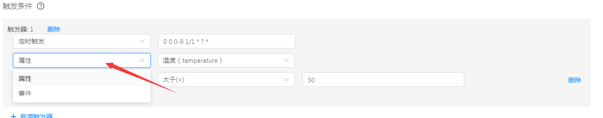  
        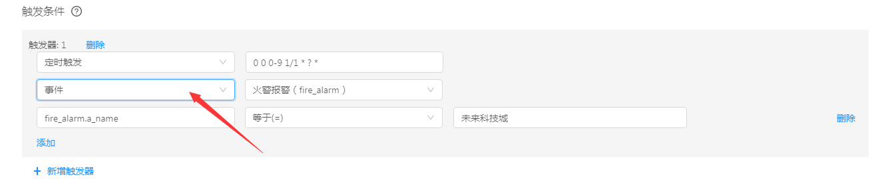  
        
    ii. 设备触发。  
        通过设备上下线以及物模型中定义的属性、事件等进行触发。  
        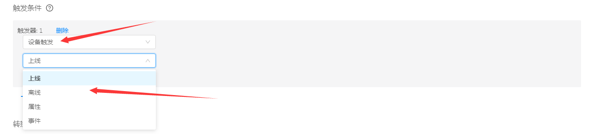  
        后续条件设置同定时触发。  
    ::: tip 注意：
    可同时添加多个触发器，任意一个触发器满足条件都将执行。
    :::
3. 设置转换。  
    将内置的结果字段转换为自定义字段，例如：deviceId 转为 id。  
    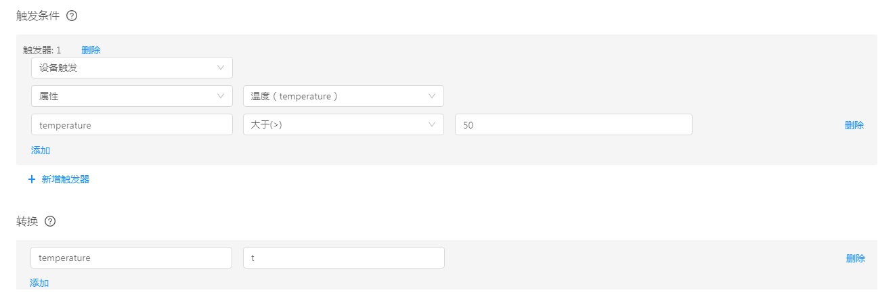  
4. 设置执行动作。  
    当设置的告警规则触发后，可配置执行动作将告警信息以消息通知的形式转发出去。  
    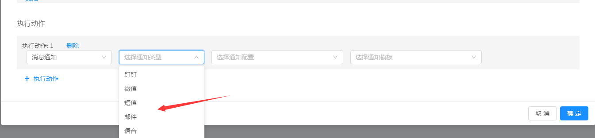  
5. 点击`确定`进行保存。  
    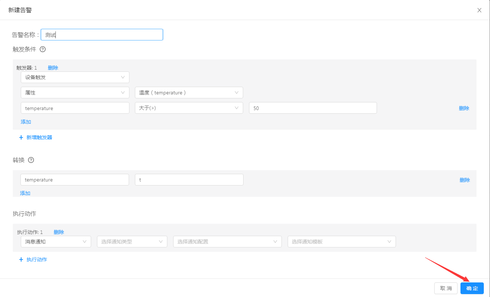  
    
### 启动/停止
在告警设置列表页，单击操作列`启动`按钮即可启动告警。  
  
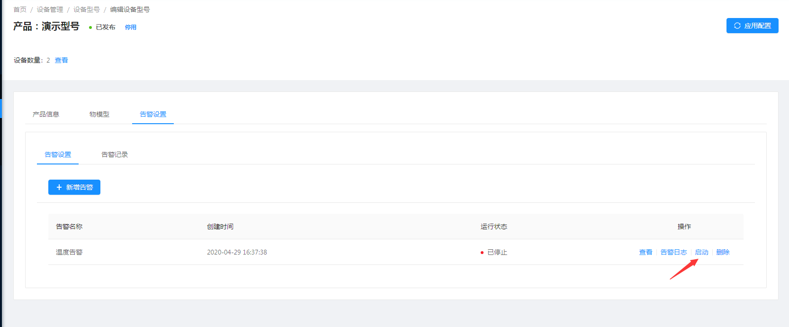  

启动成功后操作列会显示`停止`按钮，单击即可停止告警。  
  
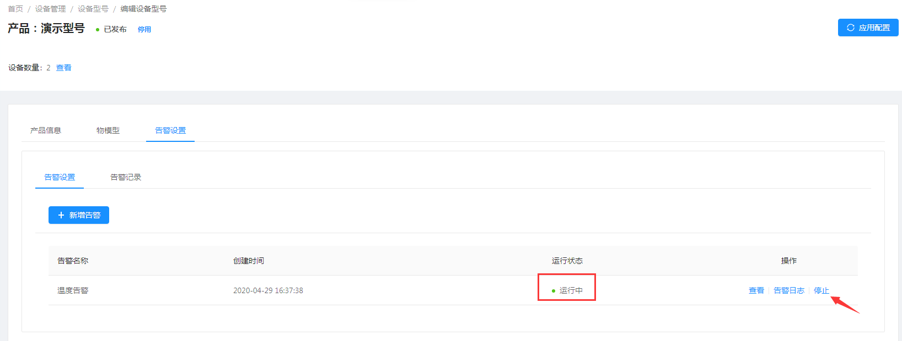  

### 告警日志
在告警设置列表页，单击操作列`告警日志`按钮即可查看告警日志。  

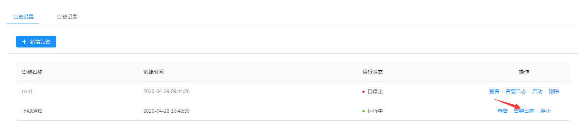  

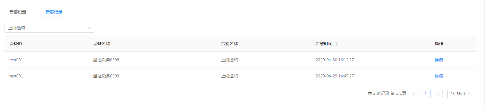  

## 配置单个设备的告警规则

::: tip 注意：
产品中设置的告警规则可应用于该产品下的所有设备，如需单独对设备设置告警规则，则需在设备实例中对其进行设置。
:::

### 创建规则
**操作步骤：**
1. 进入系统: `设备管理`-`设备`。  

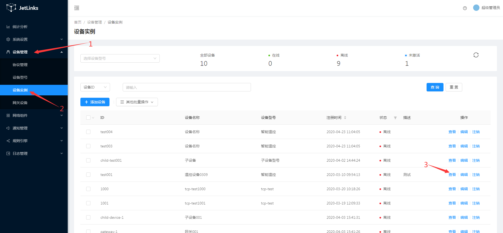  

找到需要设置的设备实例单击操作列的`查看`进入设备详情页。  

在设备详情页单击`告警设置`进入告警设置页面。  

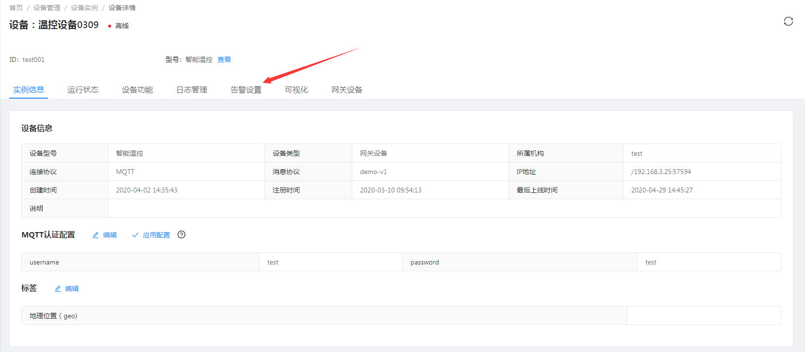  

2. 设置触发条件，告警设置页面默认存在触发器1，点击下拉列表选择触发器类型。  
    i. 定时触发。  
        通过填写cron表达式([在线cron表达式](http://cron.qqe2.com/))的方式定时触发。  
          
        设置完成后，还可以选择其他基于物模型的触发条件，如事件、属性等。  
          
          
        
    ii. 设备触发。  
        通过设备上下线以及物模型中定义的属性、事件等进行触发。  
          
        后续条件设置同定时触发。  
    ::: tip 注意：
    可同时添加多个触发器，任意一个触发器满足条件都将执行。
    :::
3. 设置转换。  
    将内置的结果字段转换为自定义字段，例如：deviceId 转为 id。  
      
4. 设置执行动作。  
    当设置的告警规则触发后，可配置执行动作将告警信息以消息通知的形式转发出去。  
      
5. 点击`确定`进行保存。  
      

### 启动/停止
在告警设置列表页，单击操作列`启动`按钮即可启动告警。  
  
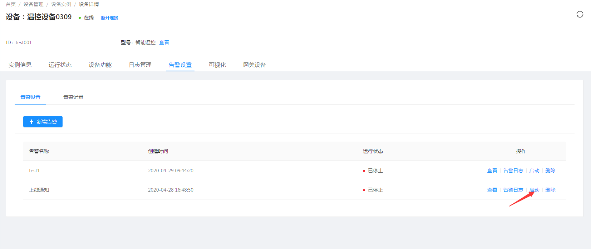  

启动成功后操作列会显示`停止`按钮，单击即可停止告警。  
  
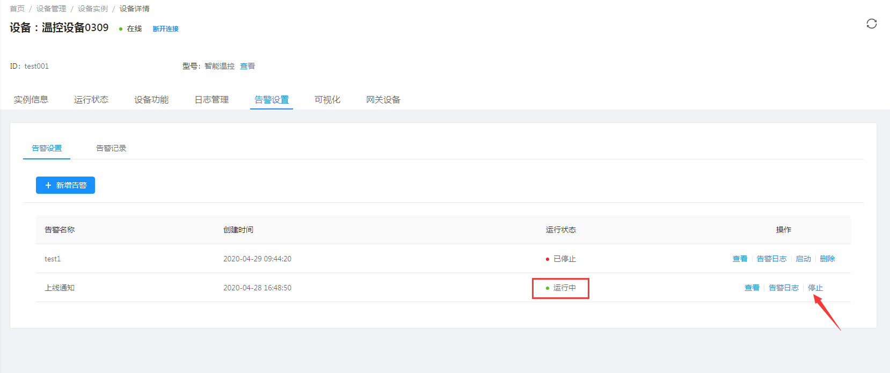  

### 告警日志
在告警设置列表页，单击操作列`告警日志`按钮即可查看告警日志。  

  

  