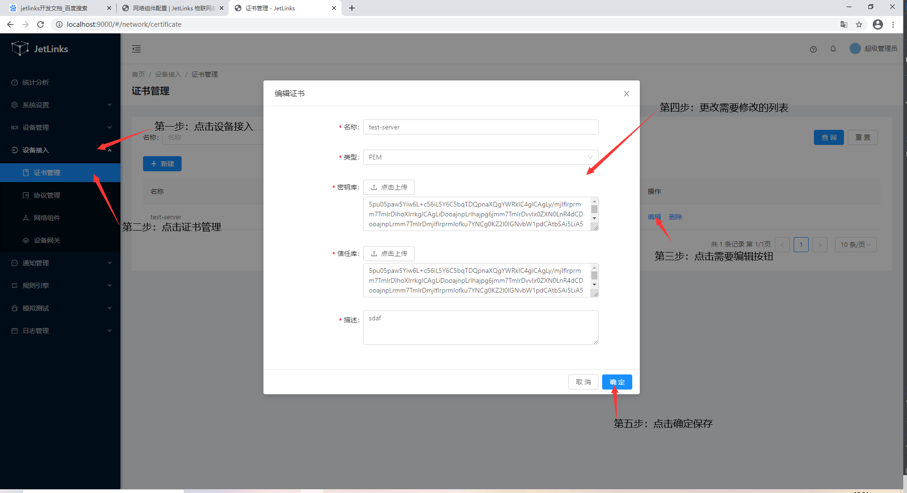
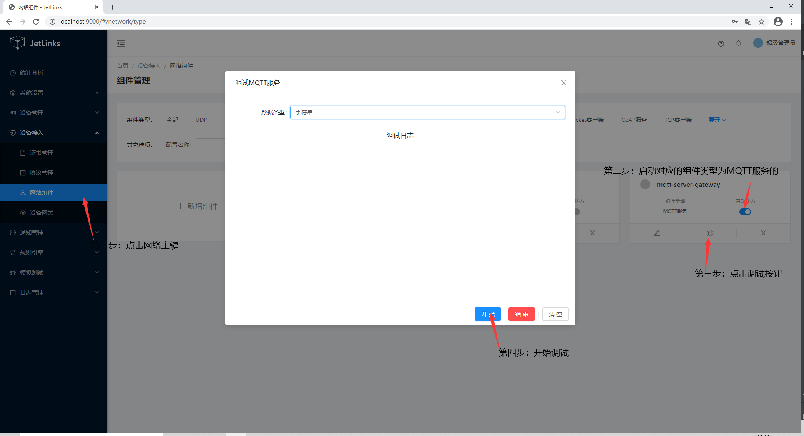
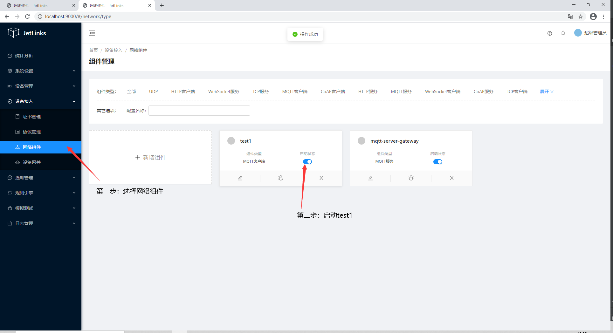
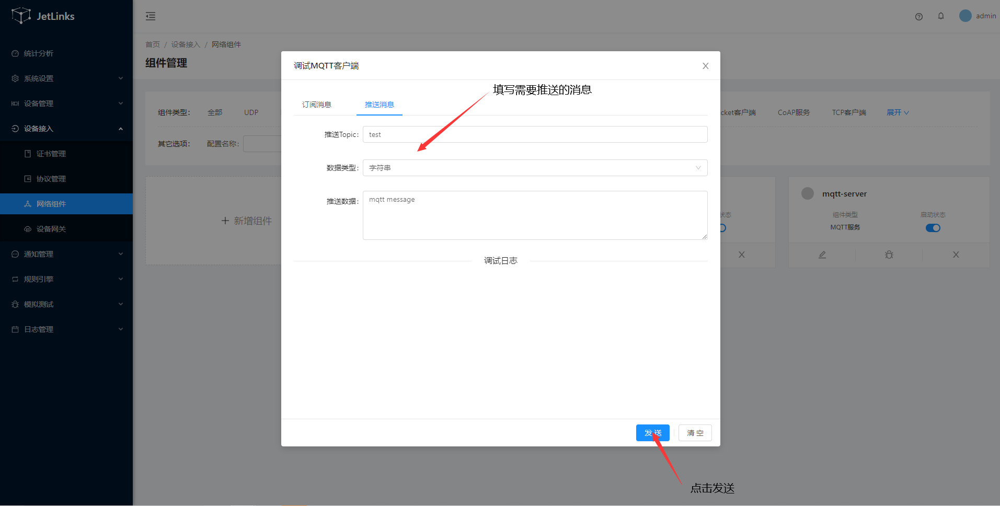
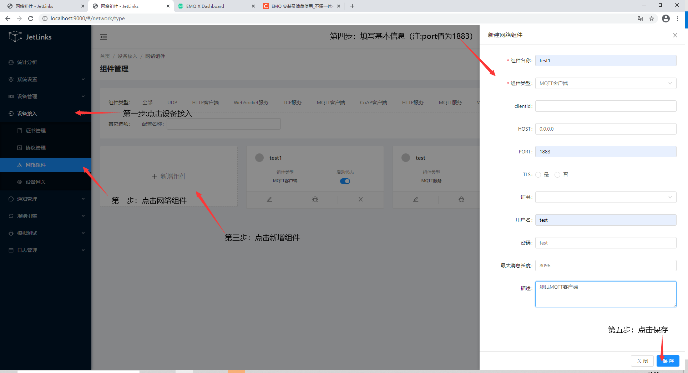

# 网络组件配置

各种网络通信协议管理,可视化配置HTTP(S),TCP(TLS),CoAP(DTLS),UDP(DTLS)
等客户端及服务端.是设备接入等功能的核心.

## 证书管理
证书管理用于统一管理各个网络组件所需的TLS证书,支持证书格式:`JKS`,`P12`,`PEM`.

### 新增
**操作步骤**
1. 进入系统: `设备接入`-`证书管理`-`新建`。  

2. 输入证书信息。  

3. 点击`确定`进行保存。  


### 编辑
**操作步骤**
1. 进入系统: `设备接入`-`证书管理`，在操作列点击`编辑`。  
2. 编辑证书信息。  
3. 点击`确定`进行保存。  


### 删除
进入系统: `设备接入`-`证书管理`，在操作列点击`删除`。  


## 协议管理

### 什么是协议

协议是设备与平台通信的一种标准，某个设备想与平台进行通信就必须按照某种协议标准进行规定上报的数据格式。

协议管理将提供两类协议类型：jar包形式，脚本形式。定义了这两类中的其中一种，即完成了协议管理的定义。

| 功能类型 | 说明 |
| :--------------: | ------------- |
| jar | 自定义协议打包成jar包，上传至平台中。|
| 脚本 | 在线编辑协议格式脚本。|

### 添加协议

1. 登录物联网管理平台。
2. 在左侧导航栏，选择设备接入 > 协议管理。
3. 在协议管理管理页面协议管理列表中，单击协议管理所对应的`新建`操作按钮。
4. 在弹出对话框中，填写协议相关信息，然后点击`保存`。


协议jar包属性参数设置说明如下表。

|参数       | 描述 |
| :--------------: | ------------- |
| 名称      |协议的名称，例如JetLinks V1.0。支持中文、大小写字母、数字、短划线和下划线。|
| 类型      | jar：自定义协议打包成jar包，上传至平台中。|
| 类名      | 上传的jar包所对应的java类的类名。|
| 文件地址      | 上传的jar包在平台的文件路径。|
| 描述      | 输入文字，对该功能进行说明或备注。长度限制为100字。|


协议脚本属性参数设置说明如下表。

| 参数       | 描述 |
| :--------------: | -------------
| 名称      |协议的名称，例如JetLinks V1.0。支持中文、大小写字母、数字、短划线和下划线|
| 类型      | 脚本：在线编辑协议格式脚本。|
| 连接协议      | 常规的连接协议。|
| 协议标识      | 唯一标识符，在协议中具有唯一性。可包含英文、数字、下划线，长度不超过32个字符，例如PowerComsuption。|
| 脚本类型      | 脚本编辑器格式。支持`groovy`和`javascript`格式|
| 脚本      | 协议格式，在线编辑。|
| 描述      | 输入文字，对该功能进行说明或备注。长度限制为100字。|

后续操作步骤:  


1. 在协议管理列表中单击该型号的`编辑`按钮，可以修改基本信息。


2. 在协议管理列表中单击该型号的`发布`按钮，将该协议注册到注册中心，添加设备型号时将会查询消息协议时就能查询到该协议。
   + 协议管理发布后,状态将变为`已发布`状态，已发布的设备型号或者是已绑定设备实例的设备型号将不支持删除。
   
   
3. 在协议管理列表中单击该型号的`删除`按钮，将物理删除该协议。
   （注：`已发布`状态的协议将不显示`删除`按钮）
   

## 网络组件

### MQTT

#### 新增
**服务：**
**操作步骤**
1. 进入系统: `设备接入`-`网络组件`-`新增组件`。  

2. 输入服务配置信息。  

3. 点击`确定`进行保存。  
  
**参数说明**  

| 名称 | 说明 | 是否必填 |
| :----: | :----- | :----: |
| 组件名称 | 组件的名称，例如：MQTT服务。支持中文、大小写字母、数字、短划线和下划线| 是 |
| 组件类型 | 组件支持的类型，此处为MQTT服务，如MQTT服务、HTTP服务、MQTT客户端等 | 是 |
| 线程数 | 最大消息处理工作线程数量 | 否 |
| HOST | 服务地址 | 是 |
| PORT | 服务端口 | 是 |
| TLS | 是否开启证书 | 否 |
| 证书 | 选择证书 | 否 |
| 最大消息长度 | 设置最大的消息长度 | 否 |
| 描述 | 组件描述 | 否 |

**客户端：**
**操作步骤**
1. 进入系统: `设备接入`-`网络组件`-`新增组件`。  

2. 输入客户端配置信息。  

3. 点击`确定`进行保存。  
  

**参数说明**  

| 名称 | 说明 | 是否必填 |
| :----: | :----- | :----: |
| 组件名称 | 组件的名称，例如：MQTT服务。支持中文、大小写字母、数字、短划线和下划线 | 是 |
| 组件类型 | 组件支持的类型，此处为MQTT服务端，如MQTT服务、HTTP服务、MQTT客户端等 | 是 |
| clientId| 客户端ID  | 否 |
| HOST | 请求服务地址 | 是 |
| PORT | 请求服务端口 | 是 |
| TLS | 是否开启证书 | 否 |
| 证书 | 选择证书 | 否 |
| 用户名 | 访问服务进行验证时所需的用户名 | 否 |
| 密码 | 访问服务进行验证时所需的密码 | 否 |
| 描述 | 组件描述 | 否 |
#### 编辑

**服务：**
**操作步骤**
1. 进入系统: `设备接入`-`网络组件`，点击对应配置的编辑按钮。  

2. 输入服务配置信息。  

3. 点击`确定`进行保存。  
  

**客户端：**  

操作步骤与服务端相同。

#### 删除
进入系统: `设备接入`-`网络组件`，点击对应配置的删除按钮。  


#### 调试

客户端组件连上服务组件，并发送消息。  

**操作步骤**  

1. 进入系统：`设备接入`-`网络组件`。  

2. 选择对应的MQTT服务组件，点击`启动`，点击`调试`。  

3. 点击`开始`。  
  
4. 在浏览器新建一个标签页，进入`组件管理`。  

5. 选择对应的MQTT客户端组件，点击`启动`，此时服务组件调试窗口将会收到客户端上线消息。  

  
  

6.点击客户端组件`调试`按钮进入调试页面，选择推送消息，点击`发送`，服务调试页收到消息表示调试成功。
  
  
### TCP
功能使用请参考[MQTT](#MQTT)。  
**服务组件新建参数说明** 
| 名称 | 说明 | 是否必填 |
| :----: | :----- | :----: |
| 组件名称 | 组件的名称，例如：TCP服务。支持中文、大小写字母、数字、短划线和下划线，且必须以中文、英文或数字开头，不超过32个字符 | 是 |
| 组件类型 | 组件支持的类型，此处为TCP服务，如MQTT服务、HTTP服务、MQTT客户端等 | 是 |
| SSL | 是否开启SSL | 否 |
| HOST | 服务地址 | 是 |
| PORT | 服务端口 | 是 |
| 证书 | 选择证书 | 否 |
| 解析方式 | TCP服务接收消息时的解析方式，如固定长度、自定义脚本等 | 否 |
| 描述 | 组件描述 | 否 |

**客户端组件新建参数说明** 
| 名称 | 说明 | 是否必填 |
| :----: | :----- | :----: |
| 组件名称 | 组件的名称，例如：TCP客户端。支持中文、大小写字母、数字、短划线和下划线，且必须以中文、英文或数字开头，不超过32个字符 | 是 |
| 组件类型 | 组件支持的类型，此处为TCP客户端，如MQTT服务、HTTP服务、MQTT客户端等 | 是 |
| SSL | 是否开启SSL | 否 |
| HOST | 请求服务地址 | 是 |
| PORT | 请求服务端口 | 是 |
| 证书 | 选择证书 | 否 |
| 解析方式 | TCP服务接收消息时的解析方式，如固定长度、自定义脚本等 | 否 |
| 描述 | 组件描述 | 否 |
### CoAP(Pro)
功能使用请参考[MQTT](#MQTT)。  
**服务组件新建参数说明** 
| 名称 | 说明 | 是否必填 |
| :----: | :----- | :----: |
| 组件名称 | 组件的名称，例如：CoAP服务。支持中文、大小写字母、数字、短划线和下划线，且必须以中文、英文或数字开头，不超过32个字符 | 是 |
| 组件类型 | 组件支持的类型，此处为CoAP服务，如MQTT服务、HTTP服务、MQTT客户端等 | 是 |
| DTSL | 是否开启DTSL | 否 |
| address | 服务地址 | 是 |
| PORT | 服务端口 | 是 |
| 证书 | 选择证书 | 否 |
| 私钥别名 |  | 否 |
| 描述 | 组件描述 | 否 |

**客户端组件新建参数说明** 
| 名称 | 说明 | 是否必填 |
| :----: | :----- | :----: |
| 组件名称 | 组件的名称，例如：TCoAP客户端。支持中文、大小写字母、数字、短划线和下划线，且必须以中文、英文或数字开头，不超过32个字符 | 是 |
| 组件类型 | 组件支持的类型，此处为CoAP客户端，如MQTT服务、HTTP服务、MQTT客户端等 | 是 |
| DTSL | 是否开启DTSL | 否 |
| URL | 请求服务地址 | 是 |
| 超时时间 | 请求超时时间 | 是 |
| 证书 | 选择证书 | 否 |
| 描述 | 组件描述 | 否 |
### WebSocket(Pro)
功能使用请参考[MQTT](#MQTT)。  
**服务组件新建参数说明** 
| 名称 | 说明 | 是否必填 |
| :----: | :----- | :----: |
| 组件名称 | 组件的名称，例如：WebSocket服务。支持中文、大小写字母、数字、短划线和下划线，且必须以中文、英文或数字开头，不超过32个字符 | 是 |
| 组件类型 | 组件支持的类型，此处为WebSocket服务，如MQTT服务、HTTP服务、MQTT客户端等 | 是 |
| SSL | 是否开启SSL | 否 |
| HOST | 服务地址 | 是 |
| PORT | 服务端口 | 是 |
| 证书 | 选择证书 | 否 |
| 解析方式 | TCP服务接收消息时的解析方式，如固定长度、自定义脚本等 | 否 |
| 描述 | 组件描述 | 否 |

**客户端组件新建参数说明** 
| 名称 | 说明 | 是否必填 |
| :----: | :----- | :----: |
| 组件名称 | 组件的名称，例如：WebSocket客户端。支持中文、大小写字母、数字、短划线和下划线，且必须以中文、英文或数字开头，不超过32个字符 | 是 |
| 组件类型 | 组件支持的类型，此处为WebSocket客户端，如MQTT服务、HTTP服务、MQTT客户端等 | 是 |
| SSL | 是否开启SSL | 否 |
| HOST | 请求服务地址 | 是 |
| PORT | 请求服务端口 | 是 |
| 证书 | 选择证书 | 否 |
| uri | 请求服务uri | 是 |
| 验证host | 是否验证host | 否 |
| 描述 | 组件描述 | 否 |
### HTTP(Pro)
功能使用请参考[MQTT](#MQTT)。  
**服务组件新建参数说明** 
| 名称 | 说明 | 是否必填 |
| :----: | :----- | :----: |
| 组件名称 | 组件的名称，例如：HTTP服务。支持中文、大小写字母、数字、短划线和下划线，且必须以中文、英文或数字开头，不超过32个字符 | 是 |
| 组件类型 | 组件支持的类型，此处为HTTP服务，如MQTT服务、HTTP服务、MQTT客户端等 | 是 |
| SSL | 是否开启SSL | 否 |
| PORT | 服务端口 | 是 |
| 证书 | 选择证书 | 否 |
| 描述 | 组件描述 | 否 |

**客户端组件新建参数说明** 
| 名称 | 说明 | 是否必填 |
| :----: | :----- | :----: |
| 组件名称 | 组件的名称，例如：HTTP客户端。支持中文、大小写字母、数字、短划线和下划线| 是 |
| 组件类型 | 组件支持的类型，此处为HTTP客户端，如MQTT服务、HTTP服务、MQTT客户端等 | 是 |
| SSL | 是否开启SSL | 否 |
| baseUrl | 请求服务地址 | 是 |
| 证书 | 选择证书 | 否 |
| 验证host | 是否验证host | 否 |
| 信任所有 | 是否信任所有 | 否 |
| 描述 | 组件描述 | 否 |


### UDP
功能使用请参考[MQTT](#MQTT)。
| 名称 | 说明 | 是否必填 |
| :----: | :----- | :----: |
| 组件名称 | 组件的名称，例如：HTTP服务。支持中文、大小写字母、数字、短划线和下划线，且必须以中文、英文或数字开头，不超过32个字符 | 是 |
| 组件类型 | 组件支持的类型，此处为HTTP服务，如MQTT服务、HTTP服务、MQTT客户端等 | 是 |
| 集群 | 选择是否共享配置或者独立的配置 | 是 |
| DTLS | 是否开启DTLS | 否 |
| 证书 | 选择证书 | 否 |
| 私钥别名 | 填写私钥 | 否 |
| 远程地址 | 填写远程地址 | 否 |
| 远程端口 | 填写远程端口 | 否 |
| 本地地址 | 填写本地地址 | 否 |
| 本地端口 | 填写本地端口 | 否 |
| 描述 | 对组件对描述 | 否 |

## 设备网关

### MQTT服务设备网关

创建MQTT服务设备网关,用于直连设备、处理设备消息。

#### 启动MQTT服务

进入系统: `设备接入`-`网络组件` 点击右侧菜单中组件类型选择`MQTT服务`， 添加一个MQTT服务.


点击状态列中的`已停止`开启服务. 状态变为`已启动`则为启动完成.

#### 测试连接

1. 点击表格中的`操作`-`调试`.

2. 点击调试界面中的`开始`按钮.
3. 请访问[MQTT.fx官网](https://mqttfx.jensd.de/index.php/download?spm=a2c4g.11186623.2.16.20ab5800HxuVJR)软件进行连接测试.


在调试MQTT服务界面打印出相关连接消息则表示服务正常.

注意:

1. 一定要先在调试界面中点击开始.否则会拒绝MQTT连接.
2. 在没有配置网关服务前,mqtt客户端的`clientId`,`username`,`password`可以填写任意字符,但是不能留空.

#### 创建设备网关

1. 新建设备网关配置:


2. 启动网关:

点击`操作`列中的`启动`按钮,启动网关.

网关状态说明:

1. 停止:网关完全停止.不再接受设备连接,以及消息.重新启动后只会接受最新的连接以及消息.
2. 暂停:网关不再接受新的设备连接,以及消息.重新启动后恢复处理之前的所有连接的消息.
3. 启动:网关处理新的设备连接以及消息.

#### 设备连接

参照[使用自定义消息协议接入设备](device-connection.md)进行设备配置,注册,以及连接,消息收发测试.

### MQTT客户端设备网关

创建MQTT客户端设备网关,用于设备已连接到第三方MQTT服务上时，处理设备消息。

#### 创建MQTT客户端

进入系统: `设备接入`-`网络组件` 点击`新增组件` ，组件类型选择MQTT客户端。




#### 测试连接

使用[EMQ](https://docs.emqx.cn/broker/v4.3/getting-started/install.html)软件进行连接测试.

1.使用docker启动
```
$docker pull emqx/emqx:4.2.7

$docker run -d --name emqx -p 1883:1883 -p 8083:8083 -p 8883:8883 -p 8084:8084 -p 18083:18083 emqx/emqx:4.2.7
```
使用[EMQ](https://docs.emqx.cn/cn/broker/latest/getting-started/dashboard.html)开发文档查看原始用户名和密码.

2.进入emq客户端监控界面


3.点击状态列中的`启动状态`开启服务.变为蓝色则为启动完成.


4.在EMQ客户端监控列表中，看到客户端连接成功。表示mqtt客户端正常。


#### 创建设备网关

点击 `设备接入`→`设备网关`


#### 设备网关连接测试

##### 前提条件

i. 已在平台中创建产品和设备

> 创建产品和设备具体操作细节，请参考[添加设备型号](../device-manager.md/#添加设备型号)、[添加设备实例](../device-manager.md/#添加设备实例)。
>
> 设备接入平台，请参考[设备接入教程](device-connection.md)

##### 创建成功的设备实例信息展示
     
i. 设备基本信息


ii. 设备运行状态信息


iii. 设备日志


使用[MQTT.fx](http://mqttfx.org/)软件进行连接测试

1.启动网关:

i. 点击`操作`列中的`启动`按钮,启动网关。

ii. 在EMQ订阅监控列表中，看到有MQTT客户端设备网关新建时，设置的topics订阅记录，表示网关topic订阅成功。


2.使用MQTT.fx连接上EMQ


> 注意：上图第2步中port为EMQ服务所暴露的端口（1883）

3.发送设备上线消息到EMQ中


4.设备上线表示设备设备网关连接成功


网关状态说明:

1. 停止:网关完全停止.不再接受设备连接,以及消息.重新启动后只会接受最新的连接以及消息。
2. 暂停:网关不再接受新的设备连接,以及消息.重新启动后恢复处理之前的所有连接的消息。
3. 启动:网关处理新的设备连接以及消息。

#### 设备连接

参照[使用自定义消息协议接入设备](device-connection.md)进行设备配置,注册,以及连接,消息收发测试。

### TCP设备网关
待完成..

### CoAP设备网关(Pro)

创建CoAP服务设备网关,处理设备消息。

#### 一、 创建CoAP服务并启动

进入系统: `设备接入`-`网络组件`，点击`新增组件`，在组件类型选择`CoAP服务`。


点击`启动状态`按钮，从灰色变成蓝色代表启动成功。


##### 测试连接

使用[Node CoAP CLI](https://www.npmjs.com/package/coap-cli)进行连接测试.

1.[安装](https://www.npmjs.com/package/coap-cli)完成coap cli

2.打开终端，输入 `coap get coap://127.0.0.1:12344` 返回结果为404则表示coap服务启动成功


#### 二、创建设备网关

新建设备网关配置


##### 设备网关消息处理测试

**前提条件**

i. 已在平台中创建产品和设备

ii. 设备已接入平台（设备已上线）

> 创建产品和设备具体操作细节，请参考[添加设备型号](../device-manager.md/#添加设备型号)、[添加设备实例](../device-manager.md/#添加设备实例)。
>
> 设备接入平台，请参考[设备接入教程](device-connection.md)

**创建成功的设备实例信息展示**
     
i. 设备基本信息


ii. 设备运行状态信息


iii. 设备日志


**使用Node CoAP CLI测试**

参照[使用CoAP接入设备（PRO)](/best-practices/coap-connection.md)进行测试

网关状态说明:

1. 停止:网关完全停止.不再接受设备连接,以及消息.重新启动后只会接受最新的连接以及消息。
2. 暂停:网关不再接受新的设备连接,以及消息.重新启动后恢复处理之前的所有连接的消息。
3. 启动:网关处理新的设备连接以及消息。

#### 设备连接

参照[使用自定义消息协议接入设备](device-connection.md)进行设备配置,注册,以及连接,消息收发测试。
