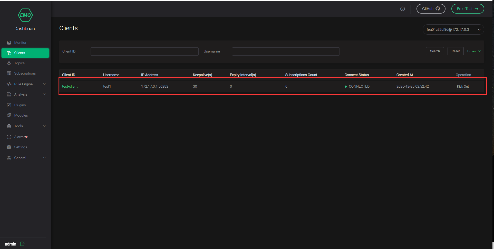
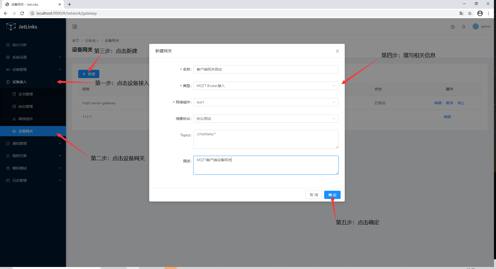
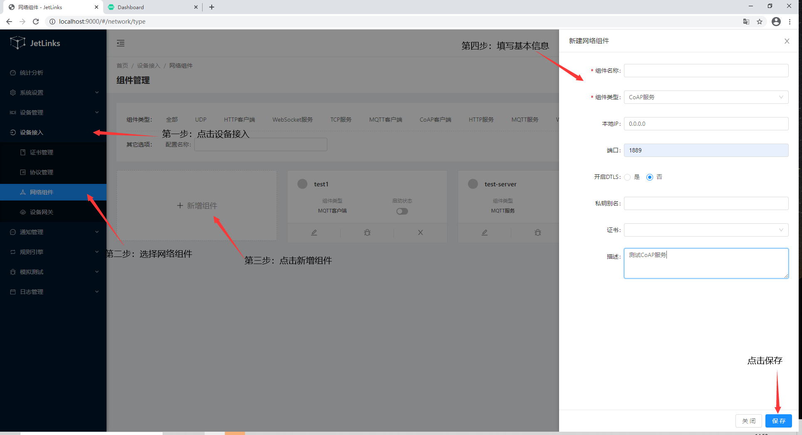

# 网络组件配置

## 介绍
各种网络通信协议组件实现，通过可视化配置HTTP(S),TCP(TLS),CoAP(DTLS),UDP(DTLS)
等客户端及服务端,以及提供多维度多监控(统计,流量,负载,异常...).
### 用途

## 证书管理
证书管理用于统一管理各个网络组件所需的TLS证书,支持证书格式:`JKS`,`P12`,`PEM`.
## 网络组件

### MQTT
待完成..
### TCP
待完成..
### CoAP(Pro)
待完成..
### WebSocket(Pro)
待完成..
### HTTP(Pro)
待完成..
## 设备网关

### MQTT服务设备网关

创建MQTT服务设备网关,用于直连设备、处理设备消息。

#### 启动MQTT服务

进入系统: `网络组件`-`组件管理` 点击左侧菜单中的`MQTT服务` 添加一个MQTT服务.

点击状态列中的`已停止`开启服务. 状态变为`已启动`则为启动完成.

#### 测试连接

1. 点击表格中的`操作`-`调试`.
2. 点击调试界面中的`开始`按钮.
3. 使用[MQTT.fx](http://mqttfx.org/)软件进行连接测试.

在调试MQTT服务界面打印出相关连接消息则表示服务正常.

注意:

1. 一定要先在调试界面中点击开始.否则会拒绝MQTT连接.
2. 在没有配置网关服务前,mqtt客户端的`clientId`,`username`,`password`可以填写任意字符,但是不能留空.

#### 创建设备网关

1. 新建设备网关配置:

2. 启动网关:

点击`操作`列中的`启动`按钮,启动网关.

网关状态说明:

1. 停止:网关完全停止.不再接受设备连接,以及消息.重新启动后只会接受最新的连接以及消息.
2. 暂停:网关不再接受新的设备连接,以及消息.重新启动后恢复处理之前的所有连接的消息.
3. 启动:网关处理新的设备连接以及消息.

#### 设备连接

参照[使用自定义消息协议接入设备](device-connection.md)进行设备配置,注册,以及连接,消息收发测试.

### MQTT客户端设备网关

创建MQTT客户端设备网关,用于设备已连接到第三方MQTT服务上时，处理设备消息。

#### 创建MQTT客户端

进入系统: `网络组件`-`组件管理` 点击左侧菜单中的`MQTT客户端` 添加一个MQTT客户端。

#### 测试连接

使用[EMQ](https://docs.emqx.io/broker/v3/cn/install.html)软件进行连接测试.

1.[安装](https://docs.emqx.io/broker/v3/cn/install.html#)完成EMQ，并启动

2.进入emq客户端监控界面

3.点击状态列中的`已停止`开启服务. 状态变为`已启动`则为启动完成.

4.在EMQ客户端监控列表中，看到客户端连接成功。表示mqtt客户端正常。

#### 创建设备网关

新建设备网关配置

#### 设备网关连接测试

##### 前提条件

i. 已在平台中创建产品和设备

> 创建产品和设备具体操作细节，请参考[添加设备型号](../device-manager.md/#添加设备型号)、[添加设备实例](../device-manager.md/#添加设备实例)。
>
> 设备接入平台，请参考[设备接入教程](device-connection.md)

##### 创建成功的设备实例信息展示
     
i. 设备基本信息

ii. 设备运行状态信息

iii. 设备日志

使用[MQTT.fx](http://mqttfx.org/)软件进行连接测试

1.启动网关:

i. 点击`操作`列中的`启动`按钮,启动网关。

ii. 在EMQ订阅监控列表中，看到有MQTT客户端设备网关新建时，设置的topics订阅记录，表示网关topic订阅成功。

2.使用MQTT.fx连接上EMQ

> 注意：上图第2步中port为EMQ服务所暴露的端口

3.发送设备上线消息到EMQ中

4.设备上线表示设备设备网关连接成功

网关状态说明:

1. 停止:网关完全停止.不再接受设备连接,以及消息.重新启动后只会接受最新的连接以及消息。
2. 暂停:网关不再接受新的设备连接,以及消息.重新启动后恢复处理之前的所有连接的消息。
3. 启动:网关处理新的设备连接以及消息。

#### 设备连接

参照[使用自定义消息协议接入设备](device-connection.md)进行设备配置,注册,以及连接,消息收发测试。

### TCP设备网关
待完成..

### CoAP设备网关(Pro)

创建CoAP服务设备网关,处理设备消息。

#### 一、 创建CoAP服务并启动

进入系统: `网络组件`-`组件管理` 点击左侧菜单中的`CoAP服务` 添加一个CoAP服务。

点击状态列中的`已停止`开启服务. 状态变为`已启动`则为启动完成.

##### 测试连接

使用[Node CoAP CLI](https://www.npmjs.com/package/coap-cli)进行连接测试.

1.[安装](https://www.npmjs.com/package/coap-cli)完成coap cli

2.打开终端，输入 `coap get coap://127.0.0.1:12344` 返回结果为404则表示coap服务启动成功

#### 二、创建设备网关

新建设备网关配置

##### 设备网关消息处理测试

**前提条件**

i. 已在平台中创建产品和设备

ii. 设备已接入平台（设备已上线）

> 创建产品和设备具体操作细节，请参考[添加设备型号](../device-manager.md/#添加设备型号)、[添加设备实例](../device-manager.md/#添加设备实例)。
>
> 设备接入平台，请参考[设备接入教程](device-connection.md)

**创建成功的设备实例信息展示**
     
i. 设备基本信息

ii. 设备运行状态信息

iii. 设备日志

**使用Node CoAP CLI测试**

i. 安装[Node CoAP CLI](https://www.npmjs.com/package/coap-cli)

ii. 点击`操作`列中的`启动`按钮，启动网关。

iii. 终端输入: `coap post coap://127.0.0.1:12344/chiefdata/push/fire_alarm/department/1/area/1/dev/test001 -p {\"devid\":\"test001\"} -O 2100,test001` 

vi. 设备收到一条上报事件则代表CoAP网关测试成功

网关状态说明:

1. 停止:网关完全停止.不再接受设备连接,以及消息.重新启动后只会接受最新的连接以及消息。
2. 暂停:网关不再接受新的设备连接,以及消息.重新启动后恢复处理之前的所有连接的消息。
3. 启动:网关处理新的设备连接以及消息。

#### 设备连接

参照[使用自定义消息协议接入设备](device-connection.md)进行设备配置,注册,以及连接,消息收发测试。
