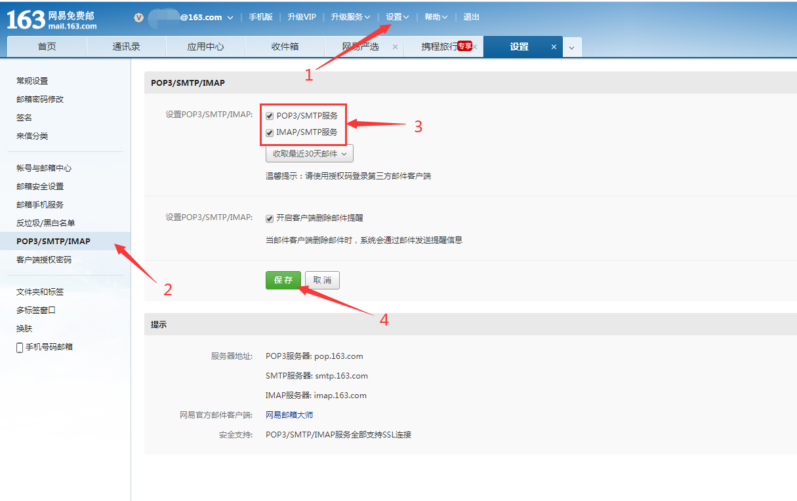
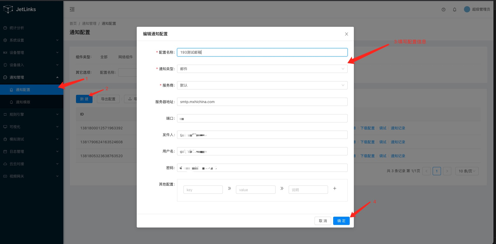
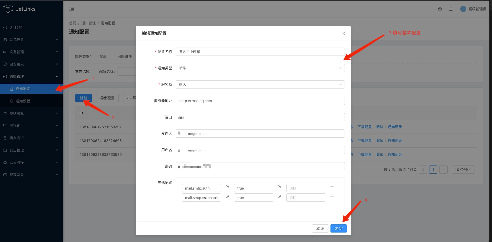
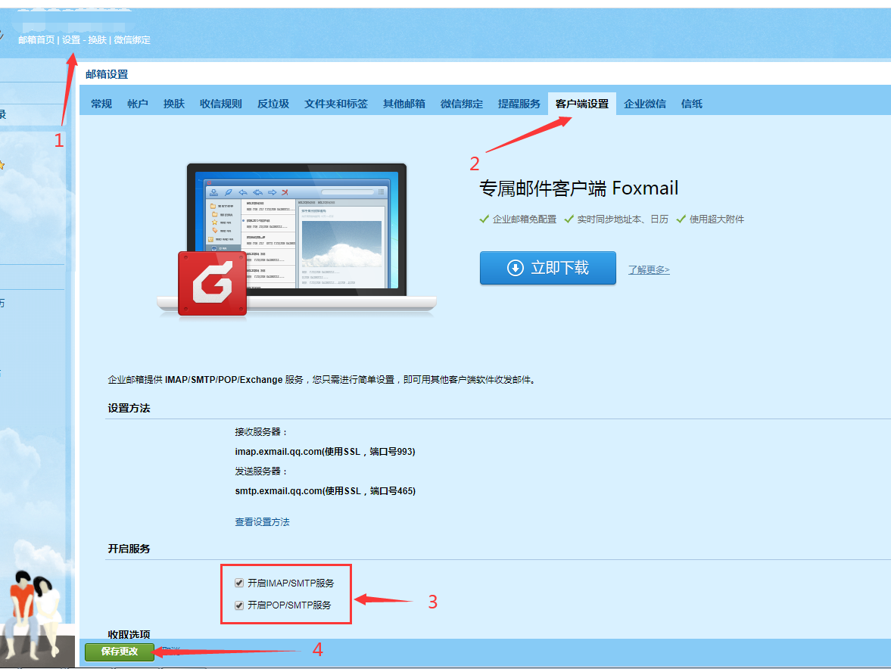
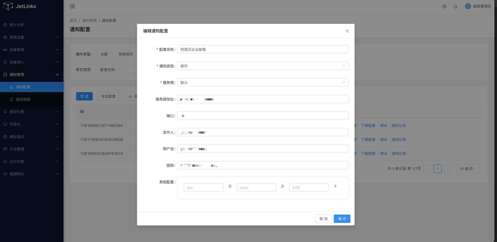
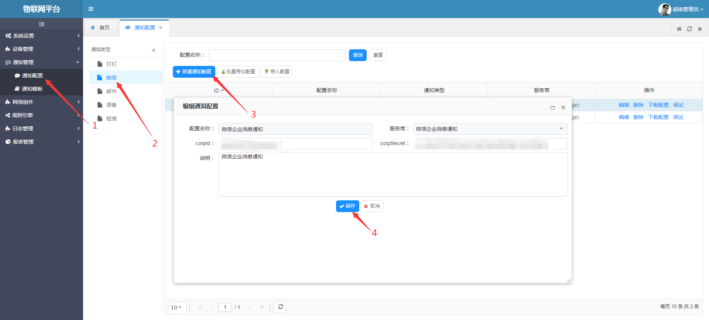
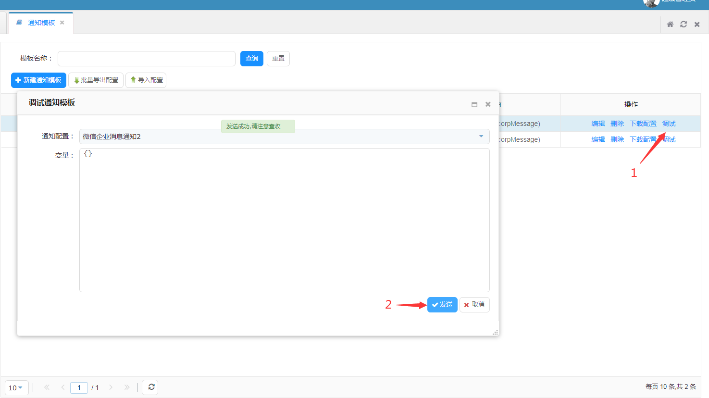
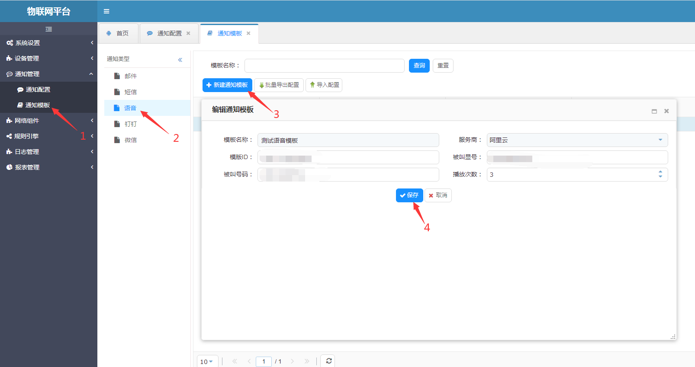

# 通知管理

通知管理用于统一管理,维护各种消息通知配置以及模版. 可通过统一的接口发送短信,邮件等消息通知

## 通知配置和模板

配置用于管理各种通知的配置. 如邮件的地址,端口,用户名密码等信息.
模版用于管理各种通知的消息模版. 如邮件模版,短信模版等.

## 服务商

同一个消息类型,但是可能由不同的服务商提供服务. 如发送短信, 阿里云和腾讯云所需要的配置以及模版内容可能都不一样.
在配置和模版中,会根据不同的服务商,填写不同的配置以及模版内容.

::: tip
发送消息时,需要指定相同服务商的配置以及模版.
:::

## 邮件通知

进入系统: `通知管理`-`通知配置` 点击左侧菜单中的`邮件` 添加一个邮件通知配置.

### 添加163邮箱配置信息

属性说明:

| 属性 | 说明 | 是否必填 |
| :----: | :----- | :----: |
| 配置名称 | 通知配置的名称，例如：测试网易邮配置。支持中文、大小写字母、数字、短划线和下划线，且必须以中文、英文或数字开头，不超过32个字符 | 是 |
| 服务商 | 邮件服务商，支持多服务商，不同服务商配置信息不同，服务商选择`默认`时，支持javax.mail发送邮件的服务商 | 是 |
| 服务器地址 | 邮件服务商提供的服务器地址，163邮箱服务器地址为：smtp.163.com | 是 |
| 端口 | 邮件服务商提供的服务端口，163邮箱端口为：25 | 是 |
| 发件人 | 发送邮件后显示的发件人信息 | 是 |
| 用户名 | 发件人账户 | 是 |
| 密码 | 发件人密码 | 是 |
| 其他配置 | 163邮箱需配置其他配置 | 否 |
| 说明 | 输入文字，对该配置进行说明或备注。长度限制为100字 | 否 |

163邮箱需操作设置如下图所示:

### 添加139邮箱配置信息

属性说明:

| 属性 | 说明 | 是否必填 |
| :----: | :----- | :----: |
| 配置名称 | 通知配置的名称，例如：测试网易邮配置。支持中文、大小写字母、数字、短划线和下划线，且必须以中文、英文或数字开头，不超过32个字符 | 是 |
| 服务商 | 邮件服务商，支持多服务商，不同服务商配置信息不同，服务商选择`默认`时，支持javax.mail发送邮件的服务商 | 是 |
| 服务器地址 | 邮件服务商提供的服务器地址，139邮箱服务器地址为：SMTP.139.com | 是 |
| 端口 | 邮件服务商提供的服务端口，139邮箱端口为：25 | 是 |
| 发件人 | 发送邮件后显示的发件人信息 | 是 |
| 用户名 | 发件人账户 | 是 |
| 密码 | 发件人密码 | 是 |
| 其他配置 | 139邮箱需配置其他配置 | 否 |
| 说明 | 输入文字，对该配置进行说明或备注。长度限制为100字 | 否 |

139邮箱需操作设置如下图所示:

### 添加腾讯企业邮配置信息

属性说明:

| 属性 | 说明 | 是否必填 |
| :----: | :----- | :----: |
| 配置名称 | 通知配置的名称，例如：测试网易邮配置。支持中文、大小写字母、数字、短划线和下划线，且必须以中文、英文或数字开头，不超过32个字符 | 是 |
| 服务商 | 邮件服务商，支持多服务商，不同服务商配置信息不同，服务商选择`默认`时，支持javax.mail发送邮件的服务商 | 是 |
| 服务器地址 | 邮件服务商提供的服务器地址，腾讯企业邮服务器地址为：smtp.exmail.qq.com | 是 |
| 端口 | 邮件服务商提供的服务端口，腾讯企业邮邮箱端口为：465 | 是 |
| 发件人 | 发送邮件后显示的发件人信息 | 是 |
| 用户名 | 发件人账户 | 是 |
| 密码 | 发件人密码 | 是 |
| 其他配置 | 腾讯企业邮需配置其他配置,配置信息查看`其他配置`表 | 是 |
| 说明 | 输入文字，对该配置进行说明或备注。长度限制为100字 | 否 |

`其他配置`信息如下:

| 配置名称 | 配置值 | 说明 |
| :---- | :----- | :----: |
| mail.smtp.auth | true |  |
| mail.smtp.ssl.enable | true |  |

腾讯企业邮需操作设置如下图所示:

### 添加阿里云企业邮配置信息

属性说明:

| 属性 | 说明 | 是否必填 |
| :----: | :----- | :----: |
| 配置名称 | 通知配置的名称，例如：测试网易邮配置。支持中文、大小写字母、数字、短划线和下划线，且必须以中文、英文或数字开头，不超过32个字符 | 是 |
| 服务商 | 邮件服务商，支持多服务商，不同服务商配置信息不同，服务商选择`默认`时，支持javax.mail发送邮件的服务商 | 是 |
| 服务器地址 | 邮件服务商提供的服务器地址，腾讯企业邮服务器地址为：smtp.mxhichina.com | 是 |
| 端口 | 邮件服务商提供的服务端口，腾讯企业邮邮箱端口为：25 | 是 |
| 发件人 | 发送邮件后显示的发件人信息 | 是 |
| 用户名 | 发件人账户 | 是 |
| 密码 | 发件人密码 | 是 |
| 其他配置 | 阿里云企业邮需配置其他配置 | 否 |
| 说明 | 输入文字，对该配置进行说明或备注。长度限制为100字 | 否 |

> 阿里云企业邮是默认开启个人邮箱pop3、smtp协议的，所以无需在阿里云邮箱里设置

### 配置邮件模板

进入系统: `通知管理`-`通知模板` 点击左侧菜单中的`邮件` 添加一个邮件通知模板.

  

属性说明:

| 属性 | 说明 | 是否必填 |
| :----: | :----- | :----: |
| 模板名称 | 通知模板的名称，例如：测试邮件-图片+附件。支持中文、大小写字母、数字、短划线和下划线，且必须以中文、英文或数字开头，不超过32个字符 | 是 |
| 服务商 | 邮件服务商，支持多服务商，不同服务商配置信息不同，服务商选择`默认`时，支持javax.mail发送邮件的服务商 | 是 |
| 标题 | 邮件发送成功后，收件人显示标题或主题。支持表达式替换 `注:不同服务商显示不同` | 是 |
| 正文 | 邮件内容 | 是 |
| 收件人 | 接收邮件的用户，可同时添加多个。支持表达式替换 | 否 |
| 附件列表 | 发送邮件时携带的文件，可同时添加多个文件。支持表达式替换 | 否 |

> 表达式说明：表达式通用格式为$符号开头,两个大括号中填写需要被替换的内容。例：${test}

### 测试发送通知

1. 点击`通知模板`表格中的`操作`列-`调试`.
2. 弹出会话框后选择`通知配置`.
3. 填写`变量`信息，用变量信息将`通知模板`中的表达式替换为相应的内容（通知模板中不存在表达式时，使用默认值`{}`即可）

>例：`通知模板`内存在表达式`${test}`。则可以用对应的json格式数据{"test":"测试"}，将通知模板中`${test}`替换为`测试`

发送成功后会提示`发送成功,请注意查收`，打开邮箱查看是否收到邮件通知，收到邮件通知即测试通过.

## 微信企业消息

### 配置信息
进入系统: `通知管理`-`通知配置` 点击左侧菜单中的`微信` 添加一个企业微信通知配置.

属性说明:

| 属性 | 说明 | 是否必填 |
| :----: | :----- | :----: |
| 模板名称 | 通知配置的名称，例如：微信企业消息通知。支持中文、大小写字母、数字、短划线和下划线，且必须以中文、英文或数字开头，不超过32个字符 | 是 |
| 服务商 | 支持`企业微信号`和`微信公众号`，不同服务商配置信息不同，目前只支持`企业微信号` | 是 |
| corpId | 每个企业都拥有唯一的corpId，获取此信息可在管理后台“我的企业”－“企业信息”下查看“企业ID”（需要有管理员权限） 登录`https://work.weixin.qq.com/`-`我的企业`，正下方可见企业ID | 是 |
| corpSecret | corpSecret是企业应用里面用于保障数据安全的“钥匙”，每一个应用都有一个独立的访问密钥，为了保证数据的安全，secret务必不能泄漏 登录`https://work.weixin.qq.com/`-在管理后台->“应用与小程序”->“应用”->“自建”，点进某个应用，即可看到 | 是 |
| 说明 | 输入文字，对该配置进行说明或备注。长度限制为100字 | 否 |

> 参考文档：<https://work.weixin.qq.com/api/doc/90000/90135/91039>

### 模板信息

进入系统: `通知管理`-`通知模板` 点击左侧菜单中的`微信` 添加一个企业微信通知模板.

属性说明:

| 属性 | 说明 | 是否必填 |
| :----: | :----- | :----: |
| 模板名称 | 通知模板的名称，例如：微信企业消息通知。支持中文、大小写字母、数字、短划线和下划线，且必须以中文、英文或数字开头，不超过32个字符 | 是 |
| 服务商 | 支持`企业微信号`和`微信公众号`，不同服务商配置信息不同，现目前只支持`微信企业消息通知` | 是 |
| 应用ID | 每个应用都有唯一的agentId 登录`https://work.weixin.qq.com/`-在管理后台->“应用与小程序”->“应用”，点进某个应用，即可看到agentId | 是 |
| 收信人ID | 每个成员都有唯一的userId，即所谓“帐号” 登录`https://work.weixin.qq.com/`-在管理后台->“通讯录”->点进某个成员的详情页，可以看到 | 是 |
| 收信部门ID | 每个部门都有唯一的id 登录`https://work.weixin.qq.com/`-在管理后台->“通讯录”->“组织架构”->点击某个部门右边的小圆点可以看到 | 是 |
| 按标签推送 | 本企业的标签ID列表，最多支持100个 | 否 |
| 内容 | 播放模板内容次数。支持表达式替换 | 否 |

> 参考文档：<https://work.weixin.qq.com/api/doc/90000/90135/90250#%E6%96%87%E6%9C%AC%E6%B6%88%E6%81%AF>

> 表达式说明：表达式通用格式为$符号开头,两个大括号中填写需要被替换的内容。例：${test}

### 测试发送通知

1. 点击`通知模板`表格中的`操作`列-`调试`.
2. 弹出会话框后选择`通知配置`.
3. 填写`变量`信息，用变量信息将`通知模板`中的表达式替换为相应的内容（通知模板中不存在表达式时，使用默认值`{}`即可）

>例：`通知模板`内存在表达式`${test}`。则可以用对应的json格式数据{"test":"测试"}，将通知模板中`${test}`替换为`测试`

发送成功后会提示`发送成功,请注意查收`，打开企业微信客户端，查看是否收到消息，收到消息即通过测试.

## 钉钉通知

### 配置信息

进入系统: `通知管理`-`通知配置` 点击左侧菜单中的`钉钉` 添加一个钉钉通知配置.

属性说明:

| 属性 | 说明 | 是否必填 |
| :----: | :----- | :----: |
| 模板名称 | 通知配置的名称，例如：钉钉测试。支持中文、大小写字母、数字、短划线和下划线，且必须以中文、英文或数字开头，不超过32个字符 | 是 |
| 服务商 | 钉钉 | 是 |
| appKey | 应用的唯一标识key | 是 |
| appSecret | 应用的密钥 | 是 |
| 说明 | 输入文字，对该配置进行说明或备注。长度限制为100字 | 否 |

> 参考文档：<https://developers.dingtalk.com/document/app/basic-concepts/title-kux-it4-9c7>

### 模板信息

进入系统: `通知管理`-`通知模板` 点击左侧菜单中的`钉钉` 添加一个钉钉通知模板.

属性说明:

| 属性 | 说明 | 是否必填 |
| :----: | :----- | :----: |
| 模板名称 | 通知模板的名称，例如：钉钉消息通知。支持中文、大小写字母、数字、短划线和下划线，且必须以中文、英文或数字开头，不超过32个字符 | 是 |
| 服务商 | 钉钉 | 是 |
| 应用ID | 每个应用都有唯一的agentId。 登录`https://open-dev.dingtalk.com/fe/app`-在管理后台->钉钉应用，点进某个应用，即可看到agentId | 是 |
| 收信人ID | 接收者的用户userid列表，最大列表长度：100。在`https://oa.dingtalk.com/contacts.htm`中点击查看的员工UserID | 可选(收信人ID,部门ID, 全部用户,必须有一个不能为空) |
| 收信部门ID | 接收者的部门id列表，最大列表长度：20,  接收者是部门id下(包括子部门下)的所有用户，示例：123,456 | 可选（可不传，若传不能为空） |
| 全部用户 | 是否发送给企业全部用户 | 可选 |
| 内容 | 消息内容，消息类型和样例参考“消息类型与数据格式”。支持表达式替换。最长不超过2048个字节 | 是 |

> 参考文档：<https://developers.dingtalk.com/document/app/app-faq>
> 注：`钉钉推送消息需要到钉钉开发平台应用中心内添加IP白名单`

> 表达式说明：表达式通用格式为$符号开头,两个大括号中填写需要被替换的内容。例：${test}

### 测试发送通知

1. 点击`通知模板`表格中的`操作`列-`调试`.
2. 弹出会话框后选择`通知配置`.
3. 填写`变量`信息，用变量信息将`通知模板`中的表达式替换为相应的内容（通知模板中不存在表达式时，使用默认值`{}`即可）

>例：`通知模板`内存在表达式`${test}`。则可以用对应的json格式数据{"test":"测试"}，将通知模板中`${test}`替换为`测试`

发送成功后会提示`发送成功,请注意查收`，打开钉钉客户端，查看是否收到消息，收到消息即通过测试.

## 语音通知

### 配置信息

进入系统: `通知管理`-`通知配置` 点击左侧菜单中的`语音` 添加一个语音通知配置.

属性说明:

| 属性 | 说明 | 是否必填 |
| :----: | :----- | :----: |
| 模板名称 | 通知配置的名称，例如：测试邮件-图片+附件。支持中文、大小写字母、数字、短划线和下划线，且必须以中文、英文或数字开头，不超过32个字符 | 是 |
| 服务商 | 语音服务商，支持多服务商，不同服务商配置信息不同，现目前只支持`阿里云` | 是 |
| regionId | 电信区域代码 | 是 |
| accessKeyId | 访问密钥id | 是 |
| secret | 密钥对 | 是 |
| 说明 | 输入文字，对该配置进行说明或备注。长度限制为100字 | 否 |

### 模板信息

进入系统: `通知管理`-`通知模板` 点击左侧菜单中的`语音` 添加一个语音通知模板.

属性说明:

| 属性 | 说明 | 是否必填 |
| :----: | :----- | :----: |
| 模板名称 | 通知模板的名称，例如：测试邮件-图片+附件。支持中文、大小写字母、数字、短划线和下划线，且必须以中文、英文或数字开头，不超过32个字符 | 是 |
| 服务商 | 语音服务商，支持多服务商，不同服务商配置信息不同，现目前只支持`阿里云` | 是 |
| 模版ID | 阿里云内配置模板的ID。`注:不同服务商显示不同` | 是 |
| 被叫显号 | 被叫显号，必须是已购买的号码。您可以在阿里云`语音服务控制台`上查看已购买的号码 | 是 |
| 被叫号码 | 被叫号码。仅支持中国大陆号码 | 是 |
| 播放次数 | 语音文件的播放次数，取值范围为1~3 | 否 |

> 参考文档：<https://help.aliyun.com/document_detail/114036.html?spm=a2c4g.11186623.6.559.3ba33c2dejPA2P>

### 测试发送通知

1. 点击`通知模板`表格中的`操作`列-`调试`.
2. 弹出会话框后选择`通知配置`.
3. 填写`变量`信息，运营商模板内容里配置有`变量`时需填写相关`变量`信息，`JSON`格式.

发送成功后会提示`发送成功,请注意查收`，收到电话语言通知即测试通过.
