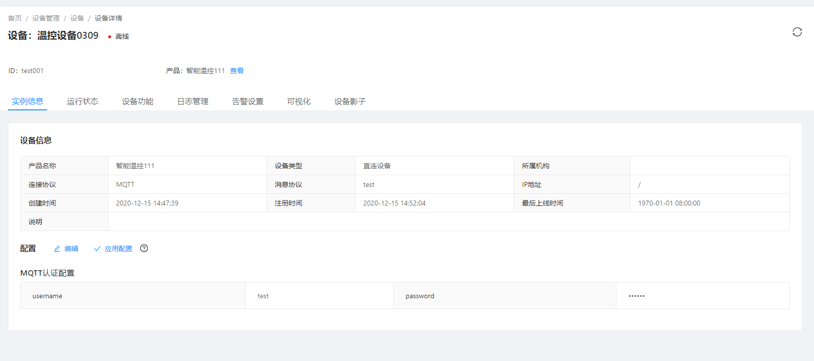

# 通过规则引擎处理设备事件消息发送钉钉通知

本文档介绍通过MQTT.fx发送消息到物联网平台，物联网平台通过规则引擎的将MQTT.fx发送的消息到用户`钉钉`客户端上。

## 前提条件

1. 已在平台中创建产品和设备

2. 设备已接入平台（设备已上线）

> 创建产品和设备具体操作细节，请参考[添加设备型号](../device-manager.md/#添加设备型号)、[添加设备实例](../device-manager.md/#添加设备实例)。
>
> 设备接入平台，请参考[设备接入教程](device-connection.md)

### 创建成功的设备实例信息展示
     
i. 设备基本信息



ii. 设备运行状态信息


iii. 设备日志


## 新建规则引擎

进入系统: `规则引擎`-`规则模型` 点击列表上的`添加模型` 添加一个规则模型模板。


1.添加`消息网关`规则节点，用于接收设备事件上报消息。


    
  i. `网关`:选择`系统默认`。
  
  ii. `类型`:选择`订阅信息`。
    
  iii. 填写`主题(Topic)`，该文档Topic使用`/device/**`(代表订阅以/device/开头的所有topic)。

2.添加`通知`规则节点，用于转发设备上报消息通知至`钉钉`。


> 说明：上图第2步连线代表规则引擎节点指向下一个规则节点。参考文档[规则引擎-连线](rule-engine.md#连线)

  i. `通知类型`:选择`钉钉`。
  
  ii. `通知器`:选择`钉钉`。
  
  > `通知器`详情如下图，自定义`通知器`请参考文档[钉钉通知配置](notification.md#钉钉通知)
    
  
  
  iii. `通知模板`:选择`钉钉`。
  
> `通知模板`详情如下图。
> 
>通知模板内容中，表达式：`${#data["message"]["data"]}` 会被规则引擎内置变量替换为消息网关所收到的设备上报事件数据。
>
>自定义`通知模板`请参考文档：[钉钉通知模板](notification.md#钉钉通知)
>
>规则引擎内置变量说明：[规则引擎-内置变量](rule-engine.md#内置节点)
  


3.`消息网关`和`通知`配置完成后，鼠标点击中间`空白处`，将会显示模型信息，`模型ID`填写完成后点击`保存`。


> 点击中间空白区域将会显示`保存`按钮
 
4.点击`操作`列中的`发布`按钮，发布规则引擎，发布成功后`规则实例`将会显示发布的`规则模型`。

 
 
5.进入`规则实例`列表也，点击`操作`列的`启动`按钮，运行`规则模型`
  
 
 
## 设备事件上报

MQTT。fx 推送设备事件消息到平台

以火灾报警事件为例。

1.在MQTT。fx上，单击 `Publish`。

2.输入事件上报Topic和要发送的事件内容，单击Publish按钮，向平台推送该事件消息。


该文档使用的topic: `/chiefdata/push/fire_alarm/department/1/area/1/dev/test001`

该文档所使用的回复内容

```json
{
   "devid":"test001",
    "pname":"烟感001",
    "aid":105,
    "a_name":"未来科技城",
    "b_name":"C2 栋",
    "l_name":"12-05-201",
    "timestamp":"2019-11-06 16:28:50",
    "alarm_type":1,
    "alarm_describe":"火灾报警",
    "event_id":1,
    "event_count":1
}
```

| 参数         | 说明    |
| :-----   | :-----  |
| devid       | 设备Id   |
| pname        |   设备型号名称   |
| aid        |   区域Id   |
| a_name        |   区域名称   |
| b_name        |   建筑名称   |
| l_name        |   位置名称   |
| timestamp        |   上报时间   |
| alarm_type        |   报警类型   |
| alarm_describe        |   报警描述   |
| event_id        |   事件 ID   |
| event_count        |   该事件上报次数   |

## 测试结果

 