# 规则引擎
提供可视化,流程化的数据(逻辑)处理工具.

## 规则实例

### 创建规则
**操作步骤**
1. 进入系统: `规则引擎`-`规则实例`-`创建规则`。  

2. 输入id、名称。  

3. 点击`确定`进行保存。  

4.保存过后会自动保存跳转到设计器。
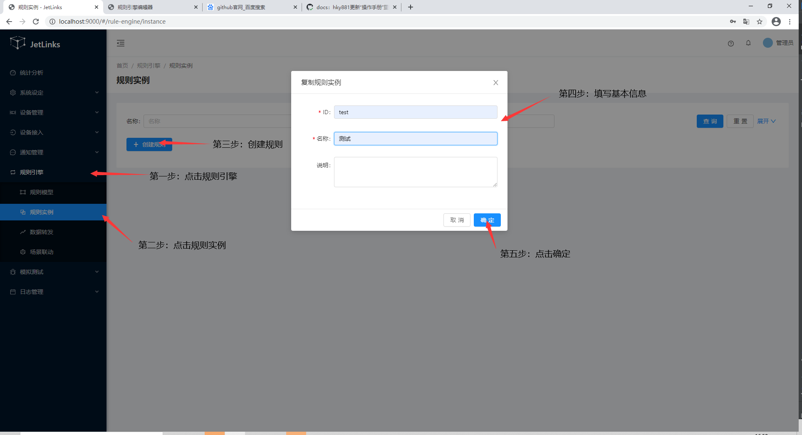   

### 设计器
在[创建规则](#创建规则)完成后，在对应规则的操作列点击`编辑`进入设计器。  

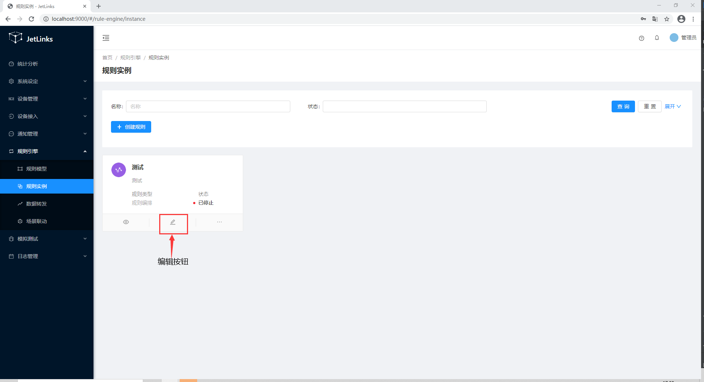  

浏览器将新打开一个标签页来展示设计器。  
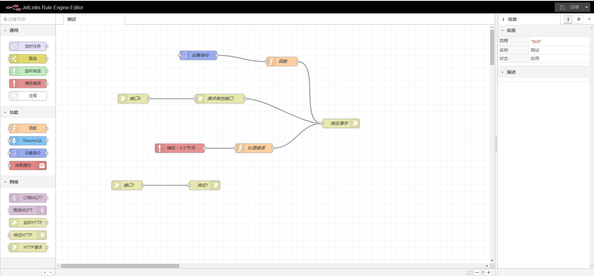  

#### 节点

规则中的节点可在设计器左侧的组件栏中选择，目前有通用、功能、网络三种类型的组件。  

    

#### 连线

节点之间通过`连线`连接，`连线`保证多个节点连续执行和有序执行。  

    

#### 设计规则

##### 创建节点

1. 使用鼠标左键在左侧组件栏中选择相应组件并拖动到中间工作区域。  

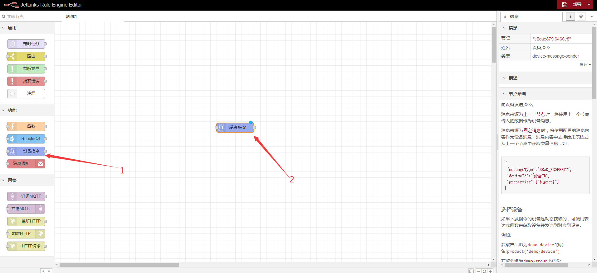   

2. 双击该组件打开编辑页面，各组件对应的节点页面各有不同，此处以`设备指令`为例。  

  

3. 编辑完成后点击`完成`。  

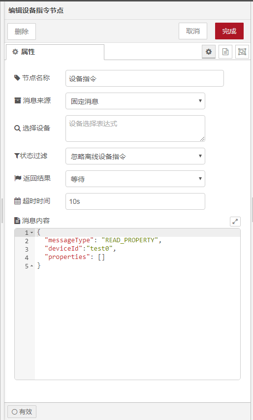  

**节点属性在节点帮助中有详细说明，请仔细阅读。**  

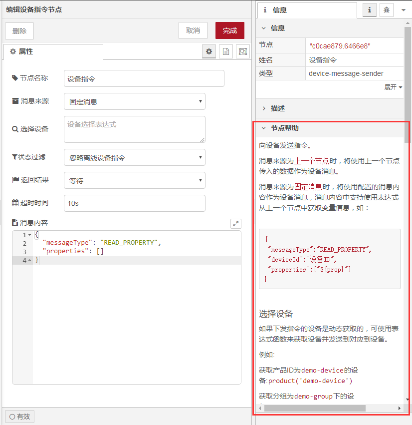  

##### 连线

在节点的两段上使用鼠标左键拖动会形成线，在连接到下游节点即可。  

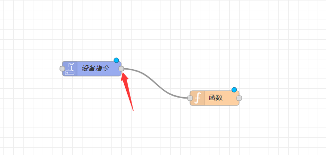  

##### 保存

设计完整个规则之后，点击设计器右上角`部署`按钮保存。  

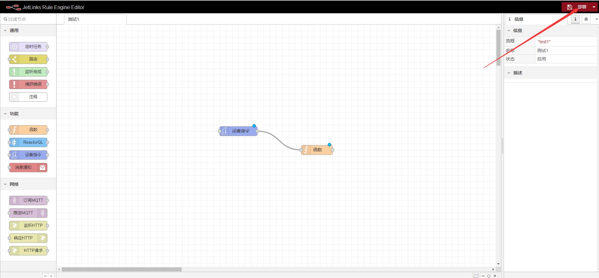  

::: tip 注意：
保存有两种方式，通过下拉展开，一是仅对规则进行保存；二是全部重新部署全部节点。  
下拉列表选项选中后只是切换两个选项，还需点击`部署`按钮进行提交。　　
:::  

##### 部署或者启动

在设计器右上角选择部署后，点击`部署`按钮进行部署。　　

或者保存规则后回到规则实例列表中，[启动](#启动)。　　

### 启动
**操作步骤**
1. 进入系统: `规则引擎`-`规则实例`。  

2. 选择需要启动的规则，在操作列点击`启动`。    
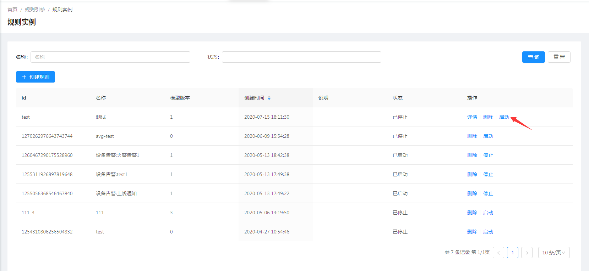   
 
### 停止
**操作步骤**
1. 进入系统: `规则引擎`-`规则实例`。  

2. 选择需要停止的规则，在操作列点击`停止`。    
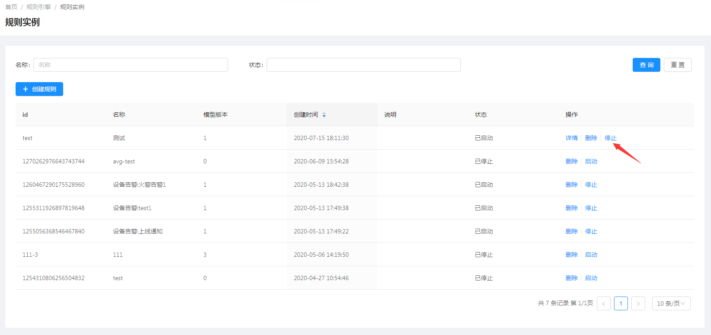   

### 删除规则
**操作步骤**
进入系统: `规则引擎`-`规则实例`，在操作列点击`删除`。  
  
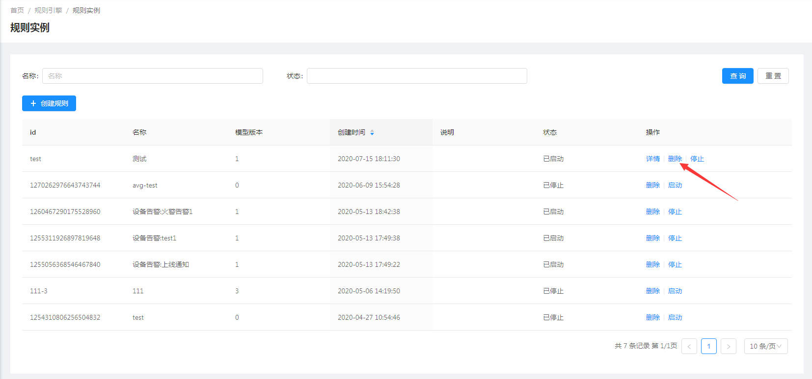  

## 数据转发

[参考规则引擎-数据转发](../../best-practices/rule-engine-sql.md)
