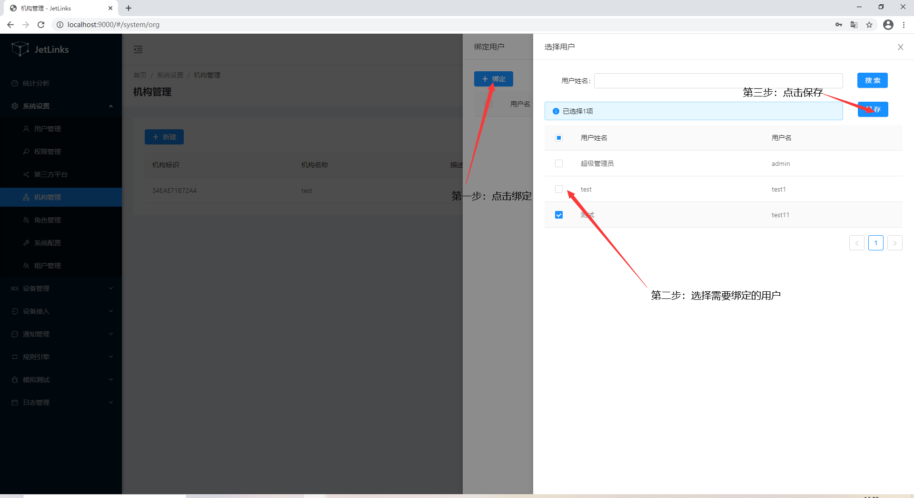

# 系统配置

## 用户管理
用于系统用户的新增、修改、权限分配。

### 新增
**操作步骤**
1. 进入系统: `系统设置`-`用户管理`-`新建`。  

2. 输入用户信息。  

3. 点击`确定`进行保存。  
  

### 编辑
**操作步骤**
1. 进入系统: `系统设置`-`用户管理`，在操作列点击`编辑`。  
2. 编辑用户信息。  
3. 点击`确定`进行保存。  
  

### 分配权限 
请参考[权限分配](#权限分配 "权限分配")  
使用超级管理员用户登录系统（默认账号：`admin`,密码：`admin`），注意：该账号只能用于系统设置相关功能，
请勿使用该账号操作业务功能。

#### 基本操作赋权
**操作步骤**  
1. 进入系统: `系统设置`-`用户管理`添加`用户`。  
  
   
  
2.用户管理页面选择需要分配权限的用户，点击`用户赋权`按钮进入用户赋权页面。  
  
  

3.进入用户赋权页面，在`权限操作`列勾选该用户需要控制的权限（可多选），如：通知管理的查询、保存、删除、导入、导出等。
点击`保存`按钮进行保存；  
  
    
基本操作赋权演示：   
 

用户未分配权限时，进入系统后无权限、无菜单。   
  

用户分配权限后，进入系统将拥有已分配的权限以及对应的菜单。  
  

## 权限管理

## OpenApi客户端
用于OpenAPI客户端管理。  

### 新增
**操作步骤**
1. 进入系统: `系统设置`-`OpenAPI客户端`-`新建`。  

2. 客户端信息。  

3. 点击`确定`进行保存。  
  

### 编辑
**操作步骤**
1. 进入系统: `系统设置`-`OpenAPI客户端`，在操作列点击`编辑`。  
2. 编辑机构信息。  
3. 点击`确定`。  

### 赋权

::: tip 注意：
OpenAPI客户端赋权时，赋权页所展示的权限需要提前`在权限设置中将对应权限的`分类`设置为`API接口`。
:::
**操作步骤**
1. 进入系统: `系统设置`-`OpenAPI客户端`，在需要赋权行的操作列点击`赋权`按钮进入赋权界面。 

  
 
2.  在赋权页勾选需要分配的权限。 

  

3. 点击`保存`按钮进行保存。  

### 禁用
**操作步骤**
1. 进入系统: `系统设置`-`OpenAPI客户端`，在需要禁用行的操作列点击`禁用`按钮。  

2.  点击`确定`。  
  

### 启用
**操作步骤**
1. 进入系统: `系统设置`-`OpenAPI客户端`，在需要启用行的操作列点击`启用`按钮。  

2.  点击`确定`。  

  

## 机构管理
用于组织机构的新增、修改、删除、权限分配、绑定用户。

### 新增
**操作步骤**
1. 进入系统: `系统设置`-`机构管理`-`新建`。  

2. 输入机构信息。  

3. 点击`确定`进行保存。  
  

如需增加子机构：  
1. 在需要添加子机构的行点击操作列中的`添加子机构`。  
2. 输入子机构信息。  
3. 点击`确定`进行保存。  
 
### 编辑
**操作步骤**
1. 进入系统: `系统设置`-`机构管理`，在操作列点击`编辑`。  
2. 编辑机构信息。  
3. 点击`确定`。  

### 删除
**操作步骤**
1. 进入系统: `系统设置`-`机构管理`，在需要删除行的操作列点击`删除`。  
2.  点击`确定`。  
  

### 绑定用户
**操作步骤**
1. 进入系统: `系统设置`-`机构管理`，在需要绑定行的操作列点击`绑定用户`。  

2.  在右侧弹出框中点击`新建`，勾选需要绑定的用户，点击`保存`。  
  

### 分配权限 
请参考[权限分配](#权限分配)  。

## 角色管理
请参考[机构管理](#机构管理)。

## 系统配置

用于制定主题以及logo。  

  

## 租户管理

### 新增
**操作步骤**
1. 进入系统: `系统设置`-`租户管理`-`添加`。  

  

2. 输入租户信息。  

3. 点击`确定`进行保存。  
  

### 基本信息

在列表页对应租户操作列点击`查看`，进入基本信息页面。  

  

### 资产信息

在基本信息页上点击`资产信息`选项卡进入资产信息页面。  

  

#### 添加资产

1. 点击相应资产框上的编辑按钮，进入资产编辑页面。

  

2. 点击`添加`按钮进入资产添加页面。  

3. 选择需要添加资产的租户成员。  

4. 在列表中选择资产。  

5. 点击`添加n项`按钮保存。  

  

#### 解绑资产

勾选需要解绑的资产，点击`解绑n项`按钮即可。  

  

### 成员管理

租户新增时创建的用户默认为管理员。 

#### 新增

在成员管理页面，点击`新增`按钮。  

  

#### 解绑

在需要解绑的成员操作列点击`解绑`。  

  

### 权限分配

点击`查看权限`选项卡，进入权限分配页面，勾选相应权限后点击`更新权限信息`。  

  

### 测试

使用创建的租户账号登录平台，只能访问对应的资产。  

  