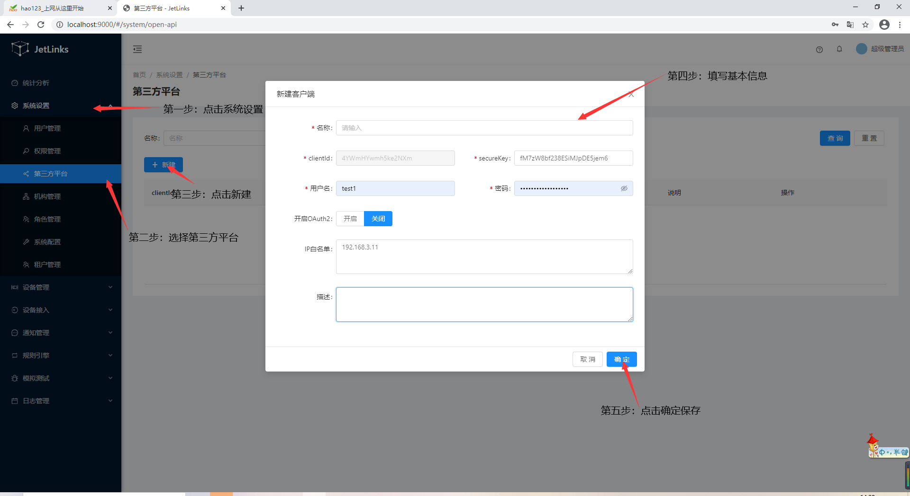

# 系统配置

## 用户管理
用于系统用户的新增、修改、权限分配。

### 新增
**操作步骤**
1. 进入系统: `系统设置`-`用户管理`-`新建`。  

2. 输入用户信息。  

3. 点击`确定`进行保存。  
  

### 编辑
**操作步骤**
1. 进入系统: `系统设置`-`用户管理`，在操作列点击`编辑`。  
2. 编辑用户信息。  
3. 点击`确定`进行保存。  
  

### 分配权限 
请参考[权限分配](#权限分配 "权限分配")  
使用超级管理员用户登录系统（默认账号：`admin`,密码：`admin`），注意：该账号只能用于系统设置相关功能，
请勿使用该账号操作业务功能。

#### 基本操作赋权
**操作步骤**  
1. 进入系统: `系统设置`-`用户管理`添加`用户`。  
  
   
  
2.用户管理页面选择需要分配权限的用户，点击`用户赋权`按钮进入用户赋权页面。  
  
  

3.进入用户赋权页面，在`权限操作`列勾选该用户需要控制的权限（可多选），如：通知管理的查询、保存、删除、发送通知等。
点击`保存`按钮进行保存；  
  
  
用户未分配权限时，进入系统后无权限、无菜单（这里以test1用户作为演示）。   
  

用户分配权限后，进入系统将拥有已分配的权限以及对应的菜单。  
  

## 权限管理

用于创建、编辑和删除新对权限，并且对系统，业务功能、api接口和多租户进行权限对分类。

### 新增权限
**操作步骤**
1、进入系统：  `系统设置`-`权限管理`-`新建`

2、输入权限对ID、名称，权限需要用在哪里就选择对应对分类。

3、点击确定保存

###编辑权限

1、进入系统：`系统设置`-`权限管理`-`新建`，然后在操作列点击`编辑`。

2、对需要修改对信息进行响应对修改。也可以查看`关联权限`和编辑、删除 `数据视图`。

3、点击`确定`进行保存。

## 第三方平台
用于第三方平台管理。  

### 新增
**操作步骤**
1. 进入系统: `系统设置`-`第三方平台`-`新建`。  

2. 客户端信息。  

3. 点击`确定`进行保存。  
  

### 编辑
**操作步骤**
1. 进入系统: `系统设置`-`第三方平台`，在操作列点击`编辑`。  
2. 编辑机构信息。  
3. 点击`确定`。  

### 赋权

::: tip 注意：
第三方平台赋权时，赋权页所展示的权限需要提前在`权限管理`→`编辑`，将分类设置为`API接口`，这样第三方平台赋权页才有相应的权限设置。

:::
**操作步骤**
1. 进入系统: `系统设置`-`第三方平台`，在需要赋权行的操作列点击`赋权`按钮进入赋权界面。 

  
 
2.  在赋权页勾选需要分配的权限。 

  

3. 点击`保存`按钮进行保存。  

### 禁用
**操作步骤**
1. 进入系统: `系统设置`-`第三方平台`，在需要禁用行的操作列点击`禁用`按钮。  

2.  点击`确定`。  
  

### 启用
**操作步骤**
1. 进入系统: `系统设置`-`第三方平台`，在需要启用行的操作列点击`启用`按钮。  

2.  点击`确定`。  

  

## 机构管理
用于组织机构的新增、修改、删除、权限分配、绑定用户。

### 新增
**操作步骤**
1. 进入系统: `系统设置`-`机构管理`-`新建`。  

2. 输入机构信息。  

3. 点击`确定`进行保存。  
  

如需增加子机构：  
1. 在需要添加子机构的行点击操作列中的`添加子机构`。  
2. 输入子机构信息。  
3. 点击`确定`进行保存。  
 
### 编辑
**操作步骤**
1. 进入系统: `系统设置`-`机构管理`，在操作列点击`编辑`。  
2. 编辑机构信息。  
3. 点击`确定`。  

### 删除
**操作步骤**
1. 进入系统: `系统设置`-`机构管理`，在需要删除行的操作列点击`删除`。  
2.  点击`确定`。  
  

### 绑定用户
**操作步骤**
1. 进入系统: `系统设置`-`机构管理`，在需要绑定行的操作列点击`绑定用户`。  

2.  在右侧弹出框中点击`绑定`，勾选需要绑定的用户，点击`保存`。  
  

### 分配权限 
请参考[权限分配](#权限分配)  。

## 角色管理
请参考[机构管理](#机构管理)。

## 系统配置

用于制定主题以及logo。  

  

## 租户管理
用于系统租户的新增、修改、资产分配、权限分配。
### 新增
**操作步骤**
1. 进入系统: `系统设置`-`租户管理`-`添加`。
2. 输入租户信息。
3. 点击`确定`进行保存。  

  

  

### 查看基本信息
**操作步骤**

进入系统:   `系统设置`→`租户管理`。  

  

点击查看基本信息

### 资产信息
**操作步骤**
1、进入系统: 系统设置→租户管理→查看。

2、在基本信息页上点击`资产信息`选项卡进入资产信息页面。

  
 
查看资产信息

**操作步骤**

2、进入系统: 系统设置→租户管理→查看。

1、点击查看资产信息。

查看产品资产：点击查看产品。

查看设备资产：点击查看设备。

#### 添加资产

1. 点击相应资产框上的编辑按钮，进入资产编辑页面。

  

2. 点击`添加`按钮进入资产添加页面。  

3. 选择需要添加资产的租户成员。  

4. 在列表中选择资产。  

5. 点击`添加n项`按钮保存。  

  

#### 解绑资产

**操作步骤**

1、进入系统: 系统设置→租户管理→查看→资产信息。

2、点击编辑。

3、勾选需要解绑的资产，点击`解绑n项`按钮即可。  

  

### 成员管理

租户新增时创建的用户默认为管理员。 

#### 新增

在成员管理页面，点击`新增`按钮。  

  

#### 解绑

在需要解绑的成员操作列点击`解绑`。  

  

### 权限分配

点击`查看权限`选项卡，进入权限分配页面，勾选相应权限后点击`更新权限信息`。  

  
::: tip 注意：
权限分配页面所展示的权限需要提前在`权限管理`→`编辑`，将`分类`设置为`多租户`，这样权限分配页面才有相应的权限设置。

:::
### 租户测试
   
1、统计分析

对租户拥有产品、设备、告警数、消息通知有个笼统概括，管理员还显示对租户的一个统计。

管理员界面：
  

普通租户界面

2、个人设置

基本设置

  可对用户姓名、主租户、联系电话、说明等进行修改。

3、安全设置

可对用户密码进行修改。

4、通知订阅

### 系统设置
::: tip 注意：
注：只有管理员才拥有
:::

1、基本信息

2、资产信息

3、成员管理

4、查看权限
