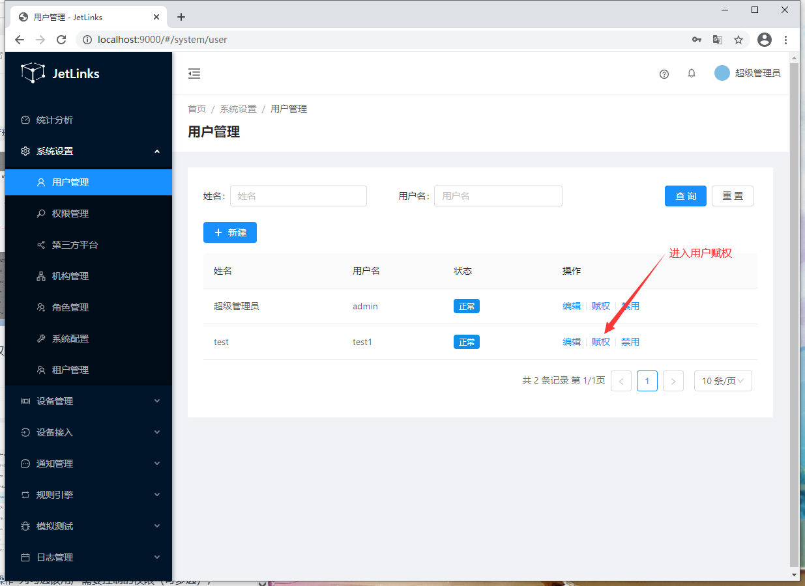

# 系统配置

## 用户管理
用于系统用户的新增、修改、权限分配。

### 新增
**操作步骤**
1. 进入系统: `系统设置`-`用户管理`-`新建`。  

2. 输入用户信息。  

3. 点击`确定`进行保存。  

### 编辑
**操作步骤**
1. 进入系统: `系统设置`-`用户管理`，在操作列点击`编辑`。  
2. 编辑用户信息。  
3. 点击`确定`进行保存。  

### 分配权限 
请参考[权限分配](#权限分配 "权限分配")  
## 权限分配
使用超级管理员用户登录系统（默认账号：`admin`,密码：`admin`），注意：该账号只能用于系统设置相关功能，
请勿使用该账号操作业务功能。

### 基本操作赋权
**操作步骤**  
1. 进入系统: `系统设置`-`用户管理`添加`用户`。  
  
   
  
2.用户管理页面选择需要分配权限的用户，点击`用户赋权`按钮进入用户赋权页面。  
  
  

3.进入用户赋权页面，在`权限操作`列勾选该用户需要控制的权限（可多选），如：通知管理的查询、保存、删除、导入、导出等。
点击`保存`按钮进行保存；  
  
    
基本操作赋权演示：   
 

用户未分配权限时，进入系统后无权限、无菜单。   
  

用户分配权限后，进入系统将拥有已分配的权限以及对应的菜单。  

## 机构管理
用于组织机构的新增、修改、删除、权限分配、绑定用户。

### 新增
**操作步骤**
1. 进入系统: `系统设置`-`机构管理`-`新建`。  

2. 输入机构信息。  

3. 点击`确定`进行保存。  
  

如需增加子机构：  
1. 在需要添加子机构的行点击操作列中的`添加子机构`。  
2. 输入子机构信息。  
3. 点击`确定`进行保存。  
 
### 编辑
**操作步骤**
1. 进入系统: `系统设置`-`机构管理`，在操作列点击`编辑`。  
2. 编辑机构信息。  
3. 点击`确定`。  

### 删除
**操作步骤**
1. 进入系统: `系统设置`-`机构管理`，在需要删除行的操作列点击`删除`。  
2.  点击`确定`。  
  

### 绑定用户
**操作步骤**
1. 进入系统: `系统设置`-`机构管理`，在需要绑定行的操作列点击`绑定用户`。  

2.  在右侧弹出框中点击`新建`，勾选需要绑定的用户，点击`保存`。  
  

### 分配权限 
请参考[权限分配](#权限分配 "权限分配")  。

## 角色管理
请参考[机构管理](#机构管理)。

