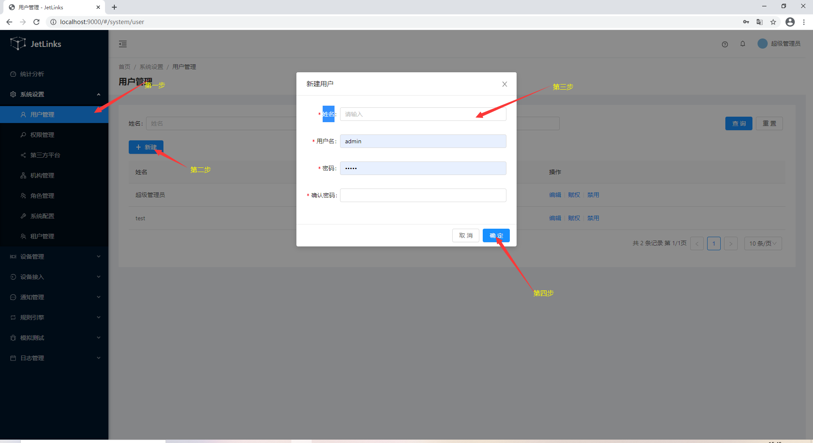

# 配置用户权限教程
使用超级管理员用户登录系统（默认账号：`admin`,密码：`admin`），注意：该账号只能用于系统设置相关功能，
请勿使用该账号操作业务功能。

## 基本操作赋权
**操作步骤**
1. 进入系统: `系统设置`-`用户管理`添加`用户`。  
  
   
  
2. 用户管理页面选择需要分配权限的用户，点击`用户赋权`按钮进入用户赋权页面。  
  
  

3. 进入用户赋权页面，点击该用户需要控制的权限，该行将展开列出具体的操作，如：查询、保存、删除、导入、导出等。
勾选操作（可多选）后继续选择其他权限进行选择或点击`保存`按钮进行保存；  
  
  
该页右侧为快捷导航，展开显示所有权限。  
  
点击权限快速定位到对应权限设置处并展开。  
  
4. 点击赋权页下方`保存`按钮完成用户赋权操作。  
  
基本操作赋权演示：   
 

用户未分配权限时，进入系统后无权限、无菜单。   
  

用户分配权限后，进入系统将拥有已分配的权限以及对应的菜单。  

## 字段权限赋权
**操作步骤**
1. 在系统左侧导航栏，单击系统设置>权限管理。  
  
2. 在权限管理页，选择需要进行字段权限控制的权限，本教程以设备型号为例。点击`编辑`按钮进入编辑页。  
  
 i. 在`支持的数据权限控制方式`下拉列表处，选择`字段权限`；  
    
 ii. 在i的基础上`操作配置`中`支持数据权限`下拉列表将会出现`字段权限`的选项，选择即可；  
   
 iii. 在`操作配置`中，对应`标识`选择了`字段权限`将在对应操作时进行字段权限控制。  
 如在`标识`query行的`支持数据权限`，选择了字段权限，则在型号管理功能界面查询时将进行字段权限控制。  
 iv. 在该页底部点击`保存`按钮即可保存配置。  
3. 在系统左侧导航栏，单击系统设置>用户管理。  
  
4. 用户管理页面选择需要分配权限的用户，点击`用户赋权`按钮进入用户赋权页面。  
  
  
5. 进入用户赋权页面，定位到设备型号，该行将多出一个`字段权限`按钮，点击进入字段权限控制配置  
  
  
6. 在字段权限编辑页面将展示出权限编辑中`数据视图`中的所有字段，并且在每个字段后列出权限编辑中选择了字段权限控制的操作，以供用户选择。  
  
  
i. 在该页面中，勾选字段列后的操作选项，选中表示该字段允许进行此操作。  
例如：`名称` 勾选了`保存`和`删除`，则在设备型号管理中查询时不会返回`名称`的数据。  
  
ii. 字段权限配置完成后点击需`保存`按钮完成编辑。  
  
7. 点击赋权页下方`保存`按钮完成用户赋权操作。  
  
