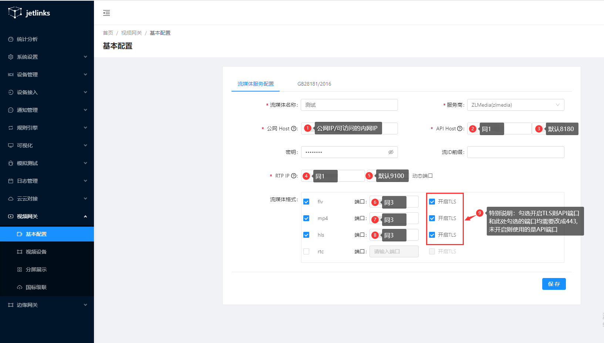

# 视频网关

## GB28181信令服务
1、进入系统：`视频网关`-`GB28181信令服务`

2、填写GB28181信令服务信息。

> SIP ID：https://www.cnblogs.com/cash/p/14177671.html (opens new window)根据这个网站提供的规则进行编写
> 
> SIP 域：SIP ID取前10位

- 具体端口开放根据部署情况而定
- 如使用jar包部署且为本地部署则不受限制
- 如使用jar包部署但使用云服务器部署，需要到云服务器控制台安全组开放udp端口
- 使用docker部署，需要映射端口，如docker部署在云服务器上，仍需要开放安全组端口
- 使用docker-compose编排文件部署，查看docker-compose文件内jetlinks节点的port节点下udp预留端口，部署在云服务器上，仍需要开放安全组端口

3、点击`启用`和`保存`。
## 基本配置

### 操作步骤

1、进入系统：`视频网关`-`基本配置`

2、填写流媒体基本到信息。

摄像头配置信息。查看[配置示例](../media-guide/media-base-config.md)

3、点击保存。

:::tip 注意 GB28181/2016标签也需要配置
:::

4、修改端口
如没有端口冲突此项可跳过。
查看`jetlinks-pro\expands-components\jetlinks-media\zlm\docker-compose.yml`文件
- API Host端口：`8180:80` 处修改左侧端口，改为自己的端口即可

5、关于秘钥
1. gb28181的秘钥：自定义即可
2. 流媒体服务的秘钥：查看`jetlinks-pro\expands-components\jetlinks-media\zlm\config.ini`里的`secret`参数复制填入

## 视频设备

可以对连接到设备查看，编辑，查看通道和更新通道

### 查看

#### 操作步骤：

1、进入系统：`视频网关`-`视频设备`-`查看`

2、跳转到设备到基本信息界面

3、特别说明
由于国标设备是定时上报给信令服务，配置完后并不一定能即时看到视频设备数据。请等待30s-1min，如超出时间仍未连接上。
- 检查配置是否正确
- 检查端口是否开放

### 编辑

选择需要编辑到设备，在操作栏点击编辑，可以对设备对基本信息进行编辑

### 查看通道

点击操作栏`查看通道`可以查询到此设备所使用的通道和基本的信息以及查看摄像头监控画面。

### 更新通道

## 分屏展示

分屏展示对摄像头监控画面进行播放，支持单屏，四分屏，九分屏，和全屏，对于可以旋转对摄像头也可以通过右边对调节按钮调整摄像头方向。

## 国标级联

把本地平台的设备推送给上级平台。

### 新增

#### 操作步骤：

1、进入系统：`视屏网关`-`国标级联`-`新建`

2、填写上级平台的基本信息。

3、点击确定保存

### 编辑

在操作栏点击`编辑`用于修改连接上级平台的基本信息

### 选择通道

在操作栏点击`选择通道`可以选择不同的通道来进行上传。

