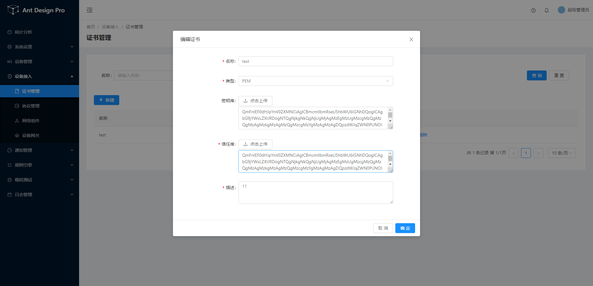

# 网络组件

各种网络通信协议组件实现，通过可视化配置HTTP(S),TCP(TLS),CoAP(DTLS),UDP(DTLS)
等客户端及服务端,以及提供多维度多监控(统计,流量,负载,异常...).

## 证书管理

证书管理用于统一管理各个网络组件所需的TLS证书,支持证书格式:`JKS`,`P12`,`PEM`.

### 生成证书

> 使用平台脚本生成的加密文件进行连接测试。平台生成脚本在目录 `D:\code\jetlinks\jetlinks-pro\jetlinks-manager\network-manager\src\test\resources\create.sh`,windows环境，在create.sh目录下执行以下命令

```bash
./create.sh
```

```sh
#!/usr/bin/env bash

#秘钥文件
KEY_STORE=keyStore.jks
#秘钥密码
KEY_STORE_PWD=endPass
#信任库秘钥文件
TRUST_STORE=trustStore.jks
#信任库密码
TRUST_STORE_PWD=rootPass

# android support - PKCS12
#P12证书信任库文件
TRUST_STORE_P12=trustStore.p12
#用于导出P12证书客户端秘钥文件
CLIENT_KEY_STORE_P12=client.p12
#用于导出P12证书服务端秘钥文件
SERVER_KEY_STORE_P12=server.p12

# PEM
# 用于导出PEM证书信任库文件
TRUST_STORE_PEM=trustStore.pem
# 用于导出PEM证书客户端秘钥文件
CLIENT_KEY_STORE_PEM=client.pem
# 用于导出PEM证书服务端秘钥文件
SERVER_KEY_STORE_PEM=server.pem

VALIDITY=3650

create_keys() {
    # 生成根秘钥文件和证书
    # -genkeypair 生成密钥对  -alias root 别名root
    # -keyalg 指定使用EC算法 -dname 指定证书拥有者信息
    # -ext BC=ca:true来标明这是一个CA证书
    # -validity设置有效期 -keypass 指定别名条目的密码$TRUST_STORE_PWD=rootPass
    # -keystore 指定密钥库的名称  -storepass 指定密钥库使用$TRUST_STORE_PWD密码
   echo "creating root key and certificate..."
   keytool -genkeypair -alias root -keyalg EC -dname 'C=CN,L=ChongQing,O=JetLinks Pro,OU=Iot Platform,CN=root' \
        -ext BC=ca:true -validity $VALIDITY -keypass $TRUST_STORE_PWD -keystore $TRUST_STORE -storepass $TRUST_STORE_PWD

    # 生成CA秘钥文件和证书
    # -genkeypair 生成密钥对  -alias ca 别名ca
    # -keyalg 指定使用EC算法 -dname 指定证书拥有者信息
    # -ext bc:ca来标明这是一个CA证书
    # -validity设置有效期 -keypass 指定别名条目的密码$TRUST_STORE_PWD=rootPass
    # -keystore 指定密钥库的名称$TRUST_STORE=trustStore.jks  -storepass 指定密钥库使用TRUST_STORE_PWD密码
    # keytool -keystore $TRUST_STORE -storepass $TRUST_STORE_PWD -certreq -alias ca 向CA发起签名请求别名ca
    # keytool -keystore $TRUST_STORE -storepass $TRUST_STORE_PWD -alias root -gencert -validity $VALIDITY -ext BC=0 -ext KU=keyCertSign,cRLSign -rfc 根据root证书生成3650天的root证书或者证书链
    # CA响应将ca证书导入$TRUST_STORE=trustStore.jks文件内
   echo "creating CA key and certificate..."
   keytool -genkeypair -alias ca -keyalg EC -dname 'C=CN,L=ChongQing,O=JetLinks Pro,OU=JetLinks Iot Platform,CN=ca' \
        -ext BC=ca:true -validity $VALIDITY -keypass $TRUST_STORE_PWD -keystore $TRUST_STORE -storepass $TRUST_STORE_PWD
   keytool -keystore $TRUST_STORE -storepass $TRUST_STORE_PWD -certreq -alias ca | \
      keytool -keystore $TRUST_STORE -storepass $TRUST_STORE_PWD -alias root -gencert -validity $VALIDITY -ext BC=0 -ext KU=keyCertSign,cRLSign -rfc | \
      keytool -alias ca -importcert -keystore $TRUST_STORE -storepass $TRUST_STORE_PWD

    # 生成服务端秘钥和证书
    # -genkeypair 生成密钥对  -alias server 别名server
    # ....
    # -keypass 指定别名条目的密码$KEY_STORE_PWD=endPass -keystore 指定密钥库的名称$KEY_STORE=keyStore.jks -storepass 指定密钥库使用$KEY_STORE_PWD的密码
    #  keytool -keystore $KEY_STORE -storepass $KEY_STORE_PWD -certreq -alias server 向CA发起签名请求别名server
    # keytool -keystore $TRUST_STORE -storepass $TRUST_STORE_PWD -alias ca -gencert -ext KU=dig,keyEnc,keyAgree -ext EKU=serverAuth -validity $VALIDITY -rfc > server.csr  根据ca证书生成服务端证书或证书链
    # CA响应将server证书导入$KEY_STORE=keyStore.jks中
   echo "creating server key and certificate..."
   keytool -genkeypair -alias server -keyalg EC -dname 'C=CN,L=ChongQing,O=JetLinks Pro,OU=JetLinks Iot Platform,CN=server' \
        -validity $VALIDITY -keypass $KEY_STORE_PWD -keystore $KEY_STORE -storepass $KEY_STORE_PWD
   keytool -keystore $KEY_STORE -storepass $KEY_STORE_PWD -certreq -alias server | \
      keytool -keystore $TRUST_STORE -storepass $TRUST_STORE_PWD -alias ca -gencert -ext KU=dig,keyEnc,keyAgree -ext EKU=serverAuth -validity $VALIDITY -rfc > server.csr
   keytool -alias server -importcert -keystore $KEY_STORE -storepass $KEY_STORE_PWD -trustcacerts -file server.csr

     # 生成客户端秘钥和证书
   echo "creating client key and certificate..."
   keytool -genkeypair -alias client -keyalg EC -dname 'C=CN,L=ChongQing,O=JetLinks Pro,OU=JetLinks Iot Platform,CN=client' \
        -validity $VALIDITY -keypass $KEY_STORE_PWD -keystore $KEY_STORE -storepass $KEY_STORE_PWD
   keytool -keystore $KEY_STORE -storepass $KEY_STORE_PWD -certreq -alias client | \
      keytool -keystore $TRUST_STORE -storepass $TRUST_STORE_PWD -alias ca -gencert -ext KU=dig,keyEnc,keyAgree -ext EKU=clientAuth -validity $VALIDITY -rfc > client.csr
   keytool -alias client -importcert -keystore $KEY_STORE -storepass $KEY_STORE_PWD -trustcacerts -file client.csr

    # 生成自签秘钥和证书
   echo "creating self-signed key and certificate..."
   keytool -genkeypair -alias self -keyalg EC -dname 'C=CN,L=ChongQing,O=JetLinks Pro,OU=JetLinks Iot Platform,CN=self' \
        -ext BC=ca:true -ext KU=keyCertSign -ext KU=dig -validity $VALIDITY -keypass $KEY_STORE_PWD -keystore $KEY_STORE -storepass $KEY_STORE_PWD

    #创建没有使用数字签名密钥的证书
   echo "creating certificate with no digitalSignature keyusage..."
   keytool -genkeypair -alias nosigning -keyalg EC -dname 'C=CN,L=ChongQing,O=JetLinks Pro,OU=JetLinks Iot Platform,CN=nosigning' \
        -ext BC=ca:true -ext KU=keyEn -validity $VALIDITY -keypass $KEY_STORE_PWD -keystore $KEY_STORE -storepass $KEY_STORE_PWD
}

#导出P12证书
export_p12() {
   echo "exporting keys into PKCS#12"
   keytool -v -importkeystore -srckeystore $KEY_STORE -srcstorepass $KEY_STORE_PWD -alias client \
      -destkeystore $CLIENT_KEY_STORE_P12 -deststorepass $KEY_STORE_PWD -deststoretype PKCS12
   keytool -v -importkeystore -srckeystore $KEY_STORE -srcstorepass $KEY_STORE_PWD -alias server \
      -destkeystore $SERVER_KEY_STORE_P12 -deststorepass $KEY_STORE_PWD -deststoretype PKCS12
   keytool -v -importkeystore -srckeystore $TRUST_STORE -srcstorepass $TRUST_STORE_PWD \
      -destkeystore $TRUST_STORE_P12 -deststorepass $TRUST_STORE_PWD -deststoretype PKCS12
}

export_pem() {
   openssl version

   if [ $? -eq 0 ] ; then
      echo "exporting keys into PEM format"
      openssl pkcs12 -in $SERVER_KEY_STORE_P12 -passin pass:$KEY_STORE_PWD -nodes -out $SERVER_KEY_STORE_PEM
      openssl pkcs12 -in $CLIENT_KEY_STORE_P12 -passin pass:$KEY_STORE_PWD -nodes -out $CLIENT_KEY_STORE_PEM
      openssl pkcs12 -in $TRUST_STORE_P12 -passin pass:$TRUST_STORE_PWD -nokeys -out $TRUST_STORE_PEM
      openssl ecparam -genkey -name prime256v1 -noout -out ec_private.pem
      openssl ec -in ec_private.pem -pubout -out ec_public.pem
   fi
}

create_keys
export_p12
export_pem
```

会生成以下文件

```
├─ resource
│  ├─ client.csr        #基于私钥创建客户端证书的签名请求文件
│  ├─ client.p12        #用于生成P12证书类型的客户端秘钥的文件
│  ├─ client.pem        # 导出的PEM类型客户端CA文件
│  ├─ ec_private.pem    #生成的ec算法私钥文件
│  ├─ ec_public.pem     #生成的ec算法公钥文件
│  ├─ keyStore.jks      #生成JKS证书类型的服务秘钥(server key)和证书文件
│  ├─ server.csr        #用于生成服务端私钥和证书的文件
│  ├─ server.p12        #用于生成P12证书类型的服务端秘钥的文件
│  ├─ server.pem        #PEM类型服务端私钥文件
│  ├─ trustStore.jks    #生成JKS证书类型的根秘钥(root key)和证书的文件
│  ├─ trustStore.p12    #用于生成P12证书类型秘钥的文件
│  └─ trustStore.pem    #信任库文件

```

### 使用PEM证书

> 平台上传秘钥库和信任库为同一文件,需要将`client.pem`和`ec_private.pem`合并成一个文件，即重新复制一份`ec_private.pem`文件后将`client.pem`文件全部内容粘贴在`ec_private.pem`文件内容后面，在平台的证书管理内上传合并后的文件。

> 特别注意：平台证书管理只允许上传证书文件，不允许复制内容粘贴在输入框内，粘贴的方式会报错。



开启证书TLS认证


客户端配置


### 使用JKS证书

JKS秘钥库密码：endPass
JKS信任库密码：rootPass

> 上传秘钥库：keyStore.jks
> 上传信任库：trustStore.jks
> 以上两个密码可以在create.sh文件内修改
> 修改参数如下：

```bash
KEY_STORE=keyStore.jks
KEY_STORE_PWD=endPass
TRUST_STORE=trustStore.jks
TRUST_STORE_PWD=rootPass
```

客户端配置

CA证书使用client.pem

### 使用P12证书

PFX秘钥库密码：endPass
PFX信任库密码：rootPass


CA证书使用client.pem


[下一步,设备管理](device-manager.md)