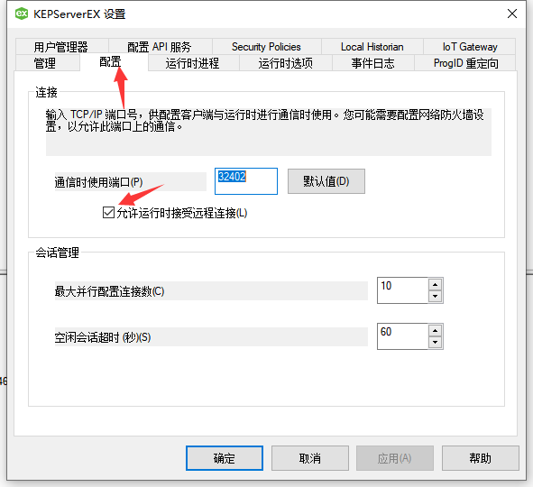
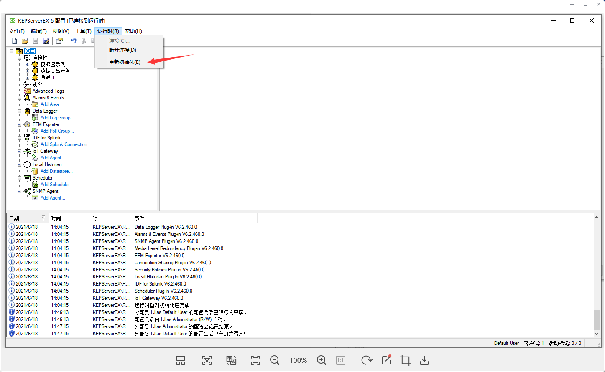

# opc ua操作文档
## 先决条件
安装KEPServerEX，在下文提供了kepserver安装文件

## 以示例文档配置
[示例文件](images/opc ua/example/)
* jetlinks data 存放opc ua设备信息、物模型模板表
* kepserver 配置文件

1. 右键kepserver图标`opc ua配置`，双击url，编辑`网络适配器`、`安全策略`，网络适配器默认为127.0.0.1,安全策略默认为无。 
点击`确定`

2. 复制上一步的url地址，进入jetlinks平台opc ua模块点击`新增`
粘贴第一步的url进入地址，安全策略填写 none/None
用户名和密码填写opc ua登录认证的
`用户名`、`密码`
点击`确定`

3. 进入产品模块，添加产品信息，`消息协议`,`传输协议`均选择`OPC-UA`,点击`保存`
4. 进入产品详情，`物模型`,快速导入物模型，选择示例物模型文件，并`应用配置`
 
5. 返回opc-ua模块,选择批量操作，`批量导入设备`，选择示例设备文件

6. 替换opc ua默认模拟设备，打开kepserver主界面，选择`文件`->`打开`，选择提供的示例服务器配置文件，如有需要，另存一下默认服务器配置
7. 开始采集

## FAQ
1. 启动的时候报

右键kepserver图标`设置`，按照下列操作配置后在尝试点击启动

