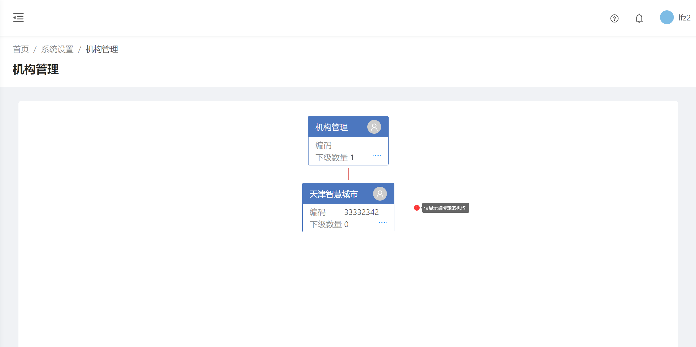
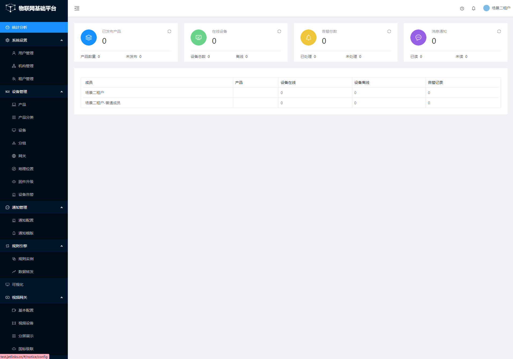
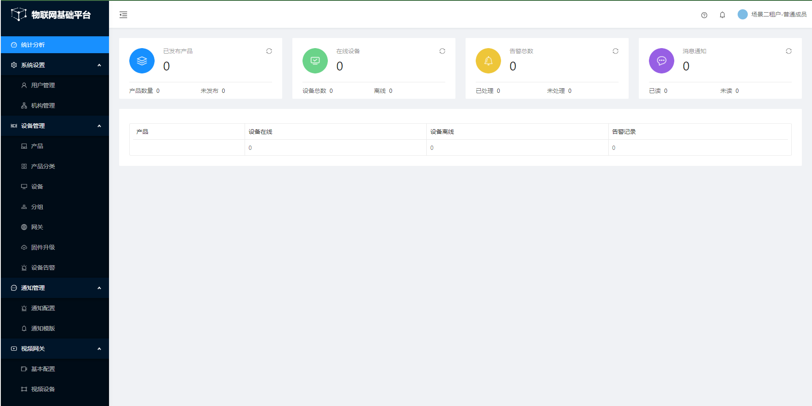
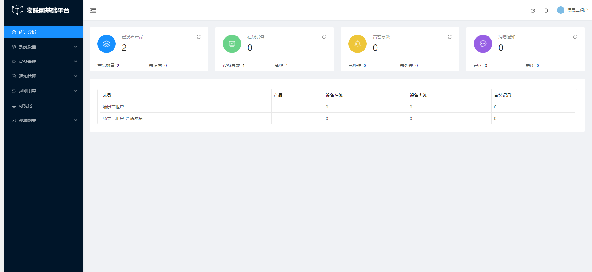
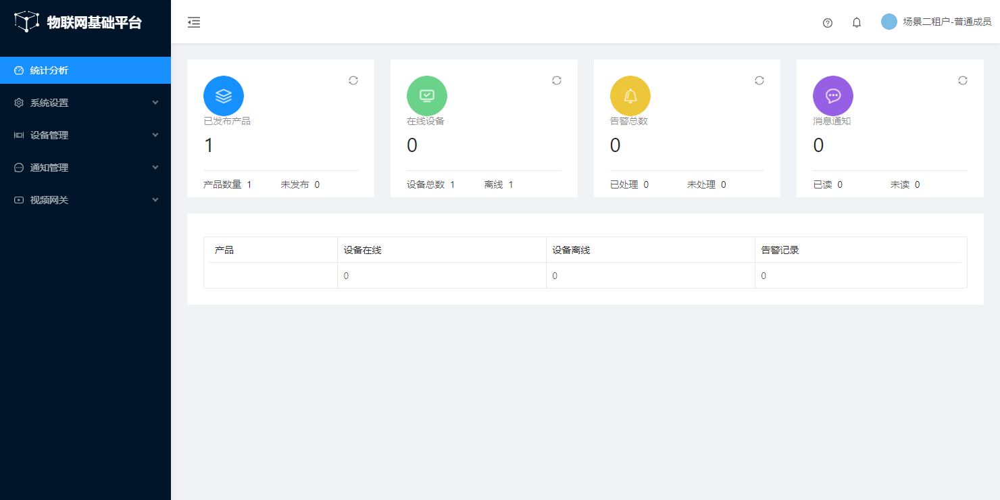
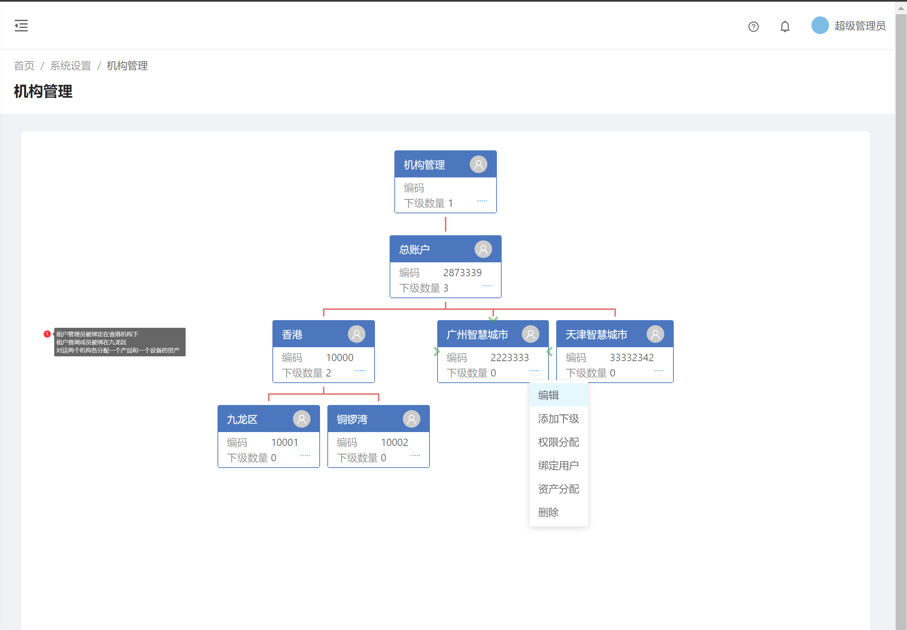
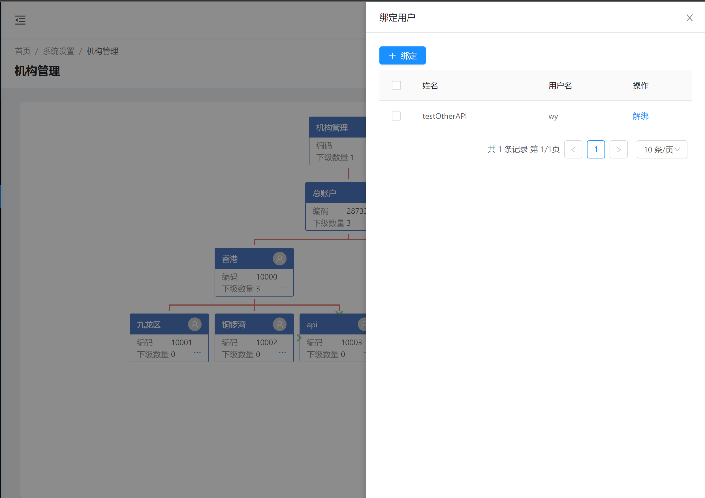
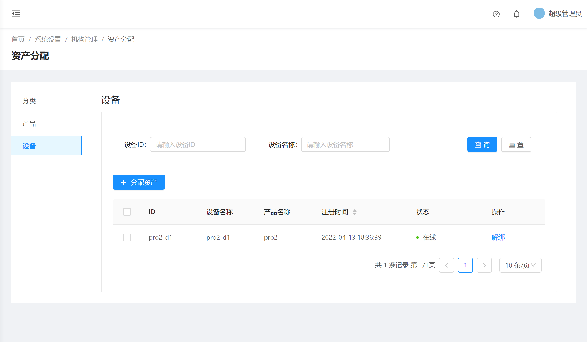
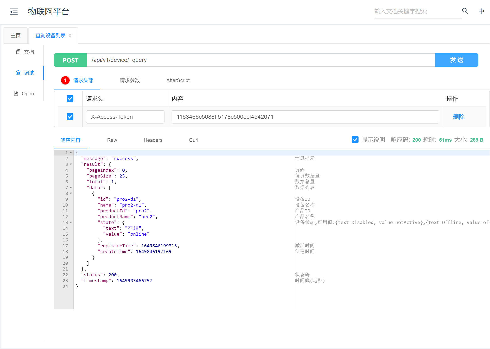

# 平台租户管理说明
 
## 场景一
 
### 场景说明

账号性质说明： 当前系统有账号A/B/C， A是普通用户账号，未绑定至任何租户下及机构下。 B为创建租户时生成的账号，默认为租户管理员。 C为租户绑定的普通成员。

 账号赋权说明： A账号赋权为用户管理赋权，无其它任何权限， B账号为租户赋权，无其它任何权限 C账号为租户赋权，无其它任何权限
 
### 测试结果

 
#### A用户展示界面【平台用户】

展示用户赋权内勾选的权限的界面。

 
#### B用户展示界面【租户管理员】
 系统管理：用户管理、机构管理、租户管理 设备管理：产品、产品分类、设备、分组、网关、地理位置、固件升级、设备告警 通知管理：通知配置、通知模板 规则引擎：规则实例、数据转发 可视化：(前端只展示了入口，但是界面无任何内容) 视频网关：基本配置、视频设备、分屏展示、国标级联
 
####  C用户展示界面【租户普通成员】
 系统设置：用户管理、机构管理 设备管理：产品、产品分类、设备、分组、网关、地理位置、固件升级、设备告警 通知管理：通知配置、通知模板 视频网关：基本配置、视频设备、分屏展示、国标级联
 
#### 租户权限隔离及权限说明

1. 请勿将超级管理员（admin）账号添加到租户中
1. 租户内绑定的成员在**查看租户**的**权限管理**勾选【**用户管理**】权限，则当前租户的所有成员都可以进行用户管理，若想对部分租户成员赋予用户管理的权限，则可以在用户管理中单独对该账号赋权。
1. 租户管理员可以在首页分析内看见自己以及租户下的其他普通租户成员的统计数据，普通成员仅能看见自己的资产数据。
1.  租户内分配资产默认是给所有租户成员分配，可以在资产分配列表内选择绑定租户成员，则仅对该租户成员分配资产。
1. 租户成员解绑，则平台自动会解绑该账号下绑定的一切资产（产品、设备）。
1. 租户主账号被解绑则该账号在用户管理内会被禁用。
1. 对租户成员直接分配设备但未分配产品，则平台⾃动将该设备所属产品绑定⾄租户成员下。对租户成员进行资产解绑时，解绑设备不会解绑对应绑定的产品，解绑产品会默认把当前产品下的所有设备进行同步解绑
1. 在**查看租户**的**权限管理**勾选【**可视化**】权限，界面只展示了入口，二级菜单均做了入口控制屏蔽。
1. 在**查看租户**的**权限管理**勾选【**规则引擎**】权限，则租户管理员可见规则引擎入口并且可以编辑修改，租户普通成员由前端控制屏蔽了入口。
1. 视频网关现目前没有做租户权限数据隔离，不建议开放视频网关给租户。
1. 设备管理地理位置没有做租户权限数据隔离，前端也没有控制屏蔽入口，若在**查看租户**的**权限管理**勾选【**地理位置**】权限，则租户登录可以查看到平台其他租户下的设备数据。
1.  租户成员默认订阅平台全部的设备数据而不是租户成员被分配的资产设备数据。如只订阅该租户成员分配的资产数据，则需要在配置文件中设置参数`rule.engine.task-executor.reactor-ql.enable-tenant=true`
1. 开启`rule.engine.task-executor.reactor-ql.enable-tenant=true`后，使用mqtt订阅设备消息也只能订阅到当前租户绑定的资产设备消息，未绑定的资产上报的数据及平台下发的报文等设备消息无法订阅。
1. 开启`allow-all-assets`参数并设置device、product资产类型后，该租户下的成员在使用api方式查询设备实例时能够访问到租户成员下全部绑定的资产设备信息。
1. 租户无法看到设备接入菜单，因前端进行入口控制屏蔽。
1. 通知配置中无法对**网络组件**配置（因为租户无法操作设备接入菜单，并且前端进行了屏蔽）。
1. 租户添加第三方账号后，通过API调用进行数据查询，数据会按照租户逻辑进行隔离。
1. 机构可以进行分配资产，但是登录租户成员账号查看，发现没有分配的资产数据，即该场景使用在机构下分配资产并不会以机构做数据隔离。
1. 在**查看租户**的**权限管理**取消勾选【**通知模板**】权限，对租户成员【任意成员，普通或管理员均可】所在的机构赋权【通知模板】权限，则被分配了权限的账号能看见通知模板菜单，未被分配权限则无法看见。
1. 机构下绑定租户展示内容

 
## 场景二
 
### 场景说明

账号性质说明： 当前系统有账号A/B/C A为平台超级管理员账号。 B为创建租户时生成的账号，默认为租户管理员。 C为租户绑定的普通成员。

 账号赋权说明： B账号为租户赋权，无其它任何权限 C账号为租户赋权，无其它任何权限

 
### 测试结果

#### B用户展示界面【租户管理员】

 
#### C用户展示界面【租户普通成员】

 
#### 租户权限隔离及权限说明

1. 当用户没有和机构关联时,用户只能管理自己创建和分配给自己的数据。包括超级管理员也只能看见自己创建的数据，租户账号同理。
1. 将B用户绑定至**testcq**机构下,将C用户绑定至**广州智慧城市**下，两个用户机构树展示一致

2.  使用B账号创建1个产品，并使用A账号（平台超级管理员）将B账号绑在广州智慧城市机构下，并给机构分配了A账号创建的产品，刷新B账号登录页面，如下图，可以看到该租户账号可以管理两个产品。一个产品是用户创建的，另一个产品是分配在机构下的。

1. C账号不创建产品，使用A账号将C账号绑定至香港机构下，并使用A账号给C账号所在机构分配一个产品的资产。C账号只能看见一个产品，该产品是分配给机构的。

1. 仅分配设备给机构，则平台会自动将产品也分配给该架构下的用户。
1. 将机构下的产品资产解绑，则绑定给机构的产品下的设备也会被解绑。
1. 将租户管理员B绑定在香港机构下，将租户成员绑定在九龙区机构下，对这两个机构各分配一个产品和设备，则管理员B和普调成员C仅能看见自己创建的和分配给当前机构的资产，上级机构不可见下级机构的数据。

1. 使用模拟器模拟两个租户创建的设备对平台发送报文，未设置`rule.engine.task-executor.reactor-ql.enable-tenant=true`的情况下，租户管理员可以在规则引擎内订阅所有用户上报的数据
1. 设置`rule.engine.task-executor.reactor-ql.enable-tenant=true`的情况下，租户仅能订阅自己创建的以及分配给租户所在机构下的设备。
1. 新建一个api机构，对该机构绑定api用户，并分配两个产品资产和一个设备资产，使用OpenAPI生成token调用在线接口，查看设备列表只有被分配的设备数据。

 
 
 
 

12. 其余视频网关、可视化及设备接入部分是不开放给租户的，同场景一情形一致。
