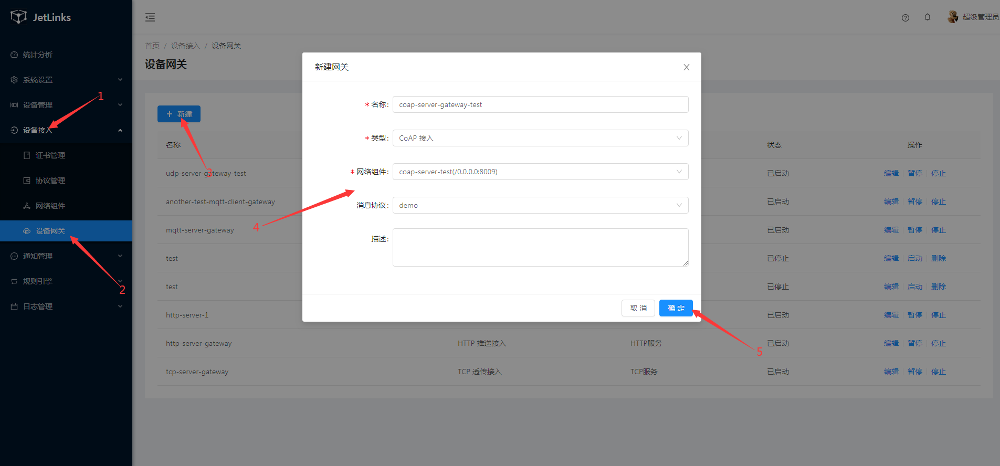

# 使用CoAp服务网关接入设备
本文档使用[coap-cli](https://www.npmjs.com/package/coap-cli)模拟设备接入平台。

## 创建协议

请参考[创建协议](../advancement-guide/mqtt-connection.md#创建协议)

## 创建产品

参考[tcp接入设备示例中的创建产品](tcp-connection.md#创建产品),  

创建id为**coap-test**的产品  

  

并**发布**。  

  

## 创建设备实例

参考[tcp接入设备示例中的创建设备](tcp-connection.md#创建设备),创建**id为coap-test-001**的设备并**激活**。   

  

## 创建CoAP服务网络组件

1. 选择 `设备接入`-->`网络组件`--> 点击`新增组件`按钮。  

  


2. 在创建完成的模块上点击`启动`按钮。  
  
  

## 创建CoAP服务设备网关

1. 选择 `设备接入`-->`设备网关`--> 点击`新建`按钮。  

  
::: tip 注意
和MQTT服务设备网关不同的是,coap必须指定消息协议,因为无法通过消息识别出对应的设备标识.
在消息解码时也无法通过上下文(`MessageDecodeContext`)获取到设备操作接口(`DeviceOperator`).
此处使用`demo`协议. 
:::
2. 在操作列点击`启动`按钮启动网关。  

   

## 使用coap-cli模拟客户端接入

1. 下载并安装`coap-cli`。  
```shell script
npm install coap-cli -g
```
 
2. 模拟设备设备属性上报

- MAC操作系统命令
```shell script
echo -n '{"deviceId":"coap-test-001","properties":{"temperature":36.5}}' | coap post coap://localhost:8009/report-property
```
- windows操作系统命令
```shell script
echo {"deviceId":"coap-test-001","properties":{"temperature":36.5}} | coap post coap://localhost:8009/report-property
```
在设备`运行状态`中可以看到温度属性已发生变化。  1

  


点击`详情`按钮可查看属性上报日志信息、图标展示。  

  
 
3. 模拟设备上报事件

- MAC操作脚本
```shell script
echo -n '{"deviceId":"coap-test-001","pname":"智能温控","aid":105,"a_name":"未来科技城","b_name":"C2 栋","l_name":"12-05-201","timestamp":"2019-11-06 16:28:50","alarm_type":1,"alarm_describe":"火灾报警","event_id":1,"event_count":1}' | coap post coap://localhost:8009/fire_alarm
```
- windows操作系统命令
```shell script
echo {"deviceId":"coap-test-001","pname":"智能温控","aid":105,"a_name":"未来科技城","b_name":"C2 栋","l_name":"12-05-201","timestamp":"2019-11-06 16:28:50","alarm_type":1,"alarm_describe":"火灾报警","event_id":1,"event_count":1} | coap post coap://localhost:8009/fire_alarm
```


在设备`运行状态`中可以看到事件已上报。  

  

点击`详情`按钮可查看属性上报日志信息、图标展示。  

     